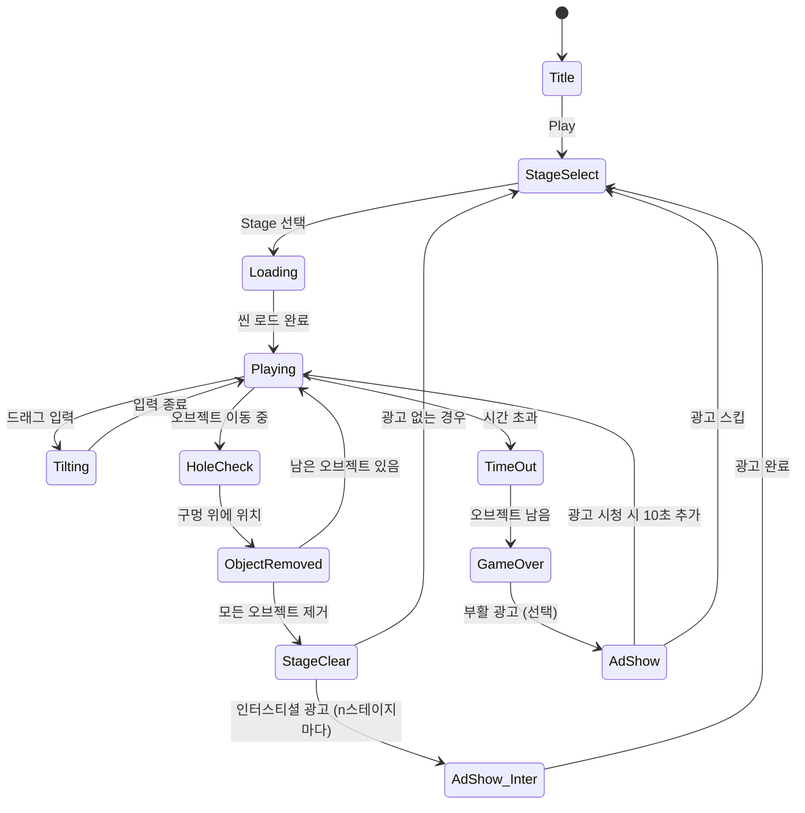

# 올인홀 All in Hole

> 화면을 기울여 모든 오브젝트를 구멍에 넣는 물리 기반 하이퍼 캐주얼 퍼즐

## 개요

플레이어는 다양한 오브젝트가 놓인 보드를 좌우로 기울여 오브젝트들이 구멍 속으로 굴러 떨어지도록 유도한다.
모든 오브젝트를 구멍에 넣으면 스테이지 클리어. 단순하지만 물리 기반 예측과 컨트롤의 쾌감이 핵심 재미 루프.

- **장르**: 하이퍼 캐주얼 / 물리 퍼즐
- **플레이 시간**: 스테이지당 30초~90초
- **타겟**: 전 연령, 특히 25~40세 모바일 캐주얼 유저
- **레퍼런스**: Homa 개발, AppStore 평점 4.9

## 코어 메카닉

### 기울기 컨트롤
- 화면을 **좌/우 드래그** 또는 **버튼**으로 보드 전체를 기울임
- 기울기 각도: -45° ~ +45° (연속 조작)
- 오브젝트는 기울기에 따라 **중력 + 마찰** 물리 법칙으로 이동
- 구멍 위에 오브젝트가 위치하면 중력에 의해 **낙하 → 제거**

### 물리 시뮬레이션 (Phaser.io Arcade Physics)
| 파라미터 | 값 | 설명 |
|----------|-----|------|
| gravity | 800 | 기본 중력 가속도 |
| friction | 0.3 | 오브젝트 바닥 마찰 |
| bounce | 0.1 | 충돌 반발력 (낮게 유지해 제어감 부여) |
| tiltSpeed | 60°/s | 보드 최대 기울기 속도 |
| holeSuckRadius | 20px | 구멍 흡입 범위 (게임감 향상) |

> 구멍 근처에서는 `holeSuckRadius` 범위 내 오브젝트에 구멍 방향 가속도를 추가로 적용해 "빨려드는" 느낌을 연출

### 오브젝트 종류
| 타입 | 물리 특성 | 시각 |
|------|-----------|------|
| Ball | 가장 잘 굴러감, bounce 0.2 | 원형 |
| Box | 마찰 높음, bounce 0.05 | 사각형 |
| Star | 불규칙 회전, 예측 어려움 | 별 모양 |
| Heavy Ball | 느리게 이동, 관성 큼 | 큰 원 |
| Bouncy Ball | bounce 0.5, 통제 어려움 | 작은 원 (밝은색) |

## 게임 플로우



## UI 레이아웃

```
┌─────────────────────────────┐
│  Stage 3        ⏱ 00:45     │  ← 상단 HUD (스테이지 번호, 타이머)
│  ●●●○○  3/5 오브젝트        │  ← 진행 표시
├─────────────────────────────┤
│                             │
│   ●      ★                  │
│        ■                    │  ← 물리 보드
│     ●        ●              │    (기울기에 따라 회전)
│   ○────────────○            │  ← 구멍 (원형 검정)
│                             │
│   ★    ■      ●             │
│         ○                   │  ← 구멍
│                             │
├─────────────────────────────┤
│    ◁ ─────────────── ▷      │  ← 기울기 슬라이더 (대안 UI)
│       [ 힌트 ]               │  ← 힌트 버튼 (광고 시청)
└─────────────────────────────┘
```

### 컨트롤 방식 (MVP: 드래그 우선)
1. **드래그 컨트롤** (기본): 화면 좌우 드래그 → 보드 기울기
2. **버튼 컨트롤** (보조): 좌/우 화살표 버튼 길게 누르기

## 스테이지 구성

### 난이도 곡선

| 스테이지 | 오브젝트 수 | 구멍 수 | 장애물 | 제한 시간 | 오브젝트 타입 |
|----------|------------|---------|--------|-----------|---------------|
| 1~5 | 3~5 | 2~3 | 없음 | 90초 | Ball만 |
| 6~10 | 5~7 | 2~3 | 없음 | 75초 | Ball + Box |
| 11~15 | 6~8 | 2~4 | 벽 1개 | 60초 | Ball + Box + Star |
| 16~20 | 7~10 | 3~4 | 벽 2개 | 60초 | 모든 타입 |
| 21~30 | 8~12 | 2~3 | 벽 + 이동 장애물 | 45초 | 모든 타입 |
| 31+ | 10~15 | 2~3 | 복합 장애물 | 45초 | 모든 타입 + Bouncy |

### 장애물 종류
| 장애물 | 설명 | 등장 시점 |
|--------|------|-----------|
| 정적 벽 | 오브젝트 이동 방해 고정 블록 | Stage 11+ |
| 이동 벽 | 좌우 왕복 이동하는 벽 | Stage 21+ |
| 경사면 | 특정 방향으로 오브젝트 유도 | Stage 16+ |
| 함정 구멍 | 오브젝트가 들어가면 점수 감소 (빨간 구멍) | Stage 26+ |

## 스코어링 시스템

| 이벤트 | 점수 |
|--------|------|
| 오브젝트 1개 구멍에 넣기 | +100 |
| 연속 2개 (콤보) | +200 × 콤보 배율 |
| 전체 클리어 | +500 |
| 남은 시간 보너스 | 남은초 × 10 |
| 함정 구멍 (페널티) | -50 |
| 노 힌트 클리어 | +300 |

### 스타 평가
- ⭐⭐⭐: 전체 클리어 + 30초 이상 남음
- ⭐⭐: 전체 클리어
- ⭐: 75% 이상 오브젝트 제거 후 타임아웃

## 아이템 / 파워업

| 아이템 | 효과 | 획득 방법 |
|--------|------|-----------|
| +10초 | 제한 시간 10초 추가 | 광고 시청 |
| 힌트 | 최적 기울기 방향 화살표 표시 (3초) | 광고 시청 or 코인 |
| 슬로우 | 물리 속도 50% 감속 (5초) | 코인 |
| 자석 | 구멍 흡입 반경 3배 증가 (5초) | 코인 |

## 수익화

### 광고 전략 (하이퍼 캐주얼 특화)
| 광고 타입 | 노출 시점 | 빈도 |
|-----------|-----------|------|
| **인터스티셜** | 스테이지 클리어 후 | 매 3스테이지마다 |
| **리워드 광고** | 게임오버 시 부활 / 힌트 사용 | 유저 선택 |
| **배너** | 스테이지 선택 화면 하단 | 상시 |

### 예상 수익 지표
- **ARPDAU**: $0.02~0.05 (하이퍼 캐주얼 평균)
- **목표 DAU**: 10,000 (1개월 내)
- **예상 일 광고 수익**: $200~500

### CPI 전략
- **예상 CPI**: $0.20~0.50 (하이퍼 캐주얼 장르 평균)
- **D1 리텐션 목표**: 35%+
- **크리에이티브**: 물리 시뮬레이션 영상 (공이 구멍에 빨려드는 장면) → 높은 CTR 기대
- **타겟 국가**: 미국, 영국, 캐나다, 호주 (ECPM 높은 시장 우선)

## 사운드 / 이펙트

| 이벤트 | 사운드 | 이펙트 |
|--------|--------|--------|
| 오브젝트 구멍 진입 | 흡입 "슉" 효과음 | 구멍 주위 파티클 |
| 오브젝트 충돌 | 통통 효과음 | 없음 |
| 콤보 | 상승 멜로디 | 화면 플래시 |
| 스테이지 클리어 | 축하 jingle | 컨페티 파티클 |
| 타임아웃 경고 | 심박 효과음 (10초 이하) | 타이머 빨간색 |
| 게임오버 | 실패 효과음 | 화면 흔들림 |

## 기술 구현 포인트 (lib 팀 전달용)

### Phaser.io 씬 구조
```
GameScene
├── Board (Container, 회전 가능)
│   ├── Ground (StaticGroup, 바닥/벽)
│   ├── Holes (Zone[], 구멍 영역)
│   ├── Objects (Group, 물리 적용)
│   └── Obstacles (StaticGroup)
├── HUD (고정 UI)
│   ├── Timer
│   ├── ProgressBar
│   └── ScoreText
└── InputHandler (드래그 → 보드 각도 조절)
```

### 핵심 구현 로직
1. **보드 기울기**: `board.setAngle(angle)` — 물리 바디 전체에 중력 방향 벡터 변환 적용
2. **구멍 감지**: Overlap 체크 + holeSuckRadius 내 오브젝트에 추가 인력(force) 적용
3. **오브젝트 제거**: 구멍 중심 도달 시 트윈 애니메이션 → destroy

### 주의사항
- Arcade Physics는 회전하는 컨테이너 내 물리를 직접 지원하지 않음
- **해결책**: 보드 자체를 회전하지 않고, 중력 벡터를 `scene.physics.world.gravity` 방향으로 조절
  - `gravity.x = Math.sin(tiltAngle) * 800`
  - `gravity.y = Math.cos(tiltAngle) * 800`

## MVP 범위

### Phase 1 — MVP (1주)
- [ ] 기획서 작성
- [ ] 기울기 입력 → 중력 벡터 변환
- [ ] Ball 오브젝트 + 구멍 감지
- [ ] 스테이지 클리어 / 게임오버 판정
- [ ] 스테이지 1~10 (Ball만, 장애물 없음)
- [ ] 기본 UI (타이머, 진행 표시)
- [ ] 인터스티셜 광고 연동 (매 3스테이지)

### Phase 2 — 콘텐츠 확장 (2주차)
- [ ] Box, Star 오브젝트 추가
- [ ] 장애물 (정적 벽) 추가
- [ ] 리워드 광고 (부활, 힌트)
- [ ] 스코어링 + 스타 평가
- [ ] 스테이지 11~30

### Phase 3 — 폴리싱 (여유 있을 때)
- [ ] Heavy Ball, Bouncy Ball
- [ ] 이동 장애물
- [ ] 함정 구멍
- [ ] 사운드/이펙트 풀셋
- [ ] 스테이지 31+

## 하이퍼 캐주얼 포트폴리오 가치 평가

### 강점
- **낮은 CPI**: 물리 시뮬레이션 영상 크리에이티브 → 높은 CTR → CPI $0.30 이하 기대
- **빠른 개발**: 중력 벡터 조작으로 Phaser Arcade Physics 활용 최대화, 1주 MVP 가능
- **높은 세션 수**: 스테이지당 30~90초 → 일 세션 10+ 자연스럽게 유도
- **레퍼런스 검증**: Homa 개발 4.9점 — 시장 수요 입증

### 리스크
- 물리 기반 특성상 난이도 밸런싱 어려움 → Phase 1에서 플레이테스트 필수
- 하이퍼 캐주얼 ARPDAU 낮음 → 볼륨 확보 필수 (DAU 10,000 이상 목표)

### 결론
**출시 권장.** 개발 난이도 대비 시장성 검증된 장르. Phase 1 MVP를 1주 내 출시하고
CPI/D1 데이터 확보 후 Phase 2 투자 여부 결정.
