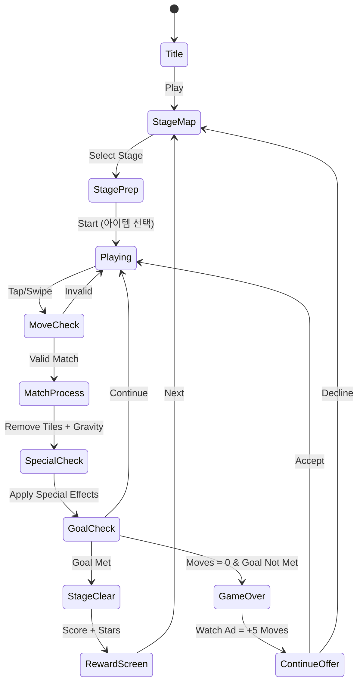

# 애니팡3 (Anipang 3) — 기능 기획서 + 시장 분석

> **레퍼런스**: 위메이드플레이 / 장르: 매치-3 / 랭킹: #85 / 평점: 3.8
> **목표**: 한국 매치-3 시장 분석 기반 MVP 설계. 1~2주 개발, 빠른 출시.

---

## 1. 시장 분석: 애니팡3 vs 시장

### 1-1. 애니팡4 대비 — 구버전이 여전히 차트에 있는 이유

애니팡3와 4가 동시에 차트에 공존하는 이유는 **유저 세그멘테이션**이다.

| 구분 | 애니팡3 | 애니팡4 |
|------|---------|---------|
| 출시 | 2017년 | 2021년 |
| 핵심 유저 | 30~50대, 카카오 친구 기반 | 20~30대, 신규 유저 |
| 플레이 방식 | 심플한 매치-3 | 더 복잡한 퍼즐 + 메타게임 |
| 소셜 레이어 | 카카오 하트 선물 문화 | SNS 공유 |
| 진입장벽 | 매우 낮음 | 중간 |

**핵심 인사이트**: 애니팡3가 살아있는 이유는 **습관화된 중장년층 캐주얼 유저**다. 이들은 이미 수백 스테이지 진행 중이고, 새 게임으로 이동할 동기가 없다. 게임 품질이 아니라 **소셜 매몰 비용**이 이들을 붙잡는다.

### 1-2. 평점 3.8의 원인 — 우리가 피해야 할 것

| 주요 불만 유형 | 내용 | 우리의 대응 |
|--------------|------|------------|
| **페이월** | 특정 스테이지에서 돈 안 쓰면 통과 불가한 난이도 설계 | 광고 기반 보상, 유료 과금 없이 진행 가능한 구조 |
| **에너지 시스템** | 하트 소진 시 30분 대기 or 결제 | MVP는 에너지 없이 무제한 플레이 |
| **알림 스팸** | 카카오 연동으로 과도한 알림 | 알림 최소화, 선택적 동의 |
| **스테이지 불균형** | 갑자기 튀어오르는 난이도** | 선형적 난이도 곡선 설계 |
| **광고 빈도** | 게임 중 강제 광고** | 스테이지 클리어 후에만 선택적 광고 |
| **구버전 버그** | 오래된 기기 지원 이슈 | WebView 기반이라 크로스플랫폼 자동 해결 |

> **결론**: 3.8점의 본질은 **P2W(Pay to Win) 과금 구조**다. 우리는 이 구조를 피하는 것만으로 차별화 가능.

### 1-3. 레거시 유저가 남아있는 이유 — 습관 + 소셜 그래프

애니팡3의 생존은 다음 3가지로 설명된다:

1. **카카오 친구 순위**: 친구와의 점수 경쟁이 주 재미. 친구가 안 옮기면 나도 못 옮긴다.
2. **진행 데이터 매몰 비용**: 스테이지 500+ 진행한 유저는 다시 시작하는 것이 심리적 부담.
3. **카카오 하트 선물 루프**: 친구에게 하트 보내기 → 받기 → 플레이. 이 루프가 일상화됨.

**우리에게 시사하는 바**: 카카오 없이는 이 소셜 루프를 복제할 수 없다. 단순히 "애니팡 클론"을 만들어도 기존 유저를 뺏어오기 어렵다. **다른 포지셔닝이 필요하다.**

### 1-4. 한국 매치-3 시장 — 애니팡 시리즈의 독점적 지위

```
한국 매치-3 시장 구도 (2024~2026)

[글로벌]  Candy Crush Saga (King) ───── 글로벌 1위, 한국 인지도 낮음
[국내]    애니팡 시리즈 (위메이드플레이) ── 한국 매치-3 사실상 독점
[신진]    포코팡, 쿠키런 퍼즐 등 ────── 니치 포지션
[글로벌]  Royal Match (Dream Games) ─── 상승 중, 한국에서도 광고 시작
```

**애니팡 시리즈의 해자(Moat)**:
- 카카오 채널 독점적 접근 (카카오게임즈 퍼블리싱)
- 브랜드 인지도 (2012년부터 국민 게임)
- 기존 소셜 그래프 네트워크 효과

**균열 지점**:
- 젊은 세대(10~20대)는 애니팡을 "어른들 게임"으로 인식
- Royal Match가 광고비 퍼부으며 한국 시장 공략 시작
- 카카오 의존도 = 카카오 없이는 신규 유저 유입 어려움

### 1-5. 우리의 매치-3 진입 전략 — 카카오 없이 한국 시장 공략 가능한가

**솔직한 평가: 어렵다. 하지만 방법이 있다.**

| 전략 | 가능성 | 이유 |
|------|--------|------|
| 애니팡 클론으로 직접 경쟁 | ❌ 낮음 | 브랜드, 소셜, 네트워크 효과 없음 |
| 글로벌 타겟 매치-3 | ✅ 가능 | Royal Match 성공 공식 따라가기 |
| 하이퍼캐주얼 + 매치-3 결합 | ✅ 유망 | CPI 낮고 바이럴 가능 |
| 특정 테마로 니치 공략 | ✅ 가능 | 캐릭터/IP 없이도 테마로 차별화 |

**추천 포지셔닝**:
- 한국 시장보다 **글로벌 시장 (영/일/동남아) 타겟**
- 또는 **티저/광고 집행 후 CPI 측정** → 타겟 시장 데이터 기반 결정
- 애니팡의 약점(P2W, 광고 과다)을 "No Pay Wall, Fair Play"로 역이용

### 1-6. 결론 — 매치-3 한국 시장 진입 가치 최종 판단

> **결론: 한국 매치-3는 진입하지 말고, 글로벌 매치-3로 포지셔닝하라.**

| 판단 기준 | 점수 | 근거 |
|----------|------|------|
| 시장 규모 | ★★★★★ | 매치-3는 전 세계 최대 캐주얼 장르 |
| 한국 진입 난이도 | ★☆☆☆☆ | 애니팡 독점, 카카오 없이 돌파 불가 |
| 글로벌 진입 난이도 | ★★★☆☆ | Royal Match 공식 복제 가능, CPI 경쟁 |
| 개발 복잡도 | ★★☆☆☆ | 매치-3는 로직 단순, 1~2주 MVP 가능 |
| 수익화 가능성 | ★★★★☆ | 광고 수익 + 소프트 과금으로 검증된 모델 |
| **종합 추천** | **진행** | **한국 제외 글로벌 타겟으로 빠른 출시** |

---

## 2. 게임 기능 기획서

### 2-1. 개요

애니팡3 레퍼런스 기반 **매치-3 퍼즐 게임**. 보드에 배치된 동물/과일 타일을 3개 이상 인접 맞추어 제거. 목표 조건 달성 시 스테이지 클리어. 광고 기반 수익화, 에너지 시스템 없음.

**핵심 차별화**:
- No Pay Wall — 모든 스테이지 무료 진행 가능
- No Energy — 무제한 플레이
- 선택적 광고 보상 (강제 아님)

### 2-2. 게임 규칙

#### 기본 메카닉 (스와이프 매치-3)

- N×N 그리드 보드 (기본 7×9)
- 인접한 같은 타일 3개 이상 → 제거 (스와이프 or 탭)
- 제거 후 위 타일이 아래로 떨어짐 (gravity)
- 빈 자리에 새 타일 생성
- **목표 조건** 달성 시 스테이지 클리어

#### 목표 조건 유형 (MVP: 1~2종)

| 목표 | 설명 |
|------|------|
| 점수 달성 | N점 이상 획득 |
| 특정 타일 제거 | 특정 색/종류 타일 N개 제거 |
| 방해물 제거 | 얼음/철창에 갇힌 타일 해제 |
| 동물 구출 | 보드 하단 출구로 동물 내려보내기 |

#### 스페셜 타일 (MVP: 2종)

| 타일 | 생성 조건 | 효과 |
|------|----------|------|
| 폭탄 | 4개 매치 | 주변 3×3 제거 |
| 레인보우 | 5개+ 매치 | 같은 색 전체 제거 |
| 줄폭탄 | L/T자 매치 | 가로+세로 1줄 전체 제거 |

#### 방해물 유형 (MVP: 1종)

| 방해물 | 설명 | 해제 방법 |
|--------|------|----------|
| 얼음 | 타일 위에 덮힌 얼음 | 인접 매치 1회로 해제 |

#### 이동 횟수 제한

- 스테이지마다 이동 횟수(Move) 지정
- 이동 소진 전 목표 미달성 → 게임 오버
- 이동 추가 아이템: 광고 시청으로 +5회

### 2-3. 아이템 시스템

#### 인게임 부스터 (스테이지 시작 전 선택)

| 아이템 | 효과 | 획득 방법 |
|--------|------|----------|
| 해머 | 아무 타일 1개 제거 | 광고 시청 or 코인 |
| 색상 폭탄 | 특정 색 전체 제거 | 광고 시청 or 코인 |
| 이동+5 | 이동 횟수 5 추가 | 광고 시청 or 코인 |

#### 코인 경제

- 스테이지 클리어 시 코인 획득 (10~30)
- 광고 시청 시 코인 획득 (20~50)
- 데일리 출석 보상 (코인 + 부스터)
- **No IAP (인앱 결제 없음, MVP 단계)**

### 2-4. 게임 플로우



### 2-5. UI 레이아웃

```
┌─────────────────────────────┐
│ ← STAGE 42    ★★★  🎯 Goal │  ← 상단 HUD (목표 표시)
│ 🔵 x12  🔴 x8  ❄️ x5       │  ← 목표 진행도
├─────────────────────────────┤
│ MOVES: 24                   │  ← 이동 횟수
├─────────────────────────────┤
│  🐶 🐱 🐰 🐭 🐶 🐱 🐰     │
│  🐰 🐭 [❄🐶] 🐱 🐰 🐭     │  ← 게임 보드 7×9
│  🐱 🐶 🐰 🐭 🐱 [💣] 🐰   │    (방해물/스페셜 포함)
│  🐭 🐱 🐶 🐰 🐭 🐱 🐶     │
│  🐰 🐭 🐱 🐶 🐰 🐭 🐱     │
│  🐶 🐰 🐭 🐱 🐶 🐰 🐭     │
│  🐱 🐶 🐰 🐭 🐱 🐶 🐰     │
│  🐭 🐱 🐶 🐰 🐭 🐱 🐶     │
│  🐰 🐭 🐱 🐶 🐰 🐭 🐱     │
├─────────────────────────────┤
│  [🔨 Hammer] [🌈 Rainbow]   │  ← 인게임 아이템
└─────────────────────────────┘
```

#### 스테이지 맵

```
┌─────────────────────────────┐
│ ☁️ WORLD 1  ✦ 65/100 Stars  │
│                             │
│  🏆[43]──[44]──[45]        │
│        |                    │
│  [40]──[41]──[42]★★★       │
│   |                         │
│  [38]──[39]★★☆             │
│ ...                         │
│                             │
│ [Settings] [Shop] [Lives]   │
└─────────────────────────────┘
```

### 2-6. 스코어링 시스템

| 액션 | 점수 |
|------|------|
| 3개 매치 | +50 × 색상 배율 |
| 4개 매치 | +150 (폭탄 생성) |
| 5개+ 매치 | +300 (레인보우 생성) |
| 스페셜 연쇄 | ×2 콤보 배율 |
| 방해물 제거 | +100 |
| 이동 남기기 | 남은 이동 × +50 |
| 3스타 클리어 | +500 |

#### 별점 기준

| 별 | 조건 |
|----|------|
| ★☆☆ | 목표 달성 |
| ★★☆ | 목표 달성 + 이동 50% 이상 남김 |
| ★★★ | 목표 달성 + 이동 70% 이상 남김 |

### 2-7. 난이도 설계

| World | Stage 범위 | 보드 크기 | 목표 유형 | 방해물 | 이동 수 |
|-------|-----------|---------|---------|--------|--------|
| 1 | 1~20 | 7×9 | 점수 달성 | 없음 | 30~40 |
| 2 | 21~40 | 7×9 | 타일 제거 | 얼음 | 25~35 |
| 3 | 41~60 | 8×10 | 동물 구출 | 얼음+철창 | 20~30 |
| 4 | 61~80 | 8×10 | 복합 목표 | 전체 | 18~25 |

#### 난이도 곡선 원칙

- 신규 메카닉은 3스테이지 전부터 예고 (쉬운 버전으로 먼저 노출)
- 10스테이지마다 상대적으로 쉬운 "여유 스테이지" 배치
- **P2W 스파이크 금지**: 특정 스테이지에서 갑자기 난이도 폭등 금지

### 2-8. 사운드/이펙트

| 이벤트 | 사운드 | 이펙트 |
|--------|--------|--------|
| 타일 탭 | 통통 경쾌한 효과음 | 타일 살짝 커졌다 작아짐 |
| 3매치 제거 | 팡! 효과음 | 파티클 burst |
| 폭탄 폭발 | 펑! 효과음 | 원형 파동 + 파티클 |
| 콤보 | 상승 멜로디 | 콤보 숫자 떠오름 |
| 스테이지 클리어 | 밝은 팡파레 | 별 3개 애니메이션 |
| 게임 오버 | 낮은 효과음 | 화면 흔들림 |
| 동물 구출 | 귀여운 소리 | 동물 출구로 이동 |

### 2-9. 수익화 전략 (MVP)

**원칙: No Hard Paywall, 광고 기반**

| 수익 모델 | 구현 | 타이밍 |
|----------|------|--------|
| 리워드 광고 | 이동+5, 아이템 획득 | 게임 오버 시, 원할 때 |
| 인터스티셜 광고 | 스테이지 클리어 후 (30% 확률) | 클리어 결과 화면 전환 시 |
| 배너 광고 | 스테이지 맵 하단 | 항상 (작게) |

**Phase 2 추가 고려 (데이터 보고)**:
- Soft Currency (코인) 패키지
- Hard Currency (보석) — 테스트 후 도입 여부 결정

### 2-10. MVP 개발 범위

#### Phase 1 (MVP — 1주)

- [x] 기획서 작성
- [ ] 7×9 그리드 보드 렌더링
- [ ] 스와이프/탭 매치 감지
- [ ] 타일 제거 + 낙하(gravity) 로직
- [ ] 스페셜 타일: 폭탄 (4매치)
- [ ] 점수 목표 달성 시 스테이지 클리어
- [ ] 이동 횟수 제한 + 게임 오버
- [ ] 20 스테이지 (World 1)
- [ ] 기본 사운드 3종

#### Phase 2 (2주차)

- [ ] 방해물: 얼음
- [ ] 목표 유형 추가: 타일 제거
- [ ] 스페셜 타일: 레인보우, 줄폭탄
- [ ] 광고 연동 (리워드, 인터스티셜)
- [ ] 스테이지 맵 UI
- [ ] 별점 시스템
- [ ] 40 스테이지 (World 1~2)

#### Phase 3 (3주차 이후, 데이터 기반 결정)

- [ ] 동물 구출 목표
- [ ] 방해물 추가 (철창)
- [ ] IAP 테스트 (시장 반응 보고)
- [ ] 푸시 알림 (데일리 리텐션)
- [ ] World 3~4

---

## 3. 기술 구현 가이드 (팀 참고)

### lib/anipang3 핵심 모듈

```
lib/anipang3/
├── scenes/
│   ├── GameScene.ts      # 메인 게임 보드 + 로직
│   ├── UIScene.ts        # HUD 오버레이
│   └── MapScene.ts       # 스테이지 맵
├── game/
│   ├── Board.ts          # 그리드 상태 관리
│   ├── Matcher.ts        # 매치 감지 알고리즘
│   ├── Gravity.ts        # 타일 낙하 로직
│   ├── SpecialTile.ts    # 스페셜 타일 효과
│   └── Goal.ts           # 목표 조건 체크
├── data/
│   └── stages.ts         # 스테이지 데이터 (목표, 보드 설정)
└── types.ts
```

### 매칭 알고리즘 개요

1. 스와이프 → 두 타일 위치 교환 시도
2. 교환 후 3개+ 연결 체크 (BFS/DFS)
3. 매치 없으면 교환 취소 (애니메이션 되돌리기)
4. 매치 있으면: 제거 → 스페셜 체크 → 낙하 → 새 타일 생성 → 연쇄 체크
5. 연쇄 매치 (cascade) 처리 후 목표 달성 여부 확인

### 스테이지 데이터 포맷 예시

```typescript
interface StageConfig {
  id: number;
  moves: number;
  boardWidth: number;
  boardHeight: number;
  tileTypes: number;        // 타일 종류 수
  goals: Goal[];
  obstacles: ObstacleConfig[];
  starThresholds: [number, number]; // [2스타 이동잔여%, 3스타 이동잔여%]
}
```

---

## 4. 런칭 체크리스트

| 항목 | 기준 |
|------|------|
| 스테이지 수 | 최소 20개 (Week 1 목표) |
| 튜토리얼 | 1~3스테이지가 자연스러운 튜토리얼 역할 |
| 광고 연동 | AdMob 또는 Unity Ads |
| 크래시율 | < 1% |
| 스테이지 클리어율 | 1~5스테이지: > 80%, 10스테이지: > 60% |
| 광고 로드 실패 처리 | 광고 없어도 아이템 획득 경로 1개 이상 |
