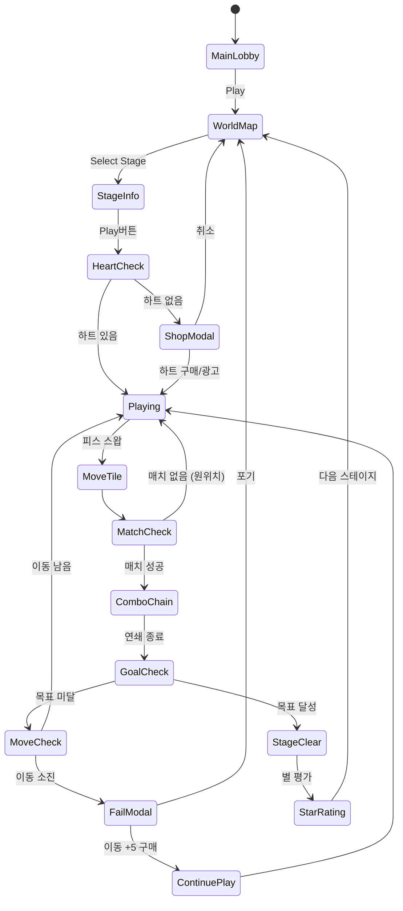

# 애니팡4 (Anipang4 Clone) — 한국형 매치-3

> **레퍼런스**: 애니팡4 by Wemade Play (Google Play #81, Rating 4.3)
> **장르**: Match-3 Puzzle
> **목표**: 1~2주 MVP 출시, 한국 시장 타겟

---

## 1. 한국 시장 분석 (벤치마크 인사이트)

### 애니팡4가 한국에서 성공한 이유

| 요소 | 내용 | 우리 대응 |
|------|------|-----------|
| 카카오 소셜 | 국민 메신저 기반 바이럴 | ❌ 불가 → 게스트/익명 플레이 우선 |
| 캐릭터 IP | 애니팡 고유 동물 캐릭터 팬덤 | ❌ 불가 → 범용 귀여운 동물 에셋 |
| 하트 시스템 | 친구에게 하트 주고받기 → 재방문 | ⚡ 단순화: 일일 무료 하트 지급 |
| 스테이지 진행 | 1000+ 스테이지 맵 | 🎯 MVP: 30스테이지, 주 1회 업데이트 |
| 쉬운 진입 | 3분 내 핵심 메카닉 파악 | ✅ 그대로 적용 |
| 한국형 IAP | 부스터 팩, 하트 묶음, 시즌패스 | ✅ 적용 (간소화) |

### 핵심 성공 인사이트

1. **30초 세션**: 출퇴근 지하철에서 1~2판 완결 가능한 밀도
2. **진행감**: 별 3개 시스템 + 월드맵으로 명확한 성취감
3. **소셜 압박**: "친구 OO님이 나를 추월했습니다" → 재방문 동기
4. **절망의 벽**: 특정 스테이지를 고의로 어렵게 → 부스터 결제 유도

---

## 2. 우리가 만들 것 vs 만들 수 없는 것

### ✅ 구현 가능 (MVP 범위)

- 스왑 기반 매치-3 코어 (Candy Crush 공식)
- 스테이지별 목표 (색상 타일 X개 제거, 특정 피스 수집)
- 스페셜 피스 (라인 클리어, 폭탄, 레인보우)
- 이동 횟수 제한 기반 난이도
- 별 3개 평가 시스템
- 로컬 진행도 저장

### ❌ 구현 불가 (대안 전략)

| 불가 요소 | 이유 | 대안 |
|-----------|------|------|
| 카카오 소셜 | 플랫폼 SDK/파트너십 필요 | 공유 스크린샷 기능 |
| 애니팡 IP 캐릭터 | 저작권 | 오픈소스 귀여운 동물 에셋 |
| 친구 하트 주고받기 | 소셜 인프라 필요 | 일일 5하트 무료 지급 |
| 1000+ 스테이지 | 개발 시간 | 런칭 30스테이지, 추후 추가 |

---

## 3. 게임 개요

보드 위의 컬러 젤리 피스를 스왑하여 3개 이상 같은 색을 연결해 제거한다.
각 스테이지는 **이동 횟수 제한** 안에 **목표 조건**을 달성하면 클리어.
스페셜 피스 콤보로 대량 제거 → 전략적 깊이를 더한다.

---

## 4. 코어 게임 규칙

### 4-1. 기본 매칭

- **보드**: 8×8 그리드 (기본)
- **피스 종류**: 6가지 컬러 (빨/주/노/초/파/보)
- **매칭 조건**: 가로 또는 세로 3개 이상 동일 색
- **매칭 후**: 피스 제거 → 위에서 새 피스 낙하 → 연쇄 반응 가능

### 4-2. 스왑 규칙

- 인접한 피스 2개를 교환 (대각선 불가)
- 교환 후 매칭이 없으면 원위치로 복귀
- 이동 1회 소비

### 4-3. 스페셜 피스 생성

| 매칭 수 | 생성 스페셜 | 효과 |
|---------|-------------|------|
| 4개 직선 | 줄무늬 피스 | 가로 또는 세로 한 줄 전체 제거 |
| 5개 L/T자 | 폭탄 피스 | 주변 3×3 범위 제거 |
| 5개 직선 | 레인보우 피스 | 교환한 색 전체 제거 |

### 4-4. 목표 시스템

스테이지마다 1~2개의 목표 조건 설정:

| 목표 유형 | 설명 |
|-----------|------|
| 색 수집 | 특정 색 피스 N개 제거 |
| 젤리 제거 | 특수 타일(젤리/얼음) 칸 클리어 |
| 재료 낙하 | 체리/너트 등 재료를 보드 하단으로 낙하 |

### 4-5. 하트 시스템 (에너지)

- 플레이 1판 = 하트 1개 소비
- 하트 최대 5개 보유
- 30분마다 1개 자동 충전
- 일일 무료 하트 3개 지급 (광고 시청 시 +2)

---

## 5. 게임 플로우



---

## 6. UI 레이아웃

```
┌─────────────────────────────┐
│ ← │ ⭐⭐⭐  스테이지 15  │ 💡 │  ← 상단 HUD
│   │ 이동: 25    목표: 🔴 40 │   │
├─────────────────────────────┤
│                             │
│  🔴 🟡 🔵 🟢 🔴 🟡 🔵 🟢  │
│  🟡 🔵 🟢 🔴 🟡 🟣 🔴 🔵  │
│  🟢 🔴 🟡 🔵 🟢 🔴 🟡 🟢  │  ← 8×8 게임 보드
│  🔵 🟢 🟣 🟡 🔵 🟢 🟣 🔴  │
│  🟡 🔵 🔴 🟢 🟡 🔵 🔴 🟡  │
│  🟢 🟡 🔵 🔴 🟢 🟡 🔵 🟢  │
│  🔴 🟢 🟡 🔵 🔴 🟢 🟡 🔴  │
│  🔵 🔴 🟢 🟡 🔵 🔴 🟢 🔵  │
│                             │
├─────────────────────────────┤
│  🔨부스터  💣폭탄  🌈레인보우 │  ← 부스터 슬롯
└─────────────────────────────┘

[WorldMap 화면]
┌─────────────────────────────┐
│         WORLD 1             │
│  🌸 꽃의 정원               │
│                             │
│   ①-②-③-④-⑤              │
│           |                 │
│          ⑥-⑦-⑧-⑨-⑩      │  ← 스테이지 맵
│                  |          │
│                ⑪-...-⑮    │
│                             │
│ ❤️❤️❤️❤️❤️  [+하트]       │  ← 하트 표시
└─────────────────────────────┘
```

---

## 7. 스페셜 피스 전략 가이드 (밸런스 설계)

```
콤보 체인 가중치:
  연쇄 1회: 피스 가치 × 1.0
  연쇄 2회: 피스 가치 × 1.5
  연쇄 3회+: 피스 가치 × 2.0

스페셜 × 스페셜 조합:
  줄무늬 + 줄무늬 → 가로세로 동시 제거 (십자)
  줄무늬 + 폭탄 → 3행/3열 제거
  폭탄 + 폭탄 → 7×7 범위 제거
  레인보우 + 스페셜 → 보드 내 해당 색 전체를 해당 스페셜로 변환 후 폭발
```

---

## 8. 스코어링 시스템

| 액션 | 점수 |
|------|------|
| 피스 1개 제거 | +50 |
| 4매치 | +200 |
| 5매치 | +500 |
| 스페셜 피스 폭발 | +100 × 제거 피스 수 |
| 콤보 보너스 | +100 × 콤보 수 |
| 스테이지 클리어 | +1000 |
| 남은 이동 × 이동 1회 | +500 |

### 별 3개 기준

| 별 | 조건 |
|----|------|
| ⭐ | 목표 달성 |
| ⭐⭐ | 목표 달성 + 이동 5회 이상 남음 |
| ⭐⭐⭐ | 목표 달성 + 이동 10회 이상 남음 |

---

## 9. 난이도 설계 (30스테이지 MVP)

| 월드 | 스테이지 | 이동 | 목표 유형 | 특수 타일 | 피스 종류 |
|------|----------|------|-----------|-----------|-----------|
| 1 (꽃밭) | 1~10 | 30~25 | 색 수집 | 없음 | 4 |
| 2 (얼음왕국) | 11~20 | 25~20 | 젤리/얼음 | 얼음 칸 | 5 |
| 3 (과일섬) | 21~30 | 22~18 | 재료 낙하 | 얼음+돌 | 6 |

### 절망의 벽 스테이지 (수익화 포인트)

- 스테이지 10, 20, 30: 의도적 고난이도 (클리어율 목표 30% 이하)
- 이 스테이지 직전에 부스터 번들 광고 노출

---

## 10. 수익화 (한국형 IAP)

### 상품 구성

| 상품 | 가격 | 내용 |
|------|------|------|
| 하트 묶음 | ₩1,100 | 하트 5개 |
| 이동 +5 | ₩1,100 | 현재 실패 스테이지에서 5회 추가 |
| 스타터팩 | ₩3,300 | 하트 10 + 부스터 3종 × 3개 |
| 위클리패스 | ₩4,400/주 | 매일 하트 +5, 코인 +500 |
| 시즌패스 | ₩9,900/월 | 전용 캐릭터 스킨 + 무제한 하트 1일 × 30 |

### 부스터 (인게임 아이템)

| 부스터 | 효과 | 기본 보유 |
|--------|------|-----------|
| 해머 | 피스 1개 즉시 제거 | 0개 |
| 셔플 | 보드 전체 재배치 | 0개 |
| +5무브 | 이동 5회 추가 | 0개 |

### 광고 수익화

- 광고 시청 → 하트 1개 (일 2회 제한)
- 실패 후 광고 시청 → 재도전 1회 무료
- 스테이지 클리어 후 광고 → 코인 보너스 2배

---

## 11. 사운드/이펙트

| 이벤트 | 사운드 | 이펙트 |
|--------|--------|--------|
| 피스 선택 | 소프트 팝 | 살짝 확대 |
| 매치 성공 | 랜덤 팝 × 3 | 피스 사라짐 + 파티클 |
| 콤보 | 상승 음계 (도-레-미-파) | 콤보 텍스트 팝업 |
| 스페셜 폭발 | 폭발음 | 화면 흔들림 + 빛 이펙트 |
| 스테이지 클리어 | 팡파레 | 별 3개 애니메이션 |
| 게임 오버 | 슬픈 효과음 | 화면 어두워짐 |

---

## 12. MVP 범위

### Phase 1 — MVP (1주)

- [ ] 기획서 작성
- [ ] 8×8 그리드 기본 렌더링
- [ ] 피스 스왑 + 매칭 로직 (3매치)
- [ ] 피스 낙하 + 새 피스 생성
- [ ] 이동 횟수 제한 + 게임오버
- [ ] 색 수집 목표 + 클리어 판정
- [ ] 별 3개 평가
- [ ] 10스테이지 (월드 1)

### Phase 2 — 완성도 (2주차)

- [ ] 스페셜 피스 (줄무늬, 폭탄, 레인보우)
- [ ] 얼음/젤리 특수 타일
- [ ] 재료 낙하 목표
- [ ] 월드맵 UI
- [ ] 하트 시스템 (에너지)
- [ ] 부스터 시스템
- [ ] 20~30스테이지 추가

### Phase 3 — 수익화 (출시 후)

- [ ] IAP 연동
- [ ] 광고 SDK 연동
- [ ] 시즌패스
- [ ] 신규 월드 주기적 업데이트

---

## 13. 기술 구현 가이드 (lib 팀용)

```typescript
// 핵심 데이터 구조
interface Board {
  grid: Piece[][];        // 8×8
  width: number;          // 8
  height: number;         // 8
}

interface Piece {
  color: PieceColor;      // RED | ORANGE | YELLOW | GREEN | BLUE | PURPLE
  type: PieceType;        // NORMAL | STRIPED_H | STRIPED_V | BOMB | RAINBOW
  special?: SpecialTile;  // JELLY | ICE | STONE | null
}

interface Stage {
  id: number;
  moves: number;          // 이동 제한
  goals: Goal[];          // 달성 목표
  boardLayout: BoardLayout; // 초기 보드 구성
}

interface Goal {
  type: 'COLOR_COLLECT' | 'JELLY_CLEAR' | 'INGREDIENT_DROP';
  target: PieceColor | null;
  count: number;
  current: number;
}
```

### 핵심 알고리즘 우선순위

1. `findMatches(board)` — 3매치 탐지 (BFS)
2. `resolveMatches(board, matches)` — 매칭 제거 + 낙하
3. `checkCombos(board)` — 연쇄 반응 루프
4. `createSpecial(matchCount, direction)` — 스페셜 피스 생성 조건
5. `evaluateGoals(board, goals)` — 목표 달성 여부

---

## 14. 결론 — 한국 시장 매치-3 전략

| 항목 | 우선순위 | 이유 |
|------|----------|------|
| 코어 루프 완성도 | 🔴 최우선 | 매치-3는 메카닉이 전부 |
| 스테이지 수 | 🟡 중요 | 30개면 런칭 충분, 추후 확장 |
| 소셜 기능 | 🟢 나중 | 카카오 없이도 스코어 공유로 대체 |
| IAP | 🟡 중요 | 부스터 판매 = 핵심 수익원 |
| 광고 | 🟡 중요 | 하트 기반 광고 = 한국 무과금 유저 공략 |

> **결론**: 카카오 소셜과 고유 IP 없이도 **코어 매치-3 + 하트 시스템 + 한국형 IAP**만으로
> 충분히 경쟁력 있는 게임 출시 가능. 1주 MVP → 데이터 보고 투자 확대 or 피벗.
