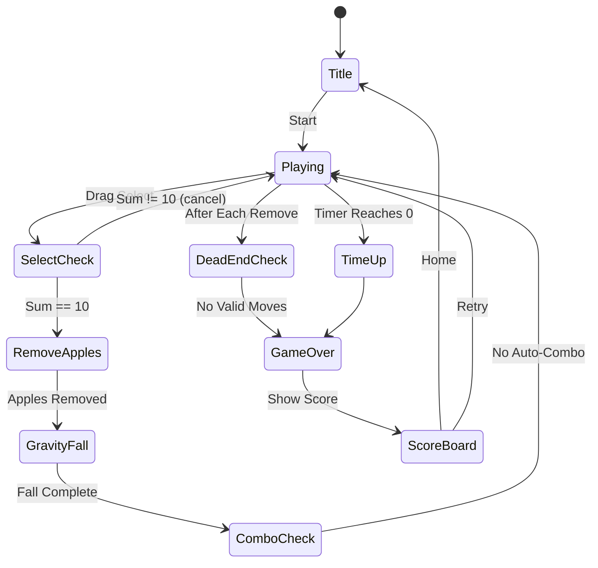

# 사과게임 (Apple Game)

> 숫자가 적힌 사과를 드래그로 선택해 합이 10이 되면 제거. 심플함과 중독성으로 한국에서 바이럴된 숫자 퍼즐 게임.

## 개요

8×10 그리드 위에 1~9 숫자가 적힌 사과들이 배치된다. 플레이어는 인접한 사과들을 드래그로 선택하여 합이 정확히 10이 되면 제거한다. 제거 후 중력으로 위 사과가 낙하하며 연쇄 콤보가 발생한다. 유효한 선택이 없으면 게임 오버.

### 왜 바이럴되었나 (한국 시장 분석)

- **극도의 심플함**: 규칙 설명 5초, 즉시 플레이 가능
- **수학적 만족감**: 합이 10이 되는 순간의 클리어 피드백
- **연쇄 반응**: 낙하 후 연쇄 콤보 — 예측 불가능한 재미
- **SNS 친화적**: 고득점 스크린샷 공유 욕구 자극
- **짧은 세션**: 2~3분 1판 — 지하철·쉬는 시간 최적

## 게임 규칙

### 기본 규칙

- 보드: **10열 × 17행** 그리드 (표준 사과게임 비율)
- 사과에는 **1~9** 숫자가 랜덤 배치 (가중치 분포: 중간값 5 빈도 낮게)
- 플레이어가 드래그로 **직사각형 영역**을 선택
- 선택 영역 내 사과 숫자 합이 **정확히 10** → 제거
- 합이 10이 아니면 선택 취소 (사과 유지)
- 사과 제거 후 위에 있던 사과가 **아래로 낙하** (중력)
- 낙하 후 새로운 합=10 조합이 생기면 **연쇄 콤보** 발생
- 보드에 합=10 조합이 **하나도 없으면 게임 오버**
- **제한 시간 2분** (표준 모드)

### 선택 규칙 상세

- 드래그 시작점 → 끝점으로 직사각형 영역 생성
- 직사각형 내 **모든** 사과 합산
- 최소 1개 ~ 최대 선택 가능 (전체 영역)
- 합 = 10인 경우에만 제거, 그 외는 피드백 후 취소

### 중력 시스템

- 사과 제거 → 해당 열에서 위 사과들이 빈 자리로 낙하
- 낙하 후 **연쇄 체크**: 새로운 직사각형 합=10 존재 시 콤보 카운터 증가
- 연쇄는 자동 발생하지 않음 (플레이어가 직접 선택해야 함)
- 단, 콤보 카운터는 연속 제거 횟수에 따라 누적

### 게임 오버 조건

1. **시간 초과**: 제한 시간 2분 경과
2. **막힘(Dead-end)**: 보드 전체를 검사하여 합=10이 되는 직사각형 영역이 없는 경우
   - Dead-end 판정은 사과 제거 후 매번 체크
   - 막힘 판정 시 "No more moves" 애니메이션 → 게임 오버 화면

## 게임 플로우



## UI 레이아웃

```
┌─────────────────────────┐
│  ⏱ 1:47    🏆 Score: 0  │  ← 상단 HUD (타이머 + 점수)
│  🔥 Combo: x3            │  ← 콤보 표시 (활성 시만)
├─────────────────────────┤
│                         │
│  1  5  3  7  2  4  8  1 │
│  9  2  6  4  8  3  5  9 │
│  3  7  1  9  5  6  2  4 │
│  6  4  8  2  1  9  7  3 │
│  2  8  5  6  4  7  3  8 │
│  7  3  9  1  6  2  8  5 │
│  5  1  4  8  3  5  1  6 │
│  4  6  2  5  9  1  4  2 │
│                         │  ← 게임 보드 (10×17)
├─────────────────────────┤
│  🔀 Shuffle  💥 Remove  │  ← 아이템 (유료/광고)
└─────────────────────────┘
```

### 선택 UI

- 드래그 중: 선택 영역 반투명 하이라이트 (초록 = 합<10, 빨강 = 합>10, 파랑 = 합=10)
- 합=10 도달 시: 진동 피드백 + 파란색 테두리 강조
- 손가락 떼는 순간 제거 실행

## 스코어링 시스템

| Action | Score |
|--------|-------|
| 사과 1개 제거 | +10점 |
| 한 번에 n개 제거 | +10 × n × n (면적 보너스) |
| 콤보 x2 | ×2 배율 |
| 콤보 x3 | ×3 배율 |
| 콤보 xN | ×N 배율 |
| 시간 보너스 (클리어 시) | 남은 초 × 5점 |

### 콤보 정의

- 이전 제거 후 **5초 이내** 다음 제거 성공 → 콤보 누적
- 5초 이내 제거 실패 시 콤보 초기화

### 예시

- 사과 4개(2×2) 한 번에 제거, 합=10: 10 × 4 × 4 = 160점
- 연속 콤보 x3: 160 × 3 = 480점

## 난이도 설계

| Mode | 그리드 | 제한 시간 | 사과 분포 | 특이사항 |
|------|--------|-----------|-----------|----------|
| Easy | 8×10 | 3분 | 균등 분포 | 힌트 기능 |
| Normal | 10×17 | 2분 | 표준 | 기본 모드 |
| Hard | 10×17 | 90초 | 극단값(1,9) 多 | 힌트 없음 |
| Endless | 10×17 | 무제한 | 표준 | 데드엔드만 종료 |

### MVP: Normal 모드 1개만 구현

## 사운드/이펙트

| Event | Sound | Visual |
|-------|-------|--------|
| 드래그 선택 중 | 틱틱 효과음 | 선택 영역 하이라이트 |
| 합=10 도달 | 딩! 효과음 | 파란색 테두리 펄스 |
| 사과 제거 | 팡팡 효과음 | 파티클 + 사과 사라짐 |
| 콤보 | 상승 음계 | COMBO xN 텍스트 팝업 |
| 중력 낙하 | 두두둑 효과음 | 사과 낙하 애니메이션 |
| 게임 오버 | 실패 사운드 | 화면 흔들림 + 그레이아웃 |
| 고득점 | 팡파레 | 별 + 점수 카운트업 |

## 아이템 시스템

| Item | Effect | 획득 방법 |
|------|--------|-----------|
| 🔀 Shuffle | 보드 전체 사과 숫자 재배치 | 광고 시청 or 유료 |
| 💥 Remove | 특정 사과 1개 즉시 제거 (숫자 무관) | 광고 시청 or 유료 |
| ⏱ +30s | 제한 시간 30초 추가 | 광고 시청 or 유료 |
| 💡 Hint | 유효한 합=10 영역 하이라이트 1회 | 광고 시청 |

### MVP 아이템: Shuffle + Remove 2개만

## 수익화 전략

### 광고

- **게임 오버 후** 인터스티셜 광고 (1/3 확률 — 너무 자주 하면 이탈)
- **아이템 사용 시** 리워드 광고 (선택적)
- **인게임 배너** 없음 (UX 방해)

### 인앱결제

| 상품 | 가격 | 내용 |
|------|------|------|
| 아이템 팩 Small | ₩1,900 | Shuffle 5 + Remove 5 |
| 아이템 팩 Large | ₩4,900 | Shuffle 20 + Remove 20 + +30s 10 |
| 광고 제거 | ₩3,900 | 영구 광고 제거 |

### MVP 수익화: 광고만 (인앱결제는 Phase 2)

## 기술 구현 가이드

### 보드 표현

```typescript
type Board = number[][]; // 0 = 빈칸, 1~9 = 사과 숫자
type Selection = { startRow: number; startCol: number; endRow: number; endCol: number };
```

### 핵심 로직

```
1. getSum(board, selection): number  — 선택 영역 합 계산
2. removeApples(board, selection): Board  — 사과 제거 후 새 보드 반환
3. applyGravity(board): Board  — 중력 적용 (빈칸 위로 사과 이동)
4. hasValidMoves(board): boolean  — 유효한 합=10 영역 존재 여부
5. generateBoard(rows, cols): Board  — 초기 보드 생성 (유효 상태 보장)
```

### 초기 보드 생성 주의사항

- 순수 랜덤 생성 시 초기부터 dead-end 발생 가능
- 생성 후 `hasValidMoves` 체크 → false이면 재생성
- 또는 보드 생성 시 최소 3개 이상의 유효 선택지 보장 알고리즘 사용

## MVP 범위

### Phase 1 — MVP (1주 목표)

- [x] 기획서 작성
- [ ] 10×17 보드 생성 + 렌더링
- [ ] 드래그 선택 → 합 계산 → 제거 로직
- [ ] 중력 + 낙하 애니메이션
- [ ] 게임 오버 판정 (dead-end + 타이머)
- [ ] 기본 스코어링 (사과 개수 × 10)
- [ ] Normal 모드 1개

### Phase 2

- [ ] 콤보 시스템 + 배율
- [ ] 면적 보너스 스코어링
- [ ] 아이템 (Shuffle, Remove)
- [ ] Easy / Hard / Endless 모드
- [ ] 리더보드
- [ ] 광고 통합
- [ ] 사운드/이펙트 폴리싱

### Phase 3 (매출 확인 후)

- [ ] 인앱결제
- [ ] 일일 챌린지 (고정 시드 보드)
- [ ] 소셜 공유 (점수 이미지 생성)
- [ ] 푸시 알림

## 우선순위 판단

**우선순위: 높음 (즉시 착수 권장)**

- 구현 난이도: **낮음** (2D 배열 + 드래그 이벤트)
- 시장 검증: **완료** (한국 바이럴 성공 사례)
- 개발 기간: **1주 MVP 가능**
- 수익 가능성: **높음** (중독성 → 높은 세션 수 → 광고 수익)
- 공통 인프라 재사용: **높음** (Phaser.io 그리드 + 터치 이벤트)
