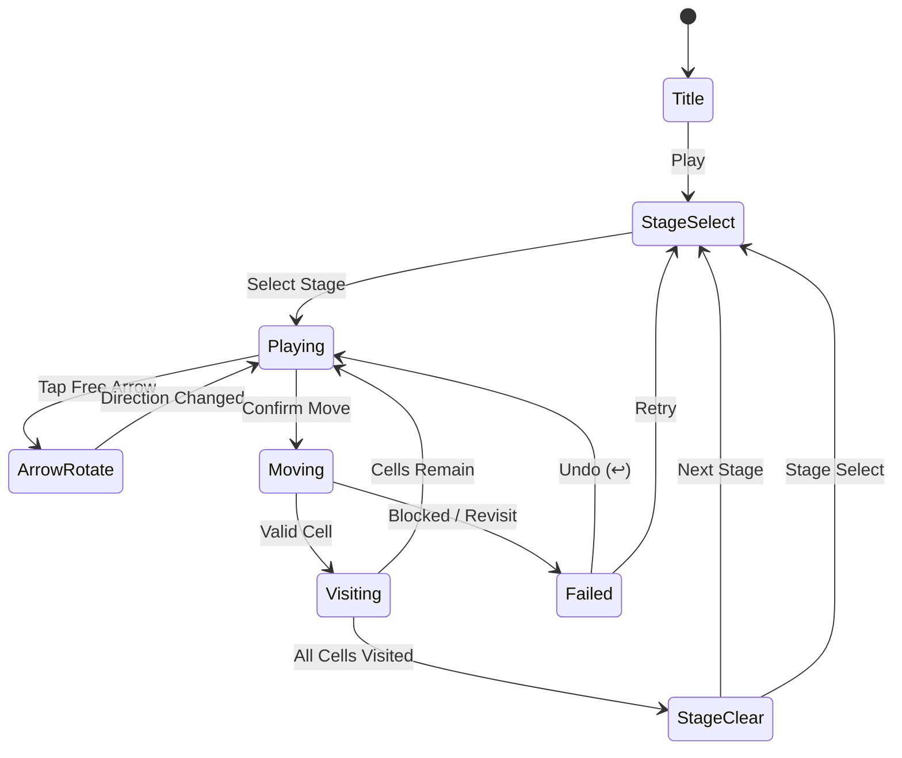

# Arrows - Puzzle Escape

> 그리드 위의 화살표 방향을 따라 이동하며 모든 칸을 한 번씩 방문하는 방향 퍼즐

## 개요

N×N 그리드의 각 칸에는 방향 화살표(↑↓←→)가 놓여 있다. 플레이어는 시작 칸에서 출발해 화살표가 가리키는 방향으로 이동하며 모든 칸을 **정확히 한 번씩** 방문해야 한다. 일부 화살표는 고정(회전 불가)이고, 나머지는 플레이어가 탭으로 방향을 바꿀 수 있다. 한붓그리기 퍼즐에 방향 제약을 더한 장르.

## 게임 규칙

### 기본 규칙

- 그리드의 모든 칸에는 화살표(↑ ↓ ← →) 중 하나가 존재
- 플레이어는 **시작 칸(★)** 에서 출발
- 현재 칸의 화살표 방향으로만 이동 가능
- 각 칸은 **정확히 한 번**만 방문 가능 (재방문 불가)
- 모든 칸을 방문하면 **스테이지 클리어**
- 이동할 수 없는 상태(막힘 or 재방문)에 도달하면 **실패**

### 화살표 조작

- **자유 화살표** (흰색): 탭할 때마다 방향이 90° 시계 방향으로 회전 (↑→↓←↑...)
- **고정 화살표** (노란색/잠금 아이콘): 방향 변경 불가, 그대로 따라야 함
- 이동 **전에만** 방향 변경 가능 (이미 방문한 칸은 변경 불가)

### 장애물 (고급 레벨)

| 요소 | 설명 |
|------|------|
| 벽(Wall) | 특정 방향으로의 이동을 막는 칸 경계 |
| 워프(Warp) | A→B 쌍으로 존재, 한쪽 진입 시 반대쪽으로 순간이동 |
| 얼음(Ice) | 방향 전환 없이 미끄러져 벽이나 일반 칸에 닿을 때까지 직진 |

### 승패 조건

| 상태 | 조건 |
|------|------|
| 클리어 | 모든 칸 방문 완료 |
| 실패 | 이동 불가 상태에서 미방문 칸이 남아있음 |
| 리트라이 | 실패 후 현재 스테이지 재시작 |

## 게임 플로우



## UI 레이아웃

```
┌────────────────────────────┐
│  ← Stage 12    ⭐ 1,200    │  ← 상단 HUD (뒤로가기 / 스코어)
│  [━━━━━━━░░░░] 진행률       │
├────────────────────────────┤
│                            │
│   ┌────┬────┬────┬────┐    │
│   │ →  │ ↓* │ ←  │ ↓  │   │
│   ├────┼────┼────┼────┤    │  ← 게임 그리드
│   │ ★  │ ↑  │ →* │ ↑  │   │     * = 고정 화살표
│   ├────┼────┼────┼────┤    │     ★ = 시작점
│   │ ↑* │ →  │ ↓  │ ←* │   │     방문칸 = 색상+경로선
│   ├────┼────┼────┼────┤    │
│   │ →  │ ↑* │ ←  │ ↓  │   │
│   └────┴────┴────┴────┘    │
│                            │
├────────────────────────────┤
│   ↩ Undo    💡 Hint   🔄   │  ← 하단 액션 버튼
└────────────────────────────┘
```

### 셀 상태별 시각 표현

| 상태 | 색상 | 표시 |
|------|------|------|
| 미방문 자유 | 흰 배경 | 화살표 아이콘 |
| 미방문 고정 | 노란 배경 + 자물쇠 | 화살표 아이콘 |
| 방문 완료 | 파란 배경 | 화살표 + 경로선 |
| 현재 위치 | 초록 배경 펄스 | 캐릭터/마커 |
| 시작점 | 주황 배경 | ★ 아이콘 |
| 장애물(벽) | 진회색 | — |

## 경로 추적 애니메이션

- 이동 시 칸 사이에 **선(path line)** 이 그려지며 방문 경로가 시각화됨
- 이동 방향 전환점에서 **곡선(rounded corner)** 처리
- Undo 시 경로선이 역방향으로 **지워지는 애니메이션**
- 클리어 시 전체 경로가 **골드 컬러**로 변하며 반짝임 이펙트

## 스코어링 시스템

| 이벤트 | 점수 |
|--------|------|
| 칸 방문 | +10 |
| 스테이지 클리어 (기본) | +500 |
| 힌트 미사용 클리어 보너스 | +300 |
| Undo 없이 클리어 보너스 | +200 |
| 스타 평가 기준 | ⭐⭐⭐ = 힌트+Undo 모두 0 |

### 스타 등급

| 등급 | 조건 |
|------|------|
| ⭐⭐⭐ | 힌트 0회, Undo 0회 |
| ⭐⭐ | 힌트 0회 또는 Undo 2회 이하 |
| ⭐ | 클리어만 |

## 난이도 설계

### 그리드 크기별 단계

| 레벨 범위 | 그리드 | 고정 화살표 비율 | 장애물 | 예상 풀이 시간 |
|-----------|--------|-----------------|--------|---------------|
| 1–10 | 3×3 | 20% | 없음 | 10–30초 |
| 11–20 | 4×4 | 30% | 없음 | 30–60초 |
| 21–30 | 4×4 | 40% | 벽 추가 | 60–90초 |
| 31–40 | 5×5 | 40% | 벽+워프 | 90–120초 |
| 41–50 | 5×5 | 50% | 벽+워프+얼음 | 120–180초 |

### 난이도 조절 변수

1. **그리드 크기** — 칸 수 = 이동 횟수
2. **고정 화살표 비율** — 높을수록 선택지 감소 → 제약 증가
3. **장애물 종류** — 벽/워프/얼음 순으로 복잡도 증가
4. **분기점 수** — 자유 화살표가 교차하는 경우의 수

## 아이템/도구

| 아이템 | 효과 | 수익화 |
|--------|------|--------|
| 💡 힌트 | 다음 이동해야 할 칸을 1초간 강조 표시 | 광고 시청 or 젬 소모 |
| ↩ Undo | 마지막 이동 1칸 되돌리기 | 무제한 무료 (패널티만) |
| 🔄 리셋 | 현재 스테이지 처음부터 재시작 | 무료 |
| 🗺 솔루션 | 정답 경로 전체 공개 | 프리미엄 젬 소모 |

### 수익화 전략

- **힌트 x3 무료** 지급 후 추가 힌트는 보상형 광고(30초) 시청
- **젬(Gem)** 통화: 광고 시청 또는 IAP로 획득
- **레벨 팩** (51–100, 101–150): $0.99 IAP
- **광고 제거** 패스: $2.99

## 사운드/이펙트

| 이벤트 | 사운드 | 이펙트 |
|--------|--------|--------|
| 화살표 회전 | 딸깍(click) | 회전 애니메이션 0.15s |
| 칸 이동 | 슉(slide) | 경로선 생성 |
| Undo | 뒤로감기 소리 | 경로선 역방향 소거 |
| 클리어 | 팡파르 | 경로 골드 변환 + 파티클 |
| 실패 | 둔탁한 효과음 | 화면 진동(shake) |
| 힌트 | 반짝임 소리 | 대상 칸 펄스 하이라이트 |

## MVP 범위

### Phase 1 — MVP (1주)

- [ ] 기획서 작성 (`prd/arrows.md`)
- [ ] 그리드 렌더링 + 화살표 표시 (`lib/arrows`)
- [ ] 탭으로 자유 화살표 회전 로직
- [ ] 방향 따라 이동 + 방문 칸 추적
- [ ] 클리어 / 실패 판정
- [ ] Undo 기능
- [ ] 3×3~4×4 레벨 10개
- [ ] 웹 빌드 (`web/arrows`)

### Phase 2 — 완성 (2주차)

- [ ] 고정 화살표 + 잠금 UI
- [ ] 경로 추적 애니메이션 (선 그리기)
- [ ] 장애물: 벽
- [ ] 힌트 시스템 (광고 연동)
- [ ] 스코어링 + 스타 등급
- [ ] 레벨 50개 완성
- [ ] RN 래핑 (`arrows/rn`)

### Phase 3 — 수익화 (출시 후)

- [ ] 장애물: 워프, 얼음
- [ ] 레벨 팩 IAP
- [ ] 광고 제거 IAP
- [ ] 리더보드 (국내 랭킹)

## 핵심 차별점

1. **화살표 제약** — 단순 한붓그리기(#25)보다 전략적 깊이 추가
2. **빠른 피드백** — 3×3 초반 레벨은 10초 내 클리어 가능 → 세션 진입 장벽 낮음
3. **경로 시각화** — 지나온 길이 선으로 남아 퍼즐 진행감 강화
4. **고정 화살표 긴장감** — "이 칸은 무조건 이 방향"이라는 제약이 퍼즐 재미의 핵심
