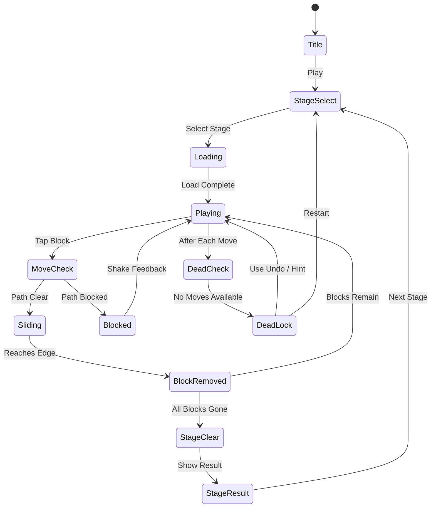

# Block Away - Tap Out Puzzle

> 블록을 탭하면 지정된 방향으로 날아가 보드 밖으로 빠져나가는 탭 아웃 퍼즐 게임.
> 올바른 순서로 블록을 제거해야만 클리어 가능한 전략 퍼즐.

## 개요

격자 보드 위에 방향이 지정된 블록들이 배치되어 있다. 플레이어가 블록을 탭하면 해당 블록은 지정된 방향(상/하/좌/우)으로 슬라이드하여 보드 밖으로 빠져나간다. 단, 이동 경로에 다른 블록이 있으면 움직이지 못한다. 모든 블록을 보드 밖으로 빼내면 스테이지 클리어.

## 게임 규칙

### 기본 규칙

- 보드는 N×M 격자로 구성됨 (MVP: 6×6)
- 각 블록에는 **이동 방향**(상/하/좌/우)이 고정되어 있음 (화살표로 표시)
- 탭 시 블록은 지정 방향으로 **끝까지 슬라이드** → 보드 가장자리에 닿으면 보드 밖으로 이탈(제거)
- 이동 경로에 다른 블록이 있으면 **이동 불가** (막힌 상태)
- 모든 블록을 보드 밖으로 빼내면 **스테이지 클리어**
- 이동 가능한 블록이 없고 블록이 남아있으면 **막힘 상태** → 되돌리기 또는 재시작

### 블록 타입

| 타입 | 설명 | 크기 | 이동 방향 |
|------|------|------|-----------|
| 단일 블록 | 기본 1칸 블록 | 1×1 | 상/하/좌/우 중 1방향 |
| 가로 블록 | 가로로 긴 블록 | 1×2 | 좌/우만 가능 |
| 세로 블록 | 세로로 긴 블록 | 2×1 | 상/하만 가능 |
| 큰 블록 | 2×2 정사각형 블록 | 2×2 | 상/하/좌/우 중 1방향 |

### 이동 규칙 상세

- 블록 이동 시 경로의 **모든 칸이 비어 있어야** 이동 가능
- 1×2 가로 블록이 오른쪽으로 이동 시 블록이 차지하는 두 칸의 오른쪽 경로 모두 비어야 함
- 2×2 블록 이동 시 이동 방향의 전면 칸들이 모두 비어야 함
- 블록이 보드 가장자리까지 슬라이드하면 **즉시 보드 이탈**
- 막힌 블록은 탭해도 반응 없음 (또는 흔들림 이펙트로 피드백)

### 순서 퍼즐 요소

- 특정 블록을 먼저 빼야 다른 블록의 경로가 열리는 **의존성 구조** 설계
- 초반 레벨: 단순 1-2단계 의존성
- 후반 레벨: 3-5단계 연쇄 의존성 (올바른 순서 없이는 풀리지 않음)

## 게임 플로우



## UI 레이아웃

```
┌─────────────────────────────┐
│  ← Back   Lv.12   ↩️ Undo  │  ← 상단 HUD
│            ⭐ Score: 2400    │
├─────────────────────────────┤
│                             │
│   ┌────┬────┬────┬────┐     │
│   │    │ ↑  │    │ →  │     │
│   ├────┼────┼────┼────┤     │
│   │ ←  │████│████│    │     │  ← 게임 보드
│   ├────┼────┼────┼────┤     │    (6×6 격자)
│   │    │    │ ↓  │    │     │
│   ├────┼────┼────┼────┤     │
│   │ →  │    │    │ ↑  │     │
│   └────┴────┴────┴────┘     │
│                             │
├─────────────────────────────┤
│  [💡 Hint x3]  [↩️ Undo x5] │  ← 아이템 바
└─────────────────────────────┘
```

### 블록 시각 표현

```
┌────────┐   ┌─────────────┐   ┌────────┐
│   →    │   │      →      │   │   ↑    │
└────────┘   └─────────────┘   │   ↑    │
  1×1 블록      1×2 가로 블록    └────────┘
                                 2×1 세로 블록

┌─────────────┐
│      ↓      │
│      ↓      │
└─────────────┘
   2×2 큰 블록
```

### 방향 화살표 색상 코드

| 방향 | 색상 |
|------|------|
| 위(↑) | 파란색 |
| 아래(↓) | 빨간색 |
| 왼쪽(←) | 초록색 |
| 오른쪽(→) | 주황색 |

## 스코어링 시스템

| Action | Score |
|--------|-------|
| 블록 1개 제거 | +50 |
| 연속 제거 (콤보) | +50 × 콤보 수 추가 |
| 스테이지 클리어 | +500 |
| 힌트 미사용 클리어 | +300 보너스 |
| 최소 탭 수 클리어 (퍼펙트) | +500 보너스 |
| 별점 3개 | 최소 탭 수 기준 이하 |
| 별점 2개 | 최소 탭 수 + 3 이하 |
| 별점 1개 | 클리어만 |

### 별점 시스템

각 스테이지는 **최적 해답(최소 탭 수)**이 사전 설계됨.
- ⭐⭐⭐: 최적 탭 수로 클리어
- ⭐⭐: 최적 + 1~3탭 내 클리어
- ⭐: 그 이상으로 클리어

## 난이도 설계

### 레벨 구간별 설계

| 레벨 구간 | 보드 크기 | 블록 수 | 블록 종류 | 최대 의존성 깊이 |
|-----------|-----------|---------|-----------|----------------|
| 1~10 (튜토리얼) | 4×4 | 3~5 | 1×1만 | 1~2단계 |
| 11~20 (초급) | 5×5 | 5~8 | 1×1, 1×2 | 2~3단계 |
| 21~30 (중급) | 6×6 | 8~12 | 1×1, 1×2, 2×1 | 3~4단계 |
| 31~40 (고급) | 6×6 | 10~15 | 전체 타입 | 4~5단계 |
| 41~50 (마스터) | 7×7 | 12~18 | 전체 타입 + 복합 | 5단계 이상 |

### 튜토리얼 레벨 (1~3)

- 레벨 1: 블록 2개, 이동 경로 완전히 열려있음, 화살표 강조 연출
- 레벨 2: 블록 3개, 1개가 다른 블록을 막고 있음 (1단계 의존성)
- 레벨 3: 블록 4개, 2단계 연쇄 의존성

## 시각 연출 / 이펙트

### 블록 이동 애니메이션

- **슬라이딩**: 블록이 방향으로 빠르게 슬라이드 (300ms, ease-out)
- **이탈**: 보드 밖으로 나가면서 **속도 가속 후 화면 밖으로 사라짐**
- **잔상**: 슬라이딩 경로에 옅은 궤적 이펙트 (흰색/파티클)
- **막힘 피드백**: 이동 불가 블록 탭 시 짧은 흔들림(shaking) 애니메이션 (100ms × 2)

### 클리어 이펙트

- 마지막 블록 제거 시 **폭발형 파티클** 이펙트
- 별점 획득 애니메이션 (별이 하나씩 팡팡 등장)
- 화면 전체 빛나는 글로우 효과

### 블록 색상 / 시각 계층

- 이동 가능한 블록: 밝은 색, 살짝 부유하는 그림자
- 이동 불가(막힌) 블록: 약간 어두워짐 (실시간 계산 후 표시)
- 선택(탭) 순간: 밝게 번쩍이는 하이라이트

## 아이템 / 수익화

### 무료 아이템 (기본 제공)

| 아이템 | 효과 | 기본 제공량 |
|--------|------|-------------|
| 되돌리기(Undo) | 마지막 이동 1회 취소 | 스테이지당 3회 무료 |
| 힌트(Hint) | 다음으로 움직여야 할 블록 1개 강조 표시 | 스테이지당 1회 무료 |

### 유료 아이템 (인앱 결제)

| 아이템 | 효과 | 가격(코인) |
|--------|------|-----------|
| 되돌리기 추가 | Undo 3회 추가 | 50코인 |
| 힌트 추가 | Hint 3회 추가 | 80코인 |
| 전체 해답 보기 | 이 레벨 전체 풀이 순서 보여줌 | 200코인 |
| 레벨 스킵 | 현재 레벨 건너뜀 | 150코인 |

### 코인 패키지 (IAP)

| 패키지 | 코인 | 가격 |
|--------|------|------|
| 소량 | 300코인 | $0.99 |
| 중량 | 800코인 | $2.99 |
| 대량 | 2000코인 | $4.99 |

### 광고 수익화

- 스테이지 실패 시: **보상형 광고** 시청 → 되돌리기 3회 획득
- 스테이지 클리어 후: **인터스티셜 광고** (5스테이지마다)
- 홈 화면: 배너 광고

## 사운드 / 이펙트

| 이벤트 | 사운드 |
|--------|--------|
| 블록 탭 | 딱, 클릭 소리 |
| 블록 슬라이딩 | 부드러운 슬라이드 효과음 |
| 블록 이탈 | 빠른 휙 소리 + 짧은 팡 |
| 블록 막힘 | 둔탁한 쿵 소리 |
| 콤보 | 상승 톤 (연속 제거마다 음정 상승) |
| 스테이지 클리어 | 밝은 팡파레 |
| 별점 획득 | 별 하나당 팅 소리 × 3 |
| 힌트 사용 | 반짝이는 마법 효과음 |

## MVP 범위

### Phase 1 (MVP - 1주차)

- [x] 기획서 작성
- [ ] 6×6 보드, 1×1 블록만, 4방향 이동
- [ ] 탭 → 슬라이딩 → 이탈 코어 로직
- [ ] 이동 가능 여부 판별 (경로 체크)
- [ ] 게임 클리어 판정
- [ ] 수동 제작 레벨 10개
- [ ] 기본 UI (HUD, 보드, 클리어 팝업)

### Phase 2 (2주차)

- [ ] 1×2, 2×1 블록 추가
- [ ] 되돌리기(Undo) 구현
- [ ] 힌트(Hint) 구현
- [ ] 별점 시스템
- [ ] 슬라이딩 애니메이션 + 이탈 이펙트
- [ ] 레벨 총 50개 완성
- [ ] 스테이지 셀렉트 화면

### Phase 3 (선택)

- [ ] 2×2 블록 추가
- [ ] 콤보 시스템
- [ ] 광고 / IAP 연동
- [ ] 전체 해답 보기 기능
- [ ] 리더보드 (스코어 랭킹)
