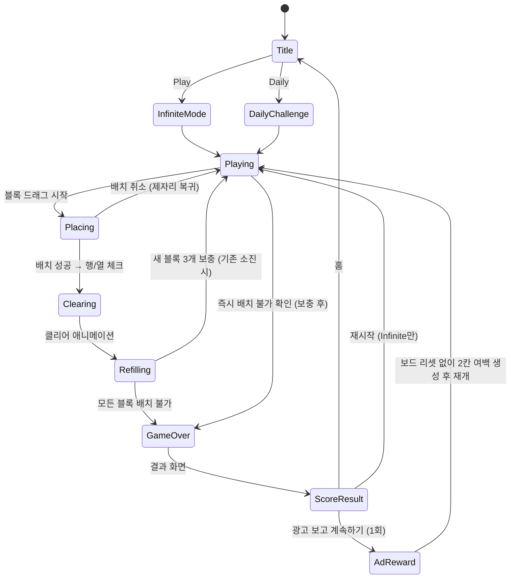

# 블록 블라스트 (Block Blast)

> 8×8 보드에 블록을 배치해 행/열을 완성하는 무한 블록 퍼즐. 단순하지만 강한 중독성.

## 개요

8×8 그리드에 다양한 형태의 블록을 드래그&드롭으로 배치한다.
행 또는 열이 완전히 채워지면 클리어되며 점수를 얻는다.
3개의 블록 후보 중 하나씩 배치하다가 남은 블록이 모두 배치 불가 상태가 되면 게임 오버.
스테이지 개념 없음 — 무한 모드 기반. 일일 챌린지는 고정 시드로 동일한 블록 시퀀스 제공.

---

## 게임 규칙

### 보드

- 8×8 격자 (총 64칸)
- 빈 칸: 투명 또는 연회색
- 채워진 칸: 블록 색상 표시

### 블록 배치

- 하단에 **3개의 블록 후보** 항상 표시
- 플레이어는 원하는 블록을 드래그해 보드에 배치
- 배치 가능한 위치만 활성화 (불가능한 위치에 놓으면 제자리로 복귀)
- 3개 모두 사용하면 새로운 3개 보충
- 배치 순서 자유 (3개 중 어떤 것이든)

### 클리어 조건

- 행(가로) 또는 열(세로)이 모두 채워지면 즉시 클리어
- 클리어된 행/열의 모든 칸이 비워짐
- 동시에 여러 행/열 클리어 가능 → 콤보 점수

### 게임오버 조건

- 현재 남아있는 **3개 블록 모두**가 보드 어디에도 배치 불가 → 게임 오버
- 1개라도 배치 가능하면 게임 계속

---

## 블록 종류

### 소형 (Small) — 1~3칸

| ID | 이름 | 형태 | 크기 |
|----|------|------|------|
| S1 | Dot | `■` | 1×1 |
| S2 | H2 | `■■` | 1×2 |
| S3 | V2 | `■`<br>`■` | 2×1 |
| S4 | H3 | `■■■` | 1×3 |
| S5 | V3 | `■`<br>`■`<br>`■` | 3×1 |

### 중형 (Medium) — 4~5칸

| ID | 이름 | 형태 |
|----|------|------|
| M1 | Square2 | `■■`<br>`■■` |
| M2 | L형 | `■`<br>`■`<br>`■■` |
| M3 | J형 | `_■`<br>`_■`<br>`■■` |
| M4 | T형 | `■■■`<br>`_■_` |
| M5 | S형 | `_■■`<br>`■■_` |
| M6 | Z형 | `■■_`<br>`_■■` |
| M7 | H4 | `■■■■` | 1×4 |
| M8 | V4 | 세로 4칸 |

### 대형 (Large) — 5칸+

| ID | 이름 | 형태 |
|----|------|------|
| L1 | Square3 | `■■■`<br>`■■■`<br>`■■■` | 3×3 |
| L2 | H5 | `■■■■■` | 1×5 |
| L3 | V5 | 세로 5칸 |
| L4 | BigL | `■`<br>`■`<br>`■■■` |
| L5 | BigZ | `■■_`<br>`_■_`<br>`_■■` |

**출현 가중치**: 소형 40%, 중형 45%, 대형 15%
→ 대형 블록은 보상감이 크지만 배치가 어려움. 희소성으로 긴장감 부여.

---

## 스코어링 시스템

### 기본 점수

```
블록 배치 점수 = 블록 칸 수 × 1점
행/열 클리어 점수 = 클리어된 칸 수 × 2점 (= 8칸 × 2 = 16점/줄)
```

### 콤보 보너스

**동시 클리어 (Single 배치로 N줄 동시 제거)**

| 동시 클리어 수 | 보너스 배율 |
|---------------|------------|
| 1줄 | ×1 (기본) |
| 2줄 | ×1.5 |
| 3줄 | ×2 |
| 4줄+ | ×3 |

**예시**: 1번의 배치로 행 2개 + 열 1개 = 3줄 동시 클리어
→ (8+8+8) × 2 × 2 = 96점 + 배치 점수

### 연쇄 스트릭 보너스

블록 배치 후 클리어가 발생하는 연속 턴 횟수에 따라 보너스:

```
스트릭 1턴: 보너스 없음
스트릭 2턴: +10%
스트릭 3턴: +20%
스트릭 4턴+: +30%
```

스트릭은 클리어가 발생하지 않는 배치가 나오면 초기화.

### 최종 점수 공식

```
턴 점수 = (블록 칸 수 × 1 + 클리어 칸 수 × 2 × 동시배율) × (1 + 스트릭보너스)
```

---

## 게임 플로우 (상태 머신)



---

## UI 레이아웃

```
┌─────────────────────────────┐
│  BLOCK BLAST        🔊  ⚙  │  ← 헤더 (최소화)
├─────────────────────────────┤
│   BEST: 12,430              │
│   SCORE: 8,720  🔥×3 STREAK │  ← 점수 영역
├─────────────────────────────┤
│                             │
│   [ 8 × 8 게임 보드 ]        │  ← 화면 가로 100% 사용
│                             │
│                             │
│                             │
│                             │
│                             │
│                             │
├─────────────────────────────┤
│  [블록A]  [블록B]  [블록C]   │  ← 블록 후보 3개
│                             │
├─────────────────────────────┤
│  [배너 광고 영역 320×50]      │  ← 최하단 고정
└─────────────────────────────┘
```

### 블록 선택/드래그 UX

- 블록 후보 영역에서 **드래그 시작** → 손가락 위치 기준으로 블록 렌더링
- 보드 위 유효한 위치 → 그린 하이라이트 표시
- 보드 위 유효하지 않은 위치 → 레드 하이라이트 표시
- 드래그 중 배치 가능 위치 실시간 업데이트
- 손가락을 떼면 해당 위치에 배치 확정 (또는 취소)

### 게임오버 화면

```
┌─────────────────────────────┐
│        GAME OVER            │
│                             │
│   SCORE      12,430         │
│   BEST       15,200         │
│   LINES        48           │
│                             │
│  [광고 보고 계속하기 (1회)]   │
│  [다시 시작]                 │
│  [홈으로]                   │
└─────────────────────────────┘
```

---

## 게임 모드

### 1. 무한 모드 (Infinite Mode)

- 기본 모드. 게임오버까지 무한 진행
- 최고 점수 로컬 저장 (베스트 스코어)
- 재시작 즉시 가능

### 2. 일일 챌린지 (Daily Challenge)

- 날짜 기반 고정 시드 → 모든 유저가 동일한 블록 시퀀스
- 하루 1회만 플레이 가능 (클리어/게임오버 후 내일까지 잠금)
- 결과 공유 기능: "오늘의 블록블라스트: 8,720점 🔥3콤보"
- 광고 계속하기 기능 없음 (공정한 비교)
- 리더보드 (로컬 시뮬레이션 / 추후 서버 연동)

---

## 중독 루프 설계 (Retention Loop)

### 핵심 감정 흐름

```
배치 → 클리어 기대 → (클리어!) 도파민 → 더 큰 콤보 욕구 → 반복
                   → (아슬아슬) 긴장 → 기지발휘 쾌감 → 반복
```

### "한 판만 더" 유도 요소

1. **베스트 스코어 근접 알림**: 현재 점수가 베스트의 90% 이상이면 "🔥 최고 기록 갱신 직전!" 배너 표시
2. **스트릭 표시**: 연속 클리어 시 화염 아이콘 + 카운터 → 끊기 싫은 심리
3. **콤보 연출**: 다중 클리어 시 화면 흔들림 + 파티클 + 점수 팝업 애니메이션
4. **블록 미리보기**: 다음 블록 힌트 없음 → 랜덤성이 주는 긴장감
5. **간발의 차 게임오버**: 게임오버 시 "이 블록 1개만 들어갔어도..." 화면 (마지막 배치 불가 블록 하이라이트)
6. **일일 챌린지**: 매일 접속 이유 제공
7. **점수 공유**: SNS 공유 → 외부 유입 + 경쟁심

---

## 수익화 전략

### 배너 광고

- **위치**: 하단 고정 (게임 플레이 중 상시)
- **크기**: 320×50 (스마트 배너)
- **주의**: 게임 보드와 블록 후보 영역을 침범하지 않도록 레이아웃 보호

### 보상형 광고 (Rewarded Video)

| 진입점 | 보상 | 하루 최대 |
|--------|------|-----------|
| 게임오버 후 "계속하기" | 보드에서 블록 2칸 자동 제거 후 재개 (1회/게임) | 3회 |
| 게임 중 "블록 교체" 버튼 | 현재 3개 블록을 새로운 3개로 교체 | 3회 |
| 게임 중 "Undo" 버튼 | 마지막 배치 1회 되돌리기 | 3회 |

### 인터스티셜 광고

- **게임오버 → 결과 화면 전환** 시 표시 (2게임 중 1회)
- 일일 챌린지는 광고 빈도 절반으로 설정 (UX 보호)

---

## 사운드 / 이펙트

### 사운드 (선택적, MVP 이후)

| 이벤트 | 사운드 |
|--------|--------|
| 블록 배치 | 둔탁한 클릭음 |
| 행/열 클리어 | 경쾌한 팝/스윙음 |
| 콤보 클리어 | 상승하는 팡파레 |
| 게임오버 | 낮고 짧은 마감음 |
| 베스트 갱신 | 팡파레 + 화면 플래시 |

### 비주얼 이펙트

| 이벤트 | 이펙트 |
|--------|--------|
| 블록 배치 | 스케일 펀치 (0.9 → 1.0) |
| 행/열 클리어 | 흰 빛 스윕 → 칸 사라짐 |
| 콤보 | 파티클 + 점수 팝업 (scale-up 후 fade) |
| 스트릭 | 화염 아이콘 + 진동 애니메이션 |
| 게임오버 | 보드 그레이아웃 + 슬라이드 업 결과 화면 |

---

## MVP 범위 (1주 출시 목표)

### 포함 (Must Have)

- [x] 8×8 보드 렌더링
- [x] 블록 드래그&드롭 배치
- [x] 행/열 클리어 감지 및 제거
- [x] 3개 블록 후보 → 소진 시 보충
- [x] 게임오버 감지
- [x] 기본 점수 계산 (배치 + 클리어)
- [x] 베스트 스코어 로컬 저장
- [x] 배너 광고 슬롯
- [x] 보상형 광고 (게임오버 계속하기)
- [x] 무한 모드

### 제외 (Post-MVP)

- [ ] 콤보/스트릭 시각 이펙트 (기능만, 애니메이션 생략)
- [ ] 일일 챌린지 모드
- [ ] 블록 교체 / Undo 기능
- [ ] 사운드
- [ ] 결과 공유 기능
- [ ] 리더보드

---

## Phaser.io 기술 명세

### 씬 구성

```
BootScene        → 에셋 로딩
GameScene        → 메인 게임 (Board + BlockTray + ScoreHUD)
GameOverScene    → 결과 표시
```

### 보드 구현

```typescript
// 8x8 그리드를 Phaser.GameObjects.Rectangle 배열로 구성
// 각 셀: { x, y, filled: boolean, color: number }
const CELL_SIZE = Math.floor((screenWidth - PADDING * 2) / 8);
const BOARD_OFFSET_X = PADDING;
const BOARD_OFFSET_Y = HEADER_HEIGHT;

class Board {
  grid: boolean[][];       // 8x8 채움 상태
  cells: Phaser.GameObjects.Rectangle[][];  // 렌더링 오브젝트

  clearLines(): { rows: number[], cols: number[] }
  canPlace(block: BlockShape, row: number, col: number): boolean
  place(block: BlockShape, row: number, col: number): void
}
```

### 드래그&드롭

```typescript
// Phaser 드래그 이벤트 활용
// 1. 블록 후보 영역: 각 블록을 Container로 구성 (셀 Rectangle 묶음)
// 2. setInteractive({ draggable: true }) 설정
// 3. drag 이벤트: 블록 위치 추적 + 보드 하이라이트 업데이트
// 4. dragend 이벤트: 가장 가까운 그리드 셀로 스냅 → 배치 가능 여부 확인

scene.input.on('drag', (pointer, gameObject, dragX, dragY) => {
  gameObject.x = dragX;
  gameObject.y = dragY;
  const gridPos = pixelToGrid(dragX, dragY);
  highlightBoard(gameObject.blockShape, gridPos);
});

scene.input.on('dragend', (pointer, gameObject) => {
  const gridPos = pixelToGrid(gameObject.x, gameObject.y);
  if (board.canPlace(gameObject.blockShape, gridPos.row, gridPos.col)) {
    board.place(gameObject.blockShape, gridPos.row, gridPos.col);
    tray.remove(gameObject);
    checkAndClearLines();
  } else {
    gameObject.returnToTray(); // 원래 위치로 복귀 트윈
  }
});
```

### 블록 형태 데이터 구조

```typescript
type BlockShape = {
  id: string;
  cells: [number, number][];  // [row, col] 오프셋 배열
  color: number;              // Phaser 색상값
  size: 'small' | 'medium' | 'large';
};

// 예시
const BLOCK_L: BlockShape = {
  id: 'L',
  cells: [[0,0],[1,0],[2,0],[2,1]],
  color: 0xFF6B35,
  size: 'medium'
};
```

### 클리어 감지 로직

```typescript
function checkAndClearLines(board: boolean[][]): { rows: number[], cols: number[] } {
  const rows = [];
  const cols = [];
  for (let r = 0; r < 8; r++) {
    if (board[r].every(cell => cell)) rows.push(r);
  }
  for (let c = 0; c < 8; c++) {
    if (board.every(row => row[c])) cols.push(c);
  }
  return { rows, cols };
}
```

### 게임오버 감지

```typescript
function isGameOver(board: boolean[][], trayBlocks: BlockShape[]): boolean {
  return trayBlocks.every(block =>
    !canPlaceAnywhere(board, block)
  );
}

function canPlaceAnywhere(board: boolean[][], block: BlockShape): boolean {
  for (let r = 0; r < 8; r++) {
    for (let c = 0; c < 8; c++) {
      if (canPlace(board, block, r, c)) return true;
    }
  }
  return false;
}
```

### 반응형 스케일링

```typescript
// Phaser Scale Manager 설정
scale: {
  mode: Phaser.Scale.FIT,
  autoCenter: Phaser.Scale.CENTER_BOTH,
  width: 390,   // iPhone 14 기준 논리 픽셀
  height: 844,
}
// → 모든 디바이스에서 비율 유지, 상하 letterbox
```

---

## 밸런스 메모

- **블록 출현**: 완전 랜덤보다 소형 비중 높게 → 보드가 너무 빨리 막히지 않도록
- **난이도 곡선**: 없음 (무한 모드는 플레이어 실력이 결정) → 게임 자체가 난이도
- **평균 게임 시간 목표**: 초보 2~5분, 숙련 10~20분 → 광고 노출 빈도 설계 기준
