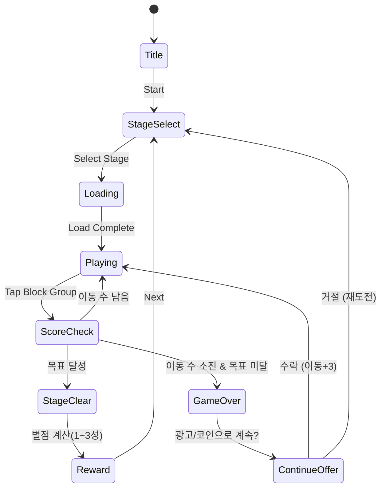

# 블록 크러시: 블록 퍼즐 (Flyfox 레퍼런스)

> **레퍼런스**: #55 Block Crush: Block Puzzle by Flyfox Games (Rating 4.3)
> **비교 대상**: #9 Block Crush by Wonderful Studio (Rating 4.8)
> **장르**: 탭-크러시형 블록 퍼즐 (그룹 제거 방식)

---

## 장르 분석

### #9 vs #55 블록 크러시 비교

| 항목 | #9 Wonderful Studio | #55 Flyfox Games |
|------|---------------------|------------------|
| 평점 | ⭐ 4.8 | ⭐ 4.3 |
| 순위 | #9 (상위권) | #55 (중위권) |
| 메카닉 | 탭 크러시 (오리지널) | 탭 크러시 (유사 클론) |
| 콘텐츠 깊이 | 깊음 (수백 스테이지) | 얕음 |
| 폴리싱 | 높음 (이펙트, 사운드) | 낮음 |
| 수익화 | 균형 잡힌 광고+IAP | 공격적 광고 |
| 차별성 | 오리지널 브랜드 | 후발 클론 |

**평점 차이 원인 분석 (4.8 → 4.3, -0.5)**:
1. **클론 인식**: 같은 이름을 사용한 후발주자 → 유저 신뢰도 낮음
2. **콘텐츠 부족**: 스테이지/레벨 수가 적어 조기 이탈
3. **과도한 광고**: 게임플레이 흐름을 방해하는 광고 빈도
4. **폴리싱 차이**: 이펙트, 애니메이션 품질의 체감 차이
5. **버그/안정성**: 클론 게임 특성상 QA 부족

---

## 블록 퍼즐 장르 포화도 분석

### 레퍼런스 리스트 내 블록 퍼즐 게임

| 순위 | 게임 | 메카닉 유형 | 평점 | 비고 |
|------|------|-------------|------|------|
| #2 | Block Blast | 배치형 (테트로미노) | 4.7+ | **최우선 타겟** |
| #9 | 블록 크러시 (Wonderful) | 탭 크러시형 | 4.8 | 오리지널 강자 |
| #16 | (블록 퍼즐 계열) | TBD | TBD | 분석 필요 |
| #20 | (블록 퍼즐 계열) | TBD | TBD | 분석 필요 |
| #55 | 블록 크러시 (Flyfox) | 탭 크러시형 클론 | 4.3 | 본 레퍼런스 |

### 메카닉 유형별 특성

#### A. 배치형 (Placement) — Block Blast 스타일
- 테트로미노/폴리미노 블록을 보드에 배치
- 줄/열이 완성되면 제거
- **장점**: 무한 플레이, 중독성 강, 세션 길이 유연
- **난이도 곡선**: 자연스러운 상승 (의도치 않은 전략)
- **대표작**: Block Blast (#2), 1010! 퍼즐

#### B. 탭 크러시형 (Tap Crush) — 블록 크러시 스타일
- 같은 색/종류 블록 그룹을 탭해서 제거
- 최소 N개 이상 연결된 그룹만 제거 가능
- **장점**: 즉각적인 피드백, 콤보 연출 용이
- **단점**: 게임 오버 상황이 명확해서 좌절감 높음
- **대표작**: 블록 크러시 (#9)

#### C. 매치-3형 (Match-3) — Candy Crush 변형
- 같은 색 블록 3개를 줄 맞춰 제거
- **대표작**: 별도 카테고리이나 블록 퍼즐과 혼합

---

## 코어 메카닉: 탭 크러시형 상세 설계

> Flyfox 레퍼런스 기반, **오리지널 Wonderful Studio 대비 차별화 포인트** 포함

### 기본 규칙
- N×M 그리드 보드에 컬러 블록이 채워짐
- 같은 색 블록이 **2개 이상 연결**된 그룹을 탭하면 제거
- 단, **최소 2개 이상** 연결된 경우에만 탭 가능 (고립 블록 탭 불가)
- 블록 제거 후 위의 블록이 중력으로 아래 낙하
- **목표**: 제한 이동 수 내에 목표 점수 달성 또는 특정 블록 전부 제거

### 스코어링
| 제거 블록 수 | 획득 점수 |
|------------|---------|
| 2개 | 10점 |
| 3개 | 20점 |
| 4개 | 40점 |
| 5개 | 80점 |
| 6개 | 150점 |
| 7개+ | `블록수² × 5` |

> **핵심**: 대형 그룹 제거에 지수적 보상 → 전략적 플레이 유도

### 특수 블록 (차별화 요소)
| 블록 유형 | 조건 | 효과 |
|-----------|------|------|
| 폭탄 블록 💣 | 5개 이상 그룹 제거 시 생성 | 주변 3×3 범위 블록 전체 제거 |
| 레인보우 블록 🌈 | 10개 이상 그룹 제거 시 생성 | 같은 색 블록 전체 제거 |
| 돌 블록 🪨 | 초반부터 배치 | 크러시로 제거 불가, 폭탄으로만 제거 |
| 잠금 블록 🔒 | 중반 이후 등장 | 2번 탭해야 제거 (첫 번째는 잠금 해제) |

---

## 게임 플로우



---

## UI 레이아웃

```
┌─────────────────────────┐
│  ← Back   [Stage 1-5]   │  ← 상단 네비
│  ⭐⭐⭐  Move: 20       │  ← 목표/이동수
├─────────────────────────┤
│  🎯 목표: 500점         │  ← 스테이지 목표
├─────────────────────────┤
│                         │
│  🔴🔴🔵🟡🔴🟢🔵      │
│  🔵🟡🟡🔴🟢🔴🟡      │
│  🟢🔴🔵🟢🔵🟡🔴      │  ← 게임 보드 (7×9)
│  🟡🟢🔴🟡🔴🔵🟢      │    (탭으로 그룹 제거)
│  🔴🔵🟢🔴🟢🟡🔵      │
│  🟢🟡🔴🔵🟡🔴🟢      │
│  🔵🔴🟢🟡🔴🟢🔵      │
│  🟡🟢🔵🔴🟢🔵🟡      │
│  🔴🔵🟡🟢🔵🟡🔴      │
│                         │
├─────────────────────────┤
│  💣 Bomb  🔀 Shuffle  🌈 │  ← 부스터 (3개)
└─────────────────────────┘
```

---

## 스테이지 구조

### 스테이지 목표 유형
1. **점수 달성**: 제한 이동 내 목표 점수 달성
2. **색상 클리어**: 특정 색 블록 전부 제거
3. **레이어 제거**: 바닥 레이어 블록(특수) 전부 제거
4. **장애물 제거**: 돌 블록 전부 제거 (폭탄 필요)

### 난이도 설계

| 구간 | 스테이지 | 색상 수 | 보드 크기 | 이동 수 | 특수 블록 |
|------|---------|---------|----------|---------|-----------|
| 튜토리얼 | 1~5 | 3 | 5×7 | 25 | 없음 |
| 초반 | 6~20 | 4 | 6×8 | 20 | 폭탄 |
| 중반 | 21~50 | 5 | 7×9 | 18 | 폭탄, 잠금 |
| 후반 | 51~100 | 6 | 7×9 | 15 | 전체 |
| 하드 | 100+ | 6 | 7×9 | 12 | 전체+콤보 |

---

## 수익화 전략

### 모바일 블록 퍼즐 공통 수익 모델

#### 1. 광고 (주력 — 무료 유저)
| 광고 유형 | 노출 시점 | 예상 CPM |
|-----------|----------|----------|
| 인터스티셜 | 게임 오버 후 | $3~8 |
| 리워드 광고 | 이동 +3 선택 시 | $8~20 |
| 배너 광고 | 스테이지 선택 화면 | $0.5~1 |

#### 2. IAP (In-App Purchase)
| 상품 | 가격 | 내용 |
|------|------|------|
| 부스터 팩 (소) | $0.99 | 폭탄 ×5, Shuffle ×3 |
| 부스터 팩 (대) | $4.99 | 폭탄 ×20, Shuffle ×10, 레인보우 ×5 |
| 광고 제거 | $2.99 | 영구 광고 없음 |
| 코인 (소) | $0.99 | 코인 1,000 |
| 코인 (대) | $9.99 | 코인 12,000 |
| 프리미엄 패스 | $4.99/월 | 매일 코인 + 광고 없음 |

#### 3. 에너지/라이프 시스템
- 게임 오버 시 하트 -1 (최대 5개)
- 하트 회복: 30분/개 or 광고 시청 or 코인 구매
- **전략**: 에너지 시스템은 리텐션 낮춤 → MVP에선 생략, Phase 2에서 고려

### 수익화 우선순위 (MVP 기준)
1. **리워드 광고** (게임 오버 후 계속하기) → 즉시 수익 + UX 덜 방해
2. **인터스티셜 광고** (스테이지 클리어 3~5개당 1회) → 수익 핵심
3. **IAP 부스터** → 광고 수익의 보완재
4. 광고 제거 IAP → 충성 유저 타겟

---

## 블록 퍼즐 전략 결론

### 우선순위 판단

```
순위: Block Blast (#2) >>> 탭 크러시형 (#9 스타일) > Flyfox 클론 (#55)
```

#### 1위: Block Blast 스타일 배치형 (최우선 개발 권장)
- **근거**: 앱스토어 #2 → 시장 검증 완료
- **메카닉**: 배치형은 무한 플레이 가능 → 리텐션 극대화
- **개발 난이도**: 낮음 (단순 그리드 + 피스 배치)
- **예상 개발 기간**: 1주 (MVP)
- **차별화**: 테마(우주/자연/레트로), 특수 피스 추가로 차별화 가능

#### 2위: 탭 크러시형 (#9 Wonderful Studio 스타일)
- **근거**: #9 앱이 4.8로 매우 높은 평점 → 검증된 메카닉
- **메카닉**: 탭으로 그룹 제거 → 직관적이고 중독성 강
- **개발 난이도**: 중간 (그룹 탐지 알고리즘, 특수 블록)
- **예상 개발 기간**: 1~2주 (MVP)
- **주의**: #9가 이미 강한 자리 → 차별화 필수

#### 3위: Flyfox 클론 (#55) — **비권장**
- 낮은 평점(4.3)의 클론 게임을 레퍼런스로 사용하는 것은 위험
- #9를 레퍼런스로 삼아 더 나은 버전 구현이 현명

### 최종 제안

> **3개월 생존 전략: Block Blast 우선, 탭 크러시 병행**

| 타임라인 | 게임 | 기대 수익 |
|---------|------|---------|
| Week 1~2 | Block Blast 스타일 배치형 | 높음 (시장 최대 검증) |
| Week 3~4 | 탭 크러시형 (#9 스타일 개선판) | 중간 |
| Month 2 | 데이터 보고 집중 투자 결정 | — |

---

## 기능 기획서: 우리 블록 크러시 (탭 크러시형)

> **전제**: Flyfox(#55)의 단점을 보완하고 Wonderful Studio(#9) 수준의 품질 목표

### 개요
- **게임명**: 블록 크러시
- **장르**: 탭 크러시 퍼즐
- **타겟**: 캐주얼 게이머, 전 연령
- **세션 길이**: 2~5분
- **핵심 재미**: 대형 그룹 연쇄 제거 시 쾌감, 콤보 이펙트

### MVP 범위

#### Phase 1 (1주차 — 반드시 출시)
- [ ] 기본 보드 렌더링 (7×9 그리드)
- [ ] 연결 그룹 탐지 알고리즘 (BFS/DFS)
- [ ] 탭으로 그룹 제거 + 중력 낙하
- [ ] 점수 시스템 (그룹 크기 기반 지수 보상)
- [ ] 이동 수 제한 + 게임 오버 판정
- [ ] 스테이지 클리어 (별점 1~3)
- [ ] 10개 스테이지

#### Phase 2 (2주차 — 완성도)
- [ ] 특수 블록 (폭탄, 레인보우)
- [ ] 장애물 블록 (돌, 잠금)
- [ ] 리워드 광고 (게임 오버 계속하기)
- [ ] 인터스티셜 광고
- [ ] 50개 스테이지
- [ ] 사운드/이펙트

#### Phase 3 (데이터 기반)
- [ ] IAP 부스터 시스템
- [ ] 에너지/하트 시스템
- [ ] 100+ 스테이지
- [ ] 데일리 챌린지

### 사운드/이펙트

| 이벤트 | 사운드 | 이펙트 |
|--------|--------|--------|
| 그룹 탭 | 팡! 효과음 | 블록 분해 파티클 |
| 폭탄 폭발 | 폭발음 | 3×3 쉐이크 + 파티클 |
| 레인보우 발동 | 상승음 | 무지개 웨이브 |
| 콤보 | 연속 상승음 | 콤보 카운터 텍스트 |
| 스테이지 클리어 | 팡파르 | 별점 애니메이션 |
| 게임 오버 | 실패음 | 화면 어두워짐 |

---

## 구현 참고사항 (lib 팀용)

### 그룹 탐지 알고리즘
```
function findGroup(board, row, col, color):
  BFS/DFS로 같은 색 연결 블록 탐색
  반환: 연결된 블록 좌표 배열
  조건: 2개 이상이면 탭 가능 표시

function removeGroup(board, group):
  그룹 블록 제거
  중력 적용 (각 열에서 빈 칸 위의 블록을 아래로 이동)
  특수 블록 생성 조건 체크 (5개 이상 → 폭탄, 10개 이상 → 레인보우)
```

### 보드 상태 타입
```typescript
type BlockType = 'red' | 'blue' | 'green' | 'yellow' | 'purple' | 'orange'
type SpecialType = 'bomb' | 'rainbow' | 'stone' | 'locked' | null
type Cell = { color: BlockType | null; special: SpecialType; locked: boolean }
type Board = Cell[][]
```
