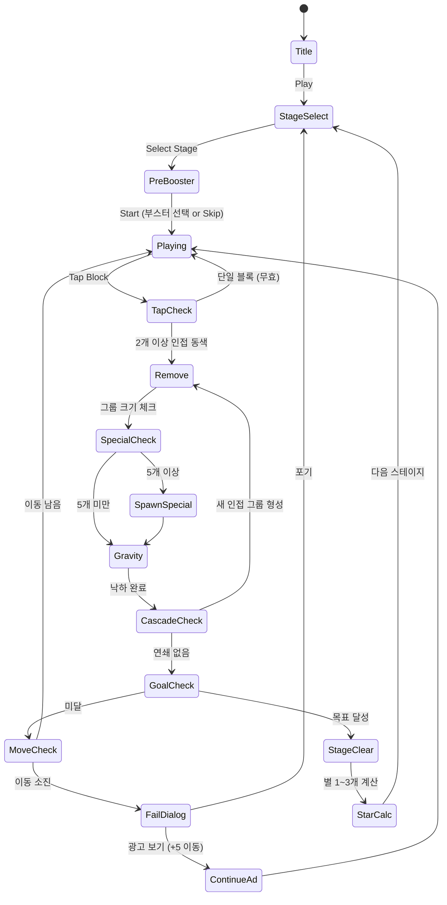

# 블록 크러시 (Block Crush)

> 간단한 규칙의 고전 블록 퍼즐. 같은 색 인접 블록 2개 이상을 탭하여 제거하고, 중력 낙하로 연쇄를 만들어 목표를 달성하라.

## 개요

N×M 격자 보드에 색상 블록이 가득 배치되어 있다. 플레이어는 같은 색 인접 블록 그룹을 탭하여 한 번에 제거한다. 블록이 제거되면 위 블록이 아래로 낙하하며 연쇄(캐스케이드)를 유발한다. 스테이지마다 목표(점수, 특정 색 제거, 장애물 파괴)가 주어지고, 제한 이동 횟수 내에 달성하면 클리어.

**핵심 재미 루프**: 탭 → 제거 → 낙하 → 연쇄 → 특수 블록 생성 → 목표 달성

## 게임 규칙

### 기본 규칙
- 보드: **8×8** 격자 (기본), 스테이지마다 형태 변형 가능
- 같은 색 **인접(상하좌우) 블록 2개 이상**을 탭하면 그룹 전체 제거
- 제거 후 위 블록이 **중력 낙하**, 빈 열은 왼쪽으로 이동(옵션)
- **제한 이동 횟수** 내에 목표 달성 → 스테이지 클리어
- 이동 횟수 소진 시 목표 미달 → **게임 오버**
- 탭 가능한 그룹(2개 이상 인접)이 없으면 자동 리셔플(보드 재배치)

### 블록 색상
| 색상 | 기호 | 난이도 |
|------|------|--------|
| 빨강 | 🔴 | 공통 |
| 파랑 | 🔵 | 공통 |
| 초록 | 🟢 | 공통 |
| 노랑 | 🟡 | 공통 |
| 보라 | 🟣 | 중급+ |
| 분홍 | 🩷 | 중급+ |

> 초반 스테이지: 4색, 후반: 6색 사용

### 그룹 크기와 특수 블록 생성
| 제거 그룹 크기 | 생성 특수 블록 |
|---------------|--------------|
| 2~4개 | 일반 제거 (특수 없음) |
| 5~6개 | **로켓** (가로 or 세로 한 줄 제거) |
| 7~8개 | **폭탄** (3×3 범위 제거) |
| 9개 이상 | **레인보우** (같은 색 블록 전체 제거) |

- 특수 블록은 탭 시 발동, 다른 특수 블록과 인접 시 **콤보 연쇄** 발동
- 특수 블록 + 특수 블록 조합:
  - 로켓 + 로켓 → 가로·세로 동시 제거 (십자)
  - 폭탄 + 폭탄 → 5×5 범위 제거
  - 레인보우 + 특수 → 보드 내 해당 색 모두 특수 블록으로 전환 후 발동

## 장애물

| 장애물 | 제거 방법 | 설명 |
|--------|----------|------|
| **돌 블록** (Stone) | 인접 블록 제거 2회 | 자체 색상 없음, 이동 불가 |
| **얼음** (Ice) | 인접 블록 제거 1회 | 얼음 아래 블록 잠금 |
| **체인** (Chain) | 인접 블록 제거 3회 | 블록에 체인이 감긴 형태 |
| **나무 상자** (Crate) | 특수 블록 또는 인접 제거 | 고정 위치, 낙하 없음 |
| **젤리** (Jelly) | 해당 칸 블록 제거 1회 | 칸 자체가 젤리로 코팅 |

> MVP에서는 **돌 블록, 얼음, 체인** 3가지만 구현

## 스테이지 목표 유형

| 유형 | 설명 | 예시 |
|------|------|------|
| **점수 목표** | N점 이상 달성 | 5,000점 달성 |
| **색 제거** | 특정 색 블록 N개 제거 | 빨강 30개 제거 |
| **장애물 파괴** | 장애물 모두 제거 | 얼음 15개 파괴 |
| **콤보** | 연속 연쇄 N회 달성 | 5콤보 달성 |
| **복합** | 위 목표 2~3개 동시 | 3,000점 + 파랑 20개 |

> MVP 30스테이지: 점수 목표(1~10) → 색 제거(11~20) → 장애물 파괴(21~30)

## 부스터 시스템

### 게임 시작 전 부스터 (Pre-Game)
| 부스터 | 효과 | 가격 |
|--------|------|------|
| **추가 이동 +5** | 시작 이동 횟수 5 추가 | 코인 100 or $0.99 |
| **폭탄 배치** | 랜덤 위치 폭탄 3개 배치 | 코인 150 or $0.99 |
| **색 제거** | 선택한 색 블록 랜덤 8개 제거 | 코인 200 or $1.99 |

### 인게임 부스터 (In-Game)
| 부스터 | 효과 | 획득 방법 |
|--------|------|----------|
| **망치** | 블록 1개 직접 제거 | 광고 시청 or 코인 50 |
| **셔플** | 보드 랜덤 재배치 | 광고 시청 or 코인 80 |
| **로켓** | 보드에 로켓 1개 즉시 추가 | 코인 100 |

## 게임 플로우



## UI 레이아웃

```
┌─────────────────────────────┐
│  ❤️❤️❤️❤️❤️   [⚙]  [🏠]   │  ← 라이프 / 설정 / 홈
│  Stage 15      🎯 목표      │  ← 스테이지 번호 + 목표 요약
│  🔴×20  🔵×15  ⭐⭐⭐       │  ← 목표 진행 + 별 기준
├─────────────────────────────┤
│  이동: 25 / 25              │  ← 남은 이동 횟수
├─────────────────────────────┤
│  ┌─┬─┬─┬─┬─┬─┬─┬─┐         │
│  │🔴│🔵│🟢│🔴│🔵│🟢│🔴│🔵│  │
│  ├─┼─┼─┼─┼─┼─┼─┼─┤         │
│  │🟡│🔴│🔵│🟢│🔴│🔵│🟢│🔴│  │
│  ├─┼─┼─┼─┼─┼─┼─┼─┤         │
│  │🔵│🟢│🟡│🔴│🟢│🔴│🔵│🟡│  │  ← 게임 보드
│  ├─┼─┼─┼─┼─┼─┼─┼─┤         │    (8×8)
│  │🔴│🔵│🔴│🟢│💣│🔵│🔴│🟢│  │    특수블록 표시
│  ├─┼─┼─┼─┼─┼─┼─┼─┤         │
│  │⛓️│⛓️│🔴│🔵│🟡│🔴│🔵│🔴│  │    장애물 표시
│  ├─┼─┼─┼─┼─┼─┼─┼─┤         │
│  │🧊│🟢│🟡│🔴│🔵│🟢│🟡│🔵│  │
│  ├─┼─┼─┼─┼─┼─┼─┼─┤         │
│  │🔴│🔵│🔴│🟢│🔴│🔵│🔴│🟢│  │
│  ├─┼─┼─┼─┼─┼─┼─┼─┤         │
│  │🟡│🔴│🔵│🔴│🔵│🟢│🔴│🔵│  │
│  └─┴─┴─┴─┴─┴─┴─┴─┘         │
├─────────────────────────────┤
│  [🔨 망치] [🔀 셔플] [🚀 로켓] │  ← 인게임 부스터
└─────────────────────────────┘
```

### 팝업 / 오버레이
- **스테이지 클리어**: 별 1~3개 + 획득 코인 + 다음 스테이지 버튼
- **게임 오버**: "5회 이동 추가? 광고 보기" / "포기" 선택
- **일일 보상**: 로그인 시 자동 팝업, 7일 달력 형태

## 스코어링 시스템

| 액션 | 점수 |
|------|------|
| 블록 1개 제거 | +10 |
| 그룹 크기 보너스 (n개) | +10 × n × (n-1) / 2 |
| 특수 블록 발동 | +500 |
| 특수 블록 콤보 | +500 × 콤보 단계 |
| 장애물 파괴 | +200 |
| 남은 이동 보너스 | 남은이동 × 200 |

### 별점 기준 (스테이지별 설정)
| 별 | 조건 |
|----|------|
| ⭐ | 목표 달성 |
| ⭐⭐ | 목표 달성 + 목표점수 150% 이상 or 이동 20% 이상 잔여 |
| ⭐⭐⭐ | 목표 달성 + 목표점수 200% 이상 or 이동 40% 이상 잔여 |

## 난이도 설계

### 스테이지 파라미터

| 스테이지 | 색상 수 | 보드 크기 | 이동 횟수 | 장애물 | 목표 유형 |
|----------|---------|----------|----------|--------|---------|
| 1~5 | 4 | 8×8 | 30 | 없음 | 점수 |
| 6~10 | 4 | 8×8 | 25 | 없음 | 점수 |
| 11~15 | 5 | 8×8 | 25 | 없음 | 색 제거 |
| 16~20 | 5 | 8×8 | 20 | 없음 | 색 제거 |
| 21~25 | 5 | 8×8 | 25 | 돌·얼음 | 장애물 파괴 |
| 26~30 | 6 | 8×8 | 20 | 돌·얼음·체인 | 복합 |

### 블록 배치 규칙
- 솔버블(Solvable) 검증: 생성 시 최소 3개 유효 이동 보장
- 특수 블록 초기 배치: 21스테이지 이상에서 폭탄 1~2개 사전 배치
- 색상 분포: 균등 분포 ± 15% 랜덤 편차

## 수익화 설계

### 라이프 시스템
- 라이프 최대 5개, 실패 1회당 -1
- 30분마다 1개 자동 충전
- 광고 시청으로 즉시 +1 라이프 (1일 3회 제한)
- 코인으로 즉시 충전 (5개 = 코인 500)
- 하트 구독 상품: 무제한 라이프 $2.99/주

### IAP (인앱 결제)
| 상품 | 가격 |
|------|------|
| 코인 1,000 | $0.99 |
| 코인 5,000 | $3.99 |
| 코인 15,000 | $9.99 |
| 추가 이동 +5 | $0.99 (즉시 사용) |
| 부스터 팩 (각 5개) | $1.99 |
| 광고 제거 | $4.99 (영구) |

### 광고 (Rewarded Ad)
| 시점 | 보상 |
|------|------|
| 게임 오버 | +5 이동 (1회) |
| 스테이지 클리어 | 코인 2배 (1회) |
| 인게임 부스터 | 망치/셔플 무료 사용 |
| 일일 보너스 | 보상 2배 |

## 리텐션 시스템

### 일일 보상 (Daily Reward)
- 7일 달력 구조
- Day 1~6: 코인 점진적 증가 (100 → 600)
- Day 7: 부스터 세트 (망치×3 + 셔플×2 + 로켓×1)
- 연속 출석 보너스: 7일 달성 시 특별 코인 보상

### 이벤트 스테이지
- 주간 특별 스테이지 3개 (한정 기간)
- 클리어 시 이벤트 전용 코인 지급
- 랭킹 이벤트: 주간 스코어 상위 100명 추가 보상

### 알림
- 라이프 충전 완료 푸시 알림
- 일일 보상 리마인더 (24시간마다)
- 이벤트 스테이지 오픈 알림

## 사운드 & 이펙트

| 이벤트 | 사운드 | 이펙트 |
|--------|--------|--------|
| 블록 탭 | 경쾌한 팝 | 선택된 그룹 하이라이트 |
| 블록 제거 | 크러시 효과음 | 블록 파편 애니메이션 |
| 낙하 | 통통 사운드 | 블록 낙하 물리 이펙트 |
| 특수 블록 발동 | 강렬한 폭발음 | 화염/전기 파티클 |
| 콤보 연쇄 | 상승 톤 × n | 화면 흔들림 + 번쩍임 |
| 스테이지 클리어 | 축하 팡파레 | 별 획득 애니메이션 |
| 게임 오버 | 실패 사운드 | 화면 흐릿해짐 |
| 장애물 파괴 | 깨짐 효과음 | 돌/얼음 파편 |

## MVP 범위 (1~2주)

### Phase 1 — MVP (1주차)
- [x] 기획서 작성
- [ ] 8×8 보드 생성 및 렌더링
- [ ] 탭으로 동색 인접 그룹 선택 및 하이라이트
- [ ] 그룹 제거 + 중력 낙하 로직
- [ ] 특수 블록 생성 (로켓, 폭탄)
- [ ] 특수 블록 발동 로직
- [ ] 이동 횟수 카운터
- [ ] 점수 목표 판정 (클리어 / 게임 오버)
- [ ] 스테이지 1~10 (점수 목표)

### Phase 2 — 장애물 + 다양한 목표 (2주차)
- [ ] 돌 블록, 얼음, 체인 장애물 구현
- [ ] 색 제거 목표 판정
- [ ] 장애물 파괴 목표 판정
- [ ] 스테이지 11~30
- [ ] 별점 1~3개 시스템
- [ ] 스테이지 셀렉트 화면
- [ ] 기본 사운드 & 이펙트

### Phase 3 — 수익화 + 리텐션 (출시 후)
- [ ] 라이프 시스템
- [ ] IAP 연동
- [ ] 광고(Rewarded Ad) 연동
- [ ] 일일 보상 시스템
- [ ] 부스터 시스템 (인게임)
- [ ] 푸시 알림

## 기술 구현 노트

> 이 섹션은 Game Core 팀 참고용

- **Phaser.io Scene 구조**: `GameScene` (보드 렌더링·로직), `UIScene` (HUD 오버레이)
- **블록 오브젝트**: `Block` 클래스 → `color`, `type`(normal/rocket/bomb/rainbow), `hp`(장애물용)
- **BFS 그룹 탐색**: 탭 시 BFS로 동색 인접 그룹 탐색, 크기 반환
- **낙하 애니메이션**: Tween으로 Y좌표 이동, 완료 후 연쇄 체크
- **캐스케이드 처리**: 낙하 완료 콜백에서 재귀 BFS 호출 (자동 연쇄 없음, 수동 탭만)
- **상태 머신**: `idle` → `animating` → `checking` → `idle` (탭 중복 방지)
