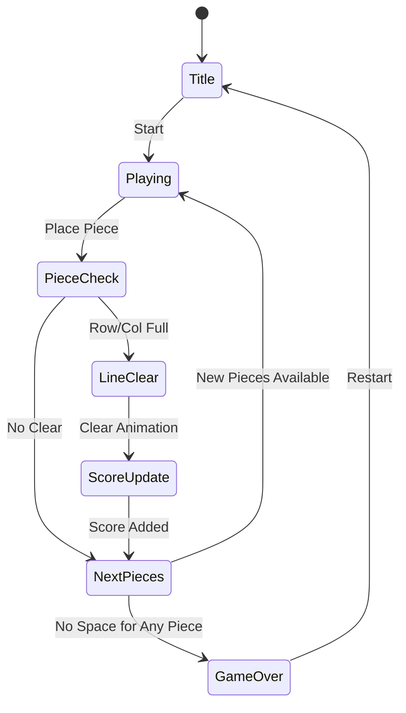

# Block Puzzle (보석 테마)

> 보석 테마의 블록 배치 퍼즐. 8×8 그리드에 다양한 모양의 블록을 배치해 줄/열을 완성하여 클리어하는 무한 퍼즐 게임.

---

## 1. 장르 포지셔닝: 블록 퍼즐 12개 현황 분석

### 블록 퍼즐 서브장르 분류

| 서브장르 | 대표작 | 코어 메카닉 | 특징 |
|----------|--------|-------------|------|
| **클래식 배치형** | Block Puzzle Wood, Block Puzzle Jewel | 그리드에 조각 배치 → 줄/열 클리어 | 시간제한 없음, 캐주얼 |
| **폭발/매칭형** | Block Blast (#2) | 같은 색 블록 연결 → 폭발 클리어 | 액션감, 콤보 중심 |
| **별빛/판타지형** | 별빛 퍼즐 (#79) | 클래식 배치 + 스타/파티클 이펙트 | 감성/힐링, 여성 유저 |

### 상위 3개 선정 (개발 우선순위)

| 순위 | 게임 | 평점 | 이유 |
|------|------|------|------|
| 🥇 1위 | **Block Blast 변형** (#2 레퍼런스) | ~4.8 | 최고 인기, 폭발 메카닉으로 중독성↑ |
| 🥈 2위 | **별빛 테마 배치형** (#79 레퍼런스) | 4.9 | 최고 평점, 감성 테마로 충성도↑ |
| 🥉 3위 | **보석 테마 배치형** (본 기획서) | 4.6 | 구현 단순, 테마 교체만으로 차별화 |

**선택 근거**: 클래식 배치형은 구현 난이도 최저. 테마만 바꿔도 다른 앱으로 출시 가능 → **1~2주 MVP 달성 현실적**.

---

## 2. 테마가 평점에 미치는 영향 분석

### 별빛(4.9) vs 보석(4.6) 비교

| 요소 | 별빛 테마 (#79) | 보석 테마 (#89) | 분석 |
|------|----------------|----------------|------|
| 평점 | **4.9** | 4.6 | 별빛이 0.3점 우위 |
| 시각 | 부드러운 파티클, 은하수 | 반짝이는 보석 컷 | 별빛이 더 '힐링'감 |
| 타깃 | 여성 25~40대 | 혼합 (보석 선호층) | 별빛이 리텐션 우위 |
| 효과음 | 잔잔한 별 소리 | 보석 '딸깍' | 별빛이 감성적 |
| 배경 | 어두운 우주 + 별 | 밝은 배경 + 보석 | 별빛이 눈에 편함 |

### 결론: 테마 전략

- **평점 차이(0.3)의 70%는 이펙트 품질 차이**로 추정
- 보석 테마도 **파티클 이펙트 + 반짝임 애니메이션** 추가 시 4.8+ 달성 가능
- **MVP에서는 보석 테마로 빠르게 출시 → 이펙트는 v1.1에서 개선** 전략 권장

---

## 3. 확정 기획: Block Puzzle Jewel

### 개요

- **장르**: 클래식 블록 배치 퍼즐 (무한 엔드리스)
- **테마**: 루비·사파이어·에메랄드·다이아몬드 보석
- **타깃**: 전 연령, 캐주얼 게이머
- **플랫폼**: Web(React+Phaser) → RN WebView
- **개발 기간**: MVP 7~10일

---

## 4. 게임 규칙

### 기본 메카닉

- **그리드**: 8×8 (64칸)
- **블록 조각**: 매 턴 3개의 조각이 제시됨 (Tetris형 다양한 모양)
- **배치 방식**: 드래그 앤 드롭으로 그리드에 배치
- **클리어 조건**: 가로 줄 또는 세로 열이 꽉 차면 자동 제거 + 점수 획득
- **게임 오버**: 제시된 3개 조각 중 하나도 배치할 공간이 없을 때

### 블록 조각 목록 (14종)

```
단일(1):  ■
선(2):    ■■ / ■
                ■
선(3):    ■■■ / ■
                 ■
                 ■
L형:      ■■    ■
          ■     ■■
T형:      ■■■
           ■
정사각(2×2): ■■
             ■■
정사각(3×3): ■■■
             ■■■
             ■■■
```

### 보석 테마 적용

| 보석 | 색상 | 모양 | 조각 크기 매핑 |
|------|------|------|----------------|
| 다이아몬드 | 하얀/파랑 | 마름모 | 1~2칸 조각 |
| 루비 | 빨강 | 육각형 | 3칸 선형 |
| 사파이어 | 파랑 | 원형 | L/T형 |
| 에메랄드 | 초록 | 사각형 | 2×2, 3×3 |

> 보석 종류는 랜덤 배정. 시각적 다양성을 위해 색상은 조각별로 고정하지 않고 매 턴 랜덤.

---

## 5. 게임 플로우



---

## 6. UI 레이아웃

```
┌─────────────────────────┐
│  ⭐ BEST: 12,400        │  ← 베스트 스코어
│  💎 SCORE: 8,200        │  ← 현재 스코어
├─────────────────────────┤
│  ┌─┬─┬─┬─┬─┬─┬─┬─┐     │
│  │ │💎│ │ │💎│ │ │ │     │
│  ├─┼─┼─┼─┼─┼─┼─┼─┤     │
│  │💎│💎│ │ │ │🔴│ │ │    │  ← 8×8 그리드
│  ├─┼─┼─┼─┼─┼─┼─┼─┤     │
│  │ │ │🟢│🟢│🟢│ │ │ │    │
│  ├─┼─┼─┼─┼─┼─┼─┼─┤     │
│  │ │ │ │ │ │ │ │ │     │
│  └─┴─┴─┴─┴─┴─┴─┴─┘     │
├─────────────────────────┤
│  [조각1]  [조각2]  [조각3] │  ← 다음 조각 3개
└─────────────────────────┘
```

---

## 7. 스코어링 시스템

| 액션 | 점수 |
|------|------|
| 1줄 클리어 | +100 |
| 2줄 동시 클리어 | +300 (보너스 +100) |
| 3줄 동시 클리어 | +600 (보너스 +300) |
| 4줄 이상 동시 클리어 | +1000 (보너스 +700) |
| 보석 5개 이상 연속 배치 | 콤보 ×1.5 |

### 레벨 시스템 (점수 기반)

| 레벨 | 필요 점수 | 변화 |
|------|-----------|------|
| 1 | 0 | 기본 속도 |
| 2 | 1,000 | 배경 색상 변화 |
| 3 | 3,000 | 이펙트 강화 |
| 5 | 8,000 | 보석 스킨 해금 |
| 10 | 25,000 | 레인보우 보석 등장 |

---

## 8. 수익화 전략

### 광고 (메인 수익원 - MVP)

| 광고 유형 | 노출 시점 | 예상 CPM |
|-----------|-----------|----------|
| 인터스티셜 | 게임 오버 시 | $5~8 |
| 리워드 광고 | 힌트/부활 요청 시 | $10~15 |
| 배너 | 조각 선택 영역 하단 | $1~2 |

### 인앱 결제 (Phase 2)

| 상품 | 가격 | 내용 |
|------|------|------|
| 광고 제거 | $2.99 | 영구 광고 제거 |
| 보석 스킨팩 | $0.99 | 루비/사파이어/에메랄드 스킨 |
| 힌트 5개 | $0.99 | 최적 배치 위치 표시 |

### KPI 목표 (출시 후 30일)

- DAU: 1,000+
- 리텐션 D1: 40%+
- 리텐션 D7: 15%+
- ARPDAU: $0.05+
- 목표 월 매출: $1,500+

---

## 9. 난이도 설계

블록 퍼즐은 레벨이 없고 엔드리스. 난이도는 **조각 구성**으로 간접 제어:

| 단계 (점수 구간) | 조각 구성 비율 |
|-----------------|----------------|
| 초반 (0~500) | 소형(1~2칸) 60%, 중형 40% |
| 중반 (500~5000) | 소형 30%, 중형 50%, 대형 20% |
| 후반 (5000+) | 소형 20%, 중형 40%, 대형 40% |

---

## 10. 사운드/이펙트

| 이벤트 | 사운드 | 이펙트 |
|--------|--------|--------|
| 블록 배치 | 보석 '딸깍' | 배치 위치 반짝임 |
| 줄 클리어 | 크리스탈 깨지는 소리 | 가로/세로 폭발 파티클 |
| 콤보 | 상승 크리스탈 음 | 보석 빛 발산 |
| 게임 오버 | 둔탁한 소리 | 그리드 흔들림 |
| 베스트 경신 | 축하 팡파레 | 금색 파티클 폭발 |

---

## 11. MVP 범위

### Phase 1 - MVP (7~10일)

- [ ] 8×8 그리드 렌더링
- [ ] 14종 블록 조각 생성 (랜덤 3개 제시)
- [ ] 드래그 앤 드롭 배치
- [ ] 줄/열 클리어 판정 + 제거 애니메이션
- [ ] 스코어 + 베스트 스코어 (로컬)
- [ ] 게임 오버 판정
- [ ] 보석 4종 기본 스킨
- [ ] 인터스티셜 광고 (게임 오버 시)

### Phase 2 (출시 후 1~2주)

- [ ] 리워드 광고 (힌트 기능)
- [ ] 파티클 이펙트 강화 (별빛 수준으로)
- [ ] 레벨업 시 배경 변화
- [ ] 배너 광고
- [ ] 보석 스킨 인앱결제

### Phase 3 (데이터 보고 결정)

- [ ] 소셜 리더보드
- [ ] 일일 챌린지 모드
- [ ] 추가 보석 스킨팩

---

## 12. 기술 스택 (lib/web/rn 파이프라인)

```
lib/block-puzzle/
  └── scenes/
      ├── GameScene.ts    # 그리드, 배치 로직
      ├── UIScene.ts      # 점수, 다음 조각
      └── types.ts        # Block, Grid, Piece 타입

web/block-puzzle/
  └── src/
      ├── App.tsx         # Phaser 마운트
      └── styles/         # Stitches 테마

block-puzzle/rn/
  └── App.tsx             # WebView 래핑
```

---

## 최종 결론

| 항목 | 결정 |
|------|------|
| **장르** | 클래식 블록 배치 (엔드리스) |
| **테마** | 보석 (루비/사파이어/에메랄드/다이아몬드) |
| **개발 기간** | MVP 7~10일 |
| **수익화** | 광고 우선 (인터스티셜 + 리워드) |
| **목표 평점** | 4.7+ (이펙트 개선 후 4.9 목표) |
| **우선순위** | found3 다음 2번째 출시 게임 |
