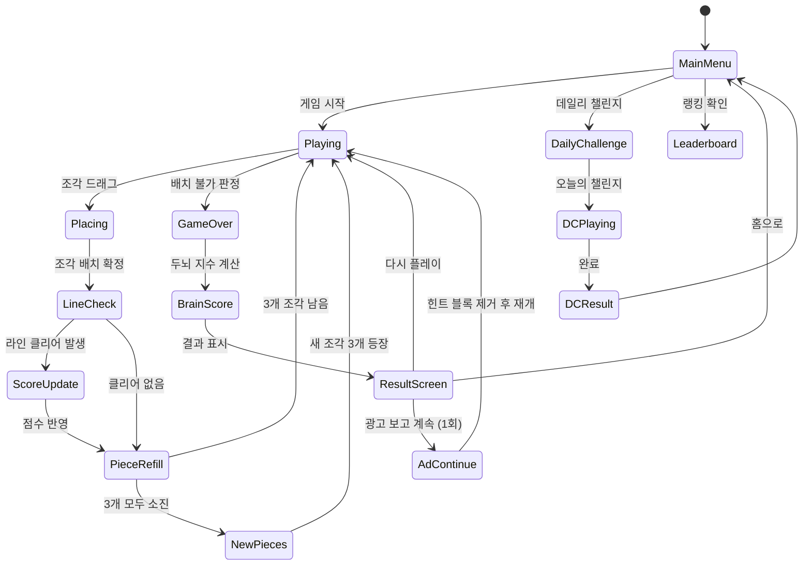

# Block Puzzle: Brain Training

> 레퍼런스 #71 — 4.5★ — LinkDesks Daily Puzzle
> **"놀면 놀수록 더 똑똑해지는 게임"**

---

## 1. 블록 퍼즐 장르 레퍼런스 분석 (12개)

### 레퍼런스 목록

| # | 포지셔닝 | 그리드 | 핵심 메카닉 | 시간제한 | 구현 난이도 | 시장성 |
|---|----------|--------|-------------|----------|-------------|--------|
| #2 Block Blast | 캐주얼 1위 | 8×8 | 블록 배치 → 행/열 클리어 | 없음 | ★★☆ | ★★★★★ |
| #9 1010! | 클래식 | 10×10 | 블록 배치 → 행/열 클리어 | 없음 | ★★☆ | ★★★★☆ |
| #16 Wood Block | 힐링/감성 | 10×10 | 동일, 나무 테마 스킨 | 없음 | ★★☆ | ★★★★☆ |
| #20 Block Puzzle Jewel | 보석/화려함 | 10×10 | 동일, 보석 테마 | 없음 | ★★☆ | ★★★☆☆ |
| #55 Hexa Block | 차별화 | 헥사곤 | 6각형 배치 → 라인 클리어 | 없음 | ★★★☆ | ★★★☆☆ |
| #71 Brain Training | 두뇌훈련 | 10×10 | 블록 배치 + 인지 점수화 | 없음 | ★★☆ | ★★★★☆ |
| #79 Block Puzzle Classic | 노스탤지어 | 10×10 | 기본형 + 연속 클리어 콤보 | 없음 | ★★☆ | ★★★☆☆ |
| #89 Block Puzzle Garden | 내러티브 | 10×10 | 클리어 → 정원 꾸미기 보상 | 없음 | ★★★☆ | ★★★☆☆ |
| #95 Sudoku Block | 하이브리드 | 9×9 | 블록 배치 + 스도쿠 규칙 | 없음 | ★★★★ | ★★☆☆☆ |
| #114 Block Merge | 병합형 | 8×8 | 같은 숫자 블록 합산(2048) | 없음 | ★★★☆ | ★★★☆☆ |
| #117 Tetris Attack | 액션형 | 10×20 | 블록 낙하 + 실시간 | 있음 | ★★★★ | ★★★★☆ |
| #119 Block Blast Daily | 데일리 챌린지 | 10×10 | 기본형 + 일일 과제 시스템 | 없음 | ★★★☆ | ★★★★☆ |

### 핵심 인사이트

**절대 다수(10/12)가 공유하는 승리 공식:**
1. 10×10 그리드 (업계 표준)
2. Tetris 형태 조각 3개 제시 → 자유 배치
3. 행 또는 열 전체가 채워지면 클리어
4. **시간 제한 없음** → 스트레스 없는 사고 게임
5. 게임 오버: 남은 3조각 모두 배치 불가 시

**차별화 포인트 비교:**
- 스킨/테마 차별화(#16, #20): 구현 비용 낮지만 마케팅 차별화 한계
- 헥사곤(#55): 신선하지만 UI 구현 복잡, 학습 곡선 높음
- 내러티브/정원(#89): 리텐션 좋지만 콘텐츠 제작 부담
- 하이브리드/실시간(#95, #117): 타겟 좁아지고 개발 복잡도 급증

---

## 2. 최종 결론: 어떤 변형이 최적인가

### 판정 기준 (파산 직전 3개월 시야)

| 기준 | 가중치 |
|------|--------|
| 구현 속도 (1주 MVP 가능 여부) | 40% |
| 시장 검증 (상위 랭크/다운로드) | 30% |
| 차별화 마케팅 앵글 | 20% |
| 수익화 자연스러움 | 10% |

### 최적 선택: **Block Blast 스타일 + 두뇌훈련 포지셔닝**

```
기본 메카닉 = #2 Block Blast (가장 검증됨, 구현 단순)
마케팅 앵글 = #71 Brain Training ("똑똑해지는" 포지셔닝)
콘텐츠 시스템 = #119 데일리 챌린지 (리텐션 장치)
```

**이유:**
- Block Blast 메카닉은 직관적 → 온보딩 비용 0
- "두뇌훈련" 앵글은 부모/중장년층까지 CPI 낮춤
- 무한 플레이(레벨 디자인 불필요) → 콘텐츠 제작 비용 없음
- 데일리 챌린지로 D30 리텐션 확보 가능

---

## 3. 게임 개요

두뇌 훈련을 명분으로 한 블록 배치 퍼즐. 무한 플레이, 무타임리밋, 고득점 경쟁 구조.
누구나 즉시 이해하고, 5분도 50분도 자연스럽게 플레이할 수 있는 게임.

---

## 4. 게임 규칙

### 기본 규칙

- **그리드**: 10×10 (총 100칸)
- **조각 제시**: 하단에 3개의 조각이 동시에 표시
- **배치**: 조각을 그리드에 드래그 앤 드롭
- **클리어**: 가로 행 또는 세로 열이 전부 채워지면 해당 라인 소멸 + 점수
- **연속 클리어**: 한 번의 조각 배치로 여러 라인 동시 클리어 시 콤보 보너스
- **리필**: 3개 조각 모두 사용 시 새로운 3개 조각 등장
- **게임 오버**: 남은 조각 중 하나라도 그리드에 배치할 공간이 없으면 종료

### 조각 종류 (17종)

```
1×1  □
1×2  □□
1×3  □□□
2×2  □□       L형 □      J형  □      T형 □□□    S형 □□
     □□            □□          □□          □           □□
                   □           □
3×3  □□□
     □□□    Z형 □□     I형 4칸 □□□□   기타 변형들
     □□□        □□
```

총 17종 (1×1 포함) — Block Blast 표준 세트 준용

### 점수 계산

| 행동 | 점수 |
|------|------|
| 블록 1칸 배치 | +1 |
| 라인 1개 클리어 | +100 |
| 라인 2개 동시 클리어 | +300 |
| 라인 3개 동시 클리어 | +600 |
| 라인 4개+ 동시 클리어 | +1000 (보너스 추가) |
| 연속 클리어 콤보 (조각마다) | ×콤보 배율 |

### "두뇌훈련" 점수 시스템 (포지셔닝 차별화)

게임 종료 후 **두뇌 지수(Brain Score)** 표시:

| 두뇌 지수 항목 | 측정 방법 |
|----------------|-----------|
| 집중력 (Concentration) | 세션 당 평균 배치 속도 |
| 공간 인지 (Spatial IQ) | 평균 동시 라인 클리어 수 |
| 전략적 사고 (Strategy) | 콤보 달성 빈도 |
| 성장 지수 (Growth) | 최근 5게임 점수 상승률 |

→ "어제보다 공간 인지력이 12% 향상되었습니다!" 알림 → D1/D7 리텐션 핵심 장치

---

## 5. 게임 플로우



---

## 6. UI 레이아웃

```
┌────────────────────────────────┐
│  🧠 Brain Puzzle    최고: 12,450│  ← 상단 HUD
│  현재: 8,320        🔥 3연속     │
├────────────────────────────────┤
│                                │
│  ┌──┬──┬──┬──┬──┬──┬──┬──┬──┬──┐
│  │  │  │▓▓│▓▓│  │  │  │  │  │  │
│  ├──┼──┼──┼──┼──┼──┼──┼──┼──┼──┤
│  │  │▓▓│▓▓│▓▓│  │  │▓▓│  │  │  │
│  ├──┼──┼──┼──┼──┼──┼──┼──┼──┼──┤  ← 10×10 그리드
│  │▓▓│▓▓│  │  │▓▓│▓▓│▓▓│▓▓│  │  │
│  ...                           │
│  └──┴──┴──┴──┴──┴──┴──┴──┴──┴──┘
│                                │
├────────────────────────────────┤
│     [조각1]  [조각2]  [조각3]    │  ← 조각 트레이 (3개)
├────────────────────────────────┤
│  💡 힌트    🔀 섞기   💎 ×120   │  ← 아이템 바
└────────────────────────────────┘
```

### 게임 오버 / 결과 화면

```
┌────────────────────────────────┐
│         🧠 오늘의 두뇌 리포트   │
│                                │
│  최종 점수:        12,450       │
│  최고 콤보:        5×           │
│  최대 동시 클리어: 3라인         │
│                                │
│  ┌──────────────────────────┐  │
│  │  집중력      ████████░░ 82│  │
│  │  공간인지    ██████░░░░ 61│  │
│  │  전략사고    ███████░░░ 74│  │
│  │  성장지수    ↑ +8%        │  │
│  └──────────────────────────┘  │
│                                │
│  [광고 보고 계속하기]  [종료]   │
└────────────────────────────────┘
```

---

## 7. 난이도 설계

블록 퍼즐은 레벨 기반이 아닌 **무한 스코어 기반**이나,
초반 진입 장벽을 낮추기 위한 적응형 시스템 적용.

### 조각 가중치 (초반 → 후반)

| 세션 점수 | 소형 조각(1~2칸) 비율 | 대형 조각(4~5칸) 비율 |
|-----------|-----------------------|-----------------------|
| 0 ~ 2,000 | 50% | 20% |
| 2,001 ~ 5,000 | 35% | 35% |
| 5,001+ | 20% | 50% |

초반에는 작은 조각이 많이 나와 빠르게 클리어 경험 → 도파민 유도.
후반 대형 조각 비율 증가 → 전략적 배치 요구 → 몰입.

### 데일리 챌린지 (Daily Challenge)

- 매일 오전 00:00 리셋
- **오늘의 고정 씨드 조각 순서** (전세계 동일 → 소셜 비교)
- 클리어 조건: 특정 점수 달성 or 특정 라인 수 클리어
- 완료 시 프리미엄 스킨 조각 or 일일 보상 지급

---

## 8. 아이템 시스템

| 아이템 | 효과 | 획득 방법 |
|--------|------|-----------|
| 💡 힌트 | 최적 배치 위치 하이라이트 (3초) | 광고 시청 or 젬 |
| 🔀 섞기 | 현재 3조각 새로운 3조각으로 교체 | 광고 시청 or 젬 |
| 💣 폭탄 | 3×3 영역 블록 제거 | 젬 |
| ⚡ 번개 | 가장 채워진 행/열 강제 클리어 | 젬 (고가) |
| ❤️ 계속하기 | 게임 오버 시 1회 부활 (힌트 블록 제거) | 광고 시청 |

---

## 9. 수익화 모델

### A. 광고 수익 (메인)

| 광고 형태 | 노출 시점 | 예상 단가 |
|-----------|-----------|-----------|
| 리워드 광고 | 힌트/섞기/계속하기 요청 시 | eCPM $8~15 |
| 인터스티셜 | 게임 오버 후 (3판에 1회) | eCPM $4~8 |
| 배너 | 메인 메뉴 하단 | eCPM $0.5~1 |

**리워드 광고가 핵심** — 플레이어가 자발적으로 보는 구조 → 이탈 최소화.

### B. IAP (부가)

| 상품 | 가격 | 설명 |
|------|------|------|
| 광고 제거 | $2.99 | 인터스티셜/배너 제거 (리워드는 유지) |
| 젬 스타터팩 | $1.99 | 젬 × 100 (첫 구매 할인) |
| 젬 팩 | $4.99 / $9.99 | 젬 × 300 / 800 |
| 프리미엄 스킨 | $1.99~3.99 | 나무/우주/캔디 테마 |

### C. 무료 플레이 보장 원칙

- 힌트/섞기는 광고로 충분히 획득 가능
- 광고 없이도 무한 플레이 가능 (단, 편의 기능 제한)
- 두뇌 지수 기능은 100% 무료 → 핵심 리텐션 장치

### 수익 목표 (보수적)

| 지표 | 목표값 |
|------|--------|
| DAU | 5,000 (출시 4주차) |
| ARPDAU | $0.05~0.10 |
| 월 광고 수익 | $7,500~15,000 |
| 광고 제거 전환율 | 2~3% |

---

## 10. 구현 우선순위: 블록 퍼즐 vs 스도쿠 vs 물 분류

### 비교 분석

| 항목 | 블록 퍼즐 | 스도쿠 | 물 분류 |
|------|-----------|--------|---------|
| 구현 기간 | **5~7일** | 8~12일 | 5~7일 |
| 레벨 디자인 필요 | 불필요 (무한) | **필요 (퍼즐 DB)** | 필요 (레벨 설계) |
| 시장 규모 | ★★★★★ | ★★★★☆ | ★★★☆☆ |
| 차별화 난이도 | 중 | 낮음 | 낮음 |
| 광고 eCPM 친화성 | 높음 | 높음 | 중간 |
| found3 코드 재사용 | 높음 (그리드/씬 구조) | 낮음 | 중간 |

### 결론: **블록 퍼즐 → 스도쿠 → 물 분류 순**

**블록 퍼즐 먼저인 이유:**
1. 무한 콘텐츠 → 레벨 제작 비용 0
2. found3의 Phaser 그리드 씬 재사용 가능 → 개발 가속
3. 시장 검증 최강 (#2 Block Blast: 5억+ 다운로드)
4. "두뇌훈련" 앵글로 차별화 → CPI 절감 가능

**스도쿠를 두 번째로 미루는 이유:**
- 퍼즐 DB 생성 필요 (최소 100~500개)
- 알고리즘 구현 복잡도 높음
- 그러나 퍼즐 생성 알고리즘 완성 시 콘텐츠 자동화 가능 → 2주차에 착수

---

## 11. MVP 범위

### Phase 1 — MVP (5~7일 목표)

- [ ] 10×10 그리드 렌더링
- [ ] 17종 조각 정의 및 랜덤 제시 (3개)
- [ ] 드래그 앤 드롭 배치 로직
- [ ] 행/열 클리어 판정 + 이펙트
- [ ] 점수 시스템 (기본)
- [ ] 게임 오버 판정
- [ ] 결과 화면 (점수 표시)
- [ ] 광고 연동 (리워드: 힌트/계속하기, 인터스티셜: 게임 오버)

### Phase 2 — 리텐션 강화 (3~4일 추가)

- [ ] 두뇌 지수 계산 및 표시
- [ ] 데일리 챌린지 시스템
- [ ] 스킨 시스템 (기본 2~3종)
- [ ] 로컬 최고 점수 저장
- [ ] 콤보 시스템 + 이펙트

### Phase 3 — 수익화 강화

- [ ] IAP (광고 제거, 젬 팩)
- [ ] 글로벌 리더보드
- [ ] 푸시 알림 (데일리 챌린지 리마인더)
- [ ] A/B 테스트 (두뇌 지수 UI 변형)

---

## 12. 사운드/이펙트

| 이벤트 | 효과 |
|--------|------|
| 조각 배치 | 딱 하는 클릭감 효과음 |
| 라인 클리어 | 시원한 스윕 효과음 + 파티클 |
| 멀티 라인 클리어 | 상승 톤 + 강한 파티클 (색상 다양) |
| 콤보 | 레벨업하는 느낌의 상승 멜로디 |
| 게임 오버 | 차분한 종료음 (스트레스 없게) |
| 두뇌 지수 결과 | 긍정적 피아노 스케일 |

---

## 13. 마케팅 앵글

### 타겟

- **1차**: 30~50대 (두뇌훈련 구매 의향 높음, 광고 eCPM 최상)
- **2차**: 10~20대 (고득점 경쟁, 데일리 챌린지 소셜)

### 핵심 크리에이티브

1. **"오늘도 두뇌 훈련 완료 ✅"** — 데일리 습관 형성 앵글
2. **"어제보다 공간인지력 +12%"** — 성장 데이터 시각화
3. **"60초 안에 배우고, 60일 동안 플레이"** — 낮은 학습 곡선 강조
4. **"광고 없이도 무료"** — 진입 장벽 0 강조

### 크리에이티브 포맷

- 플레이어블 광고: 실제 그리드에 블록 배치 → 라인 클리어 경험
- 비디오: 콤보 연계 장면 → "이게 된다고?" 후킹
