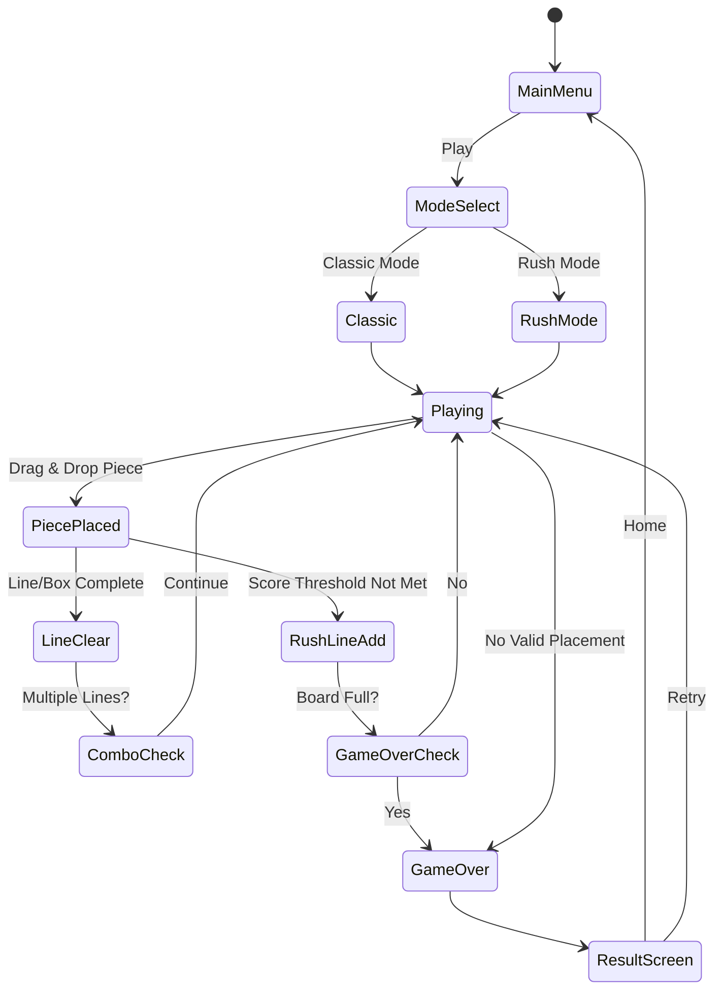

# Block Rush

> **레퍼런스 #119** — Grandfalls Limited / 평점 4.8 / 장르: block-puzzle
> **블록 퍼즐 14번째이자 최종 확정 기획서**

---

## 개요

블록을 격자 위에 배치해 가로·세로·박스 라인을 완성하여 지우는 퍼즐 게임.
**"Rush"** 는 이 게임의 핵심 차별점: 보드 하단에서 블록이 **밀려 올라오는 위기 메카닉**으로
시간 압박 없이도 자연스러운 긴장감을 만들어낸다.

Block Blast의 블록 배치 단순함 + Woodoku의 박스 클리어 깊이 + 우리만의 **Rush 라인** 위기 시스템.

---

## 14개 블록 퍼즐 레퍼런스 종합 분석

| # | 게임 | 핵심 메카닉 | 우리 채택 여부 |
|---|------|-------------|----------------|
| 1 | Classic Tetris | 낙하 블록, 가로 라인 클리어 | ❌ (실시간 조작 복잡) |
| 2 | Block Blast | 8×8 드래그 배치, 행/열 클리어 | ✅ **핵심 채택** |
| 3 | Woodoku | 9×9 + 3×3 박스 클리어 | ✅ **박스 클리어 채택** |
| 4 | 1010! | 10×10 + 다양한 피스 | ✅ **피스 다양성 채택** |
| 5 | Block Puzzle Jewel | 보석 테마, 클리어 이펙트 | ✅ **비주얼 참고** |
| 6 | Wood Block Puzzle | 나무 질감 미니멀 UI | ❌ (캐주얼 타겟 상이) |
| 7 | Block Puzzle King | 힌트 시스템 | ✅ **힌트 파워업 채택** |
| 8 | Jigsaw Puzzle Block | 불규칙 피스 | ❌ (난이도 너무 높음) |
| 9 | Block Hexa | 헥사곤 그리드 | ❌ (구현 복잡) |
| 10 | Blockudoku | Sudoku 룰 결합 | ❌ (학습 곡선 과다) |
| 11 | Block Puzzle Master | 스테이지형 진행 | ✅ **스테이지 구조 채택** |
| 12 | Tetris Effect | 음악 연동 이펙트 | ✅ **콤보 이펙트 참고** |
| 13 | Block Journey | 스토리 모드 | ❌ (개발 공수 과다) |
| **14** | **Block Rush** | **Rush 라인 위기 + 스피드 모드** | ✅ **우리의 차별점** |

**최종 결론**: Block Blast/Woodoku의 검증된 코어 + Rush 라인으로 차별화.

---

## 핵심 차별점: #2 vs #95 vs #119 비교

| 항목 | #2 (Block Blast 타입) | #95 (Woodoku 타입) | **#119 Block Rush** |
|------|-----------------------|--------------------|---------------------|
| 그리드 | 8×8 | 9×9 | **8×8** |
| 클리어 조건 | 행/열 | 행/열/박스 | **행/열/박스** |
| 압박 요소 | 없음 (무한 배치) | 없음 | **Rush 라인 (바닥 상승)** |
| 모드 | 단일 | 단일 | **일반 + Rush Mode** |
| 타겟 | 캐주얼 | 미드코어 | **미드코어 (수익 최적)** |
| 세션 길이 | 5~10분 | 10~15분 | **3~5분 (모바일 최적)** |

---

## 게임 규칙

### 기본 규칙 (일반 모드 — Classic)

1. **8×8 격자** 위에 블록 피스를 드래그로 배치
2. 배치 후 가로/세로 **라인이 완성**되면 해당 라인 전체 제거
3. **3×3 박스** 9개 중 하나가 모두 채워지면 추가 제거 (Woodoku 룰)
4. 배치 가능한 위치가 **없으면 게임 오버**
5. 매 턴 **3개의 피스**가 하단 선택 슬롯에 제공 (Block Blast 방식)
6. 3개 피스를 모두 배치하면 다음 3개가 등장

### Rush 라인 메카닉 (핵심 차별점)

- 보드 점수가 일정 값에 도달하지 못하면 **N턴마다 보드 하단에 "Rush 라인" 1줄 추가**
- Rush 라인은 랜덤 구멍이 뚫린 회색 블록으로 채워져 있음
- Rush 라인이 쌓여 **보드 상단을 넘으면 게임 오버**
- Rush 라인을 포함한 줄을 완성해서 지우면 보너스 점수 +200
- 이 메카닉이 **"Rush"** 의 정체: 서두르지 않으면 죽는다

```
Rush 라인 추가 주기:
  - 1~10턴: 8턴마다
  - 11~20턴: 6턴마다
  - 21~30턴: 4턴마다
  - 31턴~: 3턴마다 (최대 압박)
```

### Rush Mode (스피드 변형)

- 위 메카닉에 **30초 카운트다운** 추가
- 라인 클리어 시 +5초 획득
- Rush 라인 추가 주기 고정 (3턴마다)
- 리더보드 경쟁 모드

---

## 게임 플로우



---

## UI 레이아웃

```
┌─────────────────────────────┐
│  ← MENU   SCORE   BEST      │  ← 상단 HUD
│           12,450  25,000    │
├─────────────────────────────┤
│  ┌─────────────────────────┐│
│  │ □ □ □ □ □ □ □ □         ││
│  │ □ ■ ■ □ □ □ □ □         ││
│  │ □ ■ ■ □ □ ■ □ □         ││
│  │ □ □ □ □ ■ ■ □ □         ││  ← 8×8 게임 보드
│  │ □ □ □ □ □ □ □ □         ││    (■ = 채워진 블록)
│  │ □ □ □ □ □ □ □ □         ││
│  │ □ □ □ □ □ □ □ □         ││
│  │▓▓▓▓▓▓□▓▓▓▓▓▓▓▓▓         ││  ← Rush 라인 (▓)
│  └─────────────────────────┘│
│  Rush in: 3 turns  [━━━━░░] │  ← Rush 카운터 바
├─────────────────────────────┤
│  ┌─────┐  ┌─────┐  ┌─────┐ │
│  │ ■■  │  │  ■  │  │■■■  │ │  ← 다음 피스 3개
│  │  ■  │  │ ■■■ │  │     │ │
│  └─────┘  └─────┘  └─────┘ │
├─────────────────────────────┤
│  💡 Hint    🔨 Bomb  ✨ Rush│  ← 파워업 (광고/유료)
└─────────────────────────────┘
```

---

## 블록 피스 종류

| 타입 | 모양 | 등장 빈도 |
|------|------|-----------|
| I-2 | ■■ | 매우 높음 |
| I-3 | ■■■ | 높음 |
| I-4 | ■■■■ | 중간 |
| L형 | ■■ / ■ | 높음 |
| T형 | ■■■ / ■ | 중간 |
| 2×2 | ■■ / ■■ | 높음 |
| 2×3 | ■■■ / ■■■ | 낮음 |
| S/Z형 | 지그재그 | 중간 |
| 단일 | ■ | 낮음 (구출용) |

총 **18종** 피스 풀. 난이도별 등장 가중치 조정.

---

## 스코어링 시스템

| 액션 | 점수 |
|------|------|
| 1라인 클리어 | +100 |
| 2라인 동시 클리어 | +300 |
| 3라인 동시 클리어 | +600 |
| 4라인 동시 클리어 | +1,000 |
| 박스(3×3) 클리어 | +200 |
| Rush 라인 포함 클리어 | +200 보너스 |
| 콤보 (연속 클리어) | × 1.5배 (최대 ×4) |
| 완벽 클리어 (보드 전체) | +5,000 |

---

## 파워업 시스템

| 파워업 | 효과 | 획득 방법 |
|--------|------|-----------|
| 💡 Hint | 최적 배치 위치 1회 표시 | 광고 시청 1개 |
| 🔨 Bomb | 선택 3×3 영역 파괴 | 광고 시청 1개 / 젬 50개 |
| ✨ Rush Clear | Rush 라인 1줄 즉시 제거 | 젬 100개 |
| ⏸ Pause Rush | Rush 라인 추가 5턴 정지 | 광고 시청 1개 |

---

## 난이도 설계

### Classic 모드 (무한 진행)

| 구간 | 턴 범위 | Rush 주기 | 피스 복잡도 |
|------|---------|-----------|------------|
| Easy | 1~10 | 8턴 | I형, 2×2 위주 |
| Normal | 11~25 | 6턴 | L, T형 추가 |
| Hard | 26~50 | 4턴 | S/Z, 2×3 추가 |
| Extreme | 51~ | 3턴 | 모든 피스 |

### Rush 모드 (리더보드)

- 고정 60초 + 라인 클리어 시 +5초
- Rush 라인: 매 3턴마다 고정
- 글로벌 리더보드 상위 100위 매주 리셋

---

## 수익화 모델 (확정)

### 핵심 수익원

| 모델 | 상세 | 예상 기여도 |
|------|------|-------------|
| **광고 (리워드)** | 파워업 1회당 광고 시청 | 40% |
| **광고 (인터스티셜)** | 게임오버 후 자동 노출 (2판에 1회) | 25% |
| **젬 패키지** | $0.99 / $4.99 / $9.99 인앱결제 | 20% |
| **광고 제거** | $2.99 (1회성) | 10% |
| **리더보드 시즌패스** | $1.99/월 — 시즌 보상 + 광고 반감 | 5% |

### 게임오버 수익화 플로우

```
게임오버 → "Rush 라인 1줄 제거하고 계속할까요?"
  └→ [젬 100개 사용] OR [광고 시청 (1회 한정)]
     → 게임 재개
  └→ [거절] → 인터스티셜 광고 → 결과 화면
```

---

## 기술 구현 사양

### lib/block-rush (Phaser.io)

| 모듈 | 상세 |
|------|------|
| `BoardScene` | 8×8 격자 렌더링, Rush 라인 애니메이션 |
| `PieceManager` | 피스 풀 관리, 드래그 & 드롭 |
| `ClearEngine` | 라인/박스 클리어 판정, 콤보 계산 |
| `RushSystem` | Rush 라인 생성/추가 타이밍 관리 |
| `ScoreManager` | 점수 계산, 최고점 저장 |

### web/block-rush (React + Stitches)

- Phaser Canvas + React UI 오버레이 분리
- 파워업 버튼, HUD, 모달은 React 컴포넌트

### block-rush/rn (React Native)

- WebView로 web 빌드 래핑
- 광고 SDK: react-native-google-mobile-ads
- 인앱결제: react-native-iap

---

## MVP 범위

### Phase 1 — MVP (1주차, 출시 목표)

- [ ] 8×8 보드 + 드래그 배치
- [ ] 라인/박스 클리어 로직
- [ ] Rush 라인 시스템 (핵심 차별점)
- [ ] 피스 3종 제공 슬롯
- [ ] 기본 스코어링 + 게임오버 판정
- [ ] 리워드 광고 (Hint 파워업)
- [ ] 인터스티셜 광고 (게임오버 후)

### Phase 2 — 수익 강화 (2주차)

- [ ] Rush Mode + 리더보드
- [ ] 젬 인앱결제 (3개 패키지)
- [ ] Bomb / Rush Clear 파워업
- [ ] 콤보 이펙트 + 사운드
- [ ] 광고 제거 구매

### 제외 (MVP 아님)

- 스토리 모드
- 소셜 기능 (친구 초대)
- 커스텀 테마/스킨

---

## 사운드/이펙트

| 이벤트 | 효과 |
|--------|------|
| 피스 배치 | 톡 효과음 |
| 라인 클리어 | 빠른 셔터 + 파티클 |
| 박스 클리어 | 추가 반짝임 이펙트 |
| Rush 라인 추가 | 저음 경고음 + 붉은 보드 테두리 깜빡임 |
| 콤보 x2~ | 상승 음계 |
| 게임 오버 | 슬로우 모션 + 실패음 |
| 완벽 클리어 | 폭죽 이펙트 |

---

## 출시 순서 및 일정

### found3 이후 출시 순서 (확정)

| 순서 | 게임 | 이유 | 목표 출시일 |
|------|------|------|-------------|
| 1 | **found3** | 기획 완료, 개발 중 | Week 1 |
| 2 | **Block Rush** | 블록 퍼즐 검증 장르, 최고 ROI 예상 | Week 2~3 |
| 3 | TBD (캐주얼) | 데이터 기반 결정 | Month 2 |

### Block Rush 개발 일정

```
Week 2: lib/block-rush MVP (보드, 피스, 클리어, Rush 라인)
Week 3: web/block-rush + rn + 광고 연동 → 출시
Week 4: 데이터 수집, Rush Mode + 인앱결제 추가
```

---

## 결론: 왜 Block Rush가 우승 픽인가

1. **검증된 장르**: 블록 퍼즐은 AppStore/Play 캐주얼 게임 매출 TOP 5 고정
2. **차별점 명확**: Rush 라인은 경쟁작에 없는 우리만의 메카닉
3. **수익화 최적**: 광고 + 젬 + 구독의 3중 구조, 게임오버 빈번 = 광고 노출 극대화
4. **개발 효율**: found3 파이프라인(lib→web→rn) 그대로 재사용
5. **세션 최적**: 3~5분 세션 = 하루 여러 번 플레이 = 광고 노출 최다
6. **리텐션**: Rush Mode 리더보드로 DAU 유지
