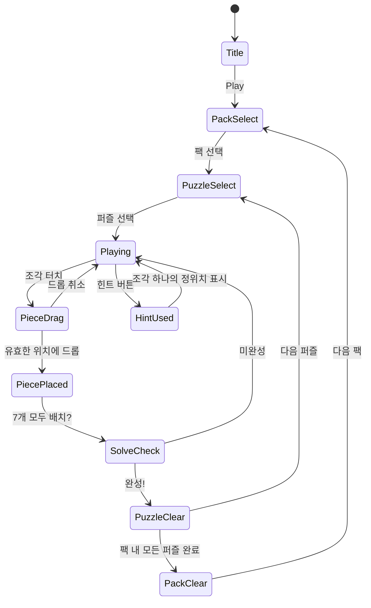

# Block! Triangle Puzzle Tangram

> **참고 게임**: Block! Triangle Puzzle Tangram by BitMango (Rating 4.4, Rank #114)
> **장르**: block-puzzle / tangram
> **MVP 목표**: 1주 개발, 빠른 출시 우선

## 개요

고전 탱그램(7개 조각)에서 영감을 받은 모바일 퍼즐 게임.
삼각형·사각형·평행사변형 조각을 회전·뒤집어 실루엣 형태에 맞추는 게임.
수백 개의 실루엣 데이터를 JSON으로 양산하여 오래 플레이 가능한 컨텐츠 볼륨을 제공한다.

### 핵심 차별점

| 항목 | 설명 |
|------|------|
| 탱그램 형태 | 7개 고정 조각 → 실루엣 완성 방식 |
| 비표준 타일 | 삼각형 중심 → 직관적이지 않아 도전감 ↑ |
| 데이터 드리븐 | 퍼즐 = JSON 실루엣 데이터 → 양산 용이 |
| 수익화 | 힌트 (조각 위치 표시) + 퍼즐 팩 IAP |

---

## 게임 조각 (Tangram Pieces)

표준 탱그램 7개 조각을 기반으로 한다.

| ID | 이름 | 형태 | 그리드 단위 |
|----|------|------|------------|
| T1 | 대삼각형 A | 직각이등변삼각형 (큰) | 4×4 격자 기준 밑변 4 |
| T2 | 대삼각형 B | 직각이등변삼각형 (큰) | T1과 동일 |
| T3 | 중삼각형 | 직각이등변삼각형 (중) | 밑변 2 |
| T4 | 소삼각형 A | 직각이등변삼각형 (소) | 밑변 2 (T3의 절반 크기) |
| T5 | 소삼각형 B | 직각이등변삼각형 (소) | T4와 동일 |
| SQ | 정사각형 | 정사각형 | 2×2 |
| PG | 평행사변형 | 평행사변형 | 2×2 사선 |

> 모든 조각의 면적 합 = 실루엣 면적 (항상 딱 맞게 채워야 함)

---

## 게임 규칙

### 기본 규칙

1. 화면 좌측: **실루엣 보드** (채워야 할 목표 형태)
2. 화면 우측/하단: **7개 조각 팔레트**
3. 플레이어는 조각을 **드래그**하여 실루엣 위에 배치
4. 조각은 **회전** (90° 단위, 4방향) 및 **뒤집기** (좌우 미러) 가능
5. 7개 조각이 실루엣을 **빈틈 없이, 겹침 없이** 채우면 클리어

### 조각 조작 UX

| 동작 | 트리거 | 결과 |
|------|--------|------|
| 드래그 | 조각 터치 후 드래그 | 조각 이동 |
| 회전 | 조각 배치 중 탭 | 90° 시계 방향 회전 |
| 뒤집기 | 조각 배치 중 더블탭 | 좌우 미러 |
| 되돌리기 | 배치된 조각 탭 | 팔레트로 반환 |
| 스냅 | 드래그 중 보드 근접 | 그리드에 자동 스냅 |

### 검증 로직

```
isPuzzleSolved():
  - 모든 7개 조각이 배치됨
  - 어떤 조각도 실루엣 경계 밖에 나가지 않음
  - 어떤 두 조각도 겹치지 않음
  - 실루엣 내 모든 셀이 채워짐
→ true → 클리어
```

---

## 게임 플로우



---

## UI 레이아웃

```
┌─────────────────────────────┐
│  ← BACK     Pack 1  ★ 3/10 │  ← 상단 HUD (팩명, 진행도)
├─────────────────────────────┤
│                             │
│   ┌──────────────┐          │
│   │              │          │
│   │   SILHOUETTE │          │  ← 실루엣 보드 (중앙)
│   │   (목표형태) │          │
│   │              │          │
│   └──────────────┘          │
│                             │
├─────────────────────────────┤
│  [T1][T2][T3][T4][T5][SQ][PG] │  ← 조각 팔레트 (7개)
├─────────────────────────────┤
│  [💡 힌트 x3]   [↩ 리셋]   │  ← 하단 버튼
└─────────────────────────────┘
```

### 조각 팔레트 UX

- 미배치 조각: 불투명, 밝은 색상
- 배치된 조각: 반투명 혹은 체크 표시 → 몇 개 남았는지 한눈에 파악
- 조각 드래그 시: 2배 확대 표시 (손가락에 가리지 않도록)

---

## 퍼즐 데이터 구조 (JSON)

```json
{
  "packId": "pack_001",
  "packName": "Basic Shapes",
  "puzzles": [
    {
      "id": "p001",
      "name": "Square",
      "difficulty": 1,
      "gridSize": 8,
      "silhouette": [
        [0,0,1,1,1,1,0,0],
        [0,0,1,1,1,1,0,0],
        [0,0,1,1,1,1,0,0],
        [0,0,1,1,1,1,0,0]
      ],
      "solution": [
        { "pieceId": "T1", "x": 0, "y": 0, "rotation": 0, "flipped": false },
        { "pieceId": "T2", "x": 2, "y": 0, "rotation": 180, "flipped": false },
        { "pieceId": "SQ", "x": 1, "y": 1, "rotation": 0, "flipped": false }
      ]
    }
  ]
}
```

### 퍼즐 ID 체계

```
p{pack번호:3자리}{퍼즐번호:3자리}
예) p001001 = 팩1의 첫 번째 퍼즐
```

### 퍼즐 양산 전략

- **Phase 1 (MVP)**: 수작업으로 20개 (4팩 × 5퍼즐)
- **Phase 2**: 퍼즐 에디터 도구 개발 → 50개+
- **Phase 3**: 알고리즘 자동 생성 → 수백 개

> 탱그램 특성상 동일한 7조각으로 수천 개의 실루엣이 가능.
> JSON 데이터만 추가하면 앱 업데이트 없이 컨텐츠 확장 가능 (서버 연동 시).

---

## 난이도 설계

| 난이도 | 팩명 | 실루엣 유형 | 힌트 초기 제공 | 퍼즐 수 |
|--------|------|------------|--------------|---------|
| ⭐ Easy | Basic Shapes | 단순 도형 (정사각형, 직사각형, 삼각형) | 3 | 30 |
| ⭐⭐ Medium | Animals | 동물 실루엣 (고양이, 토끼, 새) | 2 | 30 |
| ⭐⭐⭐ Hard | Objects | 사물 실루엣 (집, 배, 사람) | 1 | 30 |
| ⭐⭐⭐⭐ Expert | Abstract | 추상 형태 | 0 | 10+ |

### 난이도 결정 기준

- 실루엣의 대칭성 (대칭일수록 쉬움)
- 평행사변형(PG) 사용 여부 (사용 시 어려움 ↑)
- 조각 배치 후보 경우의 수 (적을수록 쉬움)

---

## 스코어링 시스템

탱그램은 **정답이 하나**이므로 시간 기반 스코어링을 사용한다.

| 항목 | 점수 |
|------|------|
| 퍼즐 클리어 (힌트 미사용) | 1000점 |
| 퍼즐 클리어 (힌트 1회) | 700점 |
| 퍼즐 클리어 (힌트 2회) | 400점 |
| 퍼즐 클리어 (힌트 3회+) | 100점 |
| 시간 보너스 | 남은 시간(초) × 5점 |
| 별점 기준 | ★★★: 1000+, ★★: 500+, ★: 클리어 |

> 타이머는 **선택적**. MVP에서는 타이머 없이 릴랙스 모드만 제공 (진입 장벽 최소화).

---

## 수익화 전략

### 힌트 시스템 (핵심 수익화)

```
힌트 1회 = 조각 1개의 정확한 위치·회전·뒤집기 상태를 보드에 반투명 표시
```

| 단계 | 내용 |
|------|------|
| 기본 제공 | 일일 3개 무료 힌트 (광고 시청으로 보충) |
| 힌트 패키지 | 10개 $0.99 / 50개 $3.99 / 100개 $6.99 |
| 광고 힌트 | 30초 광고 시청 → 힌트 1개 |

### 퍼즐 팩 IAP

| 팩 유형 | 가격 | 내용 |
|---------|------|------|
| 팩 번들 | $1.99 | 테마별 30퍼즐 (Animals, Objects 등) |
| All Unlock | $4.99 | 전체 팩 영구 해금 |
| No Ads | $2.99 | 광고 제거 |

### 광고

- 퍼즐 클리어 시 배너 광고
- 매 5퍼즐마다 전면 광고 (선택적 시청)
- 힌트 부족 시 보상형 광고

---

## #98 Hexa Puzzle 비교 분석

| 항목 | Hexa Puzzle (#98) | Triangle Tangram (#114) |
|------|------------------|------------------------|
| 타일 형태 | 육각형 격자 | 삼각형·다각형 자유 배치 |
| 목표 | 행·열 완성으로 제거 | 실루엣 완성 |
| 조각 수 | 무한 (계속 등장) | 고정 7개 |
| 정답 | 다양한 전략 | 하나 (또는 소수) |
| 난이도 진행 | 속도/복잡도 상승 | 실루엣 복잡도 상승 |
| 세션 길이 | 짧고 반복적 | 중간 (퍼즐당 1~5분) |
| **공통점** | 비표준 도형의 공간감 퍼즐 | 비표준 도형의 공간감 퍼즐 |
| **차별점** | 전략형 캐주얼 | 사고형 퍼즐 |

**결론**: 두 게임은 겹치지 않는 세그먼트 공략. 함께 포트폴리오에 포함 시 시너지.

---

## 구현 난이도 평가

| 항목 | 난이도 | 비고 |
|------|--------|------|
| 삼각형 격자 좌표계 | 중 | 직교 좌표와 다른 스냅 로직 필요 |
| 조각 회전·뒤집기 | 하 | 행렬 변환 |
| 배치 검증 | 하 | 비트마스크 연산 |
| 퍼즐 데이터 JSON 로더 | 하 | 단순 파싱 |
| 힌트 시스템 | 하 | solution 데이터에서 표시 |
| **전체 평가** | **하~중** | **1~2주 MVP 충분히 가능** |

---

## 사운드/이펙트

| 이벤트 | 효과 |
|--------|------|
| 조각 집기 | 부드러운 팝 사운드 |
| 조각 스냅 | 클릭 사운드 |
| 잘못된 배치 | 짧은 오류음 |
| 힌트 표시 | 반짝 이펙트 + 차임 |
| 퍼즐 클리어 | 축하 이펙트 + 별 애니메이션 |
| 완벽 클리어 (힌트 0) | 특별 이펙트 |

---

## MVP 범위

### Phase 1 - MVP (1주)

- [x] 기획서 작성
- [ ] 삼각형 격자 좌표계 및 스냅 시스템
- [ ] 7개 조각 정의 (회전·뒤집기 변환 포함)
- [ ] 드래그 앤 드롭 UX
- [ ] 배치 검증 로직 (겹침·경계 체크)
- [ ] 퍼즐 클리어 판정
- [ ] JSON 기반 실루엣 로더
- [ ] 기본 20개 퍼즐 데이터 (4팩)
- [ ] 힌트 시스템 (기본)
- [ ] 릴랙스 모드 (타이머 없음)

### Phase 2 (출시 후)

- [ ] 타이머 모드 + 스코어보드
- [ ] 퍼즐 팩 IAP
- [ ] 광고 통합
- [ ] 퍼즐 100개+
- [ ] 별점 시스템

### Phase 3

- [ ] 퍼즐 에디터 (내부용)
- [ ] 일일 챌린지
- [ ] 알고리즘 자동 퍼즐 생성
