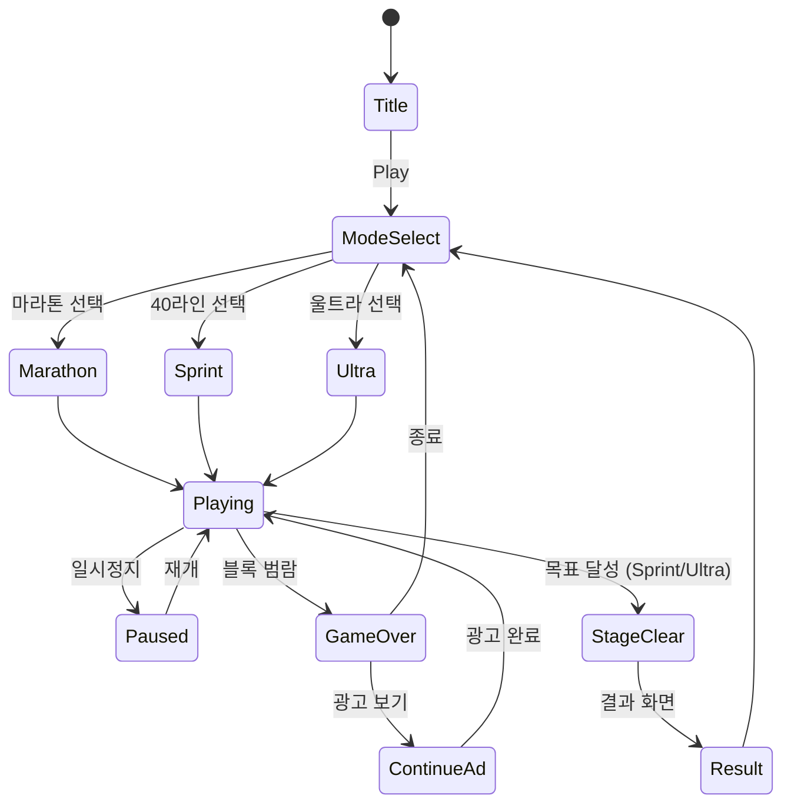

# BlockDrop

> **법적 고지**: 이 게임은 Tetris® 상표권과 무관한 독자적인 블록 낙하 퍼즐 게임입니다.
> 테트로미노 형태(수학적 도형)와 라인 클리어 메카닉은 특허 보호 대상이 아닙니다.
> (Tetris Holding LLC v. Xio Interactive, 2012 — 게임 메카닉 자체는 보호 불가 판결)

## 개요

7가지 블록(테트로미노)이 위에서 떨어진다. 블록을 쌓아 가로 줄을 완성하면 그 줄이 사라진다.
쌓인 블록이 화면 위까지 차면 게임 오버. 얼마나 오래, 얼마나 많이 줄을 지우느냐가 핵심.

**게임명**: BlockDrop (블록드롭)
**장르**: Falling Block Puzzle
**타겟**: 전 연령, 캐주얼~미드코어
**플랫폼**: iOS / Android (RN WebView)

---

## 법적 리스크 분석

### 안전한 영역 (사용 가능)

| 요소 | 근거 |
|------|------|
| 7종 테트로미노 형태 | 수학적 도형 — 저작권/특허 보호 불가 |
| 라인 클리어 메카닉 | 게임 메카닉 자체는 보호 불가 (2012 판결) |
| 그리드 기반 낙하 퍼즐 | 일반적 게임 장르 |
| 점수 시스템 | 공통 게임 요소 |

### 주의 영역 (차별화 필요)

| 요소 | 리스크 | 대응 |
|------|--------|------|
| "Tetris" 명칭 | 상표권 침해 | "BlockDrop" 사용 |
| 공식 블록 배색 (회색 배경 + 원색 블록) | 트레이드 드레스 | 독자적 비주얼 스타일 |
| 공식 UI 레이아웃 | 트레이드 드레스 | 차별화된 UI |
| The Tetris Company 가이드라인 | 클론 금지 정책 | 차별화 요소 추가 |

### 결론

**개발 GO** — 단, 아래 차별화 요소를 반드시 포함:
1. 독자적 게임명 및 비주얼 아이덴티티
2. 최소 1개 이상의 독자 메카닉 (컬러 매칭 보너스)
3. 공식 Tetris UI와 명확히 다른 레이아웃

---

## 게임 규칙

### 기본 규칙

- 7종 블록(I, O, T, S, Z, J, L)이 필드 상단에서 떨어짐
- 플레이어는 블록을 **좌우 이동**, **회전**, **소프트/하드 드롭**으로 조작
- 블록이 바닥이나 다른 블록에 닿으면 고정됨
- 가로 10칸이 빈틈 없이 채워지면 해당 줄 제거 + 위 블록 하강
- 블록이 필드 상단(20행)을 초과하면 **게임 오버**

### 블록 7종 (테트로미노)

```
I: □□□□    O: □□    T: □□□    S:  □□    Z: □□
            □□      □          □□         □□

J: □        L:    □
   □□□         □□□
```

### 점수 산정 (싱글 라인 기준)

| 라인 수 | 기본 점수 | 이름 |
|---------|-----------|------|
| 1줄 | 100 × Level | Single |
| 2줄 | 300 × Level | Double |
| 3줄 | 500 × Level | Triple |
| 4줄 | 800 × Level | BlockDrop! (차별화 명칭) |

### 컬러 매칭 보너스 (독자 메카닉)

- 각 블록은 랜덤 색상 또는 **컬러 세트** 중 하나로 지정됨
- 같은 색 블록으로만 줄을 완성하면 **1.5배 보너스**
- 두 줄 이상을 같은 색으로 동시 클리어 시 **2배 보너스**
- UI에 "다음 블록 색상 예고" 표시로 전략적 플레이 유도

### 레벨 시스템

- 10줄 클리어마다 레벨 업
- 레벨 = 낙하 속도 증가
- 최대 레벨 15

| Level | 낙하 속도 (초/칸) | 설명 |
|-------|-----------------|------|
| 1 | 1.0 | 입문 |
| 5 | 0.5 | 보통 |
| 10 | 0.2 | 빠름 |
| 15 | 0.05 | 극한 |

---

## 게임 모드

### 마라톤 (메인 모드)

- 게임 오버까지 최대한 오래 생존
- 글로벌 리더보드 연동
- 일일 도전 과제 (예: "오늘 I-블록으로만 4줄 클리어")

### 40라인 스프린트

- 40줄을 클리어하는 데 걸리는 시간 측정
- 개인 기록 경신 중심
- SNS 공유 유도 (기록 인증샷)

### 울트라 (2분 챌린지)

- 2분 안에 최대 점수
- 광고 제거 유저 우선 제공 → 수익화 레버

### 일일 미션

- 매일 1개 특수 조건 클리어 (예: "T-블록만 사용해서 5줄 클리어")
- 클리어 시 코인 보상

---

## 모바일 조작 설계

### 터치 컨트롤 (기본)

| 제스처 | 동작 |
|--------|------|
| 좌/우 스와이프 | 블록 이동 |
| 위 스와이프 | 하드 드롭 |
| 아래 스와이프 | 소프트 드롭 |
| 탭 (오른쪽 영역) | 시계방향 회전 |
| 탭 (왼쪽 영역) | 반시계 방향 회전 |
| 더블탭 | 홀드 블록 교체 |

### 버튼 컨트롤 (대안)

- 화면 하단에 D-패드 방식 버튼 표시
- 설정에서 터치/버튼 모드 전환 가능

### 조작 편의 기능

- **Ghost Piece**: 블록이 떨어질 위치 미리보기 (반투명)
- **홀드 기능**: 현재 블록을 대기열로 보관, 저장된 블록과 교체 가능
- **다음 블록 3개 미리보기**

---

## UI 레이아웃

```
┌─────────────────────────────┐
│  LEVEL 3    SCORE: 12,400   │  ← HUD
│  LINES: 28                  │
├──────────┬──────────────────┤
│          │  HOLD:           │
│          │  ┌──┐            │
│  FIELD   │  │  │            │  ← 홀드 블록
│  (10×20) │  └──┘            │
│          │                  │
│          │  NEXT:           │
│          │  ┌──┐ ┌──┐ ┌──┐ │  ← 다음 3개
│          │  │  │ │  │ │  │ │
│          │  └──┘ └──┘ └──┘ │
│          │                  │
├──────────┴──────────────────┤
│  [←] [→]  [↓]  [↺]  [↻]  │  ← 터치 버튼 (옵션)
└─────────────────────────────┘
```

---

## 비주얼 아이덴티티 (트레이드 드레스 차별화)

- **배경**: 어두운 우주/도시 테마 (공식 Tetris의 회색과 다름)
- **블록 스타일**: 네온 글로우 이펙트 + 그라데이션
- **색상 팔레트**: 네온 핑크, 사이버 블루, 일렉트릭 퍼플 기반
- **클리어 이펙트**: 줄 제거 시 파티클 폭발 이펙트
- **배경 애니메이션**: 레벨 업 시 배경 테마 변경

### 스킨 시스템 (수익화 핵심)

| 스킨 | 설명 | 가격 |
|------|------|------|
| Neon City (기본) | 네온 사이버펑크 | 무료 |
| Galaxy | 우주 테마, 별 파티클 | $1.99 |
| Retro Pixel | 8비트 픽셀 아트 | $1.99 |
| Pastel Dream | 파스텔 + 귀여운 캐릭터 | $2.99 |
| Seasonal (한정) | 크리스마스/할로윈 등 | $0.99 |

---

## 스코어링 시스템 (상세)

```
기본 점수 = 라인수_배율 × 레벨
T-스핀 보너스: T블록 회전 후 줄 클리어 × 3배
백-투-백 보너스: BlockDrop! 연속 클리어 × 1.5배
퍼펙트 클리어 보너스: 필드 완전 비우기 +3000점
콤보: 연속 클리어마다 +50 × 콤보수 × 레벨
```

---

## 사운드/이펙트

| 상황 | 사운드 | 이펙트 |
|------|--------|--------|
| 블록 이동 | 틱 효과음 | - |
| 블록 고정 | 둔탁한 효과음 | 미세 진동 |
| 라인 클리어 | 경쾌한 팡 | 라인 플래시 |
| BlockDrop! | 웅장한 효과음 | 화면 흔들림 + 파티클 |
| 레벨 업 | 상승 팡파르 | 배경 전환 |
| 게임 오버 | 실패음 | 블록 붕괴 애니메이션 |
| BGM | 레벨별 템포 변화 | - |

---

## 수익화 전략

### 핵심 원칙: 플레이 방해 최소화

수익화가 플레이를 방해하면 리텐션이 깎인다. 광고는 선택형으로만.

### 수익화 모델

| 모델 | 내용 | 예상 기여 |
|------|------|-----------|
| 광고 제거 (IAP) | $2.99 원타임 | 핵심 전환 |
| 스킨 판매 (IAP) | $0.99~$2.99 | 장기 수익 |
| 리워드 광고 | 광고 보기 → 계속하기 1회 | 게임오버 후 |
| 리워드 광고 | 광고 보기 → 울트라 모드 잠금해제 | 비침습적 |
| 인터스티셜 | 게임 시작 전 (게임오버 → 재시작 사이) | 광고 수익 |

### 리텐션 루프

```
신규 유저
  → 마라톤 첫 플레이 (쉬운 레벨)
  → 게임오버 → 리워드 광고로 계속하기
  → 일일 미션 완료 → 코인 획득
  → 코인으로 스킨 구매
  → 40라인 기록 경신 → SNS 공유
  → 글로벌 리더보드 경쟁 → 재방문
```

---

## 게임 플로우 (상태 머신)



---

## MVP 범위 (1~2주 목표)

### Phase 1 — MVP (1주)

- [ ] 기획서 작성
- [ ] 기본 7종 블록 정의 및 렌더링
- [ ] 블록 낙하 + 고정 로직
- [ ] 좌우 이동 + 회전 (좌/우)
- [ ] 소프트 드롭 + 하드 드롭
- [ ] 라인 클리어 로직
- [ ] 게임 오버 판정
- [ ] 기본 점수 시스템 (싱글~BlockDrop!)
- [ ] 터치 스와이프 조작
- [ ] Ghost Piece (낙하 위치 미리보기)
- [ ] 마라톤 모드만 출시
- [ ] 최고점 로컬 저장

### Phase 2 — 수익화 + 콘텐츠 (2주차)

- [ ] 홀드 기능
- [ ] 다음 블록 3개 미리보기
- [ ] 컬러 매칭 보너스 메카닉
- [ ] 40라인 스프린트 모드
- [ ] 울트라 2분 모드
- [ ] 스킨 시스템 (기본 2종)
- [ ] 리워드 광고 (계속하기)
- [ ] 광고 제거 IAP
- [ ] T-스핀 보너스
- [ ] 일일 미션 시스템

### Phase 3 — 성장 (이후)

- [ ] 글로벌 리더보드
- [ ] 일일 챌린지
- [ ] 추가 스킨 (Galaxy, Retro)
- [ ] 백-투-백 / 퍼펙트 클리어 보너스
- [ ] SNS 공유 기능

---

## 개발 스택 매핑

| 레이어 | 기술 | 주요 구현 |
|--------|------|-----------|
| lib/blockdrop | Phaser.io | 블록 로직, 물리, 씬 관리 |
| web/blockdrop | React + Stitches | UI 오버레이, 점수/레벨 HUD |
| blockdrop/rn | RN WebView | 앱 래핑, IAP, 광고 SDK |

## 기술 고려사항 (lib 팀 전달)

- **블록 표현**: 2D 배열 (10×20 그리드) + 비트마스크
- **회전 알고리즘**: SRS (Super Rotation System) 표준 준수
- **낙하 타이밍**: `requestAnimationFrame` 기반 60fps 고정
- **터치 이벤트**: Phaser.io 내장 Input 플러그인 활용
- **렌더링**: Canvas 기반 (WebGL 폴백)
