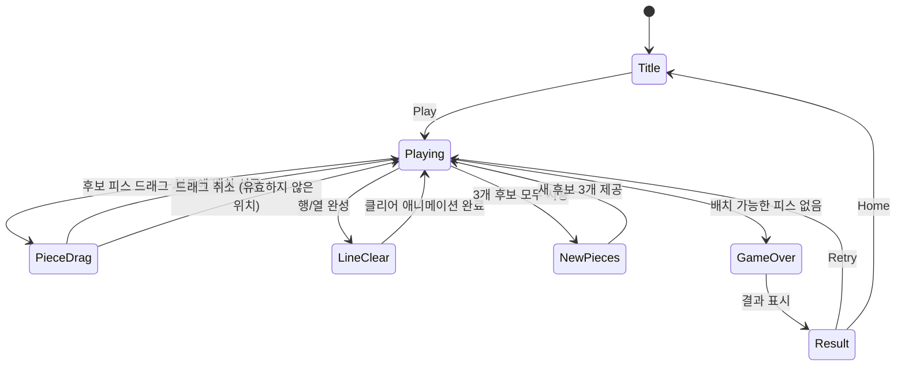

# Block Puzzle

> 보석 테마 블록 퍼즐 — 8×8 그리드에 블록 피스를 배치하여 행/열을 클리어하는 Endless 퍼즐 게임

## 개요

8×8 격자 보드에 다양한 모양의 블록 피스를 드래그&드롭으로 배치한다. 행 또는 열이 완전히 채워지면 해당 줄이 클리어되고 점수 획득. 3개의 후보 피스 중 선택하여 배치하며, 3개를 모두 사용하면 새 후보가 제공된다. 남은 피스 중 배치 가능한 것이 없으면 게임 오버. 스테이지 없는 Endless 게임으로, 고득점을 추구한다.

> **blockrush와의 차이**: blockrush는 위에서 떨어지는 블록을 실시간 조작하는 테트리스류. blockpuzzle은 턴 기반으로 블록을 자유롭게 배치하는 퍼즐.

## 게임 규칙

### 기본 규칙
- 8×8 격자 보드
- 하단에 3개의 후보 피스가 제공됨
- 후보 피스를 드래그하여 보드에 배치
- 피스는 이미 채워진 셀 위에 배치 불가
- 피스는 보드 밖으로 삐져나가게 배치 불가
- 3개 후보를 모두 사용하면 새 3개 제공

### 라인 클리어
- 행이 8칸 모두 채워지면 → 해당 행 클리어
- 열이 8칸 모두 채워지면 → 해당 열 클리어
- 동시에 여러 행/열 클리어 가능 (콤보)
- 클리어된 셀은 비워짐

### 게임 오버
- 현재 남은 후보 피스 중 보드에 배치 가능한 것이 하나도 없을 때
- 보드가 가득 차지 않아도, 남은 피스가 들어갈 자리가 없으면 종료

## 피스 종류

### 기본 피스
```
■         1×1 (단일)

■ ■       1×2 (가로)
■         2×1 (세로)
■

■ ■ ■     1×3 (가로)
■         3×1 (세로)
■
■

■ ■ ■ ■   1×4 (가로)
■         4×1 (세로)
■
■
■

■ ■ ■ ■ ■ 1×5 (가로)
■         5×1 (세로)
■
■
■
■
```

### 사각형 피스
```
■ ■       2×2
■ ■

■ ■ ■     3×3
■ ■ ■
■ ■ ■
```

### L자 피스
```
■         ■ ■     ■ ■       ■
■         ■             ■   ■
■ ■           ■       ■ ■   ■ ■
(L)       (J)       (역L)    (역J)
```

### T자 피스
```
■ ■ ■       ■       ■     ■
  ■       ■ ■     ■ ■     ■ ■
          ■         ■       ■
(T)      (T좌)    (T우)   (T역)
```

### S/Z 피스
```
  ■ ■     ■ ■
■ ■         ■ ■
(S)       (Z)
```

> 피스는 회전 없이 고정 형태로 제공됨. 각 형태가 독립 피스로 존재.

## 게임 플로우



## UI 레이아웃

```
┌─────────────────────────────┐
│  ⭐ 1,250      Best: 3,400  │  ← HUD (현재 점수, 최고 점수)
├─────────────────────────────┤
│                             │
│  ┌──┬──┬──┬──┬──┬──┬──┬──┐ │
│  │  │■ │■ │  │  │■ │  │  │ │
│  ├──┼──┼──┼──┼──┼──┼──┼──┤ │
│  │  │  │■ │■ │■ │■ │  │  │ │
│  ├──┼──┼──┼──┼──┼──┼──┼──┤ │
│  │■ │■ │  │  │  │  │■ │■ │ │  ← 8×8 보드 (Phaser)
│  ├──┼──┼──┼──┼──┼──┼──┼──┤ │
│  │  │■ │  │  │  │  │■ │  │ │
│  ├──┼──┼──┼──┼──┼──┼──┼──┤ │
│  │  │  │  │■ │■ │  │  │  │ │
│  └──┴──┴──┴──┴──┴──┴──┴──┘ │
│                             │
├─────────────────────────────┤
│   [L자]    [■■■]    [2×2]   │  ← 후보 피스 3개 (드래그 소스)
│                             │
└─────────────────────────────┘
```

- HUD: React 컴포넌트 (Stitches)
- 보드 + 후보 피스: Phaser 캔버스 (드래그&드롭 인터랙션)
- 결과 화면: React 컴포넌트 (Phaser 오버레이 사용 금지, ADR-002)

## 스코어링 시스템

| Action | Score |
|--------|-------|
| 피스 배치 | 피스 셀 수 × 10 |
| 1줄 클리어 | +100 |
| 2줄 동시 클리어 | +300 (1.5배 보너스) |
| 3줄 동시 클리어 | +600 (2배 보너스) |
| 4줄+ 동시 클리어 | +줄수 × 250 |
| 연속 클리어 (콤보) | 클리어 점수 × 콤보 수 |

### 콤보 규칙
- 연속으로 피스를 배치할 때마다 클리어가 발생하면 콤보 +1
- 클리어 없이 피스를 배치하면 콤보 리셋

## 인터랙션 상세

| 입력 | 동작 | 피드백 |
|------|------|--------|
| 후보 피스 드래그 시작 | 피스가 손가락 따라 이동, 보드에 프리뷰 표시 | — |
| 보드 위 유효 위치 | 프리뷰 셀 초록/파란 하이라이트 | — |
| 보드 위 무효 위치 | 프리뷰 셀 빨간 하이라이트 또는 미표시 | — |
| 드래그 릴리즈 (유효) | 피스 배치, 라인 체크 | 햅틱 + 배치 애니메이션 |
| 드래그 릴리즈 (무효) | 피스 원위치 복귀 | — |
| 라인 클리어 발생 | 클리어 행/열 셀 제거 애니메이션 | 햅틱 + 클리어 이펙트 |

### 드래그 오프셋
- 피스를 드래그할 때 손가락 위가 아닌 약간 위에 표시 (손가락에 가려지지 않도록)
- 드래그 중 보드 셀에 스냅 (가장 가까운 유효 위치로 자동 정렬)

## 햅틱 이벤트

| 시점 | 이벤트명 | 패턴 |
|------|----------|------|
| 피스 배치 | `piece-placed` | Heavy × 1 |
| 라인 클리어 | `line-cleared` | Heavy × 6 (60ms 간격) |
| 콤보 클리어 | `combo-cleared` | Heavy × 6 (60ms 간격) |
| 게임 오버 | `game-over` | Heavy × 3 |

## MVP 범위

### Phase 1 (MVP)
- [ ] 기획서 작성
- [ ] 8×8 보드 렌더링
- [ ] 피스 종류 정의 (기본 + L + T + S/Z + 사각형)
- [ ] 후보 피스 3개 표시
- [ ] 드래그&드롭 피스 배치
- [ ] 배치 유효성 검사
- [ ] 행/열 클리어 판정 + 애니메이션
- [ ] 게임 오버 판정
- [ ] 스코어링 (배치 + 클리어 + 콤보)
- [ ] 결과 화면 (React)
- [ ] 햅틱 이벤트 연동
- [ ] 브릿지 연동 (stage: 0, Endless)

### Phase 2 (후속)
- [ ] 베스트 스코어 저장/표시
- [ ] 피스 배치 프리뷰 하이라이트
- [ ] 클리어 이펙트 강화 (파티클)
- [ ] 보석 테마 에셋 적용 (현재는 색상 블록)
- [ ] 3×3 박스 클리어 (보너스 룰)
