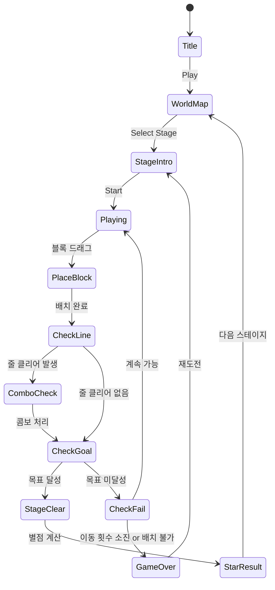

# 블록 퀘스트 (Blocky Quest)

> Block Blast 변형 + 퀘스트 모드 — 블록 퍼즐 최종 확정 기획서
> Rank #117 | Genre: block-puzzle | Reference: SayGames Ltd "Block Blast"

## 개요

10×10 그리드에 블록 조각을 배치해 가로/세로 줄을 완성·제거하는 Block Blast 변형 게임.
무한 서바이벌 모드가 아닌 **퀘스트(목표 기반 스테이지)** 중심으로 설계하여 진행감과 보상 루프를 강화한다.
한 판이 1~3분 이내로 완결되는 캐주얼 세션 타임을 유지한다.

## 핵심 차별점 (Block Blast 대비)

| 항목 | Block Blast (원작) | 블록 퀘스트 |
|------|--------------------|-------------|
| 모드 | 무한 서바이벌 | 퀘스트 스테이지 (목표 클리어) |
| 종료 조건 | 그리드 꽉 참 | 목표 달성 or 이동 횟수 소진 |
| 블록 | 무색 단일 | 색상 블록 + 특수 블록 |
| 진행 | 점수 경쟁 | 스테이지 맵 (챕터 구조) |
| 훅 | 하이스코어 | 스테이지 별점(★★★) + 챕터 해금 |

## 게임 규칙

### 기본 규칙

- **그리드**: 10×10 (100칸)
- **블록 트레이**: 매 턴마다 3개의 블록 조각이 제공됨
  - 3개를 모두 배치하면 새 세트 자동 지급
  - 배치 순서는 자유
- **블록 배치**: 드래그 앤 드롭으로 그리드에 배치 (회전 없음)
- **줄 클리어**: 가로 또는 세로 줄이 블록으로 꽉 차면 즉시 제거 + 점수 획득
- **게임 종료 조건**: 남은 블록 3개 중 어떤 것도 배치 불가능 → 실패

### 퀘스트 목표 유형

| 타입 | 설명 | 예시 |
|------|------|------|
| `CLEAR_LINES` | N줄 제거 | "25줄을 클리어하라" |
| `CLEAR_BLOCKS` | N개 블록 제거 | "200개 블록을 지워라" |
| `SCORE` | 목표 점수 달성 | "10,000점을 달성하라" |
| `COLOR_CLEAR` | 특정 색 블록 N개 제거 | "빨간 블록 30개를 제거하라" |
| `COMBO` | N콤보 이상 달성 | "3콤보를 3번 달성하라" |
| `SURVIVE` | N이동 내 목표 달성 | "30이동 안에 클리어" |

### 이동 횟수 제한

- 스테이지마다 **최대 이동 횟수(Moves)** 가 정해짐 (블록 트레이 세트 단위)
- 이동 횟수 소진 전에 목표 달성 → 클리어
- 소진 시 목표 미달성 → 실패

### 콤보 시스템

- 한 번의 블록 배치로 **가로 + 세로 동시 클리어** → 콤보 (×1.5 점수 배율)
- 연속 배치에서 매번 줄 클리어 발생 → 연속 콤보 카운트 증가
  - 2콤보 ×2.0, 3콤보 ×3.0, 4콤보+ ×4.0

## 특수 블록

| 블록 | 외형 | 효과 |
|------|------|------|
| 일반 블록 | 단색 | 기본 블록 |
| 색상 블록 🔴🔵🟡🟢 | 컬러 | 특정 퀘스트 대상, 일반 클리어와 동일 |
| 폭탄 블록 💣 | 검정+불꽃 | 배치 시 주변 3×3 범위 파괴 |
| 얼음 블록 ❄️ | 파란 얼음 | 2번 클리어되어야 제거됨 |
| 돌 블록 🪨 | 회색 | 줄 클리어로만 제거 가능 (배치 불가, 그리드 고정) |

> MVP에서는 일반 블록 + 색상 블록만 구현. 특수 블록은 Phase 2에서 추가.

## 블록 조각 종류

```
1×1  1×2  1×3  2×2  L자  T자  S자  Z자
 □    □□   □□□  □□   □    □□□  □□    □□
              □□   □□□  □    □□   □□
```

총 8가지 기본 조각 형태. MVP는 5가지(1×1, 1×2, 1×3, 2×2, L자)로 시작.

## 게임 플로우



## UI 레이아웃

```
┌─────────────────────────┐
│ ← 챕터1    ★★☆  Move:15 │  ← 상단 HUD (뒤로, 별점 목표, 남은 이동)
├─────────────────────────┤
│ 🎯 25줄 클리어  [12/25]  │  ← 퀘스트 목표 진행 바
├─────────────────────────┤
│  1 2 3 4 5 6 7 8 9 10  │
│ ┌──────────────────────┐│
│ │□□□□□□□□□□│ 1        ││
│ │□□□□□□□□□□│ 2        ││  ← 10×10 그리드
│ │  □□□□  □□│ 3        ││    (배치된 블록 표시)
│ │□□□□□□□□□□│ 4 ← CLEAR││
│ │          │ 5        ││
│ │          │ ...      ││
│ └──────────────────────┘│
├─────────────────────────┤
│  ┌────┐ ┌────┐ ┌────┐  │
│  │ L  │ │ □□ │ │ □  │  │  ← 블록 트레이 (3개)
│  │ □  │ │    │ │    │  │
│  └────┘ └────┘ └────┘  │
├─────────────────────────┤
│   💣Bomb  ↩Undo  🔀Mix  │  ← 아이템 슬롯
└─────────────────────────┘
```

## 스코어링 시스템

| Action | Score |
|--------|-------|
| 블록 1칸 배치 | +10 |
| 1줄 클리어 | +100 |
| 동시 다중 줄 클리어 (N줄) | +100 × N × N (제곱 보너스) |
| 콤보 (연속 클리어) | 현재 점수 × 콤보 배율 |
| 스테이지 클리어 보너스 | +500 |
| 남은 이동 보너스 | 남은 Move × 50 |

## 별점 시스템 (★★★)

| 별점 | 조건 |
|------|------|
| ★☆☆ | 목표 달성 (클리어) |
| ★★☆ | 목표 달성 + 목표 점수 이상 |
| ★★★ | 목표 달성 + 높은 점수 + 이동 여유 N개 이상 |

- 별점은 스테이지 해금 조건에 사용 (일부 스테이지는 이전 스테이지 ★★ 이상 필요)
- 별점 리셋 없이 최고 기록만 유지

## 챕터 구조 (월드맵)

```
Chapter 1: 초원 (Stages 1~20)  → 입문
Chapter 2: 사막 (Stages 21~40) → 색상 블록 등장
Chapter 3: 설원 (Stages 41~60) → 얼음 블록 등장
Chapter 4: 화산 (Stages 61~80) → 폭탄 블록 + 복합 목표
Chapter 5: 우주 (Stages 81~100)→ 고난이도 복합 퀘스트
```

> MVP는 Chapter 1 (20 스테이지)만 구현.

## 난이도 설계

| Stage | 그리드 | Max Moves | 목표 유형 | 특수 블록 |
|-------|--------|-----------|----------|----------|
| 1~5 | 10×10 | 30 | CLEAR_LINES(10) | 없음 |
| 6~10 | 10×10 | 25 | SCORE(5000) | 없음 |
| 11~15 | 10×10 | 20 | COLOR_CLEAR | 색상 블록 |
| 16~20 | 10×10 | 20 | COMBO+LINES | 색상 블록 |
| 21~40 | 10×10 | 18 | 복합 목표 | 돌 블록 |
| 41~60 | 10×10 | 15 | 복합 목표 | 얼음 블록 |

## 아이템/도구

| Item | Effect | 획득 |
|------|--------|------|
| 💣 Bomb | 5×5 범위 블록 즉시 파괴 | 광고 시청 or 재화 |
| ↩ Undo | 마지막 블록 배치 취소 | 광고 시청 or 재화 |
| 🔀 Mix | 블록 트레이 3개 교체 | 광고 시청 or 재화 |
| ➕ Moves | 이동 횟수 +5 추가 | 실패 시 광고 시청 |

## 사운드/이펙트

- 블록 배치: 툭 효과음 + 흔들림 애니메이션
- 줄 클리어: 슈 사운드 + 빛나는 파티클 이펙트
- 콤보: 상승 음계 + 화면 플래시
- 목표 달성 중: 진행 바 업데이트 애니메이션
- 스테이지 클리어: 별점 하나씩 채워지는 연출
- 실패: 낮은 음 + 그리드 흔들림

## 수익화 전략

| 모델 | 상세 |
|------|------|
| 리워드 광고 | 아이템 사용 시 (Bomb, Undo, Mix, +Moves) |
| 인터스티셜 광고 | 스테이지 실패 후 재시작 시 |
| 소프트 커런시 | 코인 — 레벨 클리어 지급, 아이템 구매 |
| IAP (선택) | 코인 팩, 광고 제거 (Phase 2) |

> MVP는 리워드 광고 + 인터스티셜만 구현. IAP는 Phase 2.

## 기술 구현 참고 (개발팀용)

```
lib/blocky-quest/
  scenes/
    GameScene.ts      - 그리드, 블록 배치, 클리어 로직 (Phaser.io)
    UIScene.ts        - HUD, 목표 진행 바
  types/
    Block.ts          - 블록 조각 정의 (shape, color, type)
    Stage.ts          - 스테이지 설정 (goal, maxMoves, blockTypes)
    Quest.ts          - 퀘스트 목표 유형 enum + 진행 상태
  data/
    stages.ts         - 스테이지 데이터 (Chapter 1: 20 stages)
  utils/
    GridManager.ts    - 그리드 상태, 줄 클리어 계산
    BlockGenerator.ts - 랜덤 블록 트레이 생성 (난이도 반영)

web/blocky-quest/
  - Phaser 캔버스 + React UI 오버레이 (목표 진행 바, 아이템 버튼)

blocky-quest/rn/
  - WebView 래핑
```

## MVP 범위

### Phase 1 (MVP — 1주 목표)

- [ ] 기획서 확정
- [ ] 10×10 그리드 + 블록 배치 로직
- [ ] 5가지 블록 조각 (1×1, 1×2, 1×3, 2×2, L자)
- [ ] 줄 클리어 + 콤보 시스템
- [ ] CLEAR_LINES / SCORE 퀘스트 목표 2종
- [ ] 이동 횟수 제한 + 실패 판정
- [ ] 스테이지 클리어 + 별점(★★★)
- [ ] Chapter 1: 20 스테이지
- [ ] 리워드 광고 아이템 (Mix 1종)
- [ ] 기본 사운드/이펙트

### Phase 2

- [ ] 색상 블록 + 특수 블록 (얼음, 돌, 폭탄)
- [ ] 추가 퀘스트 목표 (COLOR_CLEAR, COMBO, SURVIVE)
- [ ] Chapter 2~3 (40 스테이지 추가)
- [ ] Bomb / Undo 아이템
- [ ] IAP (코인 팩, 광고 제거)
- [ ] 월드맵 UI

### Phase 3

- [ ] Chapter 4~5 (40 스테이지)
- [ ] 데일리 챌린지
- [ ] 리더보드
