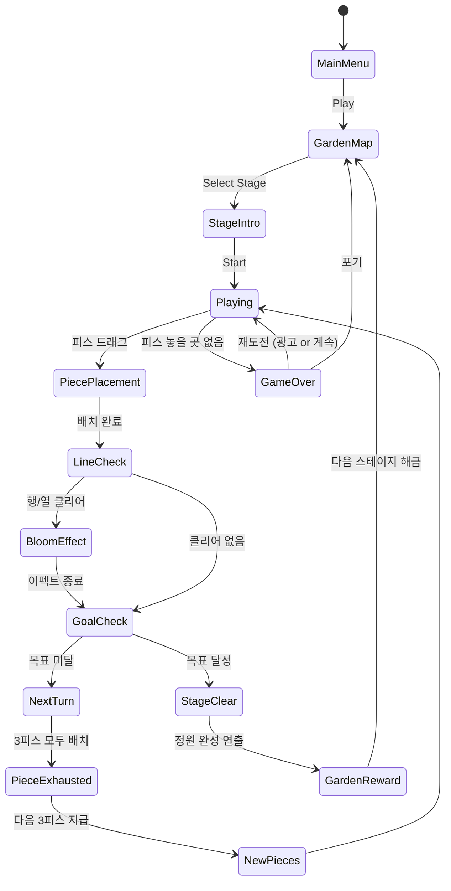

# Block Puzzle: Bloom Journey

> 꽃 테마의 블록 퍼즐 어드벤처. 블록을 배치해 행/열을 클리어하면 꽃이 피어나고, 황무지가 아름다운 정원으로 변해간다.

## 개요

9×9 그리드 보드에 다양한 모양의 블록을 배치한다. 행 또는 열이 가득 차면 클리어되며, 해당 칸에 꽃이 피어나는 연출이 재생된다. 스테이지마다 지정된 위치에 꽃을 피우거나 특정 패턴을 완성하는 목표가 있다. 블록을 놓을 수 없게 되면 게임 오버. 정원을 완성해 나가는 메타게임이 리텐션의 핵심이다.

### Block Blast(#2)와의 차별화

| 항목 | Block Blast (#2) | Bloom Journey (#16) |
|------|-----------------|-------------------|
| 테마 | 미니멀/추상 | 꽃/정원 |
| 목표 | 점수 최대화 | 스테이지 목표 달성 |
| 메타게임 | 없음 | 정원 완성 컬렉션 |
| 난이도 설계 | 무한 스코어링 | 스테이지 기반 |
| 수익화 | 광고 | 가든 확장 + 광고 + 힌트 |

---

## 게임 규칙

### 기본 규칙

- 9×9 그리드 보드에서 진행
- 매 턴 3개의 블록 피스가 제공됨 (랜덤 풀에서 선택)
- 플레이어는 3개의 피스를 보드 위 원하는 위치에 드래그하여 배치
- 행(가로) 또는 열(세로)이 블록으로 가득 차면 **자동 클리어**
- 클리어된 칸에는 **꽃 블룸 이펙트** 재생 후 빈 칸으로 전환
- 3개의 피스를 모두 배치하면 다음 턴 진행
- 3개의 피스 중 하나라도 보드에 놓을 수 없으면 **게임 오버**

### 블록 피스 종류

| 형태 | 설명 | 난이도 |
|------|------|--------|
| 1×1 | 단일 블록 | 쉬움 |
| 1×2, 2×1 | 도미노 | 쉬움 |
| 1×3, 3×1 | 트리오 | 보통 |
| L자 (3칸) | L-트리오미노 | 보통 |
| 2×2 | 정사각형 | 보통 |
| 1×4, 4×1 | 테트로미노-I | 어려움 |
| L자 (4칸) | L-테트로미노 | 어려움 |
| T자 (4칸) | T-테트로미노 | 어려움 |
| 2×3, 3×2 | 직사각형 | 어려움 |

> MVP: 1×1, 1×2, 1×3, L자(3칸), 2×2만 사용. 이후 단계적으로 추가.

### 스테이지 목표 시스템

스테이지마다 1~2개의 목표 조건이 설정된다:

| 목표 타입 | 설명 | 예시 |
|-----------|------|------|
| **블룸 목표** | 지정 위치에 꽃 피우기 | 별표 표시된 9칸에 모두 클리어 |
| **라인 목표** | 특정 행/열 N회 클리어 | 3행을 2번 클리어 |
| **점수 목표** | 목표 점수 달성 | 2,000점 이상 획득 |
| **패턴 목표** | 특정 모양 완성 | 꽃 모양 패턴 클리어 |
| **제한 턴** | N턴 내 목표 달성 | 15턴 안에 완성 |

### 꽃 블룸 & 정원 시스템

- 행/열 클리어 시 해당 칸들이 **꽃밭 타일**로 전환 (반영구적으로 표시)
- 꽃밭 타일은 다음 블록 배치 시 다시 빈 칸이 되지만, 정원 진행도(%) 계산에 반영
- **정원 완성도**: 스테이지 내 지정 꽃 위치 달성률 (0~100%)
- 100% 달성 시 스테이지 클리어 + 정원 씬 연출

---

## 게임 플로우



---

## UI 레이아웃

```
┌────────────────────────────┐
│  🌸 Bloom Journey    ⚙️   │  ← 상단 타이틀 / 설정
│  Stage 5   🌺 목표: 6/9   │  ← 스테이지 / 목표 진행도
│  ⭐ 1,240   🌿 x3 남은 턴 │  ← 점수 / 제한 턴(있을 경우)
├────────────────────────────┤
│  ┌─┬─┬─┬─┬─┬─┬─┬─┬─┐    │
│  │ │ │🌸│ │ │ │🌸│ │ │    │
│  ├─┼─┼─┼─┼─┼─┼─┼─┼─┤    │
│  │🌸│ │ │█│█│ │ │ │🌸│    │
│  ├─┼─┼─┼─┼─┼─┼─┼─┼─┤    │
│  │ │ │ │ │ │ │ │ │ │    │  ← 9×9 그리드
│  ├─┼─┼─┼─┼─┼─┼─┼─┼─┤    │    🌸 = 블룸 목표 위치
│  │ │█│ │ │ │ │ │█│ │    │    █ = 배치된 블록
│  ├─┼─┼─┼─┼─┼─┼─┼─┼─┤    │    🌺 = 이미 달성한 꽃
│  │ │ │ │ │ │ │ │ │ │    │
│  └─┴─┴─┴─┴─┴─┴─┴─┴─┘    │
├────────────────────────────┤
│  ┌────┐  ┌───┐  ┌──┐     │
│  │████│  │█  │  │██│     │  ← 현재 3개 피스 (드래그)
│  │████│  │█  │  │  │     │
│  └────┘  └───┘  └──┘     │
├────────────────────────────┤
│   💡 힌트    🔄 리셔플    │  ← 아이템 버튼
└────────────────────────────┘
```

### 정원 맵 화면 (메타게임)

```
┌────────────────────────────┐
│   🌿 My Bloom Garden       │
│   ████████░░  80% 완성     │
├────────────────────────────┤
│  ┌────┐ ┌────┐ ┌────┐     │
│  │ 1  │ │ 2  │ │ 3  │     │  ← 완성된 스테이지 정원들
│  │🌸🌺│ │🌼🌸│ │ ?  │     │
│  └────┘ └────┘ └────┘     │
│  ┌────┐ ┌────┐ ┌────┐     │
│  │ 4  │ │ 5  │ │ 6  │     │
│  │🔒  │ │🔒  │ │🔒  │     │  ← 잠긴 스테이지
│  └────┘ └────┘ └────┘     │
├────────────────────────────┤
│  🌱 가든 확장 (프리미엄)   │
└────────────────────────────┘
```

---

## 스코어링 시스템

| Action | 점수 |
|--------|------|
| 블록 배치 (칸당) | +10 |
| 1줄 클리어 | +100 |
| 2줄 동시 클리어 | +300 |
| 3줄+ 동시 클리어 | +600 |
| 콤보 (연속 클리어) | +100 × 콤보 |
| 목표 꽃 달성 (칸당) | +200 |
| 스테이지 클리어 | +1,000 |
| 잔여 블록 보너스 | 없음 (턴 제한 스테이지만 +50/턴) |

### 콤보 시스템

- 한 번의 피스 배치로 여러 줄이 동시에 클리어되면 콤보 발동
- 콤보 수 = 클리어된 줄 수 - 1
- 콤보 이펙트: 화면 흔들림 + 꽃잎 파티클 폭발

---

## 난이도 설계

### 스테이지 구조 (월드 단위)

| 월드 | 계절 | 스테이지 수 | 특징 |
|------|------|-------------|------|
| 봄 정원 | 🌸 Spring | 1~20 | 기본 블룸 목표, 피스 종류 적음 |
| 여름 숲 | ☀️ Summer | 21~40 | 라인 목표 + 제한 턴 추가 |
| 가을 들판 | 🍂 Autumn | 41~60 | 패턴 목표, 어려운 피스 추가 |
| 겨울 설원 | ❄️ Winter | 61~80 | 복합 목표, 최고 난이도 |

### 스테이지별 파라미터

| 단계 | 목표 칸 수 | 피스 풀 | 제한 턴 | 특수 타일 |
|------|-----------|---------|---------|----------|
| 초반 (1~10) | 3~5칸 | 소형 위주 | 없음 | 없음 |
| 중반 (11~30) | 6~9칸 | 혼합 | 20~30턴 | 잡초 타일 |
| 후반 (31~60) | 9~15칸 | 대형 포함 | 15~25턴 | 돌 타일 |
| 고급 (61~80) | 12~18칸 | 전체 | 10~20턴 | 얼음 타일 |

### 특수 타일 (Phase 2)

| 타일 | 효과 |
|------|------|
| 🌿 잡초 | 2번 클리어해야 제거 |
| 🪨 돌 | 인접 클리어로만 제거 가능 |
| 🧊 얼음 | 클리어 시 인접 칸 동결 (1턴 배치 불가) |

---

## 꽃 & 정원 연출 시스템

### 꽃 종류 (계절별)

| 계절 | 꽃 종류 | 색상 테마 |
|------|---------|-----------|
| 봄 | 벚꽃, 튤립, 데이지 | 분홍/흰색/노랑 |
| 여름 | 해바라기, 장미, 라벤더 | 노랑/빨강/보라 |
| 가을 | 코스모스, 국화 | 주황/자주 |
| 겨울 | 설매, 동백 | 흰색/빨강 |

### 블룸 이펙트 단계

1. **배치 시**: 블록이 부드럽게 슬라이드인
2. **클리어 시**: 클리어된 행/열이 초록빛으로 빛남 (0.3초)
3. **블룸 시**: 꽃 새싹 → 개화 애니메이션 (0.8초, 파티클 포함)
4. **정원 완성 시**: 전체 보드에 꽃잎 내리는 연출 (2초)

---

## 수익화 모델

### 무료 기능

- 기본 스테이지 1~20 (봄 월드) 전체 무료
- 광고 시청으로 힌트 획득 가능
- 광고 시청으로 게임 오버 후 1회 계속하기

### 프리미엄 / IAP

| 상품 | 가격 (예시) | 내용 |
|------|------------|------|
| 광고 제거 | ₩4,900 | 광고 없이 플레이 |
| 가든 확장팩 | ₩2,900 | 계절별 가든 테마 해금 |
| 힌트 팩 (×10) | ₩1,900 | 힌트 10회 즉시 사용 |
| 리셔플 팩 (×5) | ₩1,900 | 피스 다시 뽑기 5회 |
| 프리미엄 패스 | ₩9,900/월 | 모든 컨텐츠 + 광고 제거 |

### 광고 연동 지점

| 시점 | 광고 타입 | 보상 |
|------|-----------|------|
| 게임 오버 후 | 보상형 동영상 | 1회 계속하기 |
| 힌트 요청 시 | 보상형 동영상 | 힌트 1회 |
| 리셔플 요청 시 | 보상형 동영상 | 피스 새로 뽑기 |
| 스테이지 클리어 후 | 인터스티셜 (3스테이지마다) | 없음 |

---

## 아이템 / 도구

| 아이템 | 효과 | 획득 방법 |
|--------|------|-----------|
| 💡 힌트 | 최적 배치 위치 1곳 강조 표시 | 광고 or IAP |
| 🔄 리셔플 | 현재 3개 피스를 새것으로 교체 | 광고 or IAP |
| 💣 폭탄 | 3×3 범위 블록 제거 | 특별 보상 |
| 🌟 슈퍼 블룸 | 선택한 행/열 즉시 클리어 | 특별 보상 |

---

## 사운드 / 이펙트

| 상황 | 사운드 | 이펙트 |
|------|--------|--------|
| 블록 배치 | 부드러운 클릭음 | 블록 슬라이드 애니 |
| 1줄 클리어 | 맑은 종소리 | 초록 빛 파동 |
| 2줄+ 클리어 | 화음 종소리 | 금빛 파동 |
| 꽃 블룸 | 꽃잎 팡팡 소리 | 꽃 개화 파티클 |
| 콤보 | 상승 멜로디 | 화면 테두리 빛남 |
| 목표 달성 | 팡파레 | 꽃 폭죽 |
| 게임 오버 | 시들음 효과음 | 화면 어두워짐 |
| 정원 완성 | 감동 BGM | 꽃잎 낙하 풀스크린 |

---

## 계절 이벤트 시스템 (Phase 3)

### 시즌 이벤트 구조

- 실시간 달력 기준 계절 자동 전환
- 시즌 전용 에셋: 배경, 블록 스킨, 꽃 종류 변경
- 시즌 한정 스테이지 5~10개 추가 (이벤트 기간만 플레이 가능)
- 시즌 클리어 보상: 특별 가든 테마 영구 해금

| 계절 | 기간 | 특별 이벤트 |
|------|------|------------|
| 봄 | 3~5월 | 벚꽃 축제 스테이지 |
| 여름 | 6~8월 | 해바라기 밭 챌린지 |
| 가을 | 9~11월 | 코스모스 수확 이벤트 |
| 겨울 | 12~2월 | 설원 얼음 퍼즐 |

---

## MVP 범위

### Phase 1 (MVP — 1~2주 목표)

**핵심 목표: 플레이 가능한 블록 퍼즐 + 꽃 이펙트**

- [x] 기획서 작성
- [ ] 9×9 그리드 보드 렌더링
- [ ] 블록 피스 5종 (1×1, 1×2, 2×1, 1×3, L자, 2×2)
- [ ] 드래그 & 드롭 배치 로직
- [ ] 행/열 클리어 감지
- [ ] 꽃 블룸 이펙트 (기본 파티클)
- [ ] 게임 오버 판정 (배치 불가 감지)
- [ ] 점수 시스템 (기본)
- [ ] 스테이지 5개 (봄 정원 1~5)
- [ ] BGM + 기본 효과음

**MVP에서 제외:**

- 정원 맵 메타게임
- 계절 이벤트
- 특수 타일
- IAP 연동

### Phase 2 (출시 후 2~3주)

- [ ] 스테이지 1~20 전체 설계 및 구현
- [ ] 정원 맵 UI + 진행도 시스템
- [ ] 힌트 / 리셔플 아이템
- [ ] 광고 SDK 연동 (보상형 + 인터스티셜)
- [ ] 특수 타일: 잡초, 돌
- [ ] 목표 타입 다양화 (라인, 패턴, 제한 턴)

### Phase 3 (데이터 보고 결정)

- [ ] 계절 이벤트 시스템
- [ ] IAP 연동 (가든 확장팩, 힌트팩)
- [ ] 스테이지 21~80
- [ ] 소셜 기능 (친구 랭킹)
- [ ] 특수 타일: 얼음
