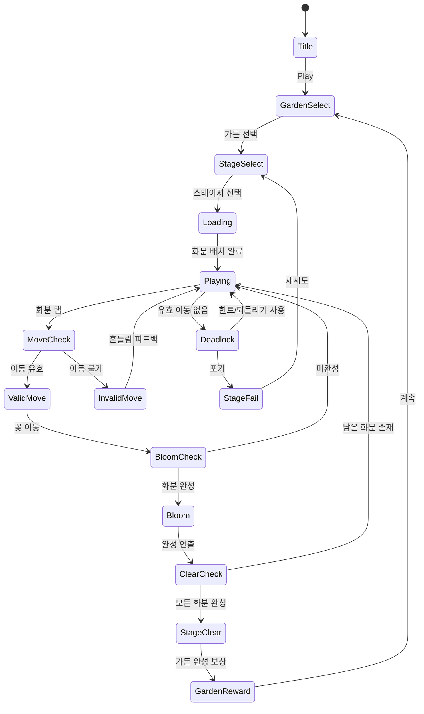

# 블라썸 매치: Blossom Sort®

> **레퍼런스 #67** | 장르: sort-puzzle | 개발사: ZeroMaze | 평점: 4.8

## 개요

꽃을 화분에 색상별로 정렬하는 정렬 퍼즐 게임. 하노이탑 메카닉을 꽃 테마로 재해석했으며,
#29 Water Sort와 동일한 컨테이너 간 이동 엔진을 공유하고 테마 스킨만 교체한다.
화분이 단색 꽃으로 가득 찰 때마다 꽃이 피는 연출과 함께 가든을 완성해 나가는 시각적 만족감이 핵심.

### 레퍼런스 비교

| 항목 | #29 Water Sort | #67 Blossom Sort |
|------|---------------|-----------------|
| 컨테이너 | 유리 시험관 | 테라코타 화분 |
| 피스 | 컬러 물 블록 | 꽃 (장미/튤립/해바라기 등) |
| 완성 연출 | 색이 꽉 차는 애니 | 꽃이 활짝 피는 애니 |
| 보상 루프 | 스테이지 클리어 | 가든 완성 + 희귀 꽃 해금 |
| 엔진 | sort-core | **sort-core (공유)** |

---

## 게임 규칙

### 핵심 메카닉 (Water Sort 동일)

- N개의 화분이 있고, 각 화분은 최대 4개의 꽃을 담을 수 있음
- 초기 상태: 꽃이 색상별로 섞여 분배됨 (1~2개의 빈 화분 제공)
- 플레이어는 **화분 A의 맨 위 꽃**을 **화분 B의 맨 위**로 이동
- 이동 규칙:
  - B가 비어 있으면 항상 이동 가능
  - B의 맨 위 꽃과 이동할 꽃의 색이 **동일**해야 이동 가능
  - B가 가득 차면(4개) 이동 불가
- 화분 하나가 **같은 색 꽃 4개**로 가득 차면 **완성(Bloom)** 처리됨
- 모든 화분이 완성되면 **스테이지 클리어**

### 멀티 이동 (Water Sort 확장)

- 화분 A의 맨 위 꽃이 연속으로 같은 색이면 **한 번에 여러 개** 이동
  - ex) A 맨 위 3개가 모두 빨강 → B에 빨강 3칸 여유 있으면 3개 동시 이동

### 실패 조건

- 유효한 이동이 **하나도 없는 상태** = 교착(Deadlock) → 힌트/되돌리기 소비 유도

---

## 꽃 테마 설계

### 꽃 종류 (색상 = 꽃 종류)

| 색상 | 꽃 | 이모지 |
|------|----|--------|
| 빨강 | 장미 | 🌹 |
| 노랑 | 해바라기 | 🌻 |
| 보라 | 라벤더 | 💜 |
| 분홍 | 벚꽃 | 🌸 |
| 주황 | 금잔화 | 🟠 |
| 흰색 | 데이지 | 🌼 |
| 파랑 | 수레국화 | 💙 |
| 초록 | 클로버 | 🍀 |

> 초기 난이도: 3~4색 → 후반: 8색까지 확장

### Bloom 애니메이션 (완성 연출)

1. 화분 가득 참 → 꽃봉오리 상태에서 활짝 피는 연출 (0.5초)
2. 반짝임 파티클 + 꽃잎 날림 이펙트
3. 화분 테두리에 완성 글로우 효과
4. 모든 화분 완성 시 → 가든 뷰 전환 + 나비 날아다니는 축하 연출

---

## 게임 플로우



---

## UI 레이아웃

```
┌─────────────────────────────┐
│  🌿 Garden 3    ⭐ 1,240    │  ← 헤더: 가든명 + 스코어
│  Stage 12       ↩️ [3]      │  ← 스테이지 번호 + 되돌리기 횟수
├─────────────────────────────┤
│                             │
│   🪴    🪴    🪴    🪴      │
│  [🌹] [🌻] [🌹] [   ]      │  ← 화분 행 1
│  [💜] [🌹] [🌻] [   ]      │    (각 칸 = 꽃 슬롯)
│  [🌻] [💜] [💜] [   ]      │
│  [🌹] [🌹] [🌻] [   ]      │
│                             │
│   🪴    🪴    🪴             │
│  [🌸] [🌸] [   ]           │  ← 화분 행 2
│  [🌸] [💜] [   ]           │
│  [💜] [🌸] [   ]           │
│  [💜] [🌸] [   ]           │
│                             │
├─────────────────────────────┤
│  💡 Hint   ↩️ Undo   ➕ Add │  ← 아이템 바
└─────────────────────────────┘
```

> 화분 수가 많을 경우 2×N 그리드로 배치, 스크롤 없이 화면 내 표시

---

## 스코어링 시스템

| Action | Score |
|--------|-------|
| 꽃 이동 1회 | +10 |
| 화분 완성(Bloom) | +300 |
| 스테이지 클리어 | +500 |
| 무힌트 클리어 보너스 | +200 |
| 이동 횟수 절약 보너스 | (최적해 대비 초과 이동 없을 때) +100 |

---

## 난이도 설계

| Stage 범위 | 꽃 색상 수 | 화분 수 | 빈 화분 | 특징 |
|-----------|-----------|---------|---------|------|
| 1~10 | 3 | 5 | 2 | 튜토리얼, 멀티이동 소개 |
| 11~30 | 4 | 6 | 2 | 기본 난이도 |
| 31~60 | 5 | 7 | 2 | 중급 |
| 61~100 | 6 | 8 | 2 | 중상급 |
| 101~150 | 7 | 9 | 1 | 상급, 빈 화분 감소 |
| 151+ | 8 | 10 | 1 | 최고 난이도 |

> **밸런스 원칙**: 빈 화분 1개 = 고난이도. 빈 화분 0개 = 불가능에 가까움 → 최소 1개 유지

---

## 아이템/도구

| Item | 효과 | 획득 |
|------|------|------|
| 💡 Hint | 유효한 다음 이동 1회 강조 표시 | 광고 또는 구매 |
| ↩️ Undo | 마지막 이동 1회 취소 | 기본 3회 제공, 추가 구매 |
| ➕ Add Pot | 빈 화분 1개 추가 (해당 스테이지 한정) | 구매 |
| 🌀 Shuffle | 전체 꽃 재배치 (단, 동일 색상 쌍 유지) | 광고 시청 |

---

## 수익화 전략

### IAP 구조

| 상품 | 가격 | 내용 |
|------|------|------|
| Starter Pack | $0.99 | 힌트 ×10, Undo ×10, Add Pot ×3 |
| Garden Pass (월정액) | $4.99/월 | 무제한 힌트, 희귀 꽃 스킨, 광고 제거 |
| Rare Flower Bundle | $1.99 | 희귀 꽃 스킨 3종 (화분 외관 변경) |
| Coin Pack S/M/L | $0.99/$2.99/$7.99 | 인게임 코인 |

### 가든 꾸미기 (핵심 리텐션 루프)

- 스테이지 클리어 시 가든 타일 해금
- 가든 = 꽃밭 그리드 (5×5, 7×7 등) → 완성할수록 아름다운 정원 완성
- 희귀 꽃(금/은/무지개) IAP로 가든 특별 장식
- 가든 완성 시 SNS 공유 기능 → 자연 유입

### 광고

- 교착 상태 → 힌트 광고 (인터스티셜)
- 스테이지 실패 → 부활 광고 (리워드: Add Pot 1회)
- 스테이지 클리어 → 2× 보상 광고 (리워드 광고)

---

## 정렬 퍼즐 공통 엔진: `lib/sort-core` 설계 제안

### 배경

#29 Water Sort와 #67 Blossom Sort는 **동일한 게임 로직**을 공유:
- 컨테이너 배열 관리
- 피스(물/꽃) 이동 유효성 검증
- 완성 판정
- 교착 상태 감지

단, 시각 표현(스킨)만 다름. → **엔진 공유, 스킨 교체** 전략으로 개발 비용 최소화.

### 패키지 구조

```
lib/sort-core/          ← 공통 정렬 퍼즐 엔진
  src/
    SortEngine.ts       ← 핵심 상태 머신
    Container.ts        ← 컨테이너 모델 (배열 + 용량)
    MoveValidator.ts    ← 이동 유효성 검사
    DeadlockDetector.ts ← 교착 상태 감지 (BFS)
    LevelGenerator.ts   ← 난이도별 레벨 자동 생성
    types.ts            ← 공통 타입 정의

lib/water-sort/         ← #29: Water Sort 스킨
  src/
    WaterSortScene.ts   ← Phaser 씬 (sort-core 사용)
    WaterRenderer.ts    ← 물 렌더링 (물리/그라데이션)

lib/blossom-match/      ← #67: Blossom Sort 스킨
  src/
    BlossomScene.ts     ← Phaser 씬 (sort-core 사용)
    FlowerRenderer.ts   ← 꽃 렌더링 + Bloom 애니
    GardenManager.ts    ← 가든 진행 관리
```

### SortEngine 인터페이스 (초안)

```typescript
// lib/sort-core/src/types.ts
export interface Container {
  id: string;
  capacity: number;       // 기본 4
  pieces: string[];       // 색상 코드 배열 (bottom → top)
}

export interface SortState {
  containers: Container[];
  moveCount: number;
  isComplete: boolean;
}

export interface MoveResult {
  success: boolean;
  fromId: string;
  toId: string;
  movedCount: number;   // 멀티 이동 지원
  bloom: boolean;       // 완성 여부
}

// lib/sort-core/src/SortEngine.ts
export class SortEngine {
  constructor(state: SortState) {}
  move(fromId: string, toId: string): MoveResult {}
  undo(): SortState {}
  getHint(): [string, string] | null {}  // [fromId, toId]
  isDeadlock(): boolean {}
  isComplete(): boolean {}
  clone(): SortEngine {}
}
```

### 개발 우선순위

1. **`lib/sort-core`** 먼저 구현 → 재사용 가능한 엔진
2. **`lib/water-sort`** (#29) 먼저 출시 → 시장 검증
3. #29 성과 기반으로 **`lib/blossom-match`** (#67) 스킨 작업
4. 두 게임이 같은 엔진 → 버그 수정 1회로 양쪽 반영

---

## 사운드/이펙트

| 이벤트 | 사운드 | 비주얼 |
|--------|--------|--------|
| 꽃 이동 | 사각사각 (식물 느낌) | 꽃 슬라이드 트윈 |
| 이동 불가 | 짧은 경고음 | 화분 흔들림 |
| Bloom (완성) | 봄바람 + 새소리 | 꽃 활짝 피는 스프라이트 + 파티클 |
| 스테이지 클리어 | 경쾌한 팡파르 | 나비 날고 꽃잎 휘날림 |
| 교착 상태 | 걱정스러운 음악 dim | 힌트 버튼 펄스 |

---

## MVP 범위

### Phase 1 (Week 1 — 핵심 엔진 + 기본 게임)

- [x] 기획서 작성
- [ ] `lib/sort-core`: SortEngine, MoveValidator, DeadlockDetector
- [ ] `lib/blossom-match`: Phaser 씬 기본 구현 (화분 + 꽃 렌더링)
- [ ] 이동 로직 + Bloom 판정
- [ ] 레벨 20개 하드코딩
- [ ] 게임 오버 / 클리어 화면

### Phase 2 (Week 2 — 폴리시 + 수익화)

- [ ] Bloom 애니메이션 (꽃 피는 연출)
- [ ] 가든 뷰 (클리어 보상 화면)
- [ ] 힌트 / Undo / Add Pot 아이템
- [ ] 광고 연동 (리워드 광고)
- [ ] IAP 기본 (Starter Pack)
- [ ] 레벨 50개로 확장
- [ ] `web/blossom-match` + `blossom-match/rn` 빌드

### 출시 후

- [ ] `lib/sort-core` 공통화 → `lib/water-sort` 리팩토링
- [ ] 가든 꾸미기 시스템 (리텐션)
- [ ] 희귀 꽃 IAP 확장
- [ ] 레벨 150개+

---

## 결론 및 권고

1. **즉시 착수**: `lib/sort-core` 엔진 설계 → Water Sort + Blossom Sort 동시 지원
2. **#29 Water Sort 먼저 출시** → CPI/ROAS 데이터 확보
3. **Blossom Sort는 스킨 작업 위주** → 2주 이내 출시 가능
4. **가든 꾸미기** = 장기 리텐션 핵심 → Phase 2에서 반드시 포함
5. 정렬 퍼즐 장르는 검증된 고수요 장르 (Top Chart 상위권 유지)
   → **3개월 생존 전략의 핵심 타이틀**로 추진 권고
