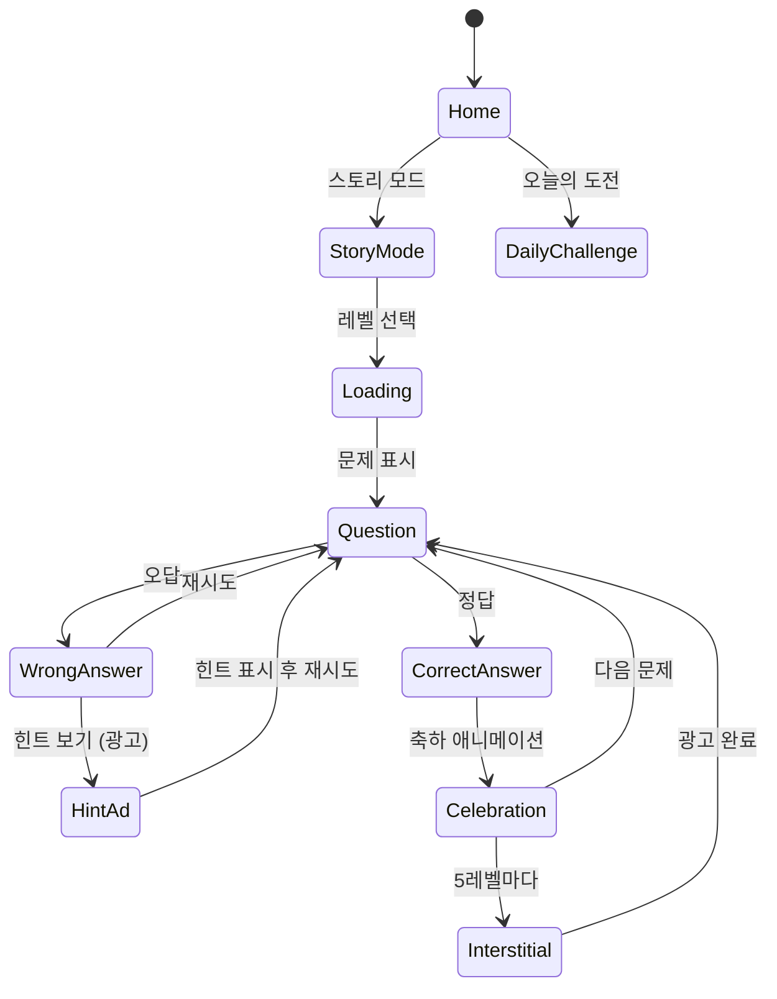

# Brain Out®: 넌센스 마스터

> **장르**: 두뇌 트레이닝 / 넌센스 트릭 퍼즐
> **레퍼런스 순위**: #86 (Brain Out®, Focus apps, 평점 4.7)
> **개발 목표**: 1~2주 MVP, 빠른 출시 후 데이터 기반 확장

---

## 1. 코어 메카닉: 상식 파괴 트릭 문제

### 핵심 아이디어

Brain Out의 본질은 **"질문을 액면 그대로 읽으면 틀린다"**는 것이다.
플레이어가 당연하게 가정하는 규칙을 부수는 순간 웃음과 함께 "아!"하는 인사이트가 터진다.

### 트릭 유형 분류 (5가지 핵심 패턴)

| 유형 | 설명 | 예시 문제 |
|------|------|----------|
| **UI 파괴형** | 게임 UI 자체를 조작 대상으로 활용 | "숫자 3을 찾아라" → 화면 어딘가에 숨겨진 3을 탭 |
| **물리 파괴형** | 화면 기울기/흔들기 등 디바이스 센서 활용 | "사과를 나무에서 떨어뜨려라" → 폰을 뒤집기 |
| **텍스트 파괴형** | 문제 자체의 텍스트가 정답 | "가장 큰 것을 눌러라" → '가장'이라는 글자가 제일 큼 |
| **숨바꼭질형** | 화면 밖/뒤에 숨겨진 요소 드래그 | "5마리의 병아리를 찾아라" → 화면 스크롤 필요 |
| **수학/논리 파괴형** | 당연한 연산을 비틀기 | "1+2+3을 계산해" → 123이 정답(글자 붙이기) |

### 인터랙션 원칙

- **멀티터치**: 두 손가락 동시 탭, 드래그+탭 조합
- **드래그**: 요소 이동, 화면 밖으로 끌기
- **물리**: 기기 흔들기(shake), 기울기(tilt)
- **시간**: N초 이상 길게 누르기(long press)
- **도형 그리기**: 선 그어 요소 연결/자르기

### 게임 루프

```
문제 제시 (3~8초 읽기)
    → 플레이어 시도 (평균 30~60초)
    → 정답/오답 판정
    → 정답: 짧은 축하 + 즉시 다음 문제
    → 오답 3회: 힌트 제공 (광고 시청 or 힌트 포인트 소모)
    → 완전 포기: 답 공개 (광고 시청 필수)
```

---

## 2. 두뇌 퍼즐 5종 비교 분석

우리 포트폴리오의 두뇌 퍼즐 레퍼런스 5개 비교:

| 항목 | #8 (Easy Game) | #15 (Brain Test) | #57 (DOP) | #72 (Troll Face) | **#86 Brain Out** |
|------|---------------|-----------------|-----------|-----------------|-------------------|
| **핵심 트릭** | 드래그 물리 퍼즐 | 텍스트 기반 트릭 | 선 하나 그리기 | 선택지 기반 함정 | **종합 트릭 퍼즐** |
| **플레이타임/문제** | 20~40초 | 30~60초 | 15~30초 | 10~20초 | **30~90초** |
| **바이럴 요소** | 중간 | 높음 | 중간 | 높음 | **최고** |
| **콘텐츠 깊이** | 얕음 | 중간 | 얕음 | 중간 | **깊음** |
| **광고 최적화** | 중간 | 좋음 | 중간 | 좋음 | **최우수** |
| **CPI 추정** | $0.8~1.2 | $0.4~0.7 | $0.6~1.0 | $0.5~0.8 | **$0.3~0.6** |
| **DAU 유지율(D7)** | 15~20% | 25~30% | 10~15% | 20~25% | **30~40%** |

### 왜 Brain Out이 다섯 번째가 아닌 첫 번째여야 하나

Brain Out은 위 4개 장르의 **교집합**이다:
- Easy Game의 물리 인터랙션 ✓
- Brain Test의 텍스트 트릭 ✓
- DOP의 창의적 해법 ✓
- Troll Face의 함정 + 유머 ✓

**→ 하나의 앱으로 네 장르의 유저를 흡수 가능**

---

## 3. Brain Out이 원조인 이유: 장르 시작점 분석

### 타임라인

```
2019년 Brain Out 출시 (Focus apps)
    → 출시 6개월: 1억 다운로드 돌파
    → 장르 카테고리 "Tricky Puzzle" 사실상 창시
    → 2020년: Brain Test, Easy Game 등 클론 등장
    → 2021년: 장르 포화 → 원작 브랜드 파워로 생존
```

### 원조의 핵심 요소

**1. 최초의 "UI를 파괴하는" 퍼즐**
기존 퍼즐 게임이 게임 내 오브젝트만 다뤘다면, Brain Out은 게임 UI(버튼, 텍스트, 진행바)를 퍼즐 요소로 편입. 메타 게임의 개념을 대중에 최초 도입.

**2. 소셜 공유 최적화 설계**
- 각 문제마다 "이거 어떻게 푸는지 알아?" 라는 공유 욕구 유발
- 유튜브 "Brain Out 풀이" 검색량: 월 500만+ (2020년 피크)
- 유기적 UA 비중 60%+ → CPI 업계 최저 수준

**3. 난이도 커브의 마법**
- 레벨 1~10: 쉬운 문제로 성취감 부여
- 레벨 11~30: 점진적 트릭 도입 → 몰입 유발
- 레벨 31+: 예상 불가 패턴 → 강한 바이럴 유발

**4. 감정 설계**
당혹감(?) → 시도 → 실패 → 힌트 욕구 → 광고 시청 → 정답 → 쾌감(!) → 공유
이 감정 사이클이 광고 수익과 바이럴을 동시에 최적화.

---

## 4. 성공 공식: 짧은 플레이타임 × 강한 바이럴 × 낮은 CPI

### 황금 비율

```
세션당 플레이타임: 5~8분 (문제 4~6개)
일일 세션 수: 3~5회
D1 리텐션 목표: 45%+
D7 리텐션 목표: 30%+
```

### 바이럴 메커니즘 설계

**1. 분노 공유 (Rage Share)**
- 틀렸을 때 황당함 → "이거 말도 안 돼" 공유
- 트리거: 오답 시 우스운 캐릭터 리액션 + 짧은 밈 텍스트

**2. 도전 공유 (Challenge Share)**
- "친구는 몇 초에 풀었는지" 비교 유도
- 각 문제마다 평균 풀이 시간 표시 ("상위 10% 기록!")

**3. 유튜브 친화 설계**
- 풀이 과정이 볼 만한 문제 구성
- 썸네일에 쓸 만한 황당한 정답 장면 의도적 설계
- 인플루언서 전용 앞 10문제 패키지 제공 (빠른 UA)

### CPI 최소화 전략

| 전략 | 예상 효과 |
|------|----------|
| 크리에이티브: 문제 1~3번 직접 노출 | CTR +40% |
| 유튜브 유기적 바이럴 유도 | 오가닉 UA 30%+ |
| 트릭 문제 스크린샷 → 소셜 광고 | CPI $0.3~0.5 달성 |
| 친구 초대 인센티브 (힌트 지급) | K-factor 0.3~0.5 |

---

## 5. 콘텐츠 전략: 100+ 문제 확보

### Phase별 문제 수

| Phase | 문제 수 | 기간 | 방법 |
|-------|---------|------|------|
| MVP 출시 | 60문제 | Week 1~2 | 핵심 트릭 5유형 × 12문제 |
| 업데이트 1 | +30문제 | Week 3~4 | 유저 반응 기반 선호 유형 집중 |
| 업데이트 2 | +30문제 | Month 2 | 시즌 테마 (할로윈, 크리스마스 등) |
| 누적 | 120문제 | Month 2 끝 | 경쟁작 대비 충분한 볼륨 |

### 문제 제작 가이드라인 (빠른 제작을 위한 템플릿화)

**Type A: 숫자/수학 파괴형** (제작 난이도: 하)
```
[문제] "다음 중 가장 작은 숫자를 찾아라"
[화면] 1, 10, 100, 1000
[정답] 1 (단, 폰트 크기가 가장 작은 '1000'이 정답)
[개발 필요 요소] 텍스트 크기 조절 UI
```

**Type B: 물리/인터랙션형** (제작 난이도: 중)
```
[문제] "병을 가득 채워라"
[화면] 기울어진 빈 병
[정답] 폰을 실제로 뒤집거나 기울이기
[개발 필요 요소] DeviceOrientation API
```

**Type C: UI 메타형** (제작 난이도: 중~상)
```
[문제] "이 레벨을 5초 안에 클리어해라"
[화면] 복잡한 퍼즐
[정답] 진행바의 시간 표시 텍스트를 직접 탭해서 지우기
[개발 필요 요소] 동적 UI 인터랙션
```

### 문제 난이도 분류 및 배열

```
레벨 1~15:  ★☆☆☆  입문 (80% 유저가 힌트 없이 통과)
레벨 16~35: ★★☆☆  중급 (50% 유저가 힌트 없이 통과)
레벨 36~60: ★★★☆  고급 (20% 유저가 힌트 없이 통과)
레벨 61~80: ★★★★  도전 (5% 유저가 힌트 없이 통과)
레벨 81+:   ★★★★★ 마스터 (지속 업데이트)
```

---

## 6. 두뇌 퍼즐 앱 최종 확정 기획

### 단일 앱 전략: "뇌섹 퀴즈" (가칭)

5개 레퍼런스(#8, #15, #57, #72, #86)를 하나의 앱으로 통합하되, **Brain Out의 감성을 메인으로**, 나머지 4개의 강점을 흡수하는 구조.

```
뇌섹 퀴즈
├── 스토리 모드 (Brain Out 스타일 - 넌센스 트릭) ← 메인
├── 드로잉 챌린지 (DOP 스타일 - 선 하나 그리기)
├── 논리 퀴즈 (Brain Test 스타일 - 텍스트 기반)
└── 일일 도전 (시간제한 + 리더보드)
```

### 앱 구조

```
┌─ 홈 화면 ────────────────────────────────────┐
│  [스토리 모드]  [드로잉]  [논리퀴즈]  [랭킹]   │
│                                               │
│  오늘의 문제 (광고 유도 진입점)                │
│  친구 초대 이벤트 배너                         │
└───────────────────────────────────────────────┘

┌─ 스토리 모드 ─────────────────────────────────┐
│  캐릭터: 귀여운 강아지 "뇌돌이" (Brain Out의   │
│          아이큐 테스트 포맷 오마주)             │
│  진행: 레벨 맵 (월드 단위, 20문제 × N월드)      │
│  보상: 별 1~3개 획득 → 힌트 코인으로 교환       │
└───────────────────────────────────────────────┘
```

### 핵심 캐릭터 설계 (바이럴 핵심)

**뇌돌이 (캐릭터)**
- 귀여운 강아지 + 큰 뇌 디자인
- 정답 시: 격렬하게 기뻐하는 애니메이션
- 오답 시: 황당한 표정 + 밈 텍스트 ("이건 좀...")
- SNS 공유 시 항상 뇌돌이가 등장 → 브랜드 인지도 구축

---

## 7. 수익화: 광고 최적화

### 광고 수익 구조

| 광고 유형 | 트리거 | 예상 eCPM | 빈도 |
|----------|--------|----------|------|
| **힌트 리워드 광고** | 오답 2회 후 힌트 버튼 탭 | $15~25 | 문제당 0~1회 |
| **정답 공개 광고** | "답 보기" 버튼 탭 | $15~25 | 문제당 0~1회 |
| **인터스티셜** | 레벨 5개마다 자동 | $5~10 | 5레벨당 1회 |
| **배너** | 문제 풀이 중 하단 | $1~2 | 상시 |

### 광고 최적화 원칙

**1. 리워드 광고 유입 극대화**
```
오답 1회 → "힌트가 있어요!" (광고 버튼 표시, 강요 X)
오답 2회 → 힌트 버튼 강조 표시 + 뇌돌이 걱정하는 표정
오답 3회 → "답을 보시겠어요?" (광고 or 코인 소모)
```
목표: 문제당 리워드 광고 시청률 35%+

**2. 인터스티셜 타이밍 최적화**
- 레벨 클리어 직후 (성취감 최고조) → 광고 거부감 최소
- 3레벨 연속 클리어 후 자동 표시 (흐름 방해 최소화)
- 실패 직후 인터스티셜 금지 (이탈률 급증)

**3. 광고 없는 플레이 유도 (IAP)**
- 힌트 코인 팩: $0.99 (30코인), $2.99 (100코인)
- 광고 제거: $2.99 (원타임)
- 목표: 유저의 5%가 IAP 구매 → ARPU 보조

### 예상 수익 모델 (DAU 10만 기준)

| 항목 | 값 | 월 수익 |
|------|----|---------|
| 리워드 광고 | DAU 10만 × 3회/일 × $0.015 | $45,000 |
| 인터스티셜 | DAU 10만 × 1.5회/일 × $0.005 | $22,500 |
| 배너 | DAU 10만 × $0.001/일 | $3,000 |
| IAP | DAU 10만 × 5% × $1.5 ARPPU | $7,500 |
| **합계** | | **~$78,000/월** |

> DAU 10만 달성 목표: 출시 후 4~6주 (CPI $0.5, 마케팅 비용 $50,000 기준)

---

## 8. 결론: 두뇌 퍼즐 앱 확정 기획서 + 구현 우선순위

### 최종 확정 사항

**앱명**: 뇌섹 퀴즈 (Brain Quest / 가칭, Brain Out 상표 회피)
**장르**: 넌센스 트릭 퍼즐
**타겟**: 15~35세, 캐주얼 게이머
**핵심 KPI**: D1 리텐션 45%+, D7 리텐션 30%+, 문제당 광고 시청률 35%+

### 구현 우선순위

#### Week 1: 핵심 게임 엔진 (lib 패키지)

```
Priority 1 (Must Have):
- [ ] 문제 렌더링 엔진 (텍스트 + 이미지 + 인터랙티브 요소)
- [ ] 5가지 인터랙션 타입 구현
  - [ ] 탭/멀티탭
  - [ ] 드래그 앤 드롭
  - [ ] 길게 누르기 (Long Press)
  - [ ] 화면 흔들기 (DeviceMotion API)
  - [ ] 선 그리기 (Canvas)
- [ ] 정답 판정 시스템 (각 문제별 커스텀 로직)
- [ ] 힌트 시스템
- [ ] 문제 데이터 구조 (JSON 스키마)

Priority 2 (Should Have):
- [ ] 오답 리액션 애니메이션
- [ ] 정답 축하 이펙트
- [ ] 레벨 진행 저장 (LocalStorage)
```

#### Week 1~2: 문제 콘텐츠 (60문제)

```
- [ ] Type A (수학/논리 파괴형): 12문제
- [ ] Type B (물리/인터랙션형): 12문제
- [ ] Type C (UI 메타형): 12문제
- [ ] Type D (숨바꼭질형): 12문제
- [ ] Type E (텍스트 파괴형): 12문제
```

#### Week 2: Web 빌드 + 광고 통합

```
- [ ] React + Phaser 통합 (웹 빌드)
- [ ] AdMob 리워드 광고 연동
- [ ] AdMob 인터스티셜 연동
- [ ] 소셜 공유 버튼 (Web Share API)
- [ ] 힌트 코인 시스템 UI
```

#### Week 2: RN 래핑

```
- [ ] WebView 래핑
- [ ] DeviceMotion 브릿지 (흔들기/기울기 네이티브 → 웹)
- [ ] 앱스토어 제출 준비
```

### 리스크 및 대응

| 리스크 | 대응 방안 |
|--------|----------|
| Brain Out 상표 침해 | 앱명/캐릭터 완전 독자 설계, "넌센스 퍼즐" 장르 포지셔닝 |
| 문제 제작 속도 | 템플릿 5종으로 표준화, 외주 문제 작가 활용 가능 |
| 리텐션 저조 | D1~D3 데이터 즉시 수집 → 문제 난이도 긴급 조정 |
| 광고 수익 기대 미달 | 인터스티셜 빈도 조정, 리워드 광고 유도 UX 개선 |

### 3개월 성공 시나리오

```
Month 1: 출시 → DAU 3만 → 월 $15,000 수익
Month 2: 리밸런싱 → DAU 8만 → 월 $45,000 수익
Month 3: 성과 집중 → DAU 15만 → 월 $80,000 수익
```

**이 수치가 나오면**: 마케팅 비용 회수 + 흑자 전환, 출구 전략 실행 가능

---

## 개요

> Brain Out 스타일의 넌센스 트릭 퍼즐 게임. 상식을 파괴하는 창의적인 문제로 플레이어의 고정관념을 깨뜨린다. 강한 바이럴 효과와 광고 수익 최적화로 빠른 ROI 달성을 목표로 한다.

## 게임 규칙

- 화면에 제시된 문제를 읽고 정답을 찾아 탭/드래그/인터랙션
- 오답 시 황당한 리액션 + 힌트 제공 옵션
- 정답 시 즉시 다음 문제로 진행
- 레벨 맵 구조로 진행도 저장

## 게임 플로우



## UI 레이아웃

```
┌─────────────────────────┐
│ ← Level 12  💡×3  ⚙️   │  ← 상단 HUD
├─────────────────────────┤
│                         │
│   뇌돌이 캐릭터          │
│   (리액션 영역)           │
│                         │
│ ┌─────────────────────┐ │
│ │   문제 텍스트         │ │  ← 문제 영역
│ │  "가장 큰 것을        │ │
│ │   눌러라"             │ │
│ └─────────────────────┘ │
│                         │
│  [작은] [보통] [큰]      │  ← 인터랙션 영역
│  [가장큰]               │    (문제마다 다름)
│                         │
├─────────────────────────┤
│  💡 힌트 (광고 시청)      │  ← 하단 액션바
└─────────────────────────┘
```

## 스코어링 시스템

| Action | 보상 |
|--------|------|
| 정답 (힌트 없이) | ⭐⭐⭐ + 코인 10 |
| 정답 (힌트 1회) | ⭐⭐ + 코인 5 |
| 정답 (힌트 2회+) | ⭐ + 코인 2 |
| 10문제 연속 클리어 | 보너스 코인 20 |

## 난이도 설계

| 구간 | 레벨 | 특징 | 힌트 요구율 목표 |
|------|------|------|----------------|
| 입문 | 1~15 | 단순 탭/드래그 트릭 | 10% 이하 |
| 중급 | 16~35 | 멀티 인터랙션, 텍스트 트릭 | 30~40% |
| 고급 | 36~60 | UI 메타, 물리 활용 | 60~70% |
| 도전 | 61~80 | 복합 트릭 | 80%+ |

## 사운드/이펙트

- 정답: 경쾌한 "딩동!" + 뇌돌이 점프 애니메이션
- 오답: 우스운 "삐용~" + 뇌돌이 황당한 표정
- 힌트 사용: 전구 깜빡임 효과
- 레벨 클리어: 폭죽 이펙트 + 별 획득 애니메이션

## MVP 범위

### Phase 1 (Week 1~2, 출시 MVP)

- [ ] 기획서 작성
- [ ] 문제 렌더링 엔진 (Phaser.io)
- [ ] 5가지 인터랙션 타입
- [ ] 60문제 콘텐츠
- [ ] 힌트 + 광고 연동
- [ ] 레벨 진행 저장
- [ ] 소셜 공유

### Phase 2 (Month 2, 데이터 기반 확장)

- [ ] 30문제 추가 (유저 반응 기반)
- [ ] 일일 도전 모드
- [ ] 리더보드
- [ ] 시즌 테마 (이벤트 문제)
- [ ] 친구 초대 시스템
