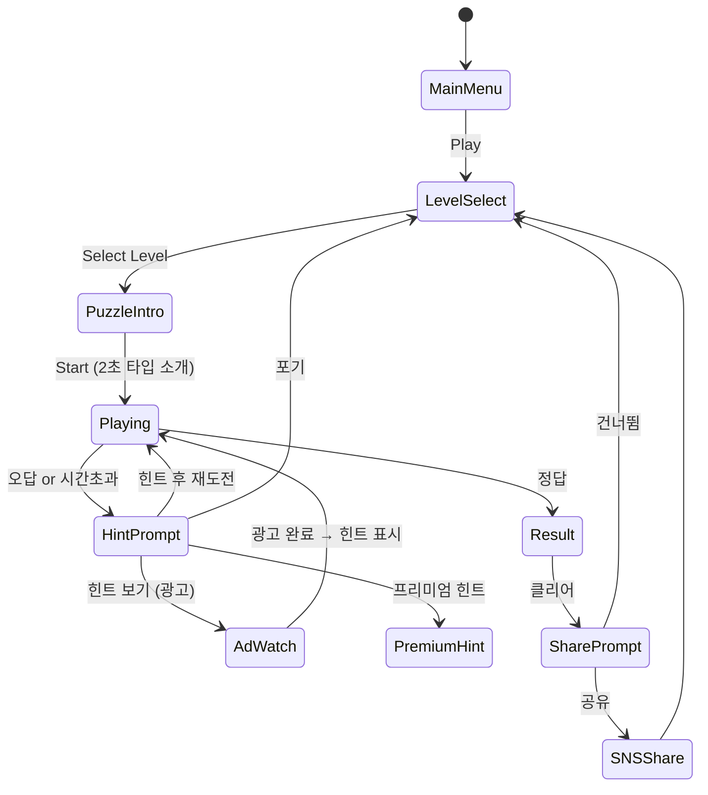

# Brain Puzzle 2: Logic Twist

> 두뇌 트레이닝을 위한 고난이도 로직 퍼즐. 매 레벨 다른 규칙의 미니 퍼즐 옴니버스.

## 개요

플레이어는 매 레벨마다 다른 유형의 퍼즐을 맞닥뜨린다. 패턴 인식, 시퀀스 완성, 공간 추론, 함정 문제 등 10가지 퍼즐 타입이 랜덤하게 등장하며, 같은 타입이 등장할수록 난이도가 증가한다. SNS 공유와 IQ 점수 시스템으로 바이럴을 유도한다.

## 코어 메카닉

### 옴니버스 구조

```
레벨 1 → [패턴 인식 #1]
레벨 2 → [시퀀스 완성 #1]
레벨 3 → [공간 추론 #1]
레벨 4 → [패턴 인식 #2]  ← 같은 타입, 더 복잡
레벨 5 → [함정 문제 #1]
...
```

- 각 레벨 시작 시 **퍼즐 타입 소개 애니메이션** (2초): "이번엔 패턴 인식!"
- 제한 시간 내 정답을 맞히면 클리어, 틀리거나 시간 초과 시 실패
- 실패 시 힌트 사용 여부 선택 (광고 보기 or 프리미엄)

### 정답 판정

- **단일 선택형**: 보기 중 하나 선택 (A/B/C/D)
- **입력형**: 숫자/문자 직접 입력
- **드래그형**: 요소를 정렬하거나 연결
- **탭 순서형**: 올바른 순서로 탭

## 퍼즐 타입 풀 (10종)

### 타입 1: 패턴 인식 (Pattern Recognition)

규칙이 있는 이미지/숫자 배열에서 다음에 올 요소를 맞힌다.

```
예시: 🔴 🔵 🔴 🔵 🔴 [ ? ]
정답: 🔵

고난이도: ▲ ▲▲ ▲▲▲ ▲ ▲▲ [ ? ]
정답: ▲▲▲
```

- Level 1-3: 색상 패턴 (2가지 색)
- Level 4-6: 도형 크기 + 색상 복합 패턴
- Level 7-9: 3중 규칙 중첩 패턴
- Level 10: 함정 포함 패턴 (규칙이 바뀌는 지점 존재)

### 타입 2: 시퀀스 완성 (Sequence Completion)

수열, 알파벳, 피보나치 등 수학적 시퀀스의 빈칸 채우기.

```
예시: 2, 4, 6, [ ? ], 10
정답: 8

고난이도: 1, 1, 2, 3, 5, [ ? ], 13
정답: 8 (피보나치)

함정: 2, 4, 8, 16, [ ? ]  → 보기: 24 / 32 / 20 / 28
정답: 32 (등비수열, 덧셈으로 착각 유도)
```

- Level 1-3: 등차수열 (단순 덧셈)
- Level 4-6: 등비수열, 제곱수열
- Level 7-9: 복합 규칙 (홀짝 분리, 교차 규칙)
- Level 10: 피보나치 변형, 소수 수열

### 타입 3: 공간 추론 (Spatial Reasoning)

도형을 회전/반전/접기 시 어떤 모양이 되는지 맞힌다.

```
원본: [L 모양]
90도 회전 시 어떤 모양? → 보기 4개 중 선택

고난이도: 3D 전개도 → 어떤 정육면체가 만들어지는가?
```

- Level 1-3: 2D 도형 90°/180° 회전
- Level 4-6: 2D 도형 반전 + 회전 조합
- Level 7-9: 종이 접기 → 구멍 위치 예측
- Level 10: 3D 전개도 → 완성형 예측

### 타입 4: 함정 문제 (Trick Questions)

직관적으로 틀리기 쉬운 함정이 숨어있는 문제. "빠르게 읽으면 틀린다."

```
예시: "3마리 새가 나무에 앉아 있다. 총을 쏴서 1마리를 잡았다. 나무에 몇 마리가 남았는가?"
함정: 나머지 새들이 총소리에 날아감 → 정답: 0마리

수학 함정: 17 × 8 = ?
보기: 136 / 126 / 138 / 96
(136이 맞지만 126을 선택하도록 유도)
```

- Level 1-3: 상식 함정 (직관 vs 논리)
- Level 4-6: 수학 계산 함정 (자릿수 착각)
- Level 7-9: 언어 함정 (단어 중의적 의미)
- Level 10: 시각 함정 + 논리 이중 함정

### 타입 5: 논리 추론 (Logical Deduction)

주어진 조건에서 참/거짓 또는 올바른 결론을 도출한다.

```
예시: "A는 B보다 크다. B는 C보다 크다. C와 A 중 누가 더 큰가?"
정답: A

고난이도:
- 모든 M은 P다. (O)
- 어떤 S는 M이다. (O)
- 결론: 어떤 S는 P다. → 참/거짓?
정답: 참
```

- Level 1-3: 1단계 비교 추론
- Level 4-6: 3-4단계 연쇄 추론
- Level 7-9: 부정 명제 포함 추론
- Level 10: 삼단논법 + 함정 명제 혼합

### 타입 6: 색상/도형 분류 (Visual Classification)

제시된 규칙에 맞는 도형 또는 규칙을 발견한다.

```
예시: 다음 중 규칙이 다른 하나는?
🔴▲  🔵▲  🔴■  🔵■  🔴●
정답: 🔴● (삼각형/사각형만 있었는데 원형)

고난이도: 도형 그룹 내 숨겨진 공통점 찾기
(크기 + 색상 + 변의 수 세 가지 중 두 가지가 일치하는 쌍)
```

- Level 1-3: 단일 속성(색상 or 형태) 분류
- Level 4-6: 2가지 속성 복합 분류
- Level 7-9: 3가지 속성 교집합 찾기
- Level 10: 규칙 자체를 역으로 추론

### 타입 7: 수학 퍼즐 (Math Puzzles)

계산보다 논리가 필요한 수학적 사고력 문제.

```
예시: 저울 양쪽에 추를 놓아 균형을 맞춰라
3g + 5g = 8g 짜리 추 1개 대신?

고난이도: 최소 이동 횟수로 하노이 탑 이동
또는: 강 건너기 문제 (늑대/양/배추)
```

- Level 1-3: 사칙연산 퍼즐 (24 만들기)
- Level 4-6: 저울 균형 맞추기
- Level 7-9: 이동 최적화 (최소 횟수)
- Level 10: 강 건너기류 경우의 수 문제

### 타입 8: 기억력 퍼즐 (Memory Challenge)

짧게 보여주고 사라진 후 맞히는 순간 기억력 테스트.

```
예시: 3초간 숫자 배열 표시 → 사라짐 → "3번째 줄 두 번째 숫자는?"

고난이도: 카드 위치 기억 → 섞은 후 특정 카드 위치 선택
```

- Level 1-3: 4개 숫자 3초 기억
- Level 4-6: 6개 숫자 + 위치 기억
- Level 7-9: 숫자 + 색상 + 위치 복합
- Level 10: 연속 2단계 기억 (앞 단계 + 현재 단계)

### 타입 9: 언어/단어 퍼즐 (Word & Language)

문자 배열, 숨은 단어, 반의어/동의어 논리.

```
예시: 다음 글자들로 만들 수 있는 단어는?
"ㄱ, ㅏ, ㅁ, ㅏ" → 가마 / 마가 / 가마우지?

영어: LISTEN의 애너그램 → SILENT / ENLIST / TINSEL

고난이도: 2개의 단어에서 공통되는 규칙 찾기
BANK - RIVER, BANK - MONEY → 공통 단어는?
```

- Level 1-3: 단순 애너그램 (4글자)
- Level 4-6: 중의어 찾기, 숨은 단어
- Level 7-9: 다중 의미 연결 퍼즐
- Level 10: 크로스워드 논리 추론

### 타입 10: 시각 착시 & 관찰력 (Visual Observation)

틀린 그림 찾기, 개수 세기, 착시 속 숨은 요소 발견.

```
예시: 두 그림에서 다른 점 3개를 찾아라 (제한 시간 내)

고난이도: 복잡한 도형 내 삼각형 총 개수는?
또는: 착시 이미지에서 두 선의 실제 길이 비교
```

- Level 1-3: 틀린 그림 찾기 (차이 2개)
- Level 4-6: 도형 개수 세기 (숨겨진 것 포함)
- Level 7-9: 착시 속 실제 값 추론
- Level 10: 복잡 패턴 내 특정 요소 개수 + 착시 함정

## 게임 플로우



## UI 레이아웃

```
┌─────────────────────────────┐
│  ← Back    Level 12    ⚙️   │  ← 상단 네비
├─────────────────────────────┤
│  🧩 패턴 인식         ⏱ 30s │  ← 퍼즐 타입 + 타이머
│  ★★★☆☆  IQ 115      🏆 #8 │  ← 현재 스탯
├─────────────────────────────┤
│                              │
│   ┌──────────────────────┐  │
│   │                      │  │
│   │   🔴 🔵 🔴 🔵 [ ? ]  │  │  ← 퍼즐 영역 (Phaser Canvas)
│   │                      │  │
│   └──────────────────────┘  │
│                              │
├─────────────────────────────┤
│  [ 🔴 ]  [ 🔵 ]  [ 🟢 ]  [ 🟡 ]  │  ← 보기 버튼
├─────────────────────────────┤
│  💡 힌트 (광고 시청)         │  ← 힌트 버튼
└─────────────────────────────┘
```

### 결과 화면

```
┌─────────────────────────────┐
│         ✅ 정답!             │
│                              │
│   ⭐⭐⭐☆☆   3/5 Stars     │
│                              │
│   🧠 IQ 점수: +8 → 123      │
│   ⏱ 풀이 시간: 12.4초       │
│   🏆 전국 랭킹: 상위 15%    │
│                              │
│  [ 📤 결과 공유 ]            │
│  [ ▶ 다음 레벨  ]           │
└─────────────────────────────┘
```

## 힌트 시스템 (3단계)

모든 퍼즐에 3단계 힌트가 존재한다. 단계가 높을수록 구체적이며 별점이 줄어든다.

| 단계 | 명칭 | 내용 예시 | 별점 패널티 | 획득 방법 |
|------|------|-----------|-------------|-----------|
| 1 | 방향 힌트 | "패턴에서 색상에 집중해보세요" | -1★ | 광고 시청 (15초) |
| 2 | 구체적 힌트 | "홀수 번째는 빨간색, 짝수는 파란색입니다" | -2★ | 광고 시청 (30초) or 프리미엄 |
| 3 | 정답 공개 | "정답은 🔵입니다" | -3★ (0점) | 프리미엄 전용 or 광고 3회 |

- 힌트 사용 후 최대 별점 = (5 - 패널티)
- 힌트 없이 클리어 시 **퍼펙트 보너스** +IQ 5점

## 스코어링 시스템

### IQ 점수 계산

```
기본 IQ = 100
각 문제 클리어:
  + 정답: +8~15 (난이도별)
  + 힌트 없이: +3 보너스
  + 제한시간 50% 이내: +2 보너스

실패/힌트:
  - 오답: -3
  - 힌트 1단계: -1
  - 힌트 2단계: -3
  - 힌트 3단계: -5
```

### 별점 평가

| 조건 | 별점 |
|------|------|
| 힌트 없이 15초 이내 | ⭐⭐⭐⭐⭐ |
| 힌트 없이 제한시간 내 | ⭐⭐⭐⭐ |
| 힌트 1단계 후 정답 | ⭐⭐⭐ |
| 힌트 2단계 후 정답 | ⭐⭐ |
| 힌트 3단계 (정답 공개) | ⭐ |

### 랭킹

- **전국 랭킹**: 같은 레벨 클리어 시간 기준
- **IQ 랭킹**: 누적 IQ 점수 기준
- **주간 챔피언**: 주간 획득 별점 총합 기준

## 바이럴 & SNS 공유

### 공유 카드 자동 생성

레벨 클리어 시 공유 가능한 카드 이미지 생성:

```
┌───────────────────────────┐
│  🧠 Brain Puzzle 2        │
│  "Logic Twist"             │
│                            │
│  나는 레벨 24를 풀었다!   │
│  IQ 127 | 상위 8%         │
│  풀이 시간: 9.2초          │
│                            │
│  "이 문제 너도 맞힐 수 있어?" │
│  → [링크]                  │
└───────────────────────────┘
```

### 공유 트리거 포인트

1. **레벨 클리어 시**: "내가 풀었어, 너는 할 수 있어?"
2. **IQ 마일스톤**: IQ 120/130/140 달성 시 자동 축하 + 공유 유도
3. **연속 퍼펙트**: 3연속 힌트 없이 클리어 시 "천재 등장" 배지 + 공유
4. **어려운 문제 실패**: "이 문제 나도 틀렸는데..." 공감 공유 (역발상)

### 딥링크

공유 링크 클릭 시 해당 레벨로 바로 진입:
```
brainpuzzle2://level/24?challenge=true&from=user123
```

## 수익화 전략

### 광고 수익 (Free 유저)

| 광고 유형 | 트리거 | 보상 |
|-----------|--------|------|
| 리워드 광고 (15초) | 힌트 1단계 요청 | 힌트 1단계 잠금 해제 |
| 리워드 광고 (30초) | 힌트 2단계 요청 | 힌트 2단계 잠금 해제 |
| 전면 광고 | 게임 오버 후 | 없음 (강제) |
| 배너 광고 | 레벨 선택 화면 | 없음 |

> 리워드 광고는 유저가 선택하므로 거부감 낮음. 힌트 욕구와 연동.

### 인앱결제 (Premium)

| 상품 | 가격 | 내용 |
|------|------|------|
| 힌트 팩 (10개) | ₩1,100 | 광고 없이 힌트 10회 사용 |
| 프리미엄 퍼즐 팩 A | ₩2,200 | 퍼즐 50문제 추가 (고난이도) |
| 프리미엄 퍼즐 팩 B | ₩2,200 | 퍼즐 50문제 추가 (함정 특화) |
| 광고 제거 | ₩3,300 | 강제 광고 제거 (리워드 광고는 선택 가능) |
| All-In Bundle | ₩5,500 | 광고 제거 + 팩 A + 팩 B + 힌트 30개 |

### 수익 예상 (3개월)

- DAU 10,000 기준, ARPU $0.05/일 → 월 $15,000
- 전환율 2% 프리미엄 → 200명 × ₩5,500 = 월 ₩1,100,000

## Phaser.io 씬 모듈화 설계

### 씬 구조

```
GameScene (루트)
  ├── PuzzleIntroScene       - 퍼즐 타입 소개 (2초)
  ├── PuzzleScene (추상)     - 공통 인터페이스
  │   ├── PatternScene       - 타입 1: 패턴 인식
  │   ├── SequenceScene      - 타입 2: 시퀀스 완성
  │   ├── SpatialScene       - 타입 3: 공간 추론
  │   ├── TrickScene         - 타입 4: 함정 문제
  │   ├── LogicScene         - 타입 5: 논리 추론
  │   ├── ClassifyScene      - 타입 6: 분류
  │   ├── MathScene          - 타입 7: 수학 퍼즐
  │   ├── MemoryScene        - 타입 8: 기억력
  │   ├── WordScene          - 타입 9: 언어 퍼즐
  │   └── VisualScene        - 타입 10: 시각 관찰
  ├── HintScene              - 힌트 오버레이
  ├── ResultScene            - 결과 + 공유
  └── LevelSelectScene       - 레벨 선택
```

### PuzzleScene 공통 인터페이스

```typescript
interface PuzzleScene {
  puzzleData: PuzzleData;    // 문제 데이터
  timeLimit: number;         // 제한 시간 (초)
  hintLevel: number;         // 현재 힌트 단계 (0~3)

  onCorrect(): void;         // 정답 처리 → ResultScene
  onWrong(): void;           // 오답 처리 → HintPrompt
  onTimeUp(): void;          // 시간 초과 → HintPrompt
  showHint(level: number): void; // 힌트 표시
}
```

### 데이터 구조

```typescript
interface PuzzleData {
  id: string;                // "pattern_001"
  type: PuzzleType;          // 'pattern' | 'sequence' | ...
  level: number;             // 1~10
  question: string;          // 문제 텍스트
  options: string[];         // 선택지 (단일 선택형)
  answer: string;            // 정답
  hints: [string, string, string]; // 3단계 힌트
  timeLimit: number;         // 제한 시간
  iqdelta: number;           // 정답 시 IQ 획득량
}
```

### 씬 전환 흐름

```
LevelSelectScene.selectLevel(levelId)
  → PuzzleIntroScene.show(puzzleType)  [2초]
  → [PuzzleType]Scene.start(puzzleData)
  → 정답: ResultScene.show(result)
  → 오답/시간초과: HintScene.show(hintLevel)
    → 힌트 후: [PuzzleType]Scene.resume()
    → 포기: LevelSelectScene
```

## 난이도 설계

### MVP 50문제 구성 (5타입 × 10레벨)

| 레벨 | 패턴인식 | 시퀀스 | 공간추론 | 함정문제 | 논리추론 | 제한시간 |
|------|---------|--------|---------|---------|---------|---------|
| 1 | 2색 단순 | 등차(+2) | 90°회전 | 상식함정 | 1단계비교 | 60초 |
| 2 | 2색 단순 | 등차(+3) | 90°회전 | 상식함정 | 1단계비교 | 55초 |
| 3 | 3색 단순 | 등차(×2) | 180°회전 | 수학함정 | 2단계비교 | 50초 |
| 4 | 3색+크기 | 등비수열 | 반전 | 수학함정 | 2단계비교 | 45초 |
| 5 | 3속성 | 제곱수열 | 반전+회전 | 언어함정 | 3단계연쇄 | 40초 |
| 6 | 3속성 | 복합규칙 | 종이접기 | 언어함정 | 3단계연쇄 | 35초 |
| 7 | 규칙변환 | 홀짝분리 | 종이접기 | 시각함정 | 부정명제 | 30초 |
| 8 | 규칙변환 | 피보나치 | 3D전개도 | 시각함정 | 부정명제 | 25초 |
| 9 | 이중규칙 | 소수수열 | 3D전개도 | 이중함정 | 삼단논법 | 20초 |
| 10 | 함정포함 | 변형수열 | 3D+착시 | 이중함정 | 함정명제 | 15초 |

## 사운드 & 이펙트

| 상황 | 사운드 | 시각 이펙트 |
|------|--------|------------|
| 퍼즐 시작 | 긴장감 있는 드럼롤 | 타입 로고 등장 애니 |
| 정답 | 상쾌한 챙 효과음 | 녹색 플래시 + 파티클 |
| 오답 | 틱 효과음 | 빨간 흔들기 |
| 시간 10초 이하 | 빠른 비프음 | 타이머 빨간색 깜빡 |
| 레벨 클리어 | 팡파레 | 별 3개 등장 + 폭죽 |
| 힌트 사용 | 부드러운 팝 | 힌트 말풍선 슬라이드 인 |
| IQ 상승 | 상승 글리산도 | 숫자 카운트업 |

## MVP 범위

### Phase 1 (MVP — 1주차)

**퍼즐 타입**: 5가지 (패턴인식, 시퀀스, 함정문제, 논리추론, 시각관찰)
**레벨**: 각 10레벨 = 총 50문제
**힌트**: 1단계 힌트만 (광고 연동)
**별점**: 3단계 (힌트 없음/1단계/나머지)

- [x] 기획서 작성
- [ ] 퍼즐 데이터 JSON 50문제 작성
- [ ] PuzzleScene 기본 인터페이스 구현 (lib)
- [ ] PatternScene, SequenceScene, TrickScene, LogicScene, VisualScene 구현
- [ ] LevelSelectScene, ResultScene 구현
- [ ] 타이머 + 기본 IQ 점수 시스템
- [ ] 광고 SDK 연동 (리워드 힌트)
- [ ] Web 빌드 (web/brain-puzzle-2)
- [ ] RN WebView 래핑

### Phase 2 (2주차)

- [ ] 나머지 5가지 퍼즐 타입 추가 (공간추론, 분류, 수학, 기억력, 언어)
- [ ] 힌트 2~3단계 구현
- [ ] SNS 공유 카드 생성
- [ ] 전국 랭킹 시스템 (Firebase)
- [ ] IQ 마일스톤 알림

### Phase 3 (런칭 후)

- [ ] 프리미엄 퍼즐 팩 A/B 콘텐츠 추가 (50문제 × 2)
- [ ] 딥링크 챌린지 시스템
- [ ] 주간 신규 퍼즐 업데이트

## 성공 지표 (KPI)

| 지표 | 목표 (런칭 2주 내) |
|------|-------------------|
| DAU | 5,000+ |
| D1 Retention | 40%+ |
| D7 Retention | 20%+ |
| 힌트 광고 시청률 | 35%+ (오답 유저 중) |
| SNS 공유율 | 8%+ (클리어 유저 중) |
| 프리미엄 전환율 | 2%+ |
| 평균 세션 시간 | 8분+ |
