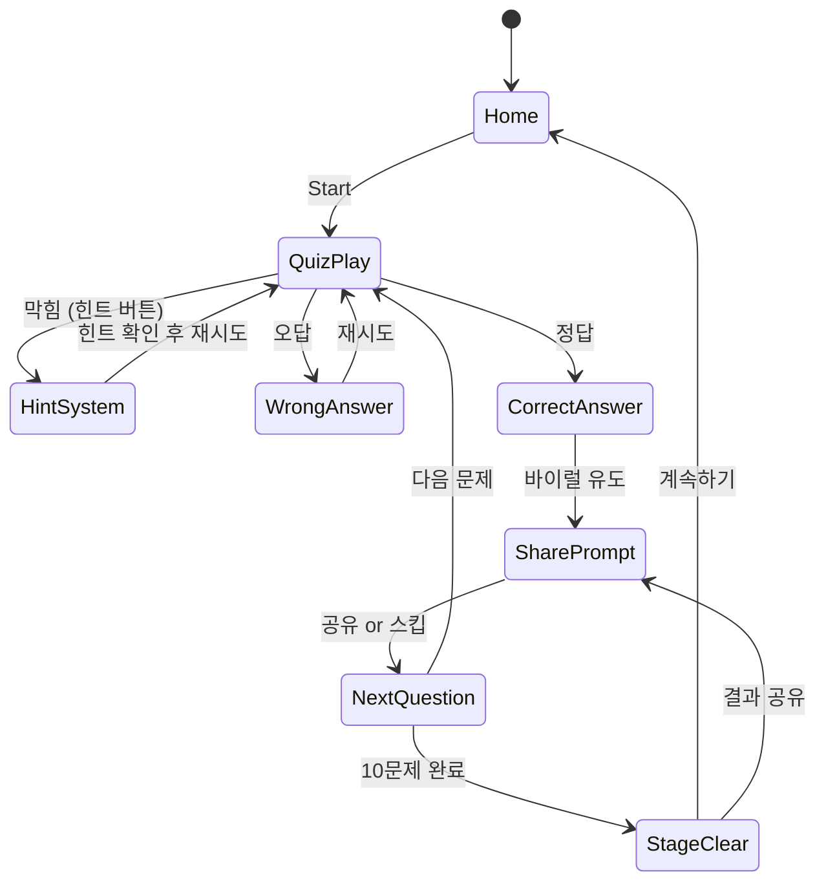
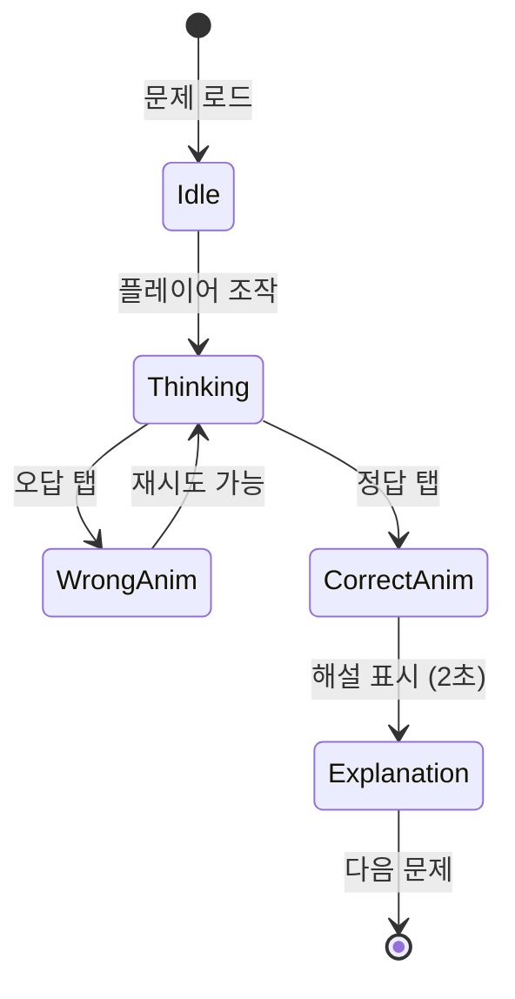

# Brain Puzzle: Tricky Quest

> 상식을 비틀어라. 생각대로 되지 않는 트릭 퀴즈 게임.

## 개요

뇌를 자극하는 트릭 문제들로 구성된 퀴즈 게임. 문제는 겉보기엔 쉬워 보이지만 실제 답은 예상을 완전히 벗어난다.
플레이어는 자신감 → 당황 → 깨달음 → 성취감의 감정 곡선을 경험하며 "한 문제만 더"를 반복하게 된다.
바이럴 공유와 힌트 광고를 핵심 수익 엔진으로 삼는다.

---

## 코어 메카닉

### 트릭 문제 시스템

- 각 문제는 **질문(텍스트/이미지) + 선택지 or 직접 입력** 형태
- 겉보기 답과 실제 정답이 다른 "트릭 레이어" 존재
- 트릭 유형:
  - **문자 그대로 읽기**: "이 문장에서 오류를 찾아라" → 정답이 문제 자체에 숨어 있음
  - **역발상**: 상식적으로 X인데 실제론 Y
  - **시각 함정**: 착시, 색깔, 크기 비교 오류 유도
  - **언어 유희**: 단어의 이중 의미, 맞춤법 트릭

### 답변 방식

| 유형 | 설명 | 예시 |
|------|------|------|
| 객관식 (4지선다) | 가장 빠른 직관 유도 → 트릭에 걸리기 쉬움 | "다음 중 가장 가벼운 것은?" |
| 숫자 직접 입력 | 계산 문제, 수 세기 | "알파벳 F는 몇 개인가?" |
| 텍스트 입력 | 단답형 | "이 문장의 오류는?" |
| 탭/드래그 | 화면 요소 직접 조작 | "더 큰 원을 눌러라" (실제로 없음) |

---

## 문제 카테고리

### 4대 카테고리

| 카테고리 | 설명 | 대표 트릭 예시 |
|----------|------|----------------|
| 👁️ **시각 트릭** | 착시, 크기/색상 오류 유도 | "어느 선이 더 길어 보이나?" → 실은 같음. 하지만 문제는 "더 짧은 선을 골라라" |
| 📝 **텍스트 함정** | 언어적 오류, 맞춤법, 문장 구조 | "다음 문장을 빠르게 읽어라: The the quick brown fox" → 'the'가 두 번 |
| ⚙️ **물리 퍼즐** | 무게, 속도, 자연법칙 반전 | "1kg 철과 1kg 솜털 중 무거운 것은?" → 같음 |
| 🔄 **상식 반전** | 당연하다고 생각한 상식이 틀림 | "하루는 몇 시간?" → "24시간이라고 쓴 것 자체가 정답" 류의 메타 트릭 |

### 카테고리별 문제 비율 (MVP 30문제 기준)

| 카테고리 | 문제 수 |
|----------|---------|
| 시각 트릭 | 8문제 |
| 텍스트 함정 | 8문제 |
| 물리 퍼즐 | 7문제 |
| 상식 반전 | 7문제 |

---

## 게임 플로우



### 문제 진행 상태



---

## 난이도 시스템

### 감정 곡선 설계 (핵심)

> 자신감 → 당황 → 깨달음 → 성취감 → "한 문제만 더" 루프

```
난이도
  ↑
5 │                    ★ 보스 문제 (정답률 5%)
4 │              ★ ★
3 │        ★ ★
2 │  ★ ★
1 │★
  └─────────────────→ 문제 번호
  1  2  3  4  5  6  7  8  9  10
```

| 구간 | 문제 번호 | 설명 | 정답률 목표 |
|------|-----------|------|-------------|
| Warm-up | 1~3 | 쉬운 트릭, 힌트 없이 풀 수 있음 | 70~90% |
| Mid | 4~7 | 진짜 트릭 시작, 당황 유발 | 40~60% |
| Hard | 8~9 | 고난이도, 힌트 유도 | 15~30% |
| Boss | 10 | 극단적 트릭, 바이럴 유발 | 5~15% |

### 스테이지 구성

- **1스테이지 = 10문제** (각 카테고리 혼합)
- MVP: 3스테이지 × 10문제 = 30문제
- 스테이지 클리어 보상: 별점 0~3개 (정답률 기반)

---

## 힌트 시스템

### 3단계 힌트 구조

| 단계 | 이름 | 내용 | 비용 |
|------|------|------|------|
| 힌트 1 | 방향 힌트 | "생각의 방향을 바꿔봐" 같은 추상적 가이드 | 광고 시청 or 코인 1개 |
| 힌트 2 | 범위 힌트 | 오답 선택지 1개 제거, 또는 "답은 숫자가 아니야" | 광고 시청 or 코인 2개 |
| 힌트 3 | 거의 답 | 답의 형태/첫 글자 공개, "정답은 선택지에 없어" | 광고 시청 or 코인 3개 |

### 힌트 경제

- **무료 힌트 코인**: 매일 3개 지급
- **힌트 광고**: 30초 광고 시청으로 코인 획득
- **코인 패키지**: IAP (아래 수익화 참고)

---

## UI 레이아웃

### 인게임 화면

```
┌─────────────────────────┐
│ ← 뒤로   ★★☆  ⚙️       │  ← 상단 바 (진행도 + 설정)
├─────────────────────────┤
│  📊 문제 3/10           │  ← 진행 표시
│  🔥 정답률 23%          │  ← 바이럴 후킹
├─────────────────────────┤
│                         │
│   ┌─────────────────┐   │
│   │  Q. 이 중에서   │   │
│   │  가장 가벼운    │   │  ← 문제 카드
│   │  것은?          │   │
│   └─────────────────┘   │
│                         │
│  [이미지 or 시각 요소]   │  ← 시각 트릭용 영역
│                         │
├─────────────────────────┤
│  A. 1kg 철  B. 1kg 깃털 │
│  C. 1kg 솜  D. 모두 같다│  ← 선택지 (4지선다)
├─────────────────────────┤
│  💡 힌트 (코인 1개)     │  ← 힌트 버튼
└─────────────────────────┘
```

### 정답/오답 피드백

```
┌─────────────────────────┐
│  ✅ 정답!               │
│  정답률: 23%            │
│  "대부분 틀리는 문제!   │
│   당신은 천재?"         │  ← 바이럴 카피
│                         │
│  [📤 공유하기]          │  ← SNS 공유 버튼
│  [▶ 다음 문제]          │
└─────────────────────────┘
```

```
┌─────────────────────────┐
│  ❌ 틀렸어요!           │
│  88%가 똑같이 틀렸어요! │  ← 위로 + 바이럴 후킹
│                         │
│  [💡 힌트 보기]         │
│  [🔄 다시 시도]         │
└─────────────────────────┘
```

---

## 바이럴 시스템

### 공유 트리거

| 상황 | 공유 카드 내용 |
|------|----------------|
| 정답 맞춤 | "나는 맞췄는데 정답률 5%래! 너는?" |
| 오답 후 정답 확인 | "나도 틀렸어... 이 문제 진짜 말도 안 됨 ㅋㅋ" |
| 스테이지 클리어 | "3스테이지 별 3개 클리어! 도전해봐" |
| 보스 문제 정답 | "이 문제 맞춘 사람이 전 세계 5%래" |

### 공유 카드 구조

```
┌─────────────────────────┐
│  🧠 Brain Puzzle        │
│  Tricky Quest           │
├─────────────────────────┤
│  Q. [문제 텍스트]        │
│                         │
│  [시각 요소/이미지]      │
├─────────────────────────┤
│  정답률: 5%             │
│  나는 맞췄다! ✅        │
│  (or 나도 틀렸다 😅)   │
├─────────────────────────┤
│  App Store 링크         │
└─────────────────────────┘
```

### 바이럴 카피 원칙

- 숫자로 후킹: "정답률 5%", "100명 중 3명만 맞춤"
- 자랑 욕구 자극: "나만 알고 싶었는데...", "천재 판별 테스트"
- FOMO: "이 문제 모르면 창피함 주의"

---

## 콘텐츠 생산 시스템

### 문제 DB 구조

```json
{
  "id": "q_001",
  "category": "text_trap",
  "difficulty": 3,
  "question": {
    "text": "다음 문장에서 오류를 찾아라: The the quick brown fox",
    "image_url": null,
    "interactive": false
  },
  "answer_type": "multiple_choice",
  "choices": ["문법 오류", "철자 오류", "단어 반복", "오류 없음"],
  "correct_index": 2,
  "explanation": "'the'가 두 번 연속으로 나왔지만, 줄 바꿈 때문에 눈에 안 띕니다.",
  "correct_rate": 0.23,
  "hint_1": "천천히, 아주 천천히 읽어봐",
  "hint_2": "줄이 바뀌는 부분을 봐",
  "hint_3": "같은 단어가 두 번 있어",
  "viral_copy_correct": "정답률 23%짜리 문제 맞춤! 🧠",
  "viral_copy_wrong": "나도 틀렸어... 줄바꿈에 숨어있었잖아 ㅋㅋ",
  "tags": ["attention", "reading", "classic"]
}
```

### 문제 추가 파이프라인

```
문제 제작 (구글 스프레드시트)
    ↓
검수 & 정답률 예측
    ↓
JSON 변환 스크립트
    ↓
CDN 업로드 (Firebase Storage or S3)
    ↓
앱 원격 업데이트 (코드 배포 없이 문제만 교체)
```

- **MVP**: 로컬 JSON 번들 (30문제)
- **v2**: 원격 JSON fetch, 주기적 업데이트
- **v3**: 유저 제출 문제 + 커뮤니티 검증

---

## 스코어링 시스템

| 이벤트 | 점수 |
|--------|------|
| 정답 (힌트 없음) | +300 |
| 정답 (힌트 1개 사용) | +200 |
| 정답 (힌트 2개 사용) | +100 |
| 정답 (힌트 3개 사용) | +50 |
| 첫 시도 정답 (No Mistake) | +100 보너스 |
| 스테이지 퍼펙트 (힌트 0) | +500 보너스 |

### 별점 기준 (스테이지당)

| 별점 | 조건 |
|------|------|
| ⭐⭐⭐ | 힌트 0개, 오답 0개 |
| ⭐⭐ | 힌트 2개 이하 |
| ⭐ | 클리어만 해도 |

---

## 수익화

### 힌트 광고 (핵심 수익원)

- 문제 막힐 때 자연스러운 광고 노출
- **리워드 광고**: 30초 시청 → 힌트 코인 1개
- 하루 최대 10회 광고 시청 허용
- 예상 eCPM: $5~15 (두뇌 퍼즐 유저 고관여)

### IAP 구성

| 상품 | 가격 | 내용 |
|------|------|------|
| 코인 소팩 | ₩1,200 | 힌트 코인 10개 |
| 코인 중팩 | ₩4,500 | 힌트 코인 50개 |
| 광고 제거 | ₩5,900 | 영구 광고 제거 |
| 문제팩 Vol.2 | ₩2,400 | 추가 30문제 (어려운 트릭) |
| 문제팩 Vol.3 | ₩2,400 | 추가 30문제 (시각 특화) |
| 올인원 패스 | ₩9,900 | 광고 제거 + 문제팩 전체 |

### 수익 모델 우선순위

1. **리워드 광고** (힌트 요청 시 즉시 노출, 전환율 높음)
2. **코인 IAP** (광고 보기 귀찮은 유저)
3. **문제팩 IAP** (게임에 빠진 헤비 유저)
4. **광고 제거** (장기 유저 유지)

---

## 사운드/이펙트

| 이벤트 | 사운드/이펙트 |
|--------|---------------|
| 문제 등장 | 슬라이드 인 + 경쾌한 벨소리 |
| 정답 | 짧고 강한 정답음 + 파티클 폭발 |
| 오답 | 버저음 + 화면 흔들림 |
| 힌트 열기 | 전구 켜지는 효과음 |
| 스테이지 클리어 | 팡파레 + 별 3개 애니메이션 |
| 보스 문제 등장 | 긴장감 있는 짧은 드럼롤 |

---

## MVP 범위

### Phase 1 (MVP — 1주 목표)

- [ ] 기획서 작성
- [ ] 문제 JSON 30개 제작 (카테고리별 분배)
- [ ] 기본 퀴즈 UI (문제 카드 + 4지선다)
- [ ] 정답/오답 판정 + 피드백 애니메이션
- [ ] 3단계 힌트 시스템 (광고 연동 없이 무료로 MVP)
- [ ] 스테이지 진행 (10문제 × 3스테이지)
- [ ] 간단한 스코어링 + 별점

### Phase 2

- [ ] 리워드 광고 연동 (힌트 코인)
- [ ] SNS 공유 카드 생성 (이미지 캡처)
- [ ] 정답률 실시간 표시 (Firebase)
- [ ] IAP 문제팩

### Phase 3

- [ ] 원격 문제 업데이트 (JSON CDN)
- [ ] 유저 정답률 기반 난이도 자동 조정
- [ ] 리더보드 (스테이지 최고 점수)
- [ ] 데일리 챌린지 문제

---

## 샘플 문제 30개 목록

### 시각 트릭 (8문제)

| # | 문제 | 정답 | 트릭 포인트 |
|---|------|------|-------------|
| V1 | "어느 선이 더 길어?" (뮬러-라이어 착시) | 같음 | 착시 |
| V2 | "이 두 색은 같은가?" (체스판 착시) | 같음 | 명암 대비 |
| V3 | "원이 몇 개?" (숨겨진 원 포함) | 예상보다 많음 | 주의력 |
| V4 | "A, B 중 큰 원은?" | 같음 | 에빙하우스 착시 |
| V5 | "이 사진에서 고양이를 찾아라" | 없음 | 없는 것 찾기 |
| V6 | "숫자 몇 개?" (겹친 숫자 포함) | 예상보다 많음 | 주의력 |
| V7 | "이 글자는 몇 번 깜빡였나?" | 실제 횟수 | 집중력 |
| V8 | "더 큰 정사각형을 눌러라" | 같음 | 원근법 착시 |

### 텍스트 함정 (8문제)

| # | 문제 | 정답 | 트릭 포인트 |
|---|------|------|-------------|
| T1 | "Paris in the the spring" 오류는? | 'the' 두 번 | 줄바꿈 함정 |
| T2 | "이 문장은 몇 단어?" (단어 세기) | 예상보다 많음 | 속독 함정 |
| T3 | "F는 몇 개? FINISHED FILES ARE THE RESULT..." | 6개 | 'of' 속 F 누락 |
| T4 | "다음 알파벳의 다음은? A B C D E F ?" | G | 너무 쉬워서 의심 유발 |
| T5 | "이 문제를 읽지 마시오" + 선택지 | 읽음 | 메타 함정 |
| T6 | "1+1=?" (단, 여기서 1은 '일'입니다) | 이 | 언어 함정 |
| T7 | "문제를 3번 읽고 9번 문제를 푸세요" → 9번 없음 | 없음 | 지시 함정 |
| T8 | "밑줄 친 단어를 고르시오" → 밑줄 없음 | 없음 | 형식 함정 |

### 물리 퍼즐 (7문제)

| # | 문제 | 정답 | 트릭 포인트 |
|---|------|------|-------------|
| P1 | "1kg 철 vs 1kg 솜, 무거운 것?" | 같음 | 클래식 트릭 |
| P2 | "30m/s로 달리는 기차 안에서 30m/s로 앞으로 던진 공의 속도?" | 60m/s | 상대속도 |
| P3 | "구멍을 파면 흙은 어디 가나?" | 구멍 밖 | 당연한 것 |
| P4 | "빛이 없는 방에서 성냥 하나 있을 때 먼저 켤 것은?" | 성냥 | 순서 함정 |
| P5 | "비행기가 컨베이어 벨트 위에서 이륙 가능?" | 가능 | 물리 오해 |
| P6 | "닭이 먼저냐 달걀이 먼저냐?" | 달걀 (공룡 달걀) | 상식 반전 |
| P7 | "얼음이 녹으면 물의 부피는?" | 줄어든다 | 밀도 차이 |

### 상식 반전 (7문제)

| # | 문제 | 정답 | 트릭 포인트 |
|---|------|------|-------------|
| C1 | "모든 달의 일수를 더하면?" | 365 | 당연히 알지만 계산 안 함 |
| C2 | "모세의 방주에 동물 몇 쌍?" | 노아의 방주 | 모세 함정 |
| C3 | "영국에서 7월 4일 독립기념일?" | 있음 (날짜는 있음) | 미국 독립기념일 혼동 |
| C4 | "남극에 곰이 있나?" | 없음 | 북극 혼동 |
| C5 | "전화기 발명가?" | 논쟁 있음 | 벨 vs 무치 |
| C6 | "사람은 몇 %의 뇌만 사용?" | 100% | 10% 미신 |
| C7 | "금붕어 기억력은 3초?" | 거짓 | 수 개월 기억 |
