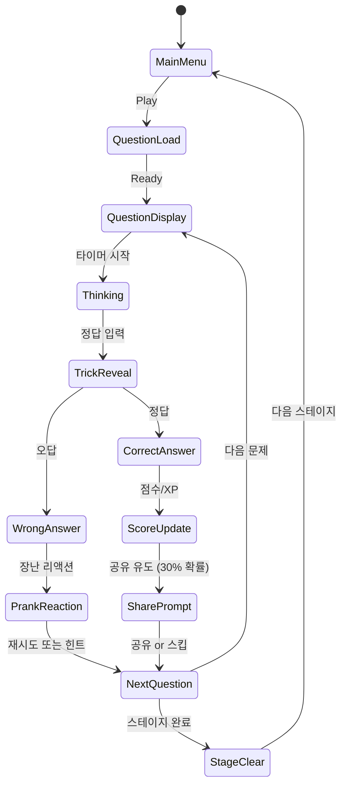

# Brainy Prankster

> 넌센스와 트릭을 활용한 두뇌 게임. 상식을 비틀어 플레이어를 웃기고 당황시키는 인터랙티브 퍼즐.

**레퍼런스 순위**: #72 | **장르**: brain-logic | **개발사**: TheSunStudio | **평점**: 4.7

---

## 개요

플레이어에게 얼핏 쉬워 보이지만 상식을 비틀거나 숨겨진 인터랙션이 요구되는 트릭 문제를 제시한다.
문제를 풀 때 "아!" 하는 유레카 모먼트와 "이게 뭐야!" 하는 당혹감이 교차하며 SNS 공유를 유도한다.

### 포지셔닝 (두뇌 퍼즐 4종 비교)

| 항목 | #8 (IQ Logic) | #15 (Math Blast) | #57 (Word Twist) | #72 Brainy Prankster |
|------|--------------|-----------------|-----------------|----------------------|
| 핵심 재미 | 논리 추론 | 수학 연산 | 단어 연상 | **넌센스 트릭 + 장난** |
| 플레이 시간 | 2~5분 | 1~3분 | 3~7분 | **30초~2분 (숏폼)** |
| 바이럴성 | 낮음 | 중간 | 중간 | **매우 높음** |
| 연령층 | 성인 | 전연령 | 성인 | **전연령 (특히 10~30대)** |
| 재도전 욕구 | 보통 | 보통 | 높음 | **매우 높음** |
| 소셜 공유 | 낮음 | 낮음 | 중간 | **핵심 드라이버** |

**결론**: Brainy Prankster는 4개 두뇌 퍼즐 중 **바이럴 잠재력이 가장 높다**.
숏폼 콘텐츠(TikTok/Shorts) 친화적 구조로 CPI 최저화 가능.

---

## 코어 메카닉

### 트릭 문제 유형 (5가지)

#### Type A: 시각 트릭 (Visual Trick)
- 보이는 것과 다른 답이 존재
- 예: "다음 중 가장 큰 것은?" → 화면 밖에 있는 숨겨진 요소가 정답
- 조작: 화면 스크롤, 드래그, 멀리 보기

#### Type B: 텍스트 트릭 (Text Trap)
- 문제 자체에 답이 숨어있음
- 예: "이 문장에서 'A'는 몇 개?" → 문제 텍스트 포함 카운트
- 조작: 텍스트 탭, 단어 선택

#### Type C: 물리 인터랙션 (Physics Prank)
- 게임 물리/UI를 이용한 트릭
- 예: "컵에 물을 채워라" → 실제로 폰을 기울여야 함 (자이로센서)
- 조작: 기울이기, 흔들기, 화면 길게 누르기

#### Type D: 숨겨진 오브젝트 (Hidden Object)
- 화면 어딘가에 숨어있는 요소를 찾아야 함
- 예: "고양이 7마리를 찾아라" → 일부는 다른 오브젝트 뒤/UI 안에 숨어있음
- 조작: 핀치줌, 이동, 오브젝트 이동

#### Type E: 역발상 문제 (Reverse Logic)
- 일반적인 게임 상식을 뒤엎는 문제
- 예: "이 게임에서 지려면?" → 의도적으로 틀려야 통과
- 조작: 의도적 오답 선택, 아무것도 안 하기

### 장난 요소 (Prank Layer)

각 문제마다 1가지 "장난" 요소를 추가하여 공유 욕구 극대화:

| 장난 유형 | 설명 | 공유 트리거 |
|----------|------|------------|
| 폭탄 타이머 | 시간 내 못 풀면 화면이 "폭발" | "친구도 폭발시켜봐" |
| 오답 리액션 | 틀리면 캐릭터가 과장된 반응 | 리액션 GIF 공유 |
| 힌트 낚시 | 힌트가 오히려 혼란스러움 | "힌트도 트릭이었다!" |
| 연속 트릭 | 답을 맞춰도 또 다른 트릭 등장 | 두 번 당하는 경험 |

---

## 게임 플로우



---

## UI 레이아웃

```
┌─────────────────────────────────┐
│  ❓ Q.12/20    ⏱ 15s  ⭐ 1,240  │  ← 상단 HUD
├─────────────────────────────────┤
│                                 │
│   "다음 중 짝수는?"              │  ← 문제 텍스트
│                                 │
│  ┌──────────┐  ┌──────────┐    │
│  │    2     │  │    4     │    │  ← 선택지 버튼
│  └──────────┘  └──────────┘    │
│  ┌──────────┐  ┌──────────┐    │
│  │    6     │  │   짝수   │    │  ← 정답: "짝수" 텍스트 자체
│  └──────────┘  └──────────┘    │
│                                 │
│         [힌트 광고 보기]         │  ← 힌트 CTA
└─────────────────────────────────┘
```

### 오답 리액션 화면

```
┌─────────────────────────────────┐
│         😱 WRONG!               │
│                                 │
│   [캐릭터 과장 리액션 애니메]     │
│                                 │
│   "정말요?! 다시 생각해봐요!"    │
│                                 │
│  [재도전]      [힌트 광고 보기]  │
└─────────────────────────────────┘
```

---

## 스코어링 시스템

| 액션 | 점수 |
|------|------|
| 정답 (힌트 없이) | +200 |
| 정답 (힌트 사용) | +50 |
| 제한 시간 내 정답 | +시간 보너스 (남은초 × 5) |
| 연속 정답 (콤보) | +100 × 콤보 수 |
| 스테이지 클리어 | +500 |
| 오답 | 0 (감점 없음, 재시도 가능) |

### 레벨 시스템

- 누적 XP 기반 레벨업
- 레벨업 시 무료 힌트 토큰 지급
- 리더보드: 주간/전체 랭킹 (소셜 공유 유도)

---

## 난이도 설계

| 스테이지 | 문제 수 | 제한시간(초) | 트릭 유형 | 오답 패널티 |
|---------|---------|------------|---------|------------|
| 1-5 | 10 | 30 | A, B (쉬움) | 없음 |
| 6-10 | 15 | 25 | A, B, C | 힌트 코스트 증가 |
| 11-15 | 15 | 20 | A~D | 재시도 광고 |
| 16-20 | 20 | 15 | A~E (하드) | 재시도 광고 |
| 보너스 | 5 | 10 | 랜덤 믹스 | 최고점 도전 |

---

## 콘텐츠 파이프라인

### 문제 DB 구조

```json
{
  "id": "q_001",
  "type": "text_trap",
  "difficulty": 1,
  "question": "이 문장에 있는 숫자는?",
  "hint": "문제 자체를 잘 봐요",
  "answer_type": "tap_object",
  "correct_answer": "question_text",
  "wrong_answers": ["1개", "2개", "0개"],
  "prank_type": "text_highlight",
  "share_template": "나는 {attempt}번 만에 맞췄어! 너는?",
  "tags": ["text", "beginner", "viral"]
}
```

### 초기 콘텐츠 볼륨 (MVP)

| 카테고리 | 문제 수 | 스테이지 |
|---------|---------|---------|
| 시각 트릭 | 40 | 1~8 |
| 텍스트 트릭 | 30 | 1~6 |
| 물리 인터랙션 | 20 | 5~12 |
| 숨겨진 오브젝트 | 30 | 4~10 |
| 역발상 | 20 | 8~20 |
| **합계** | **140** | **20 스테이지** |

### 업데이트 주기

| 주기 | 콘텐츠 | 목적 |
|------|--------|------|
| 주 1회 | 신규 문제 5~10개 | 리텐션 유지 |
| 월 1회 | 시즌 이벤트 팩 (20문제) | 재참여 유도 |
| 격월 | 협업 팩 (IP 컬래버) | 신규 유저 획득 |

> **핵심**: 문제 DB는 JSON 파일로 원격 업데이트 가능하도록 설계. 앱 업데이트 없이 콘텐츠 추가.

---

## 바이럴 마케팅 전략 (저CPI 달성)

### 핵심 전략: "당해봐야 안다" 공유 루프

```
플레이어 당함 → 분노/웃음 → 친구에게 공유 → 친구도 당함 → 반복
```

### TikTok/Shorts 전용 설계

1. **문제 자체가 영상 콘텐츠**: 문제 풀이 과정을 스크린 레코딩하면 자연스럽게 바이럴
2. **리액션 유도 UI**: 틀렸을 때 과장된 애니메이션 → 리액션 영상 소재
3. **챌린지 포맷**: "10초 안에 풀어봐" 챌린지 → 해시태그 캠페인

### 공유 트리거 설계

| 트리거 | 발생 시점 | 공유 메시지 |
|-------|---------|------------|
| 오답 N회 | 3번 틀렸을 때 | "나 {N}번이나 틀렸어 ㅋㅋ 너도 해봐" |
| 스테이지 클리어 | 클리어 직후 | "드디어 {스테이지} 클리어! 평균 시도 {N}회" |
| 최고점 갱신 | 신기록 시 | "새 기록: {점수}점! 이길 수 있어?" |
| 랭킹 진입 | 상위 10% 진입 | "상위 10% 천재 인증 🧠" |

### CPI 목표

- **타겟**: $0.30~0.50 (두뇌 퍼즐 장르 평균 $1.20 대비 -70%)
- **달성 방법**: UGC(사용자 생성 콘텐츠) 중심 → 유료 광고 최소화
- **주요 채널**: TikTok (40%), YouTube Shorts (30%), 카카오톡 공유 (30%)

---

## 수익화 전략

### 힌트 광고 시스템 (핵심 수익원)

```
힌트 요청 → 광고 시청 (15~30초) → 힌트 지급
→ 오답 → 재도전 광고 (선택) → 재시도 가능
```

| 광고 유형 | 발생 빈도 | 예상 단가 | 월 수익 기여 |
|---------|---------|---------|------------|
| 힌트 리워드 광고 | 문제당 최대 1회 | $0.02~0.05 | 40% |
| 재도전 광고 | 스테이지당 최대 2회 | $0.02~0.04 | 35% |
| 인터스티셜 | 스테이지 클리어 시 | $0.01~0.02 | 25% |

### 문제 팩 (IAP)

| 팩 | 내용 | 가격 |
|----|------|------|
| 힌트 팩 | 힌트 토큰 × 30 | $0.99 |
| 시즌 팩 | 시즌 전용 문제 20개 | $1.99 |
| 무광고 패스 | 광고 제거 + 힌트 × 10/일 | $2.99/월 |
| 올인원 | 모든 팩 + 영구 무광고 | $9.99 |

### 수익 목표

| 월차 | MAU | ARPU | 월 매출 |
|-----|-----|------|--------|
| 1개월 | 50,000 | $0.15 | $7,500 |
| 2개월 | 200,000 | $0.20 | $40,000 |
| 3개월 | 500,000 | $0.25 | $125,000 |

---

## MVP 범위

### Phase 1 - MVP (1주차)
- [x] 기획서 작성
- [ ] 트릭 문제 타입 A, B (시각/텍스트) 구현
- [ ] 기본 타이머 + 정오답 판정
- [ ] 오답 리액션 애니메이션 (5종)
- [ ] 힌트 광고 연동 (AdMob)
- [ ] 20문제 (스테이지 1~4)

### Phase 2 - 바이럴 기능 (2주차)
- [ ] 공유 시스템 (스크린샷 + 메시지)
- [ ] 트릭 문제 타입 C, D 추가
- [ ] 리더보드 (주간 랭킹)
- [ ] 문제 DB 원격 업데이트 구조
- [ ] 140문제 (스테이지 1~20)

### Phase 3 - 수익화 최적화
- [ ] IAP 시스템 (힌트 팩, 무광고)
- [ ] 트릭 문제 타입 E (역발상)
- [ ] 시즌 이벤트 시스템
- [ ] A/B 테스트 프레임워크

---

## 두뇌 퍼즐 4종 단일 앱 통합 전략

### 통합 앱 컨셉: "Brain Arena"

4개 게임(#8 IQ Logic, #15 Math Blast, #57 Word Twist, #72 Brainy Prankster)을 단일 앱으로 묶되, 각 게임이 독립적으로 플레이 가능한 구조.

```
Brain Arena
├── IQ Logic (#8)      - 논리 추론
├── Math Blast (#15)   - 수학 연산
├── Word Twist (#57)   - 단어 연상
└── Brainy Prankster (#72) - 넌센스 트릭  ← 가장 바이럴
```

### 통합의 장점

| 항목 | 개별 앱 4개 | Brain Arena 단일 앱 |
|------|-----------|-------------------|
| ASO 비용 | 4배 | 1배 |
| 유저 획득 비용 | 분산됨 | 집중 가능 |
| 리텐션 | 각 게임 단독 | 게임 간 교차 플레이로 향상 |
| 수익화 | 분산 | 크로스-업셀 가능 |
| 개발 비용 | 공통 인프라 재사용 | 최대 재사용 |

### 통합 수익화 시너지

- Brainy Prankster로 신규 유저 유입 (바이럴)
- 유입된 유저에게 다른 두뇌 게임 교차 추천
- 프리미엄 구독 1개로 4개 게임 모두 무광고

---

## 사운드/이펙트

- 문제 등장: "두둥" 효과음
- 정답: 짧고 경쾌한 승리음 + 파티클
- 오답: 과장된 "삐에에에!" + 캐릭터 리액션
- 타이머 경고: 심장박동 효과음 (5초 남았을 때)
- 스테이지 클리어: 팡파레 + 별 3개 애니메이션
- 공유 성공: 소셜 알림음

---

## 기술 구현 노트 (lib → web → rn 파이프라인)

### lib/brainy-prankster
- 문제 엔진: 타입별 인터랙션 핸들러
- 자이로센서 이벤트 (물리 트릭)
- 타이머 관리
- 점수/XP 계산

### web/brainy-prankster
- Phaser.io 씬: QuestionScene, ReactionScene, ResultScene
- Stitches 기반 UI 오버레이
- AdMob 웹뷰 브릿지

### brainy-prankster/rn
- WebView 래핑
- 자이로센서 네이티브 브릿지 (타입 C 문제 필수)
- 소셜 공유 네이티브 API
- 인앱 결제 (IAP)
