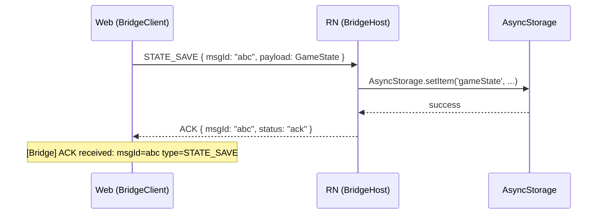

# WebView Bridge Protocol

> Web(Phaser.io) ↔ RN WebView 간 상태 저장 및 네이티브 기능 호출을 위한 브릿지 프로토콜

## 개요

found3 게임은 WebView 안에서 실행되며, 게임 상태(스테이지 진행, 코인, 아이템 등)를 RN 앱의 AsyncStorage에 영속 저장해야 한다. 이 프로토콜은 Web ↔ RN 간 메시지 규격, ACK 플로우, 폴백 전략을 정의한다.

## 1. 메시지 포맷

### Web → RN

```typescript
interface BridgeMessage {
  type: string;       // 메시지 타입 (아래 정의)
  payload: any;       // 메시지별 데이터
  msgId: string;      // 고유 ID (uuid v4 또는 nanoid)
  timestamp: number;  // Date.now()
}
```

전송 방식: `window.ReactNativeWebView.postMessage(JSON.stringify(message))`

### RN → Web

```typescript
interface BridgeResponse {
  type: string;                    // 응답 메시지 타입
  msgId: string;                   // 원본 메시지의 msgId
  status: 'ack' | 'error';        // 처리 결과
  payload?: any;                   // 데이터 응답 시 포함
  error?: string;                  // status='error' 시 에러 메시지
  timestamp: number;               // Date.now()
}
```

전송 방식: `webViewRef.current.injectJavaScript(`window.__bridgeReceive(${json})`)`

## 2. 메시지 타입 정의

### Web → RN (요청)

| Type | Payload | 설명 |
|------|---------|------|
| `STATE_SAVE` | `GameState` | 게임 상태 전체 저장 요청 |
| `STATE_LOAD` | `{}` | 저장된 상태 로드 요청 |
| `LEADERBOARD_SAVE` | `LeaderboardEntry` | 리더보드 기록 저장 |
| `LEADERBOARD_LOAD` | `{ limit?: number }` | 리더보드 로드 요청 |
| `AD_REQUEST` | `{ adType: 'rewarded' }` | 광고 시청 요청 (아이템 충전용) |
| `HAPTIC` | `{ style: 'light' \| 'medium' \| 'heavy' }` | 진동 요청 |

### RN → Web (응답/이벤트)

| Type | Payload | 설명 |
|------|---------|------|
| `ACK` | `{}` | 단순 수신 확인 (STATE_SAVE, HAPTIC 등) |
| `STATE_LOADED` | `GameState \| null` | 저장된 상태 전달 (없으면 null) |
| `LEADERBOARD_LOADED` | `LeaderboardEntry[]` | 리더보드 데이터 전달 |
| `AD_COMPLETE` | `{ rewarded: boolean }` | 광고 시청 완료 (보상 수령 여부) |

### 요청-응답 매핑

```
STATE_SAVE       → ACK
STATE_LOAD       → STATE_LOADED
LEADERBOARD_SAVE → ACK
LEADERBOARD_LOAD → LEADERBOARD_LOADED
AD_REQUEST       → AD_COMPLETE
HAPTIC           → ACK
```

## 3. 상태 스키마

### GameState

```typescript
interface GameState {
  currentStage: number;
  coins: number;
  itemCounts: {
    shuffle: number;
    undo: number;
    magnet: number;
  };
  stagesCleared: number[];
  totalPlayTimeMs: number;
}
```

### LeaderboardEntry

```typescript
interface LeaderboardEntry {
  stage: number;
  score: number;
  clearTimeMs: number;
  timestamp: number;
}
```

### 초기값 (첫 실행 시)

```typescript
const DEFAULT_GAME_STATE: GameState = {
  currentStage: 1,
  coins: 0,
  itemCounts: { shuffle: 3, undo: 3, magnet: 1 },
  stagesCleared: [],
  totalPlayTimeMs: 0,
};
```

## 4. ACK 플로우

### 시퀀스



### ACK 규칙

1. **모든 Web→RN 메시지에 unique `msgId` 부여** (nanoid 권장)
2. **RN은 메시지 수신 시 반드시 응답** (ACK 또는 데이터 응답)
3. **ACK 타임아웃: 3초**
   - 타임아웃 시 웹에서 1회 자동 재전송
   - 재전송 후에도 타임아웃 시 에러 콜백 호출
4. **웹 로그 출력**:
   - ACK 수신: `[Bridge] ACK received: msgId=abc type=STATE_SAVE`
   - 타임아웃: `[Bridge] ACK timeout: msgId=abc type=STATE_SAVE (retry 1/1)`
   - 에러: `[Bridge] Error: msgId=abc error="storage full"`
5. **디버그 모드** (`bridgeDebug: true`):
   - 송신: `[Bridge] >>> type=STATE_SAVE msgId=abc payload={...}`
   - 수신: `[Bridge] <<< type=ACK msgId=abc status=ack`

## 5. 웹 단독 실행 (폴백)

RN WebView 없이 브라우저에서 직접 실행 시 localStorage로 폴백한다.

### 분기 조건

```typescript
const isRN = typeof window.ReactNativeWebView !== 'undefined';
```

### 폴백 동작

| 메시지 | RN 환경 | 브라우저 폴백 |
|--------|---------|---------------|
| `STATE_SAVE` | AsyncStorage 저장 | localStorage.setItem |
| `STATE_LOAD` | AsyncStorage 로드 | localStorage.getItem |
| `LEADERBOARD_SAVE` | AsyncStorage 저장 | localStorage.setItem |
| `LEADERBOARD_LOAD` | AsyncStorage 로드 | localStorage.getItem |
| `AD_REQUEST` | RN 광고 SDK 호출 | 즉시 `{ rewarded: true }` 응답 (개발용) |
| `HAPTIC` | RN Haptics API | 무시 (no-op) |

폴백 시에도 동일한 ACK 플로우를 유지하여 웹 코드의 분기를 최소화한다.

## 6. AsyncStorage 키 구조

```
@found3/gameState       → JSON.stringify(GameState)
@found3/leaderboard     → JSON.stringify(LeaderboardEntry[])
```

## 7. 에러 처리

| 상황 | RN 응답 | 웹 처리 |
|------|---------|---------|
| AsyncStorage 쓰기 실패 | `{ status: 'error', error: 'storage_full' }` | 유저에게 저장 실패 토스트 표시 |
| 알 수 없는 메시지 타입 | `{ status: 'error', error: 'unknown_type' }` | 경고 로그 출력 |
| JSON 파싱 실패 | 무시 (RN 측 에러 로그) | - |
| ACK 타임아웃 (재전송 후) | - | 에러 콜백, 로컬 캐시 유지 |

## 8. 연동 계획

| Phase | 담당팀 | 작업 | 산출물 |
|-------|--------|------|--------|
| Phase 1 | Game Core | BridgeClient 구현 | `lib/found3/src/bridge/` |
| Phase 2 | Web Frontend | BridgeClient 초기화 + Phaser 연동 | `web/found3/src/bridge.ts` |
| Phase 3 | RN App | BridgeHost 구현 (메시지 수신 + AsyncStorage) | `found3/rn/src/bridge/` |
| Phase 4 | 전체 | 통합 테스트 (ACK 로그 확인) | 테스트 시나리오 문서 |

### Phase 1 상세 (Game Core - BridgeClient)

```
lib/found3/src/bridge/
├── types.ts          # 메시지/상태 타입 정의
├── BridgeClient.ts   # 메시지 송수신, ACK 관리, 타임아웃
└── index.ts          # public API export
```

- `BridgeClient.send(type, payload): Promise<BridgeResponse>` — 메시지 전송 + ACK 대기
- `BridgeClient.saveState(state: GameState): Promise<void>`
- `BridgeClient.loadState(): Promise<GameState | null>`
- `BridgeClient.saveLeaderboard(entry: LeaderboardEntry): Promise<void>`
- `BridgeClient.loadLeaderboard(limit?: number): Promise<LeaderboardEntry[]>`
- `BridgeClient.requestAd(): Promise<{ rewarded: boolean }>`
- `BridgeClient.haptic(style): void`
- 내부적으로 `isRN` 분기하여 localStorage 폴백 자동 처리

### Phase 3 상세 (RN App - BridgeHost)

```
found3/rn/src/bridge/
├── BridgeHost.ts     # onMessage 핸들러, AsyncStorage CRUD
└── types.ts          # (lib에서 공유하거나 복사)
```

- WebView `onMessage` 이벤트에서 메시지 파싱
- 타입별 핸들러 라우팅
- AsyncStorage 읽기/쓰기
- `injectJavaScript`로 응답 전송

## MVP 범위

### 포함

- STATE_SAVE / STATE_LOAD / STATE_LOADED
- ACK 플로우 + 타임아웃
- localStorage 폴백
- 디버그 로그

### 후순위

- LEADERBOARD_SAVE / LEADERBOARD_LOAD
- AD_REQUEST / AD_COMPLETE
- HAPTIC
