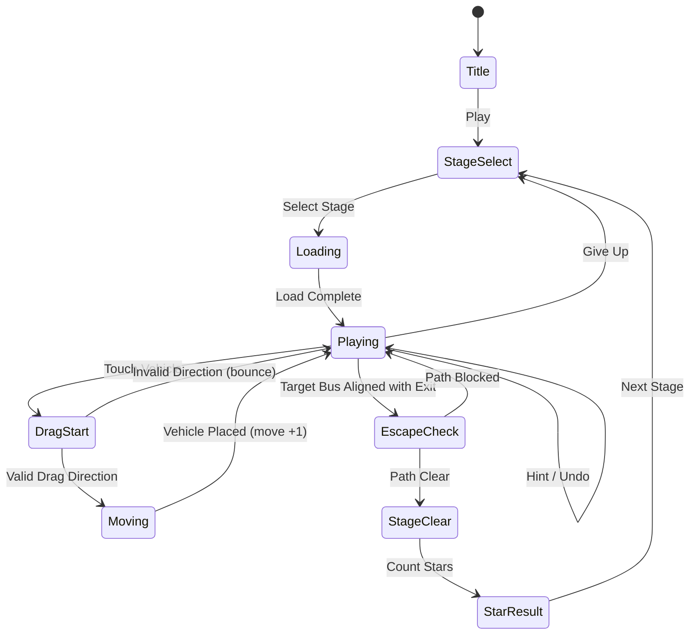

# 버스 탈출 - 교통 체증

> 주차/탈출 컨셉의 슬라이딩 퍼즐. 그리드 위 차량을 밀어 버스를 출구로 탈출시켜라.

## 개요

6×6 그리드 보드 위에 버스와 차량들이 배치되어 있다. 플레이어는 차량을 앞뒤로 밀어 길을 만들고, **타겟 버스(빨간 버스)**를 오른쪽 출구로 탈출시키면 스테이지 클리어. 이동 횟수가 적을수록 높은 별점을 획득한다.

레퍼런스: Rush Hour, Unblock Me, Traffic Escape

---

## 게임 규칙

### 기본 규칙

- 보드 크기: 4×4 (초급) / 5×5 (중급) / 6×6 (고급)
- 타겟 차량: **빨간 버스 (1×2)** — 항상 수평 방향, 출구 행에 배치
- 출구: 보드 오른쪽 벽 특정 행의 개구부
- 차량은 자신의 **이동 방향(수평 또는 수직)으로만** 슬라이드 가능
- 다른 차량이나 벽을 통과 불가
- 타겟 버스가 출구까지 직선 이동 가능하면 **자동 클리어 연출** 실행

### 이동 규칙

- 터치 드래그 방향으로만 차량 이동 (수평 차량: 좌우만, 수직 차량: 상하만)
- 이동 가능한 최대 거리까지 슬라이드 (중간 경로에 다른 차량 있으면 정지)
- 잘못된 방향 드래그 시 차량 흔들림(bounce) 피드백
- 이동할 때마다 이동 카운터 +1

---

## 차량 타입

| 타입 | 크기 | 방향 | 설명 |
|------|------|------|------|
| 버스 (타겟) | 1×2 | 수평 | 빨간색, 탈출 목표 |
| 소형차 | 1×2 | 수평/수직 | 가장 흔한 타입 |
| 트럭 | 1×3 | 수평/수직 | 이동 제약 큼 |
| 미니버스 | 1×2 | 수평 | 중형, 시각적 다양성 |
| SUV | 1×2 | 수직 | 세로 배치 차단 |

> **구현 우선순위**: MVP는 버스(1×2 수평) + 소형차(1×2 수평/수직) + 트럭(1×3 수평/수직)만으로 충분

---

## 게임 플로우



---

## UI 레이아웃

```
┌─────────────────────────────┐
│  ← Back   Stage 12   ⭐⭐⭐  │  ← 상단 HUD
│           이동: 14          │
├─────────────────────────────┤
│                             │
│  ┌───┬───┬───┬───┬───┬───┐  │
│  │   │ ▲ │   │   │   │   │  │
│  ├───┼───┼───┼───┼───┼───┤  │
│  │←→ │ ▼ │   │←←←←←←│   │  │  ← 게임 보드
│  ├───┼───┼───┼───┼───┼───┤  │    (6×6 그리드)
│  │   │   │ ▲ │[BUS→→] │▶▶│  │  ← 출구(▶▶)
│  ├───┼───┼───┼───┼───┼───┤  │
│  │   │←→ │ ▼ │   │   │   │  │
│  ├───┼───┼───┼───┼───┼───┤  │
│  │   │   │   │←←←←←←│   │  │
│  └───┴───┴───┴───┴───┴───┘  │
│                             │
├─────────────────────────────┤
│  💡 힌트  ↩️ 되돌리기  🔄 리셋 │  ← 액션 버튼
└─────────────────────────────┘
```

### 색상 코드 (차량 구분)

| 차량 | 색상 |
|------|------|
| 타겟 버스 | 빨간색 (#E74C3C) |
| 소형차 | 파란계열, 초록계열, 노란계열 랜덤 |
| 트럭 | 주황색 계열 |
| 보드 배경 | 회색 아스팔트 텍스처 |
| 출구 | 흰색 화살표 + 초록 테두리 |

---

## 스코어링 & 스타 시스템

### 스타 기준 (퍼즐별 최적 이동 횟수 기준)

| 별점 | 조건 |
|------|------|
| ⭐⭐⭐ | 최적 이동 횟수 × 1.2 이하 |
| ⭐⭐ | 최적 이동 횟수 × 1.5 이하 |
| ⭐ | 클리어만 (이동 횟수 무관) |

> 예: 최적 이동 12회 → 3스타 ≤14회, 2스타 ≤18회, 1스타 제한 없음

### 스테이지 클리어 점수

| 항목 | 점수 |
|------|------|
| 클리어 기본 | +500 |
| 3스타 보너스 | +300 |
| 2스타 보너스 | +150 |
| 힌트 미사용 보너스 | +200 |
| 초과 이동당 패널티 | -10/회 |

---

## 난이도 설계

### 보드 크기 × 차량 수

| 단계 | 보드 | 차량 수 | 최적 이동 | 설명 |
|------|------|---------|-----------|------|
| 입문 (1~10) | 4×4 | 3~5대 | 5~10회 | 튜토리얼, 1~2단계 이동 |
| 초급 (11~20) | 5×5 | 5~7대 | 8~15회 | 기본 패턴 학습 |
| 중급 (21~35) | 6×6 | 7~10대 | 12~20회 | 트럭 등장, 체인 이동 필요 |
| 고급 (36~50) | 6×6 | 10~14대 | 18~30회 | 복잡한 연쇄 이동 |

### 난이도 파라미터

- **차량 밀도**: 보드 셀 대비 차량 점유율 (MVP 기준: 40~65%)
- **최소 이동 깊이**: BFS로 계산한 최적해 이동 횟수
- **간섭 차량 수**: 타겟 버스 경로 직접 차단 차량 수

---

## 퍼즐 생성

### MVP: 수동 디자인 (50개)

MVP에서는 **수동으로 디자인된 50개 퍼즐**을 사용한다. 퍼즐 품질과 난이도 곡선을 정밀하게 제어할 수 있어 초기 출시에 적합하다.

```typescript
// 퍼즐 데이터 포맷 (lib/bus-escape/puzzles.ts)
interface Vehicle {
  id: string;
  row: number;      // 0-indexed
  col: number;      // 0-indexed
  length: 2 | 3;   // 1×2 또는 1×3
  direction: 'H' | 'V';  // Horizontal / Vertical
  isTarget: boolean;
}

interface Puzzle {
  id: number;
  boardSize: 4 | 5 | 6;
  exitRow: number;   // 타겟 버스 행 (출구 위치)
  vehicles: Vehicle[];
  optimalMoves: number;  // BFS 검증값
  difficulty: 'easy' | 'normal' | 'hard' | 'expert';
}
```

### Phase 2: 알고리즘 자동 생성

1. **역방향 생성**: 클리어 상태에서 역으로 차량을 추가하여 퍼즐 생성
2. **BFS 검증**: 최적 이동 횟수 계산 및 난이도 필터링
3. **품질 필터**:
   - 유일해(unique solution) 검증
   - 최소 이동 횟수 범위 내 퍼즐만 통과
   - 단조 패턴(너무 단순한 배치) 제외

---

## 힌트 & UX 시스템

### 힌트 (수익화 핵심)

- **힌트 1단계**: 다음에 이동해야 할 차량 하이라이트 (1힌트 소모)
- **힌트 2단계**: 이동 방향 + 칸 수까지 표시 (2힌트 소모)
- **전체 경로 힌트**: 최적 경로 전체를 단계별로 재생 (5힌트 소모)
- 기본 힌트 3개 제공, 이후 광고 보상 또는 유료 구매

### 되돌리기 (Undo)

- 마지막 이동 1회 취소
- 무료 3회/스테이지, 추가는 광고 리워드

### 리셋

- 스테이지 초기 상태로 완전 복구 (이동 카운터 리셋)
- 무료 무제한

### 탈출 연출 (Feel)

1. 버스 경로 초록색 하이라이트
2. 출구 플래시 + 화살표 애니메이션
3. 버스 가속하며 오른쪽으로 달려나감 (Phaser Tween)
4. 화면 전체 폭죽/파티클 이펙트
5. 스타 개수별 다른 BGM 승리 음악

### 드래그 피드백

- 드래그 시 차량 살짝 상승 (z-elevation 효과)
- 이동 가능 범위: 옅은 초록 오버레이
- 이동 불가(막힘): 빨간 테두리 순간 표시
- 차량 충돌 예상: 진동(shake) 효과

---

## 수익화

### 힌트 시스템 (핵심 수익원)

| 상품 | 가격 | 힌트 수 |
|------|------|---------|
| 힌트 팩 소 | ₩1,200 | 10개 |
| 힌트 팩 중 | ₩3,500 | 35개 |
| 힌트 팩 대 | ₩9,900 | 120개 |

### 광고 리워드

| 시청 조건 | 보상 |
|-----------|------|
| 스테이지 실패(20회 초과) 후 | 힌트 2개 |
| 되돌리기 소진 후 | 되돌리기 3회 |
| 스테이지 클리어 후 | 힌트 1개 보너스 |

### 인터스티셜 광고

- 5스테이지마다 클리어 후 전면 광고 (스킵 가능 5초 후)
- 광고 제거: ₩4,900 (IAP)

### 무광고 + 힌트 번들

- ₩9,900: 광고 제거 + 힌트 30개 묶음 (LTV 최적화)

---

## 사운드/이펙트

| 이벤트 | 효과 |
|--------|------|
| 차량 드래그 시작 | 타이어 끼익 소리 |
| 차량 이동 | 차량 슬라이드 효과음 |
| 차량 충돌(막힘) | 쿵 소리 + 진동 |
| 버스 탈출 | 경적 + 환호 사운드 |
| 스타 획득 | 별 반짝 팡파레 |
| 힌트 사용 | 전구 켜지는 소리 |
| 배경음 | 도시 교통 앰비언스 (루프) |

---

## MVP 범위

### Phase 1 — MVP (1~2주)

**목표**: 코어 슬라이딩 퍼즐 + 50개 스테이지 출시

- [x] 기획서 작성
- [ ] 6×6 그리드 보드 렌더링 (Phaser)
- [ ] 차량 타입 3종 (버스 1×2, 소형차 1×2, 트럭 1×3)
- [ ] 터치 드래그 이동 로직 (충돌 감지)
- [ ] 탈출 판정 & 클리어 연출
- [ ] 이동 카운터 & 스타 시스템
- [ ] 수동 디자인 퍼즐 50개 (4×4×10개 + 5×5×20개 + 6×6×20개)
- [ ] 기본 힌트 시스템 (다음 차량 하이라이트)
- [ ] 되돌리기 1회
- [ ] 스테이지 셀렉트 화면
- [ ] 광고 리워드 연동 (힌트/되돌리기)

### Phase 2 (출시 후 데이터 기반)

- [ ] 알고리즘 퍼즐 자동 생성 (100개 이상)
- [ ] 차량 스킨 (시즌 테마: 크리스마스, 할로윈 등)
- [ ] 일일 챌린지 퍼즐
- [ ] 글로벌 랭킹 (최소 이동 수 경쟁)
- [ ] 업적 시스템
- [ ] 전체 경로 힌트

---

## 기술 구현 가이드 (팀 전달용)

### lib/bus-escape

```
lib/bus-escape/
├── src/
│   ├── scenes/
│   │   ├── GameScene.ts      # 메인 게임 씬
│   │   ├── UIScene.ts        # HUD 오버레이
│   │   └── ClearScene.ts     # 클리어 연출
│   ├── objects/
│   │   ├── Vehicle.ts        # 차량 Phaser.GameObjects.Image
│   │   ├── Board.ts          # 그리드 로직 + 충돌 감지
│   │   └── ExitGate.ts       # 출구 오브젝트
│   ├── systems/
│   │   ├── DragSystem.ts     # 드래그 입력 처리
│   │   ├── SolverBFS.ts      # 최적 경로 BFS (힌트용)
│   │   └── PuzzleLoader.ts   # 퍼즐 JSON 로더
│   ├── puzzles/
│   │   └── index.ts          # 50개 퍼즐 데이터
│   └── index.ts
```

### 핵심 알고리즘: 충돌 감지

```typescript
// 수평 차량 이동 가능 범위 계산
function getHorizontalRange(board: Board, vehicle: Vehicle): [number, number] {
  const row = vehicle.row;
  let minCol = 0;
  let maxCol = board.size - vehicle.length;

  for (const other of board.vehicles) {
    if (other.id === vehicle.id) continue;
    if (other.direction === 'H' && other.row === row) {
      if (other.col + other.length - 1 < vehicle.col) {
        minCol = Math.max(minCol, other.col + other.length);
      } else if (other.col > vehicle.col) {
        maxCol = Math.min(maxCol, other.col - vehicle.length);
      }
    }
    if (other.direction === 'V') {
      const vCols = [other.col];
      if (vCols.some(c => c >= minCol && c < vehicle.col)) {
        minCol = Math.max(minCol, other.col + 1);
      } else if (vCols.some(c => c >= vehicle.col + vehicle.length && c <= maxCol + vehicle.length - 1)) {
        maxCol = Math.min(maxCol, other.col - vehicle.length);
      }
    }
  }
  return [minCol, maxCol];
}
```
