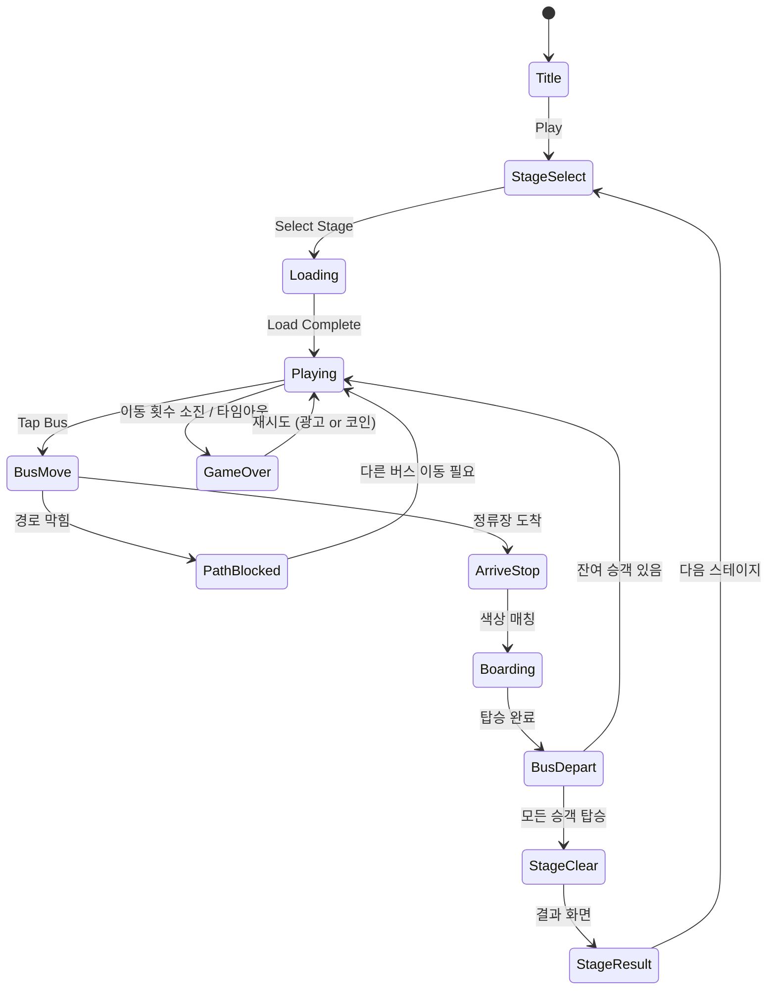

# Bus Jam

> 버스 정류장에서 색상이 일치하는 승객을 올바른 버스에 태워 교통 혼잡을 해소하는 퍼즐 게임

## 개요

버스 정류장 레이아웃에 다양한 색상의 승객들이 대기 중이다. 플레이어는 각 색상의 버스를 올바른 정류장으로 유도하여 같은 색 승객을 모두 탑승시켜야 한다. 버스는 주차장/도로 구조 내에서 순서에 따라 움직이며, 막힌 버스를 어떤 순서로 빼낼지가 핵심 퍼즐이다.

**핵심 재미**: "어느 버스를 먼저 움직여야 하지?" — 교통 정리 + 색상 정렬의 이중 만족감

## 게임 규칙

### 기본 규칙

- 도로/주차장 그리드에 여러 색상의 버스가 대기 중
- 각 정류장(Lane)에는 특정 색상의 승객들이 줄 서 있음
- 버스를 탭하면 해당 색상의 정류장으로 이동 시도
- 경로가 막혀 있으면 이동 불가 → 다른 버스를 먼저 이동해야 함
- 버스가 정류장에 도착 → 같은 색 승객이 자동 탑승 → 버스 출발
- 모든 승객을 탑승시키면 **스테이지 클리어**
- 이동 횟수 제한 도달 또는 타임아웃 시 **게임 오버**

### 버스 이동 규칙

- 버스는 전진만 가능 (후진 불가, 단방향 차선)
- 앞에 다른 버스가 있으면 이동 불가
- 버스 출발(승객 탑승 완료) 후 뒤 버스가 전진 가능
- 버스 크기: 미니(2칸), 일반(3칸), 대형(4칸) — 난이도에 따라 혼합

### 승객 탑승 규칙

- 버스 색상 = 승객 색상 → 자동 전원 탑승 후 출발
- 색상 불일치 → 탑승 거부, 버스 경로 재탐색 필요
- 정류장 용량: 최대 6명 대기 (초과 시 다음 정류장 오버플로우)

## 게임 플로우



## UI 레이아웃

```
┌────────────────────────────┐
│  ⭐ Stage 12   🔄 Moves:15 │  ← 상단 HUD
├────────────────────────────┤
│                            │
│  [정류장A: 🔴🔴🔴]         │  ← 승객 대기열 (색상 표시)
│  [정류장B: 🔵🔵🔵🔵]       │
│  [정류장C: 🟡🟡🟡]         │
│                            │
│  ┌──┬──┬──┬──┬──┬──┐      │
│  │🚌│  │🚌│  │  │🚌│      │  ← 도로 그리드
│  │🔴│  │🔵│  │  │🟡│      │     (버스 + 차선)
│  └──┴──┴──┴──┴──┴──┘      │
│  ┌──┬──┬──┬──┬──┬──┐      │
│  │  │🚌│  │🚌│  │  │      │
│  │  │🟡│  │🔴│  │  │      │
│  └──┴──┴──┴──┴──┴──┘      │
│                            │
├────────────────────────────┤
│  💡 Hint   ↩️ Undo   🎯    │  ← 아이템 바
└────────────────────────────┘
```

### 색상 팔레트

| 색상 | 코드 | 단계 도입 |
|------|------|-----------|
| 빨강 | #FF4444 | Stage 1 |
| 파랑 | #4488FF | Stage 1 |
| 노랑 | #FFD700 | Stage 3 |
| 초록 | #44CC44 | Stage 5 |
| 보라 | #AA44FF | Stage 8 |
| 주황 | #FF8800 | Stage 12 |
| 분홍 | #FF66AA | Stage 16 |
| 청록 | #00CCCC | Stage 20 |

## 스코어링 시스템

| Action | 점수 |
|--------|------|
| 버스 1대 출발 (탑승 완료) | +200 |
| 남은 이동 횟수 × 보너스 | 잔여 이동 × 50 |
| 스테이지 클리어 | +500 |
| 이동 없이 연속 3대 클리어 (콤보) | +300 |
| 퍼펙트 클리어 (최소 이동) | +1000 |

### 별점 시스템 (3성 기준)

| 별점 | 조건 |
|------|------|
| ⭐⭐⭐ | 최적 이동 수의 120% 이내 |
| ⭐⭐ | 최적 이동 수의 150% 이내 |
| ⭐ | 클리어만 해도 |

## 난이도 설계

### 단계별 파라미터

| Stage 구간 | 버스 수 | 색상 수 | 정류장 수 | 이동 제한 | 버스 크기 |
|-----------|---------|---------|---------|---------|---------|
| 1–5 (튜토리얼) | 3–4 | 2 | 2 | 무제한 | 일반(3칸) |
| 6–15 (초급) | 4–6 | 3 | 3 | 20 | 일반 |
| 16–30 (중급) | 6–8 | 4 | 3–4 | 18 | 일반+미니 |
| 31–50 (고급) | 8–10 | 5 | 4 | 15 | 혼합 |
| 51+ (전문가) | 10–12 | 6–8 | 4–5 | 12 | 혼합+대형 |

### 난이도 조절 요소

1. **버스 밀도**: 도로 그리드 내 버스 배치 밀도 (40% → 70%)
2. **색상 수**: 2색 → 8색 점진적 증가
3. **정류장 용량**: 6명 → 4명 (후반부 압박 증가)
4. **버스 크기 혼합**: 크기가 다를수록 경로 계산 복잡
5. **일방통행 제약**: 후반부 U턴 불가 구간 추가

### 퍼즐 설계 원칙

- 모든 퍼즐은 반드시 해법이 존재해야 함 (역방향 검증 필수)
- 최소 이동 수 = 퍼즐 생성 시 BFS로 계산 후 이동 제한에 여유분 추가
- 데드락(교착) 상태는 힌트로 탈출 가능하게 설계

## Bus Jam vs Bus Craze (#87) 비교 분석

### Bus Craze (#87) — 평점 4.3

- **메카닉**: 버스를 탭해서 경로만 뚫는 단순 슬라이딩
- **색상 요소**: 없음 (순수 교통 정리)
- **단점**: 반복감 빠름, 색상 만족감 없음, 단조로운 시각 피드백

### Bus Jam (#84) — 평점 4.8 ⬆️

- **메카닉**: 교통 정리 + 색상 매칭 이중 레이어
- **차별점**:
  - 색상 매칭의 시각적/심리적 만족감 추가
  - "올바른 버스에 탑승시키기" → 목적의식 강화
  - 색상별 승객 대기열 → 보드 읽기 전략 복잡도 증가
- **결론**: 색상 레이어 추가만으로 재미 밀도 0.5점↑, **이 변형이 버스/교통 퍼즐 중 최적**

> **개발 권장**: Bus Craze 대신 Bus Jam 우선 개발. 동일한 개발 비용으로 더 높은 리텐션 기대.

## 수익화 설계

### 인앱 결제

| 상품 | 가격 | 내용 |
|------|------|------|
| 힌트 팩 (5개) | $0.99 | 최적 다음 이동 1수 표시 |
| Undo 팩 (10개) | $0.99 | 마지막 이동 취소 |
| 코인 500 | $1.99 | 범용 재화 |
| 광고 제거 | $2.99 | 영구 광고 제거 |
| 스타터 팩 | $4.99 | 힌트 20 + Undo 20 + 광고 제거 |

### 광고

| 유형 | 타이밍 | 보상 |
|------|--------|------|
| 리워드 영상 | 게임 오버 시 자발적 시청 | 이동 횟수 +5 또는 재시도 |
| 인터스티셜 | 스테이지 클리어 3번마다 | 없음 (스킵 가능) |
| 배너 | 스테이지 선택 화면 | 없음 |

### 수익화 깔때기

```
설치 → 튜토리얼 완료 → Stage 10 도달 (첫 막힘 지점)
  → 힌트/Undo 첫 노출 → 광고 or 결제 전환
```

- **핵심 전환 포인트**: Stage 10–15 (처음으로 이동 제한에 걸리는 구간)
- **D7 리텐션 목표**: 35% (색상 만족감 기반 리텐션)

## 아이템/도구

| 아이템 | 효과 | 획득 방법 |
|--------|------|----------|
| 💡 힌트 | 최적 다음 이동 1수 하이라이트 표시 | 코인 50 / 광고 시청 |
| ↩️ Undo | 마지막 버스 이동 취소 (최대 3수) | 코인 30 / 팩 구매 |
| 🔀 Shuffle | 버스 위치 재배치 (동일 색상 유지) | 코인 100 |
| ⏱️ +Time | 제한 시간 +30초 (타임어택 모드) | 광고 시청 |

## 사운드/이펙트

| 이벤트 | 사운드 | 이펙트 |
|--------|--------|--------|
| 버스 이동 | 엔진 소리, 바퀴 구름 | 버스 슬라이드 애니메이션 |
| 승객 탑승 | 탑승 효과음 (딩동) | 승객 버스로 점프 |
| 버스 출발 | 출발 경적 | 버스 화면 밖으로 이동 |
| 색상 매칭 성공 | 상승 톤 | 색상 파티클 이펙트 |
| 스테이지 클리어 | 축하 팡파레 | 별 3개 애니메이션 |
| 게임 오버 | 실패음 | 화면 흔들림 |
| 힌트 사용 | 팝 효과음 | 버스 깜빡임 하이라이트 |

## MVP 범위

### Phase 1 — MVP (1주 목표)

- [x] 기획서 작성
- [ ] 도로 그리드 + 버스 배치 렌더링
- [ ] 버스 탭 → 이동 로직 (경로 탐색)
- [ ] 색상 매칭 → 승객 탑승 → 버스 출발
- [ ] 게임 오버 / 클리어 판정
- [ ] 스테이지 10개 (튜토리얼 5 + 초급 5)
- [ ] 기본 힌트 1회 제공

### Phase 2 — 출시 후 (2주차)

- [ ] 별점 시스템 및 스테이지 셀렉트
- [ ] Undo 아이템
- [ ] 광고 통합 (리워드 + 인터스티셜)
- [ ] 스테이지 50개
- [ ] 사운드/이펙트 완성

### Phase 3 — 성과 기반 (데이터 확인 후)

- [ ] 일일 챌린지 모드
- [ ] 타임어택 모드
- [ ] 색상 8종 전부 해금
- [ ] 스테이지 100개+
- [ ] 인앱 결제 전품목
