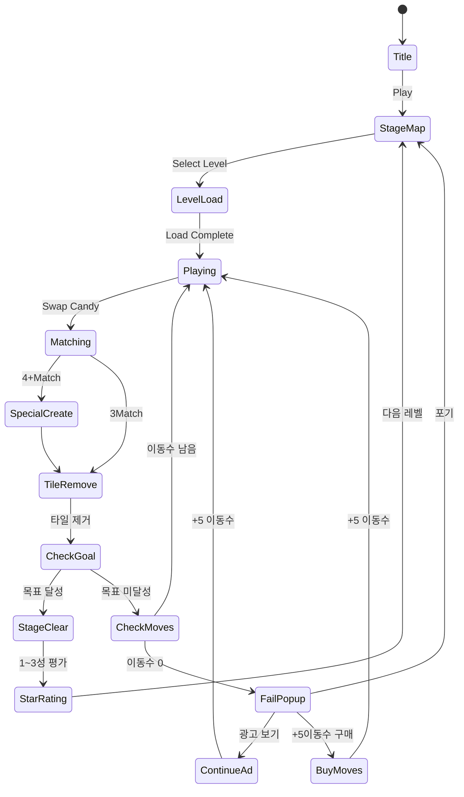

# 캔디 프렌즈 : 매치 3 퍼즐

> 귀여운 캔디 캐릭터들과 함께하는 클래식 스왑 매치-3 퍼즐

---

## 개요

| 항목 | 내용 |
|------|------|
| 장르 | Match-3 Puzzle (스왑 방식) |
| 레퍼런스 | 캔디크러시 사가, 로얄 매치 (#11) |
| 차별화 | 귀여운 캔디 프렌즈 캐릭터 + 단순화된 메카닉 |
| MVP 목표 | 50레벨, 핵심 특수 타일 4종, 라이프+광고 수익화 |
| 개발 기간 | 1~2주 (MVP) |

캔디크러시에서 복잡한 이벤트/시즌 콘텐츠를 제거하고, **"귀엽고 간단하게 즐기는 매치-3"** 포지션. 로얄 매치보다 캐주얼하고 진입 장벽을 낮춰 **광고 수익 모델에 최적화**한다.

---

## 코어 게임 메카닉

### 기본 스왑 규칙

- 8×8 그리드 보드
- 인접한 두 캔디 타일을 **스왑**해서 가로/세로 **3개 이상** 같은 색상 줄맞추기
- 매치되면 타일 제거 → 위에서 새 타일 낙하
- 유효한 매치가 없으면 스왑 불가 (또는 애니메이션 후 원위치)
- **이동 횟수(Move)** 제한 방식 (타이머 없음 → 캐주얼 친화적)

### 스테이지 목표 유형 (MVP 3종)

| 목표 타입 | 설명 | 도입 레벨 |
|-----------|------|-----------|
| Score | 제한 이동 안에 목표 점수 달성 | 1~10 |
| Collect | 특정 색상 캔디 N개 수집 | 11~30 |
| Clear | 특정 타일(젤리/초콜릿) 전부 제거 | 31~50 |

### 낙하 & 보충 메카닉

```
타일 제거 → 중력 낙하 → 빈칸 위에서 신규 타일 보충
연쇄 낙하로 추가 매치 발생 시 콤보 보너스
```

---

## 특수 타일 조합 매트릭스

### 생성 조건

| 매치 형태 | 생성 특수 타일 | 외형 | 효과 |
|-----------|---------------|------|------|
| **3매치** (기본) | 없음 (일반 제거) | - | 3개 제거 |
| **4매치** (직선) | 스트라이프 캔디 | 🍬➡️ | 한 줄(행/열) 전체 제거 |
| **5매치** (직선) | 컬러 밤 | 💣🌈 | 같은 색 전체 제거 |
| **L자 / T자** | 래퍼 캔디 | 🍬💥 | 3×3 범위 제거 |

### 특수 타일 조합 폭발

| 조합 | 효과 |
|------|------|
| 스트라이프 + 스트라이프 | 십자(+) 전체 제거 |
| 스트라이프 + 래퍼 | 3행 + 3열 제거 |
| 래퍼 + 래퍼 | 5×5 범위 제거 |
| 컬러 밤 + 스트라이프 | 같은 색 전부 스트라이프로 변환 후 폭발 |
| 컬러 밤 + 래퍼 | 같은 색 전부 래퍼로 변환 후 폭발 |
| 컬러 밤 + 컬러 밤 | 전체 보드 클리어 |

> **MVP 구현 우선순위**: 4매치 스트라이프 → L/T자 래퍼 → 5매치 컬러 밤 → 조합 폭발 순

### 장애물 타일

| 타일 | 제거 방법 | 도입 레벨 |
|------|-----------|-----------|
| 젤리 (1겹) | 매치 1회 | 11 |
| 젤리 (2겹) | 매치 2회 | 21 |
| 초콜릿 | 매턴 확산, 인접 매치로 제거 | 31 |
| 마시멜로 | 직접 매치 불가, 특수 타일로만 제거 | 41 |

---

## 캐릭터 차별화 — 캔디 프렌즈

### 캐릭터 설정

매치-3 타일 자체에 **얼굴 표정**을 부여해 "친구" 느낌 강조.

| 캔디 이름 | 색상 | 표정 특징 | 특수 형태 |
|-----------|------|-----------|-----------|
| 레드 | 빨강 | 활기차고 에너지 넘침 | 불꽃 스트라이프 |
| 블루 | 파랑 | 차분하고 똑똑함 | 얼음 스트라이프 |
| 그린 | 초록 | 자연스럽고 친근함 | 잎사귀 래퍼 |
| 옐로 | 노랑 | 밝고 긍정적 | 번개 래퍼 |
| 퍼플 | 보라 | 신비롭고 귀여움 | 마법 컬러 밤 |
| 오렌지 | 주황 | 장난끼 넘침 | 폭탄 래퍼 |

### 캐릭터 활용

- **마스코트**: 메인 캐릭터 "캔디" (레드 캔디)가 스토리 진행자 역할
- **레벨 완료 리액션**: 클리어 시 캐릭터 축하 애니메이션 (간단한 스프라이트 시트)
- **라이프 요청**: "캔디가 도움이 필요해요!" → 소셜 공유 유도 (Phase 2)

> MVP에서는 타일 스프라이트에 표정 내포, 마스코트 정적 이미지로 구현

---

## 경쟁작 비교 분석

### #3 로얄 킹덤 vs #11 로얄 매치 vs 캔디 프렌즈

| 항목 | 로얄 킹덤 (#3) | 로얄 매치 (#11) | 캔디 프렌즈 (우리) |
|------|---------------|-----------------|-------------------|
| 장르 혼합 | 매치-3 + 건설 | 순수 매치-3 | 순수 매치-3 |
| 코어 루프 | 매치 → 왕국 건설 | 매치 → 레벨 클리어 | 매치 → 레벨 클리어 |
| 복잡도 | 높음 (건설 관리) | 중간 | 낮음 |
| 개발 비용 | 매우 높음 | 높음 | **낮음** |
| 타겟 유저 | 미드코어 | 캐주얼-미드코어 | **하이퍼캐주얼-캐주얼** |
| 수익화 | IAP 중심 | IAP + 광고 | **광고 중심 + IAP** |
| 차별화 포인트 | 건설 RPG | 심플 매치-3 | 캐릭터 감성 |

### 우리 포지션 전략

- 로얄 매치 대비 **더 단순하고 캐주얼한 진입점**
- 캔디크러시 대비 **콘텐츠 압박 없는 가벼운 경험**
- **광고 수익 우선** → CPI 낮은 캐주얼 유저 확보 → 부스터 IAP 추가 판매

---

## 스테이지 설계 — 50레벨 난이도 곡선

### 단계별 설계 원칙

```
1~10   : 튜토리얼 → 기본 메카닉 학습 (이동수 넉넉, 목표 쉬움)
11~20  : 스트라이프 도입 → 특수 타일 활용 학습
21~30  : 래퍼 도입 + 젤리 2겹 → 조합 전략 필요
31~40  : 초콜릿 도입 → 빠른 판단력 요구
41~50  : 마시멜로 + 복합 목표 → 첫 번째 난관 (구매 전환점)
```

### 상세 난이도 테이블

| 레벨 범위 | 목표 | 이동수 | 타일 색상 수 | 장애물 | 특수 타일 |
|-----------|------|--------|-------------|--------|-----------|
| 1~5 | Score | 25~30 | 4 | 없음 | 없음 |
| 6~10 | Score | 20~25 | 5 | 없음 | 스트라이프만 |
| 11~15 | Collect | 20~22 | 5 | 젤리 1겹 | 스트라이프 |
| 16~20 | Collect | 18~20 | 5 | 젤리 1겹 | 스트라이프+래퍼 |
| 21~25 | Collect | 16~18 | 6 | 젤리 2겹 | 스트라이프+래퍼 |
| 26~30 | Clear | 18~22 | 6 | 젤리 2겹 | 전체 |
| 31~35 | Clear | 20~25 | 6 | 초콜릿 | 전체 |
| 36~40 | Clear+Collect | 18~22 | 6 | 초콜릿+젤리 | 전체 |
| 41~45 | Clear | 16~20 | 6 | 마시멜로 | 전체 |
| 46~50 | 복합 | 15~18 | 6 | 복합 | 전체 |

### 스파이크 레벨 (구매 유도 지점)

레벨 **10, 20, 30, 40, 50** — 갑자기 이동수를 15로 제한하고 목표치를 높여 실패 유도. 실패 직후 "+5 이동수 구매" 또는 "광고 보고 계속하기" 노출.

---

## 게임 플로우



---

## UI 레이아웃

```
┌─────────────────────────────┐
│ ❤️❤️❤️  Level 15  [⚙️]     │  ← 라이프 + 레벨 + 설정
│ 🎯 목표: 젤리 30개 제거     │  ← 목표 표시
│ 🔵 이동: 18                 │  ← 남은 이동수
├─────────────────────────────┤
│                             │
│  🔴 🟡 🟢 🔵 🟣 🔴 🟡 🟢  │
│  🟢 🔵 🟣 🟡 🔴 🟢 🔵 🟣  │
│  🟡 🔴 🔵 🟢 🟡 🟣 🔴 🔵  │  ← 8×8 게임 보드
│  🔵 🟣 🟡 🔴 🟢 🔵 🟣 🟡  │    (캔디 캐릭터 표정)
│  🟣 🟢 🔴 🟣 🔵 🟡 🟢 🔴  │
│  🔴 🔵 🟢 🟡 🟣 🔴 🔵 🟢  │
│  🟡 🟣 🟡 🔵 🔴 🟢 🟣 🟡  │
│  🟢 🔴 🟣 🟢 🟡 🔵 🔴 🟣  │
│                             │
├─────────────────────────────┤
│  [🔨 망치]  [🕐 +시간]  [🌈] │  ← 인게임 부스터 3종
└─────────────────────────────┘
```

### 스테이지 맵 UI

```
┌─────────────────────────────┐
│  캔디 프렌즈           [👤] │
│                             │
│  ⭐⭐⭐ 25   ⭐⭐⭐ 24   │
│     ↕                       │
│  ⭐⭐☆ 23   🔒 22          │  ← 선형 맵 (캔디크러시 스타일)
│     ↕                       │
│  ⭐⭐⭐ 21   ⭐⭐☆ 20      │
│                             │
│  [❤️×5] 리필: 25:30        │  ← 라이프 타이머
└─────────────────────────────┘
```

---

## 스코어링 시스템

| 액션 | 점수 |
|------|------|
| 3매치 제거 | +60 |
| 4매치 (스트라이프 생성) | +120 |
| L/T매치 (래퍼 생성) | +180 |
| 5매치 (컬러 밤 생성) | +300 |
| 특수 타일 폭발 | +200~500 |
| 연쇄 콤보 1단계 | ×1.2 배율 |
| 연쇄 콤보 2단계+ | ×1.5 배율 |
| 레벨 클리어 보너스 | 남은 이동수 × 500 |

### 별점 기준 (레벨마다 다름)

| 별 | 조건 |
|----|------|
| ⭐ | 목표 달성 |
| ⭐⭐ | 목표 달성 + 이동수 5+ 남음 |
| ⭐⭐⭐ | 목표 달성 + 이동수 10+ 남음 |

---

## 수익화 전략

### 라이프 시스템

| 항목 | 설정 |
|------|------|
| 최대 라이프 | 5개 |
| 자연 회복 | 30분당 1개 |
| 레벨 실패 시 | -1 라이프 |
| 라이프 0 | 팝업: 광고 보기(+1) / 구매(+5) / 친구에게 요청 / 기다리기 |

### 부스터 종류 (인게임 구매)

| 부스터 | 효과 | 가격 (코인) | 실제가 |
|--------|------|-------------|--------|
| 망치 | 타일 1개 즉시 제거 | 900 | $0.99 |
| +5 이동수 | 게임 중 이동수 추가 | 1800 | $1.99 |
| 색깔 폭탄 | 컬러 밤 즉시 사용 | 1200 | $1.29 |
| 슈퍼 부스터 팩 | 3종 세트 | 3600 | $2.99 |

### Pre-level 부스터 (레벨 시작 전)

| 부스터 | 효과 | 비용 |
|--------|------|------|
| 스트라이프 ×2 | 보드 시작 시 스트라이프 2개 배치 | 코인 600 |
| +3 이동수 | 시작 이동수 추가 | 코인 900 |
| 젤리피쉬 | 랜덤 타일 3개 즉시 제거 | 코인 600 |

### 광고 수익화 (핵심)

| 위치 | 광고 형식 | 리워드 |
|------|-----------|--------|
| 레벨 실패 후 | 리워드 광고 (30초) | +5 이동수 1회 |
| 라이프 0 시 | 리워드 광고 | +1 라이프 |
| 레벨 완료 후 | 리워드 광고 (선택) | 코인 +200 |
| 스테이지 맵 | 인터스티셜 (3레벨마다) | 없음 (강제) |

> **수익화 우선순위**: 광고 노출 최대화 → 코인 유도 → IAP 전환
> 무료 유저도 광고로 라이프 회복 가능 → 이탈률 감소 → DAU 유지

### 코인 경제

- **획득**: 레벨 클리어 보너스, 일일 보상, 광고 시청, 소량 구매
- **소비**: 부스터, +이동수, 라이프 즉시 충전
- **패키지**: 첫 구매 패키지 $0.99 (코인 3000 + 스타터 부스터)

---

## 사운드/이펙트

| 이벤트 | 사운드 | 시각 이펙트 |
|--------|--------|-------------|
| 타일 스왑 | 경쾌한 스왑음 | 슬라이드 애니메이션 |
| 3매치 | 팡! + 캔디 터짐 | 파티클 폭발 |
| 스트라이프 폭발 | 슝~ 효과음 | 빛 줄기 |
| 래퍼 폭발 | 쾅! | 원형 폭발파 |
| 컬러 밤 | 마법 효과음 | 무지개 소용돌이 |
| 콤보 | 상승 톤 시리즈 | 콤보 카운터 팝업 |
| 레벨 클리어 | 축하 팡파레 | 별 낙하 + 캐릭터 댄스 |
| 레벨 실패 | 실망 효과음 | 캐릭터 슬픈 표정 |
| 특수 타일 생성 | 반짝 + 신비 음 | 생성 글로우 |

---

## MVP 범위

### Phase 1 (1~2주, 출시 목표)

- [ ] 8×8 그리드 스왑 매칭 코어
- [ ] 기본 6색 캔디 타일 (표정 포함 스프라이트)
- [ ] 4매치 스트라이프 생성 및 폭발
- [ ] L/T매치 래퍼 생성 및 폭발
- [ ] Score / Collect / Clear 목표 3종
- [ ] 젤리 1겹 장애물
- [ ] 50레벨 스테이지 데이터
- [ ] 라이프 시스템 (5개, 30분 회복)
- [ ] 리워드 광고 (라이프 회복, +5 이동수)
- [ ] 인터스티셜 광고
- [ ] 레벨 완료 3성 평가
- [ ] 스테이지 맵 UI

### Phase 2 (출시 후 데이터 확인 후 결정)

- [ ] 5매치 컬러 밤 + 조합 폭발
- [ ] 젤리 2겹 / 초콜릿 / 마시멜로 장애물
- [ ] Pre-level 부스터 시스템
- [ ] 코인 경제 + IAP 연동
- [ ] 일일 도전 / 이벤트 레벨
- [ ] 소셜 기능 (친구 랭킹)

---

## 매치-3 포트폴리오 포지셔닝

### 시장 현황

- 매치-3는 모바일 퍼즐 **1위 장르** (전체 캐주얼 게임 25% 이상)
- 상위 3개 (캔디크러시, 로얄 매치, 가너) 과점이지만 **롱테일 수요 존재**
- 신규 매치-3의 성공 패턴: **저CPI + 광고 수익** 모델 (IAP 없이도 수익화 가능)

### 우리의 포지셔닝

```
             캐주얼                      미드코어
낮은 개발비 ─────────────────────────────────────
             [캔디 프렌즈] ← 우리 목표 위치
                  ↑
             Found3 (이미 개발 중)
낮은 개발비 ─────────────────────────────────────
             로얄 매치    로얄 킹덤
높은 개발비
```

- **CPI 목표**: $0.20~0.40 (캐주얼 매치-3 평균 범위)
- **ARPDAU 목표**: $0.03~0.06 (광고 위주)
- **D1 리텐션 목표**: 40%+ (매치-3 장르 평균 35%)

### 장르 진입 가치 판단

**장점**:
1. 검증된 게임플레이 루프 → 개발 리스크 최소화
2. 광고 수익 모델 최적화 (라이프 시스템 = 광고 노출 강제)
3. 연령/성별 가리지 않는 넓은 타겟층
4. Found3와 함께 "퍼즐" 카테고리 포트폴리오 강화

**단점/리스크**:
1. 경쟁 과포화 → UA 단가 상승 위험
2. 상위 게임 대비 콘텐츠 격차 (레벨 수, 이벤트)
3. 유저 기대치 높음 → 폴리시 부족 시 빠른 이탈

---

## 결론: 매치-3 장르 진입 가치 vs 다른 장르 우선 판단

### 권고: **조건부 진행 (Phase 1만, 1주 개발)**

| 기준 | 판단 | 이유 |
|------|------|------|
| 구현 난이도 | ✅ 낮음 | 스왑 매칭 로직은 known 패턴 |
| 시장 수요 | ✅ 높음 | 매치-3 = 최대 캐주얼 장르 |
| 차별화 | ⚠️ 약함 | 캐릭터만으론 부족, 콘텐츠 필요 |
| 개발 비용 | ✅ 1주 MVP | 스왑 + 특수 타일 4종 + 50레벨 |
| 수익화 속도 | ✅ 빠름 | 광고 모델 즉시 적용 가능 |
| 장기 경쟁력 | ❌ 불확실 | 상위 게임 대비 콘텐츠 부족 |

### 3개월 생존 전략에서 이 게임의 역할

**매치-3는 "볼륨 게임"**: 빠르게 출시해서 광고 수익을 확인하고, ROAS가 나오면 레벨 추가 투자, 안 나오면 빠르게 정리.

1. **1주차**: MVP 출시 (50레벨, 광고)
2. **2~3주차**: CPI/D1/ARPDAU 측정
3. **판단 기준**:
   - D1 ≥ 38% + ARPDAU ≥ $0.03 → Phase 2 투자 (레벨 100 추가, IAP)
   - D1 < 35% 또는 ARPDAU < $0.02 → 유지만, 신규 장르로 피벗

### 다른 장르 대비 우선순위

```
우선도 높음:
  1. Found3 (이미 개발 중, 마무리 필요)
  2. 캔디 프렌즈 매치-3 (1주 MVP, 시장 검증)
  3. 하이퍼캐주얼 1~2종 (빠른 CPI 테스트)

우선도 낮음:
  - 로얄 킹덤 류 (건설+매치-3): 개발 4~8주, MVP 불가
  - RPG/전략: 개발 기간 초과
```

**최종 권고**: 캔디 프렌즈는 **2번째 출시 타이틀로 적합**. Found3 완성 후 병렬로 개발 시작. 1주 내 50레벨 MVP 출시, 2주차에 광고 수익 데이터 기반 투자 여부 결정.
