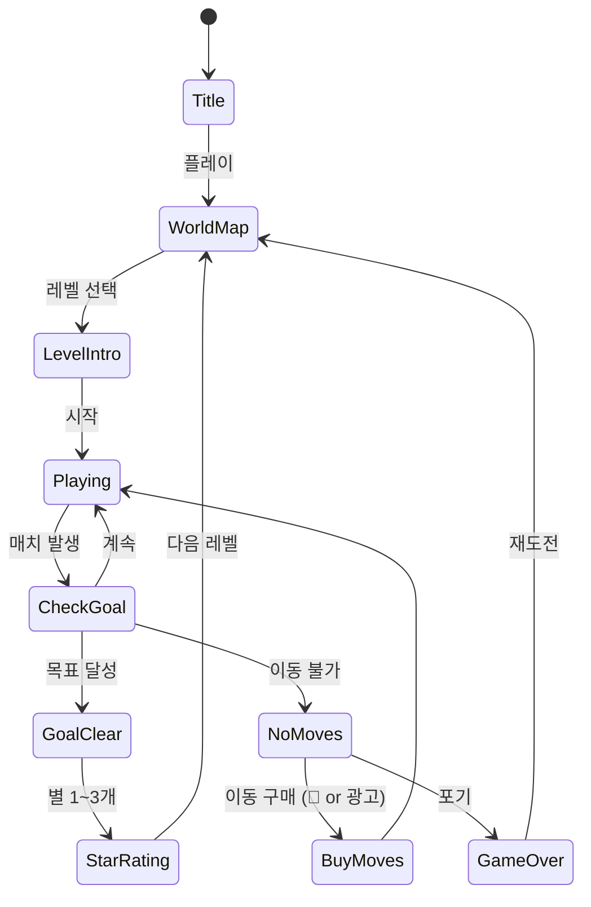

# 캔디 팝 포레스트 매치-3

> **레퍼런스**: #105 | SUPERBOX Inc | 평점 4.9 | 매치-3 장르

## 개요

숲 속의 자연 테마를 배경으로 한 클래식 매치-3 퍼즐 게임.
인접한 타일을 스왑하여 3개 이상 같은 종류를 연결해 제거하고, 레벨 목표를 달성하는 방식.
힐링 미학(healing aesthetic)과 친숙한 캐주얼 메카닉의 결합으로 광범위한 유저층 확보.

---

## 핵심 매력 포인트 (4.9 평점 비결)

### 1. 숲 테마의 심리적 효과
- **자연 = 스트레스 해소**: 초록, 갈색, 베이지 톤의 팔레트 → 눈의 피로 감소
- **숲 속 동물 캐릭터**: 토끼, 다람쥐, 새 등 — 귀엽고 감정이입 유도
- **계절 변화 연출**: 봄 꽃, 여름 잎, 가을 단풍, 겨울 눈 — 장기 플레이 동기
- **ASMR 수준 효과음**: 새소리, 바람소리, 풀잎 소리 → 게임 자체가 힐링 앱처럼 느껴짐

### 2. 4.9 평점의 구조적 이유
매치-3 중 최고점인 4.9는 단순 재미 이상의 요소를 가짐:

| 요소 | 내용 |
|------|------|
| **진입 장벽** | 첫 10레벨이 매우 쉬움 → 성취감 → 5성 리뷰 유도 |
| **난이도 곡선** | 갑작스러운 스파이크 없이 점진적 상승 |
| **수익화 타이밍** | 20-30레벨 이후 첫 페이월 → 반감 최소화 |
| **비주얼 폴리시** | 매치 애니메이션, 파티클 이펙트의 완성도 |
| **오프라인 플레이** | 네트워크 없이도 플레이 가능 → 이동 중 사용자 만족 |

---

## 게임 규칙

### 기본 메카닉
- **스왑 매칭**: 인접한 타일 2개를 스왑하여 가로/세로 3개 이상 연결
- **중력**: 타일 제거 후 위에서 새 타일 낙하
- **목표**: 레벨마다 다른 목표 (특정 타일 제거, 점수 달성, 장애물 제거 등)

### 특수 타일 (차별화 요소)
| 타일 | 생성 조건 | 효과 |
|------|-----------|------|
| **도토리 폭탄** | 4개 매치 | 가로/세로 1줄 제거 |
| **버섯 크리스탈** | 5개 L자 매치 | 3×3 범위 폭발 |
| **요정 무지개** | 5개 직선 매치 | 같은 색 타일 전체 제거 |
| **뿌리 덩굴** | 두 스페셜 조합 | 화면 전체 제거 |

### 장애물 (난이도 요소)
| 장애물 | 제거 방법 |
|--------|-----------|
| **이끼 블록** | 인접 매치 1회 |
| **바위** | 인접 매치 2회 |
| **얼음 결정** | 인접 매치 3회 |
| **나무 뿌리** | 스페셜 타일만 가능 |

---

## 게임 플로우



---

## UI 레이아웃

```
┌─────────────────────────┐
│ 🌿 목표: 도토리 30개 제거 │  ← 레벨 목표 HUD
│ ❤️❤️❤️❤️❤️  이동: 25    │  ← 라이프 + 남은 이동수
├─────────────────────────┤
│                         │
│  🍬 🌰 🍄 🌸 🍬 🌰     │
│  🌸 🍬 🌰 🍄 🌸 🍬     │
│  🍄 🌸 🍬 🌰 🍄 🌸     │  ← 8×8 게임 보드
│  🌰 🍄 🌸 🍬 🌰 🍄     │
│  🍬 🌰 🍄 🌸 🍬 🌰     │
│  🌸 🍬 🌰 🍄 🌸 🍬     │
│  🍄 🌸 🍬 🌰 🍄 🌸     │
│  🌰 🍄 🌸 🍬 🌰 🍄     │
│                         │
├─────────────────────────┤
│  🔨 🧪 🌈 🌀  [부스터]  │  ← 부스터 슬롯 (4개)
└─────────────────────────┘
```

---

## 스코어링 & 별 시스템

| 별 | 조건 |
|----|------|
| ⭐ | 목표 달성 |
| ⭐⭐ | 목표 달성 + 남은 이동 5회 이상 |
| ⭐⭐⭐ | 목표 달성 + 남은 이동 10회 이상 |

---

## 난이도 설계

### 레벨 구조 (100레벨 MVP)

| 구간 | 레벨 | 특징 |
|------|------|------|
| 튜토리얼 | 1-10 | 기본 스왑, 쉬운 목표, 무제한 이동 |
| 초반 | 11-30 | 이동 제한 도입, 이끼 블록 등장 |
| 중반 | 31-60 | 스페셜 타일 활용 필요, 바위 장애물 |
| 후반 | 61-85 | 복합 장애물, 시간 제한 레벨 |
| 어려움 | 86-100 | 얼음 + 뿌리 조합, 타이트한 이동수 |

### 수익화 연계 난이도 스파이크
- **레벨 35, 65, 90**: 의도적 어려운 레벨 → 부스터/라이프 구매 유도
- 평균 클리어율 목표: 70% (너무 쉬우면 과금 없음, 너무 어려우면 이탈)

---

## 수익화 설계

### 1. 라이프 시스템
| 항목 | 내용 |
|------|------|
| 최대 라이프 | 5개 |
| 충전 시간 | 30분/1개 |
| 광고 시청 | +1 라이프 즉시 (30초 광고) |
| 즉시 충전 | 💎 25개 (프리미엄 화폐) |
| 무한 라이프 | 💎 80개 / 24시간 |

### 2. 부스터 시스템
| 부스터 | 효과 | 가격 |
|--------|------|------|
| 🔨 해머 | 타일 1개 즉시 제거 | 💎 20 |
| 🧪 색 폭탄 | 선택 색 전체 제거 | 💎 30 |
| 🌈 무지개 | 스페셜 타일 생성 | 💎 25 |
| 🌀 소용돌이 | +5 이동 추가 | 💎 40 |

### 3. 광고 수익화
| 위치 | 형태 | 보상 |
|------|------|------|
| 게임 오버 | 보상형 | 이동 +5회 또는 라이프 복구 |
| 레벨 클리어 | 전면 | 코인 2배 |
| 메인 메뉴 | 배너 | 상시 노출 |
| 일일 보너스 | 보상형 | 💎 5-10개 |

### 4. IAP 패키지
| 패키지 | 가격 | 내용 |
|--------|------|------|
| 스타터 | $0.99 | 💎 100 + 부스터 세트 |
| 인기 | $4.99 | 💎 600 + 무한라이프 3일 |
| 베스트 | $9.99 | 💎 1500 + 광고 제거 7일 |
| 광고 제거 | $2.99 | 영구 광고 제거 |

---

## 사운드/이펙트

- **배경음**: 숲속 자연음 + 잔잔한 BGM (루프)
- **매치 성공**: 청량한 팡 효과음 + 파티클 이펙트
- **스페셜 타일 발동**: 화려한 시각 이펙트 + 임팩트 사운드
- **레벨 클리어**: 새소리 코러스 + 별 획득 애니메이션
- **게임 오버**: 부드러운 실패음 (짜증 유발 없이)
- **버튼 탭**: 나뭇잎 스치는 소리

---

## MVP 범위

### Phase 1 (1주, 최소 출시 가능)
- [ ] 기본 스왑 매칭 (3개 이상 연결)
- [ ] 중력 시스템 (타일 낙하)
- [ ] 이동 제한 + 목표 시스템
- [ ] 별 1~3개 평가
- [ ] 20 레벨
- [ ] 기본 숲 테마 비주얼
- [ ] 라이프 시스템 (5개, 30분 충전)
- [ ] 보상형 광고 (라이프 복구)

### Phase 2 (2주차)
- [ ] 스페셜 타일 4종
- [ ] 장애물 4종
- [ ] 부스터 시스템
- [ ] IAP 연동
- [ ] 100 레벨
- [ ] 월드맵 UI

### Phase 3 (이후)
- [ ] 계절 이벤트 레벨
- [ ] 리더보드
- [ ] 친구 도전
- [ ] 스페셜 챌린지 모드
