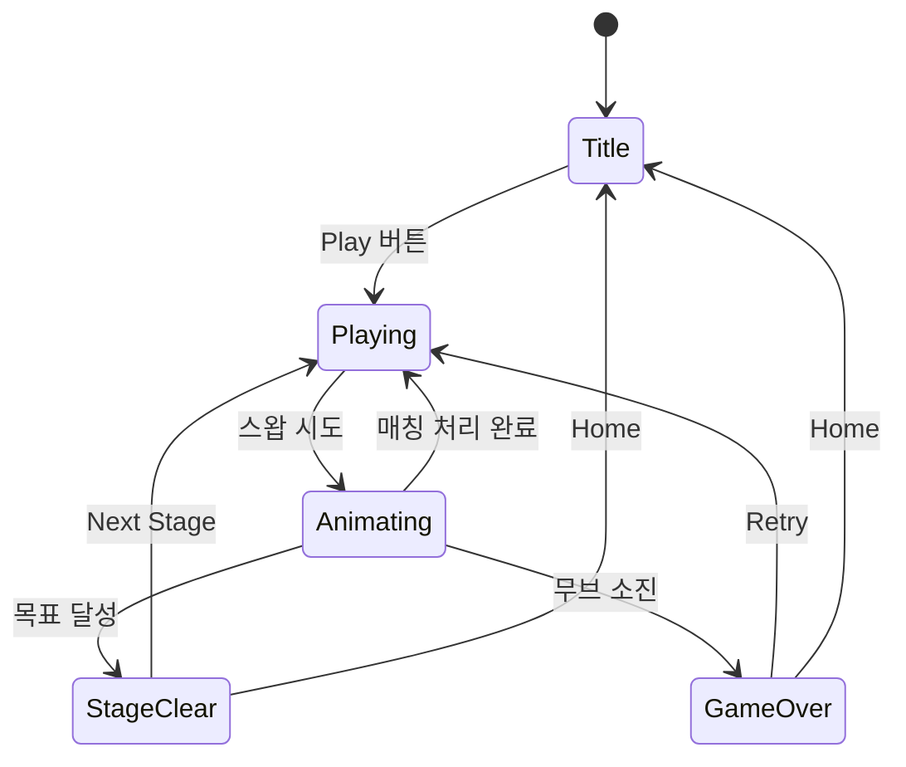

# 캔디 팝 포레스트 (Candy Pop Forest)

## 개요

숲 테마의 고전 매치-3 퍼즐 게임. 과일 타일을 스왑하여 3개 이상 매칭하면 "팝" 이펙트와 함께 제거.
목표 점수를 달성하면 스테이지 클리어.

- **장르**: Match-3 (Swap)
- **테마**: Forest / Nature (숲, 과일, 자연 힐링)
- **평점 레퍼런스**: 4.9 (매치-3 장르 최고점)
- **개발 기간**: 1주 (crunch3 파이프라인 재사용)

## 4.9 최고 평점 분석

매치-3 장르에서 4.9점은 최고 수준. 고평점 비결:
1. **힐링 테마** — 숲/자연 배경이 주는 편안함. 경쟁보다 릴렉스
2. **부드러운 피드백** — 매칭 시 "팝" 이펙트의 만족감
3. **직관적 조작** — 스왑 메카닉의 보편성 (누구나 즉시 이해)
4. **적절한 난이도 커브** — 쉬운 초반 → 점진적 도전
5. **세션 관리** — 짧은 1~2분 플레이 사이클

## 숲 테마 설계

- **배경색**: 연한 녹색 (#e8f5e9) — 숲속 느낌
- **타일**: 과일 아이콘 (사과, 딸기, 오렌지, 포도, 체리, 블루베리, 복숭아, 키위, 레몬, 수박)
- **타일 배경**: 과일별 파스텔 컬러 (부드러운 시각적 구분)
- **BGM**: Spring Loaded Waltz (봄 느낌, 힐링)
- **이펙트**: "팝" — 매칭 시 살짝 커졌다가 사라지는 애니메이션

## 게임 규칙

### 기본 메카닉
1. 8×8 (또는 9×9) 그리드에 과일 타일 배치
2. 인접한 두 타일을 스왑 (상하좌우)
3. 3개 이상 같은 타일이 일직선으로 놓이면 매칭 성공 → "팝" 제거
4. 매칭 안 되면 자동으로 되돌아감
5. 제거된 자리에 위 타일이 낙하 + 새 타일 생성
6. 연쇄 매칭(캐스케이드) 시 콤보 배율 적용

### 승리/패배 조건
- **승리**: 제한 무브 안에 목표 점수 도달
- **패배**: 무브 소진 시 목표 미달

### 특수 기능
- 유효한 스왑이 없으면 자동 셔플
- 캐스케이드 콤보 시 점수 배율 증가

## 게임 플로우



## UI 레이아웃

```
┌──────────────────────────┐
│  Stage  Score  Target  Moves │  ← HUD (React, 녹색 테마)
│    1    1,200   2,000   15  │
├──────────────────────────┤
│                          │
│   🍎 🍓 🍊 🍇 🍒 🫐 🍑 🥝  │
│   🍋 🍉 🍎 🍓 🍊 🍇 🍒 🫐  │
│   🍑 🥝 🍋 🍉 🍎 🍓 🍊 🍇  │  ← 8×8 Game Board
│   🍒 🫐 🍑 🥝 🍋 🍉 🍎 🍓  │     (Phaser, 녹색 배경)
│   🍊 🍇 🍒 🫐 🍑 🥝 🍋 🍉  │
│   🍎 🍓 🍊 🍇 🍒 🫐 🍑 🥝  │
│   🍋 🍉 🍎 🍓 🍊 🍇 🍒 🫐  │
│   🍑 🥝 🍋 🍉 🍎 🍓 🍊 🍇  │
│                          │
└──────────────────────────┘
```

## 스코어링 시스템

| 매칭 수 | 기본 점수 | 콤보 배율 |
|---------|----------|----------|
| 3개 매칭 | 100 | ×1 |
| 4개 매칭 | 200 | ×1 |
| 5+개 매칭 | 500 | ×1 |
| 콤보 2 | 기본 × 2 | ×2 |
| 콤보 3+ | 기본 × N | ×N |

## 난이도 설계

| Stage | 그리드 | 타일 종류 | 무브 | 목표 점수 |
|-------|-------|----------|------|----------|
| 1 | 8×8 | 5 | 30 | 800 |
| 2 | 8×8 | 6 | 28 | 1,500 |
| 3 | 8×8 | 6 | 25 | 2,500 |
| 4 | 8×8 | 7 | 22 | 4,000 |
| 5 | 8×8 | 7 | 20 | 5,500 |
| 6 | 9×9 | 7 | 25 | 6,000 |
| 7 | 9×9 | 8 | 22 | 7,500 |
| 8 | 9×9 | 8 | 20 | 9,000 |

## 사운드/이펙트

- **BGM**: Spring_Loaded_Waltz.mp3 (힐링 분위기)
- **매칭**: "팝" 이펙트 (살짝 커졌다 사라짐)
- **콤보**: 연쇄 매칭 시 배율 표시
- **스테이지 클리어**: 🌳 Stage Clear!
- **게임 오버**: 🍂 Game Over

## 매치-3 장르 종합 분석 (12개 레퍼런스)

### 장르 내 포지셔닝
- #3, #11, #52, #56, #69, #75, #81, #85, #92, #105, #110, #112 — 총 12개 매치-3
- **핵심 차별화**: 숲 힐링 테마 + 과일 타일 + 파스텔 색상
- **crunch3과의 차이**: crunch3(음식 테마, 회색 배경) vs candypop(숲 테마, 녹색 배경)

### 투자 판단
매치-3는 시장에서 가장 검증된 장르이며, 캐주얼 유저의 진입 장벽이 가장 낮음.
crunch3 파이프라인 90% 재사용으로 개발 비용 최소 (1주 이내).
테마 차별화만으로도 별도 앱으로 마케팅 가능.

**결론: 투자 O** — crunch3 코드 재사용으로 한계 비용 거의 0. 포트폴리오 다양성 확보.

## 수익화

1. **라이프 시스템** (Phase 2): 라이프 소진 시 광고 시청으로 회복
2. **부스터 아이템** (Phase 2): 셔플, 폭탄 등 광고/인앱 구매
3. **인터스티셜 광고**: 스테이지 클리어/게임 오버 시 AdMob 삽입 (RN 레벨)

## MVP 범위

### Phase 1 (MVP) ✅
- [x] 기획서 작성
- [x] 과일 타일 8×8 그리드
- [x] 스왑 매칭 (3+)
- [x] 캐스케이드 콤보
- [x] 무브 제한 + 목표 점수
- [x] 8 스테이지
- [x] 숲 테마 UI (녹색 배경, 파스텔 타일)
- [x] "팝" 이펙트 애니메이션
- [x] 유효 무브 없으면 자동 셔플
- [x] Web 빌드 (arcade 통합)
- [x] Bridge 연동 (STAGE_CLEAR / GAME_OVER)

### Phase 2
- [ ] 특수 타일 (4매칭 → 라인 클리어, 5매칭 → 폭탄)
- [ ] 아이템 시스템 (셔플, 힌트)
- [ ] 라이프 시스템
- [ ] 더 많은 스테이지 (20+)
- [ ] 리더보드
