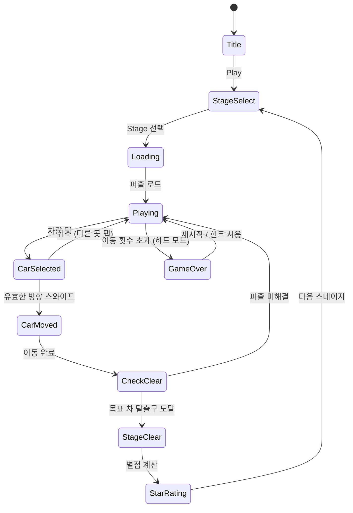

# Car Jam Solver (카잼 솔버)

> 교통 체증을 해소하는 주차 로직 퍼즐. 차량을 슬라이딩하여 목표 차량을 탈출구로 인도한다.
> 레퍼런스 #120 (Ladaneta Games, ★4.7, Traffic 장르)
> 교통 퍼즐 9개 레퍼런스 (#12, #33, #48, #70, #77, #82, #84, #87, #120) 종합 최종판

---

## 개요

6×6 격자 보드 위에 다양한 차량(크기 1×2 또는 1×3)이 배치되어 있다.
플레이어는 차량을 수평/수직 방향으로 슬라이딩하여 **목표 차량(빨간 차)**이 탈출구까지 이동할 수 있도록 교통 체증을 해소한다.

### 핵심 재미 루프

```
퍼즐 인식 → 막힌 차 발견 → 순서대로 이동 → 아하! 모먼트 → 클리어 → 다음 퍼즐
```

### 장르 포지셔닝 (9개 레퍼런스 종합)

| 변형 타입 | 레퍼런스 | 선택 여부 |
|-----------|----------|-----------|
| 슬라이딩 퍼즐 (Rush Hour형) | #12, #48, #82, #120 | ✅ **채택** |
| 순서 결정 (Parking Jam형) | #33, #70, #77 | 부분 채택 |
| 색상 매칭 (Color Road형) | #84, #87 | 색상 구분에만 사용 |

**결정**: Rush Hour 슬라이딩 + Parking Jam 순서 결정 하이브리드
- 슬라이딩: 깊이 있는 논리적 사고 요소
- 순서 결정: 직관적인 UX, 빠른 진행감

---

## 게임 규칙

### 기본 규칙

- **보드**: 6×6 격자 (기본), 후반 8×8 확장
- **차량 종류**:
  - 일반 차 (1×2): 수평 또는 수직 배치
  - 트럭 (1×3): 수평 또는 수직 배치
  - **목표 차 (빨간 1×2)**: 항상 수평, 우측 탈출구를 향함
- **이동 규칙**:
  - 수평 차량 → 좌우로만 슬라이딩
  - 수직 차량 → 상하로만 슬라이딩
  - 다른 차량 또는 벽에 막히면 이동 불가
- **클리어 조건**: 목표 차가 탈출구(오른쪽 벽 끝)까지 이동

### 이동 제한 모드 (난이도 추가)

- **이동 횟수 제한**: 정해진 횟수 내에 클리어해야 별 3개
- **시간 제한**: 선택적 타이머 (하드 모드)
- **최소 이동**: 최적 해(최소 이동 수)보다 적게 이동 시 퍼펙트 클리어

---

## 게임 플로우



---

## UI 레이아웃

```
┌─────────────────────────────┐
│  ←  Level 42   ★★☆   ↩️   │  ← 상단 HUD (뒤로/레벨/별/되돌리기)
├─────────────────────────────┤
│  이동: 12  최소: 8          │  ← 이동 카운터
├─────────────────────────────┤
│  ┌──────────────────────→  │
│  │  [트럭][트럭][트럭]      │
│  │        [  ]              │
│  │  [🚗🚗][  ][ ↑ ]        │  ← 6×6 게임 보드
│  │        [ ↑ ]             │     🚗 = 목표 차 (빨간색)
│  │  [ ←  ←  ] [ ↑ ]       │     → = 탈출구
│  │  [  ]      [  ]          │
│  └──────────────────────→  │
├─────────────────────────────┤
│   [💡 힌트]   [↩️ 되돌리기] │  ← 하단 액션
│   [🔄 재시작]              │
└─────────────────────────────┘
```

### 차량 색상 시스템

| 차량 타입 | 색상 | 설명 |
|-----------|------|------|
| 목표 차 | 빨간색 (#FF3B30) | 탈출시켜야 할 차 |
| 일반 차 | 파란/초록/노란/보라 | 장애물 차량 |
| 트럭 | 주황/갈색 | 3칸 장애물 |
| 잠긴 차 | 회색 | 이동 불가 (하드 모드) |

---

## 퍼즐 시스템

### 퍼즐 설계 원칙 (Rush Hour 기반)

1. **유일한 해**: 모든 퍼즐은 해가 존재하며 논리적으로 풀림
2. **최소 이동 수**로 클리어 가능 (힌트 기준)
3. **점진적 복잡도**: 초반에 단계별 학습 유도

### 난이도 등급

| 등급 | 차량 수 | 최소 이동 | 보드 | 잠긴 차 |
|------|---------|-----------|------|---------|
| Easy (1~30) | 5~8 | 3~8 | 6×6 | 없음 |
| Medium (31~80) | 8~12 | 9~15 | 6×6 | 없음 |
| Hard (81~150) | 12~15 | 16~25 | 6×6 | 1~2개 |
| Expert (151+) | 14~18 | 20~35 | 8×8 | 2~3개 |

### 퍼즐 생성 전략

**Phase 1 (MVP)**: 수동 디자인 50~100개 퍼즐
- Rush Hour 클래식 퍼즐 재구성 (저작권 주의: 레이아웃은 자체 제작)
- 검증된 난이도 커브 보장

**Phase 2**: 자동 생성 알고리즘
```
1. 목표 차 배치 (고정 위치)
2. BFS로 탈출 경로 탐색
3. 역방향으로 장애물 배치
4. 최소 이동 수 계산 → 난이도 분류
5. 중복 해 검사 → 유일 해만 채택
```

---

## 스코어링 시스템

| 조건 | 별점 |
|------|------|
| 클리어 (이동 제한 없음) | ★☆☆ |
| 최소 이동 × 1.5 이하 | ★★☆ |
| 최소 이동 수와 동일 | ★★★ |

### 레벨 보상

| 보상 | 조건 |
|------|------|
| 힌트 +1 | 10레벨마다 |
| 되돌리기 +3 | 스테이지 팩 완료 |
| 광고 스킵권 | 연속 3일 플레이 |

---

## 수익화 설계

### 핵심 수익 모델

```
힌트 소모 → 힌트 소진 → 광고 보기 or 구매
```

| 상품 | 가격 | 설명 |
|------|------|------|
| 힌트 3개 | $0.99 | 다음 이동 1개 표시 |
| 힌트 10개 | $2.49 | 번들 할인 |
| 되돌리기 5개 | $0.99 | 직전 이동 취소 |
| 광고 제거 | $2.99 | 영구 |
| 전체 잠금 해제 | $4.99 | 모든 스테이지 + 광고 제거 |

### 광고 전략

| 광고 유형 | 타이밍 | 보상 |
|-----------|--------|------|
| 리워드 광고 | 힌트 0개일 때 "광고 보고 힌트 받기" | 힌트 1개 |
| 인터스티셜 | 스테이지 5개마다 클리어 후 | 없음 |
| 배너 | 스테이지 선택 화면 하단 | 없음 |

### 힌트 시스템 상세

- **힌트 1회**: 다음에 움직여야 할 차량 1개 하이라이트
- **힌트 연속**: 전체 해답 순서 자동 표시 (프리미엄)
- 힌트는 퍼즐 난이도가 높을수록 소모 욕구 ↑ → Hard/Expert에서 전환율 높음

---

## 기술 설계

### 핵심 데이터 구조

```typescript
interface Car {
  id: string;
  x: number;        // 격자 x 좌표
  y: number;        // 격자 y 좌표
  length: number;   // 1×2 or 1×3
  direction: 'H' | 'V';  // 수평/수직
  isTarget: boolean;
  isLocked: boolean;
  color: string;
}

interface Board {
  size: 6 | 8;
  cars: Car[];
  exitX: number;   // 탈출구 x (보통 size-1)
  exitY: number;   // 탈출구 y
}

interface PuzzleState {
  board: Board;
  moveCount: number;
  minMoves: number;
  history: Move[];  // 되돌리기용
}

interface Move {
  carId: string;
  delta: number;   // 양수: 우/하, 음수: 좌/상
}
```

### 차량 이동 알고리즘

```typescript
function canMove(car: Car, delta: number, board: Board): boolean {
  // 1. 이동 방향 검증 (H차량은 delta가 좌우, V차량은 상하)
  // 2. 이동 후 위치 계산
  // 3. 보드 경계 검사
  // 4. 다른 차량과 충돌 검사 (격자 순회)
  // 5. 모두 통과 시 true
}

function getValidMoves(car: Car, board: Board): number[] {
  // 이동 가능한 delta 배열 반환 (연속 이동 거리 포함)
}
```

### 탈출 판정

```typescript
function checkEscape(board: Board): boolean {
  const target = board.cars.find(c => c.isTarget);
  if (!target) return false;
  // 목표 차 우측 끝이 탈출구 x에 도달했는지 확인
  return target.x + target.length - 1 >= board.exitX;
}
```

### BFS 힌트 엔진

```typescript
function solveBoard(board: Board): Move[] | null {
  // BFS로 최단 해 탐색
  // 상태를 문자열 해시로 직렬화하여 방문 체크
  // 큐: { state, moves }
  // 목표: checkEscape() === true
  // 반환: 최소 이동 배열
}
```

---

## 사운드/이펙트

| 이벤트 | 사운드 | 이펙트 |
|--------|--------|--------|
| 차량 선택 | 클릭 효과음 | 차량 위 화살표 표시 |
| 차량 이동 | 슬라이딩 효과음 | 부드러운 트윈 애니메이션 |
| 이동 불가 | 짧은 버저음 | 흔들기 (shake) |
| 탈출 성공 | 경적 + 환호 | 목표 차 화면 밖으로 주행 |
| 별 3개 | 팡파레 | 별 3개 점등 애니메이션 |
| 힌트 사용 | 전구 효과음 | 해당 차량 깜빡임 |

---

## MVP 범위

### Phase 1 - MVP (1주)

- [x] 기획서 작성
- [ ] 6×6 보드 렌더링 (Phaser.io)
- [ ] 차량 슬라이딩 이동 (탭 + 스와이프)
- [ ] 충돌 감지 + 탈출 판정
- [ ] 수동 제작 20개 퍼즐 (Easy 10 + Medium 10)
- [ ] 이동 카운터
- [ ] 스테이지 클리어 화면
- [ ] 되돌리기 (Undo) 기능

### Phase 2 (2주차)

- [ ] 힌트 시스템 (BFS 엔진)
- [ ] 별점 시스템 (이동 수 기반)
- [ ] 스테이지 선택 화면 (팩 구조)
- [ ] 50개 퍼즐 (Easy 20 + Medium 20 + Hard 10)
- [ ] 리워드 광고 연동 (힌트)
- [ ] 인터스티셜 광고

### Phase 3 (출시 후)

- [ ] 8×8 보드 + Expert 난이도
- [ ] 자동 퍼즐 생성 알고리즘
- [ ] 잠긴 차량 메카닉
- [ ] 일일 도전 퍼즐
- [ ] 인앱 구매 (힌트 팩, 광고 제거)
- [ ] 100개+ 퍼즐

---

## 기술 스택 (모노레포 파이프라인)

```
lib/car-jam/          ← Phaser.io 게임 코어
  - BoardScene.ts     ← 메인 게임 씬
  - Car.ts            ← 차량 게임 오브젝트
  - PuzzleSolver.ts   ← BFS 힌트 엔진
  - puzzles.ts        ← 퍼즐 데이터 (JSON)

web/car-jam/          ← React + Stitches 웹 빌드
  - App.tsx
  - GameContainer.tsx

car-jam/rn/           ← React Native WebView 래핑
```
