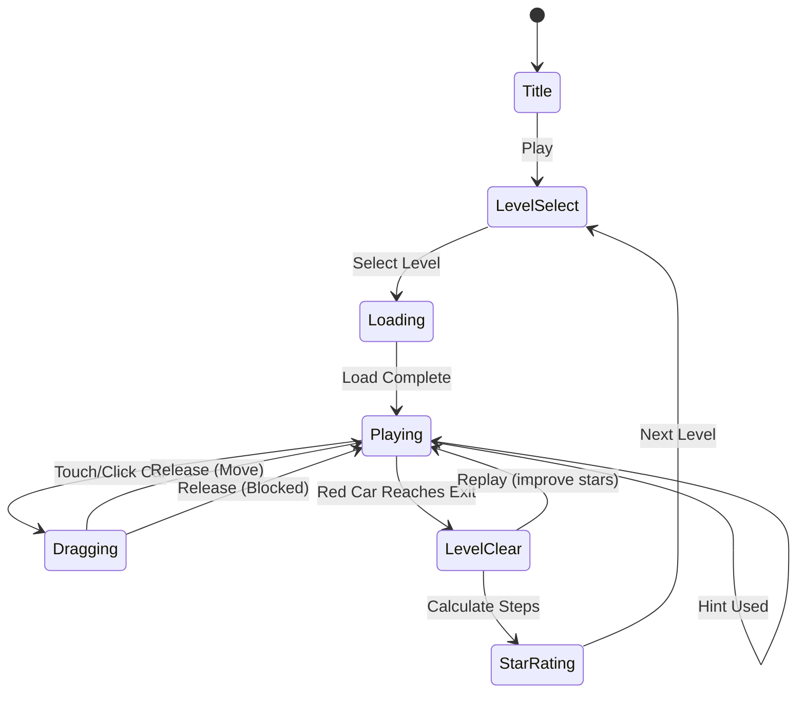

# Car Jam: 자동차 게임・주차의 달인

> **장르**: 교통/주차 슬라이딩 퍼즐
> **레퍼런스 랭크**: #70 (Rating 4.7)
> **MVP 목표**: 1~2주

## 개요

주차장에 가득 찬 차량들 사이에서 **타겟 차량(빨간 차)**을 출구까지 이동시키는 슬라이딩 퍼즐 게임.
Rush Hour 클래식 메카닉 + 아이소메트릭 3D 뷰로 깊이감 부여.
직관적인 드래그 조작, 단계적 난이도, 힌트/되돌리기 수익화.

---

## #12 버스 탈출과의 차이점

| 항목 | #12 버스 탈출 | #70 Car Jam (이 게임) |
|------|--------------|----------------------|
| **타겟 오브젝트** | 버스 (2×3 칸) | 자동차 (1×2 칸) |
| **그리드** | 6×6 (작음) | 6×6 ~ 8×8 (확장 가능) |
| **특수 차량** | 없음 | 소방차(3칸), 경찰차(빠른 이동) |
| **뷰** | 탑뷰 (2D) | 아이소메트릭 (3D 느낌) |
| **이동 제약** | 전/후만 | 전/후만 (가로차=좌우, 세로차=상하) |
| **난이도 범위** | 입문~중급 | 입문~전문가 (100+ 레벨) |
| **세계관** | 도시 버스 터미널 | 도심 주차장 → 교통 체증 도로 |
| **차별화 포인트** | 단순 명확 | 비주얼 품질 + 다양한 차량 유형 |

**결론**: #12는 룰이 단순하고 빠른 MVP에 유리. #70 Car Jam은 비주얼 차별화와 차량 다양성으로 더 높은 리텐션 목표.

---

## 코어 메카닉

### 기본 규칙

- **그리드**: 6×6 격자 (추후 7×7, 8×8 확장)
- **타겟 차량**: 빨간 자동차 (1×2), 항상 출구 방향과 같은 행/열에 위치
- **출구**: 그리드 우측 벽 (가로 방향 탈출)
- **승리 조건**: 빨간 차를 출구까지 이동
- **조작**: 차량을 드래그하면 해당 방향(가로/세로)으로 슬라이드, 다른 차량에 막히면 정지

### 이동 규칙

```
가로 차량 → 좌우만 이동 가능
세로 차량 → 상하만 이동 가능
이동 중 다른 차량 통과 불가
```

### 스텝 카운팅

- 차량 1회 드래그 = 1 스텝 (이동 거리 무관)
- 스텝 수 기준으로 별점(1~3★) 부여
- 최소 스텝 달성 시 3★

---

## 차량 특성

### 기본 차량 타입

| 타입 | 크기 | 이동 방향 | 색상 | 등장 시기 |
|------|------|-----------|------|-----------|
| 소형차 | 1×2 | 가로 | 다양 | 레벨 1~ |
| 소형차 | 2×1 | 세로 | 다양 | 레벨 1~ |
| SUV/트럭 | 1×3 | 가로 | 노랑/파랑 | 레벨 5~ |
| 트럭 | 3×1 | 세로 | 노랑/파랑 | 레벨 5~ |

### 특수 차량 (레벨 20~)

| 차량 | 크기 | 특수 효과 | 비주얼 |
|------|------|-----------|--------|
| 소방차 | 1×3 | 이동 시 인접 차량 1칸 밀어냄 (선택적 적용) | 빨강+사다리 |
| 경찰차 | 1×2 | 특수 없음, 비주얼 차별화 | 파랑+사이렌 |
| 구급차 | 1×3 | 특수 없음, 비주얼 차별화 | 흰색+십자 |
| 탱크로리 | 1×4 | 이동 불가 장애물 (레벨 50~) | 회색 |

> **MVP에서는 특수 효과 제외, 비주얼만 다양하게** → 구현 단순화

---

## 3D 아이소메트릭 뷰

### 렌더링 방식

```
탑뷰 (논리적 그리드)         아이소메트릭 (렌더링)
┌─┬─┬─┬─┬─┬─┐         /‾‾‾‾‾‾‾‾‾‾‾‾‾‾‾\
│ │🚗│ │🚙│ │ │    →   /  🚗  /  🚙  /
├─┼─┼─┼─┼─┼─┤        ‾‾‾‾‾‾‾‾‾‾‾‾‾‾‾‾
│🔴│🔴│ │ │🚕│ │        (45° 회전 + 원근감)
```

### 구현 방식 (Phaser.io)

- **옵션 A (MVP 권장)**: 탑뷰 로직 + 아이소메트릭 스프라이트만 교체
  - 논리 좌표는 6×6 그리드 유지
  - 렌더링만 `(x-y) * tileW/2`, `(x+y) * tileH/2` 변환
  - 차량 스프라이트를 45° 아이소메트릭 이미지로 제작
- **옵션 B**: Phaser 카메라 회전 (구현 복잡, MVP 비권장)

### 깊이감 연출

- 차량마다 Y좌표 기준 depthSort (위쪽 차량이 뒤에 렌더링)
- 그리드 바닥에 타일 그림자 효과
- 차량 이동 시 부드러운 트윈 애니메이션 (200ms)

---

## 게임 플로우



---

## UI 레이아웃

```
┌─────────────────────────────┐
│  ← Back   Level 42   🔊    │  ← 상단 바
│  Steps: 12  ★★☆  Best: 8  │  ← 스텝 카운터
├─────────────────────────────┤
│                             │
│    /‾‾‾\/‾‾‾\/‾‾‾\         │
│   /🔵🔵/     /🟡🟡\        │
│  /‾‾‾‾/‾‾‾‾‾/‾‾‾‾‾\       │
│  /🔴🔴/     /🟢🟢🟢\      │  ← 아이소메트릭 그리드
│  \    /‾‾‾‾‾\      /       │
│   \  /🟣🟣🟣 \    /        │
│    \/‾‾‾‾‾‾‾‾\/           │
│                         →  │  ← 출구 화살표
├─────────────────────────────┤
│  💡 Hint   ↩️ Undo  🔄 Reset│  ← 조작 버튼
└─────────────────────────────┘
```

---

## 스코어링 & 별점 시스템

| 별점 | 조건 |
|------|------|
| ★★★ | 최소 스텝 이하 |
| ★★☆ | 최소 스텝 × 1.5 이하 |
| ★☆☆ | 클리어만 함 |

| Action | 점수 |
|--------|------|
| 레벨 클리어 | +1000 |
| 3★ 달성 | +500 보너스 |
| 힌트 미사용 | +200 보너스 |

---

## 난이도 설계

| 구간 | 레벨 | 그리드 | 차량 수 | 최소 스텝 | 특징 |
|------|------|--------|---------|-----------|------|
| Tutorial | 1-5 | 6×6 | 3-5 | 3-5 | 특수차 없음, 안내 화살표 |
| Easy | 6-20 | 6×6 | 6-8 | 5-10 | 기본 차량만 |
| Medium | 21-50 | 6×6 | 9-12 | 10-20 | 트럭 등장 |
| Hard | 51-80 | 7×7 | 12-15 | 20-35 | 특수 차량 비주얼 |
| Expert | 81-120 | 8×8 | 15-20 | 35+ | 복합 블로킹 |

---

## 교통 퍼즐 장르 9개 분석

레퍼런스: **#12, #33, #48, #70, #77, #82, #84, #87, #120**

### 변형 분류

| 번호 | 추정 변형 | 핵심 메카닉 | 구현 난이도 | 인기도 |
|------|-----------|-------------|-------------|--------|
| #12 버스 탈출 | Rush Hour (버스) | 슬라이딩 탈출 | ⭐⭐ 쉬움 | ★★★★ |
| #33 | 주차장 정렬 추정 | 색깔 매칭 + 이동 | ⭐⭐⭐ 중간 | ★★★ |
| #48 | 도로 연결 퍼즐 | 타일 회전/연결 | ⭐⭐⭐ 중간 | ★★★ |
| #70 Car Jam | Rush Hour (자동차) | 슬라이딩 탈출 | ⭐⭐ 쉬움 | ★★★★★ (4.7) |
| #77 | 교통 신호 퍼즐 추정 | 타이밍 + 신호 | ⭐⭐⭐⭐ 어려움 | ★★★ |
| #82 | 주차 시뮬레이터 추정 | 실시간 주차 | ⭐⭐⭐⭐ 어려움 | ★★★ |
| #84 | 도로 건설 퍼즐 | 타일 배치 | ⭐⭐⭐ 중간 | ★★★ |
| #87 | 카 소팅 퍼즐 추정 | 색깔 분류 | ⭐⭐ 쉬움 | ★★★★ |
| #120 | 교통 체증 해소 추정 | 순서 제어 | ⭐⭐⭐ 중간 | ★★★ |

### 가장 효율적인 변형: **Rush Hour 슬라이딩 (#12, #70)**

**이유**:
1. **구현 단순**: 그리드 충돌 감지만 있으면 됨, 물리 엔진 불필요
2. **레벨 무한 생성**: 알고리즘으로 퍼즐 자동 생성 가능
3. **시장 검증 완료**: Rush Hour 시리즈 수천만 다운로드
4. **직관적 조작**: 드래그 하나로 완성, 튜토리얼 불필요 수준
5. **단시간 플레이**: 1판 30초~3분, 모바일 최적

---

## 수익화 전략

### 핵심 수익 모델

| 아이템 | 가격 | 설명 |
|--------|------|------|
| 💡 힌트 | 코인 또는 광고 시청 | 다음 1수 최적 이동 표시 |
| ↩️ 되돌리기 | 코인 또는 광고 시청 | 마지막 이동 취소 (무제한 되돌리기 팩) |
| 🎨 차량 스킨 팩 | $0.99~$2.99 | 레트로 카, 스포츠카, 클래식카 테마 |
| 🗺️ 레벨 팩 | $1.99 | 추가 50레벨 |
| 👑 프리미엄 패스 | $4.99/월 | 광고 제거 + 힌트 무제한 + 전용 스킨 |

### 광고 통합

- **인터스티셜**: 레벨 5개마다 (너무 잦으면 이탈)
- **리워드 광고**: 힌트/되돌리기 대신 시청 → 강제 없음, 자발적
- **배너 광고**: 레벨 셀렉트 하단 (플레이 중 노출 금지)

### 코인 경제

```
획득: 레벨 클리어 (+10), 3★ (+20), 일일 보너스 (+30), 광고 시청 (+15)
소비: 힌트 (-20), 되돌리기 (-10), 스킨 구매 (-코인 또는 현금)
```

---

## MVP 범위 (1~2주)

### Phase 1 - MVP (Week 1-2)
- [ ] 기획서 작성
- [ ] 6×6 그리드 슬라이딩 로직 (lib/car-jam)
- [ ] 드래그 인터랙션 (터치/마우스)
- [ ] 충돌 감지 + 탈출 판정
- [ ] 기본 차량 스프라이트 (소형차, 트럭 2종)
- [ ] 아이소메트릭 렌더링 (스프라이트 치환 방식)
- [ ] 튜토리얼 5레벨 + 게임 레벨 20개
- [ ] 힌트 시스템 (솔버 알고리즘 기반)
- [ ] 되돌리기 기능
- [ ] 별점 시스템
- [ ] 리워드 광고 연동 (힌트/되돌리기)

### Phase 2 (런칭 후)
- [ ] 레벨 100개로 확장
- [ ] 특수 차량 비주얼 (소방차, 경찰차)
- [ ] 차량 스킨 팩
- [ ] 인터스티셜 광고
- [ ] 레벨 자동 생성 알고리즘

---

## 교통 퍼즐 장르 최종 전략

### 결론: 하나만 만든다면 **#70 Car Jam (Rush Hour 변형)**

**근거**:
1. **최고 레이팅 4.7** — 9개 중 가장 시장 검증됨
2. **구현 가장 쉬움** — 그리드 충돌만으로 완성 가능
3. **비주얼 차별화 여지** — 아이소메트릭 뷰로 경쟁작 대비 차별화
4. **레벨 무한 확장** — 알고리즘 생성으로 콘텐츠 고갈 없음
5. **수익화 자연스러움** — 막혔을 때 힌트 구매 욕구 자연 발생

### 9개 교통 퍼즐 포트폴리오 전략

```
월 1 (즉시 출시):  #70 Car Jam (Rush Hour) ← 지금 이것
월 2 (데이터 후):  #87 카 소팅 or #12 버스 탈출 (유사 장르로 크로스 프로모)
월 3 (성과 집중):  잘 되는 쪽에 업데이트 투자, 나머지 보류
```

> **3개월 전략**: Car Jam 하나로 먼저 데이터를 만들고,
> 성과가 나오면 같은 교통 장르를 복수 출시해 크로스 프로모로 UA 효율 극대화.

---

## 사운드/이펙트

| 이벤트 | 효과 |
|--------|------|
| 차량 드래그 시작 | 엔진 소리 (짧게) |
| 차량 이동 | 타이어 마찰음 |
| 차량 충돌(블로킹) | 범퍼 충격음 |
| 레벨 클리어 | 경적 + 환호 |
| 힌트 사용 | 신호등 효과음 |
| 3★ 달성 | 팡파레 |
