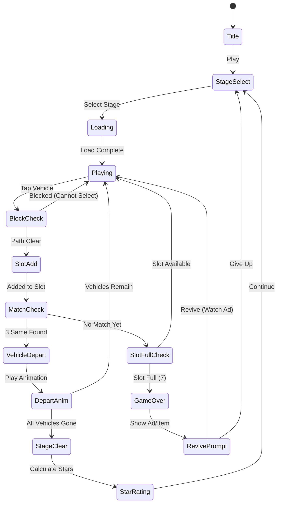

# Car Match - Traffic Puzzle

> 차량 매치와 교통 정리를 결합한 하이브리드 퍼즐. 같은 색 차량 3대를 매칭해 도로를 정리하라.

## 개요

주차장과 도로에 뒤섞인 차량들을 정리하는 퍼즐 게임. 플레이어는 같은 색/종류의 차량 3대를 선택해 출발시키고, 모든 차량을 정리하면 스테이지 클리어. Found3의 3매치 메카닉에 교통 퍼즐(슬라이딩/이동 경로)을 결합한 하이브리드 장르.

### 왜 이 게임인가? (0점 평점 분석)

- **0점 = 신규 미출시** — 레퍼런스 게임이 아직 시장에 나오지 않은 상태
- 교통 퍼즐 장르(Traffic Jam, Unblock Me)는 글로벌 상위권 캐주얼 장르
- 3매치 + 교통 퍼즐 하이브리드는 검증된 양쪽 메카닉을 결합한 블루오션
- **선점 기회**: 경쟁 포화 전 빠른 출시로 니치 선점 가능
- CPI 낮은 교통/주차 퍼즐 크리에이티브 + 3매치 유저층 동시 공략

---

## 게임 규칙

### 핵심 메카닉

1. **그리드 보드**: 주차장 + 도로가 결합된 격자형 맵
2. **차량 선택**: 플레이어가 차량을 탭하면 하단 **대기 슬롯(최대 7칸)**으로 이동
3. **3매치 출발**: 슬롯에 같은 색/종류 차량 3대가 모이면 자동으로 **출발(제거)**
4. **경로 제약**: 일부 차량은 앞이 막혀 직접 선택 불가 → 막힌 차량을 먼저 치워야 선택 가능
5. **슬롯 오버**: 슬롯 7칸이 모두 차고 3매치 불가 시 **게임 오버**
6. **스테이지 클리어**: 모든 차량 출발 완료

### 교통 그리드 규칙

- 차량은 **전진 방향**이 정해져 있음 (↑↓←→)
- 앞 칸이 다른 차량으로 막힌 경우 선택 불가 (회색 잠금 표시)
- 빈 공간이 생기면 뒤 차량이 앞으로 이동 (자동 슬라이드)
- 특수 구역: 주차 칸(고정), 도로 칸(슬라이딩 가능)

### 매칭 기준

| 기준 | 설명 |
|------|------|
| 색상 | 빨강/파랑/노랑/초록/보라/주황 (6색) |
| 크기 | 소형/중형/대형이 다른 경우 매치 불가 |
| 특수 | 특수 차량(트럭/버스)은 동종끼리만 매치 |

> **매치 우선순위**: 색상 > 크기. 같은 색이어도 크기 다르면 매치 안 됨.

---

## 차량 타입

### 일반 차량

| 타입 | 크기 | 칸 점유 | 특징 |
|------|------|---------|------|
| 소형차 | 소 | 1×1 | 기본, 가장 많음 |
| SUV | 중 | 1×1 | 중반부터 등장 |
| 세단 | 소 | 1×1 | 소형차와 다른 색군 |

### 특수 차량

| 타입 | 크기 | 칸 점유 | 특징 |
|------|------|---------|------|
| 트럭 | 대 | 1×2 | 2칸 점유, 이동 시 경로 2칸 비워야 함 |
| 버스 | 대 | 1×2 | 트럭과 동형, 색상 구분 |
| 구급차 | 특수 | 1×1 | 단독 와일드카드(어떤 색과도 매치) |
| 경찰차 | 특수 | 1×1 | 슬롯에 들어오면 인접 차량 1대 제거 |

### 장애물

| 타입 | 설명 |
|------|------|
| 공사 콘 | 이동 불가 고정 장애물 |
| 잠긴 차량 | 열쇠 아이템 사용 전 선택 불가 |
| 가중 차량 | 슬롯 2칸을 차지하는 대형 특수 차량 |

---

## 게임 플로우



---

## UI 레이아웃

```
┌────────────────────────────┐
│ ←  Stage 12   ⭐⭐⭐  🔔  │  ← 상단 HUD (뒤로/스테이지/별/설정)
│    [━━━━━━━━──────] 60s   │  ← 타이머 바
├────────────────────────────┤
│                            │
│  ┌──┬──┬──┬──┬──┬──┐      │
│  │🔴│🔵│🔴│🟡│  │  │      │
│  ├──┼──┼──┼──┼──┼──┤      │
│  │🟡│🔴│🔵│🔴│🔵│  │      │  ← 교통 그리드
│  ├──┼──┼──┼──┼──┼──┤      │    (회색=막힘, 빈칸=이동가능)
│  │  │🟡│🚛│🚛│🟡│🔵│      │
│  ├──┼──┼──┼──┼──┼──┤      │
│  │🔵│  │🔴│🟢│🔴│  │      │
│  └──┴──┴──┴──┴──┴──┘      │
│                            │
├────────────────────────────┤
│ [🔴][🔵][🔴][  ][  ][  ][  ] │  ← 대기 슬롯 (7칸)
├────────────────────────────┤
│  🔀 Shuffle  ↩️ Undo  🔑 Key │  ← 아이템
└────────────────────────────┘
```

### 차량 상태 표시

| 상태 | 표시 |
|------|------|
| 선택 가능 | 밝은 색, 살짝 위아래 흔들림 |
| 막힘 (앞 차 있음) | 어둡게 + 자물쇠 아이콘 |
| 슬롯 대기 중 | 슬롯 칸에 작게 표시 |
| 매치 완료 출발 | 앞으로 달려나가는 애니메이션 |

---

## 스코어링 시스템

| Action | Score |
|--------|-------|
| 차량 3매치 출발 | +100 |
| 연속 매치 콤보 | +100 × 콤보 수 |
| 특수 차량 매치 | +200 |
| 스테이지 클리어 | +500 |
| 남은 시간 보너스 | 남은초 × 15 |
| 아이템 미사용 클리어 | +300 |

### 별점 기준

| 별 | 조건 |
|----|------|
| ⭐ | 스테이지 클리어 |
| ⭐⭐ | 아이템 1개 이하 사용 |
| ⭐⭐⭐ | 아이템 미사용 + 제한 시간 50% 이상 남김 |

---

## 난이도 설계

### 단계별 설정

| Level | 차량 수 | 색상 수 | 특수 차량 | 장애물 | 시간(초) | 그리드 |
|-------|---------|---------|---------|--------|----------|--------|
| 1~5 | 12~18 | 3 | 없음 | 없음 | 120 | 4×4 |
| 6~15 | 18~24 | 4 | 트럭 1대 | 콘 1~2 | 100 | 5×5 |
| 16~30 | 24~30 | 5 | 트럭/버스 | 콘 2~4 | 90 | 6×6 |
| 31~50 | 30~36 | 6 | 모든 특수 | 콘+잠금 | 80 | 6×6 |
| 51+ | 36+ | 6 | 모든 특수 | 복합 | 70 | 6×7 |

### 난이도 밸런싱 원칙

- **막힌 경로 비율**: 전체 차량의 30~50%는 직접 선택 불가 상태로 시작
- **필수 이동 수**: 클리어에 최소 N번의 순서 있는 선택 필요 (N = 레벨 × 2)
- **데드락 방지**: 모든 스테이지는 솔버로 해결 가능 여부 사전 검증

---

## 아이템/도구

| Item | 획득 방법 | Effect |
|------|-----------|--------|
| 🔀 Shuffle | 기본 제공 (스테이지당 1회) | 보드 차량 위치 랜덤 재배치 |
| ↩️ Undo | 기본 제공 (스테이지당 2회) | 마지막 슬롯 입력 취소 |
| 🔑 Key | 광고 시청 or 유료 구매 | 잠긴 차량 1대 즉시 해제 |
| 💣 Tow Truck | 유료 구매 | 선택 차량 1대 강제 제거 |
| ⏱ Extra Time | 광고 시청 | +30초 추가 |
| 🧲 Magnet | 유료 구매 | 슬롯에서 같은 색 차량 자동 정렬 |

---

## 수익화 전략

### 광고 (주 수익원 — MVP 단계)

| 형태 | 시점 | 내용 |
|------|------|------|
| 보상형 광고 | 게임 오버 시 | 광고 보면 슬롯 3칸 비우기 (부활) |
| 보상형 광고 | 클리어 직전 | ×2 코인 |
| 삽입 광고 | 스테이지 5개마다 | 15~30초 전면 광고 |

### 인앱 결제

| 상품 | 가격대 | 내용 |
|------|--------|------|
| 아이템 팩 소 | $0.99 | Key ×5, Undo ×10 |
| 아이템 팩 중 | $2.99 | 모든 아이템 + 코인 500 |
| 광고 제거 | $3.99 | 영구 광고 제거 |
| 스타터 팩 | $4.99 | 광고 제거 + 아이템 팩 중 |

### KPI 목표 (3개월)

| 지표 | 목표 |
|------|------|
| D1 리텐션 | 40%+ |
| D7 리텐션 | 20%+ |
| 광고 ARPDAU | $0.05+ |
| IAP 전환율 | 3%+ |

---

## 사운드/이펙트

| 이벤트 | 효과음 | 시각 이펙트 |
|--------|--------|------------|
| 차량 선택 | 경적 "빵" | 차량 살짝 점프 |
| 슬롯 이동 | 타이어 끌리는 소리 | 슬라이드 애니메이션 |
| 3매치 출발 | 엔진 가속음 | 차량이 화면 밖으로 쌩하고 달려나감 + 먼지 파티클 |
| 콤보 | 연속 경적 + 상승 톤 | 콤보 숫자 팡팡 |
| 게임 오버 | 교통 경적 혼잡 사운드 | 화면 흔들림 |
| 스테이지 클리어 | 경쾌한 팡파르 | 별 3개 애니메이션 |
| 장애물 충돌 | 둔탁한 효과음 | 빨간 X 표시 |

---

## 비주얼 가이드

### 아트 스타일

- **톤**: 밝고 귀여운 미니멀 카툰
- **차량 디자인**: 치비(chibi) 스타일 미니카 — 큰 눈, 둥근 몸체
- **컬러 팔레트**: 채도 높은 원색 위주 (빨/파/노/초/보/주황)
- **배경**: 탑뷰(top-down) 도시 주차장/교차로

### 애니메이션 우선순위 (MVP)

1. 차량 출발 애니메이션 (핵심 보상 피드백)
2. 슬롯 이동 슬라이드
3. 매칭 완료 파티클
4. 게임 오버 정체 애니메이션

---

## MVP 범위

### Phase 1 — MVP (1주차 목표)

- [x] 기획서 작성
- [ ] 기본 6×6 그리드 + 소형차만 (색 4종)
- [ ] 차량 선택 → 슬롯 이동 로직
- [ ] 3매치 출발 판정
- [ ] 경로 막힘/해제 로직 (앞 칸 체크)
- [ ] 게임 오버 / 스테이지 클리어 판정
- [ ] 10 스테이지
- [ ] 출발 애니메이션 (기본)
- [ ] Shuffle / Undo 아이템 (각 1회)
- [ ] 타이머

### Phase 2 — 확장 (2주차)

- [ ] 트럭/버스 (2칸 특수 차량)
- [ ] 구급차 와일드카드
- [ ] 경찰차 특수 효과
- [ ] 잠긴 차량 + Key 아이템
- [ ] 보상형 광고 (부활 기능)
- [ ] 삽입 광고
- [ ] 별점 시스템 + 스테이지 셀렉트
- [ ] 30 스테이지

### Phase 3 — 수익화

- [ ] IAP 구현
- [ ] 코인/에너지 시스템
- [ ] 데일리 챌린지
- [ ] 50+ 스테이지

---

## 기술 스택 (개발팀 참고)

| Layer | 기술 | 비고 |
|-------|------|------|
| `lib/car-match` | Phaser.io | 그리드 로직, 차량 이동, 매치 판정 |
| `web/car-match` | React + Stitches | UI 오버레이, HUD, 슬롯 UI |
| `car-match/rn` | RN WebView | 앱 래핑, 광고 브릿지 |

### 핵심 데이터 구조 (의사 코드)

```typescript
// 차량 타입
type Vehicle = {
  id: string
  color: 'red' | 'blue' | 'yellow' | 'green' | 'purple' | 'orange'
  size: 'small' | 'medium' | 'large'
  type: 'car' | 'truck' | 'bus' | 'ambulance' | 'police'
  direction: 'up' | 'down' | 'left' | 'right'
  position: { row: number; col: number }
  isLocked: boolean
}

// 그리드 셀
type Cell = {
  type: 'empty' | 'road' | 'parking' | 'obstacle'
  vehicle: Vehicle | null
}

// 매치 판정
type Slot = Vehicle[]  // 최대 7개
// 슬롯에 추가될 때마다 같은 color+size 3개 체크
```
