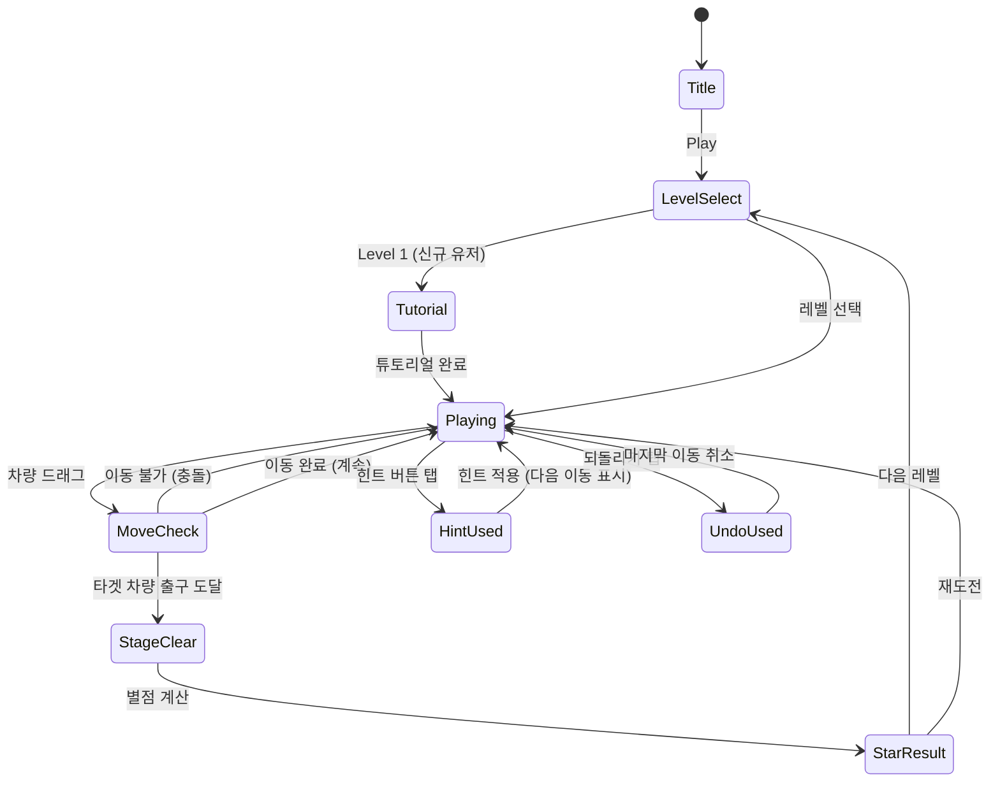

# Car Out! Traffic — 자동차 주차 탈출 퍼즐

> **레퍼런스**: Car Out! Traffic by Tripledot Studios Limited (Rating 4.7, Rank #82)
> **장르**: 슬라이딩 블록 퍼즐 / 주차 탈출
> **교통 퍼즐 시리즈**: 10번째 레퍼런스 종합 기획

---

## 개요

주차장에 가득 찬 차량들 사이에서 **타겟 차량(빨간 차)**을 출구까지 빼내는 슬라이딩 블록 퍼즐.
Rush Hour 원형에서 출발한 검증된 장르. 직관적 조작, 무한 레벨, 힌트 기반 수익화로 글로벌 Top 100 유지 중.

### 왜 이 게임인가

| 항목 | 분석 |
|------|------|
| 개발 난이도 | ★★☆☆☆ (슬라이딩 로직 단순) |
| 시장 검증 | Rush Hour, Unblock Me 포함 수십 개 히트작 존재 |
| 수익화 | 힌트/되돌리기 IAP + 보상형 광고 구조 검증 완료 |
| 리텐션 | 레벨 무한 생성 가능 → 장기 플레이 유도 |
| MVP 기간 | **1주** (그리드 로직 + 50레벨 + 힌트 1종) |

### Tripledot Studios 전략 분석

Tripledot Studios는 **Solitaire**, **Woodoku**, **1010!** 등 미니멀 퍼즐로 수억 다운로드를 달성한 스튜디오.
공통 전략:
- **초저난이도 튜토리얼** → 첫 5분 내 성공 경험 설계
- **광고 없는 첫 세션** → 초기 리텐션 극대화
- **페이스 조절형 힌트** → 막힌 유저가 이탈 전 힌트 구매 유도
- **데일리 챌린지** → 매일 재방문 동기 부여
- **시각적 만족감** → 차량 슬라이딩·탈출 애니메이션 폴리싱에 집중

---

## 게임 규칙

### 기본 규칙

- 보드는 **6×6 그리드** (기본), 고급 레벨은 8×8
- 차량은 **2칸 또는 3칸** 크기
- **수평 차량**: 좌우로만 이동
- **수직 차량**: 상하로만 이동
- **타겟 차량(빨간 차)**: 항상 수평, 우측 출구로 탈출해야 함
- 차량은 다른 차량을 통과할 수 없음 (충돌 판정)
- 타겟 차량이 출구 라인에 도달하면 **스테이지 클리어**
- 이동 횟수가 적을수록 높은 별점 (1~3성)

### 조작 방법

- **드래그**: 차량을 이동 방향으로 드래그
- **탭 후 방향키**: 탭으로 차량 선택 → 이동 방향 탭
- 이동 가능한 칸까지만 슬라이딩 (자동 스냅)

### 클리어 조건

```
타겟 차량(빨간 차)이 우측 출구까지 이동 완료
```

### 별점 기준

| 별점 | 조건 |
|------|------|
| ⭐⭐⭐ | 최적 이동 횟수 이내 |
| ⭐⭐ | 최적 + 3회 이내 |
| ⭐ | 그 이상 |

---

## 게임 플로우



---

## UI 레이아웃

```
┌─────────────────────────────┐
│  ← Back    Lv.42   ⭐⭐☆   │  ← 상단 HUD (레벨, 현재 별점 예측)
│            이동: 12         │
├─────────────────────────────┤
│                             │
│  ┌───┬───┬───┬───┬───┬───┐ │
│  │   │[B]│[B]│   │   │   │ │  ← 6×6 그리드
│  ├───┼───┼───┼───┼───┼───┤ │     [R] = 타겟 차량 (빨간)
│  │[V]│   │   │[H]│[H]│   │ │     [B] = 블로킹 차량
│  ├───┼───┼───┼───┼───┼───┤ │     [V] = 수직 차량
│  │[V]│[R]│[R]│   │[W]│   →│ │     [H] = 수평 차량
│  ├───┼───┼───┼───┼───┼───┤ │     → = 출구
│  │   │   │[W]│   │[W]│   │ │
│  ├───┼───┼───┼───┼───┼───┤ │
│  │[L]│[L]│[L]│   │   │[T]│ │
│  ├───┼───┼───┼───┼───┼───┤ │
│  │   │   │   │[T]│[T]│   │ │
│  └───┴───┴───┴───┴───┴───┘ │
│                             │
├─────────────────────────────┤
│  💡 힌트     ↩️ 되돌리기    │  ← 하단 액션 버튼
│  🔄 초기화                  │
└─────────────────────────────┘
```

### 클리어 화면

```
┌─────────────────────────────┐
│                             │
│       🚗💨  탈출 성공!      │
│                             │
│         ⭐ ⭐ ⭐            │
│                             │
│   이동 횟수: 14             │
│   최적 이동: 12             │
│                             │
│  [다음 레벨]  [재도전]      │
│                             │
└─────────────────────────────┘
```

---

## 기술 설계

### 데이터 모델

```typescript
// 차량 방향
type Orientation = 'horizontal' | 'vertical';

// 차량 정의
interface Vehicle {
  id: string;
  orientation: Orientation;
  row: number;      // 시작 행 (0-indexed)
  col: number;      // 시작 열 (0-indexed)
  length: number;   // 2 or 3
  isTarget: boolean; // 빨간 차 여부
  color: string;    // 차량 색상 (렌더링용)
}

// 보드 상태
interface BoardState {
  size: number;         // 6 or 8
  vehicles: Vehicle[];
  exitRow: number;      // 출구 행 (타겟 차량과 동일)
  moveCount: number;
  optimalMoves: number; // BFS로 사전 계산
}

// 레벨 정의
interface Level {
  id: number;
  difficulty: 'easy' | 'medium' | 'hard' | 'expert';
  board: BoardState;
  starThresholds: [number, number]; // [3성 기준, 2성 기준] 이동 횟수
}
```

### 핵심 로직

#### 1. 이동 가능 범위 계산

```
차량 드래그 시:
1. 해당 차량의 orientation 확인
2. 방향에 따라 좌/우 또는 상/하로 빈 칸 탐색
3. 다른 차량 또는 보드 경계까지가 이동 가능 범위
4. 드래그 거리를 그리드 단위로 스냅
```

#### 2. 충돌 판정

```
이동 시도 전:
- 그리드 점유 맵 (2D boolean array) 유지
- 이동 경로의 각 칸이 비어있는지 확인
- 충돌 시 가능한 최대 거리로 자동 스냅
```

#### 3. 클리어 판정

```
매 이동 후:
- 타겟 차량의 col + length == boardSize (출구 도달 확인)
- 조건 만족 시 클리어 애니메이션 트리거
```

#### 4. 힌트 로직 (BFS)

```
현재 상태에서 BFS로 최단 경로 탐색:
- 상태 = 모든 차량의 위치 조합 (string으로 직렬화)
- 방문한 상태 기록 (Set)
- 클리어까지의 다음 1수 반환
- 복잡한 레벨은 precompute하여 JSON에 포함
```

#### 5. 탈출 애니메이션

```
클리어 판정 후:
1. 타겟 차량 우측으로 화면 밖까지 슬라이딩 (Tween, 0.4s)
2. 먼지/속도감 파티클 이펙트
3. 별점 카운트업 애니메이션
4. 클리어 화면 페이드인
```

### Phaser.io 구현 계획

| 컴포넌트 | 구현 방식 |
|----------|-----------|
| 그리드 렌더링 | Phaser.GameObjects.Graphics + Sprite |
| 차량 드래그 | Phaser.Input.Pointer (dragstart/drag/dragend) |
| 이동 스냅 | Tween (duration: 100ms, ease: 'Power2') |
| 탈출 애니메이션 | Tween chain + Particle emitter |
| 레벨 데이터 | JSON 파일 (levels.json) |
| 힌트 표시 | 화살표 Sprite + Tween 점멸 |

---

## 레벨 설계

### 난이도 분포 (초기 100레벨)

| 난이도 | 레벨 범위 | 최적 이동 횟수 | 보드 크기 | 차량 수 |
|--------|-----------|----------------|-----------|---------|
| Easy | 1~20 | 5~10 | 6×6 | 5~7 |
| Medium | 21~50 | 11~20 | 6×6 | 8~10 |
| Hard | 51~80 | 21~35 | 6×6 | 11~13 |
| Expert | 81~100 | 36+ / 8×8 | 6×6 or 8×8 | 14+ |

### 튜토리얼 레벨 (Level 1~3)

```
Level 1: 타겟 차량 앞에 차량 1대만 존재, 1번 이동으로 클리어
Level 2: 2단계 이동 필요, 간접 막힘 도입
Level 3: 3단계 이동, 연쇄 이동 개념 도입
```

### 레벨 생성 전략

1. **수작업 큐레이션 50레벨**: 난이도 곡선 정밀 조정
2. **알고리즘 생성 50레벨**: 역방향 생성 (클리어 상태 → 랜덤 역이동)
3. **BFS 검증**: 모든 레벨 최적 이동 횟수 사전 계산

---

## 수익화 설계

### 수익화 구조

```
무료 플레이 (기본)
    └─ 레벨 클리어 후 광고 (선택 시청 → 보상)
    └─ 힌트 소진 시 광고 시청 또는 IAP

IAP 구조
    └─ 힌트 팩: ₩1,900 (5개) / ₩4,900 (15개) / ₩9,900 (40개)
    └─ 되돌리기 무제한: ₩3,900 (1주) / ₩9,900 (영구)
    └─ 광고 제거: ₩5,900 (영구)
```

### 힌트 시스템

| 힌트 종류 | 효과 | 소비 |
|-----------|------|------|
| 다음 이동 표시 | 최적 경로의 다음 1수를 화살표로 표시 | 1개 |
| 자동 풀기 | BFS 최적 경로로 자동 완성 (3배속) | 5개 |

### 광고 배치 전략 (Tripledot 방식)

| 위치 | 광고 유형 | 조건 |
|------|-----------|------|
| 레벨 클리어 후 | 전면 광고 | 5레벨마다 1회 (조정 가능) |
| 힌트 획득 | 보상형 광고 | 힌트 0개 시 "광고 보고 1개 받기" |
| 레벨 실패 재도전 | 보상형 광고 | "광고 보고 이동 +5회" |
| 홈 화면 복귀 | 배너 광고 | 상시 (하단) |

### 핵심 지표 목표 (KPI)

| 지표 | 목표 |
|------|------|
| Day 1 Retention | 40%+ |
| Day 7 Retention | 20%+ |
| ARPDAU | $0.05+ |
| 힌트 구매 전환율 | 3%+ |
| 세션당 평균 레벨 수 | 5+ |

---

## 스테이지 선택 UI

```
┌─────────────────────────────┐
│  🚗 Car Out! Traffic         │
├─────────────────────────────┤
│  EASY           MEDIUM       │
│  [⭐⭐⭐][⭐⭐⭐][⭐⭐☆]  │
│   1      2      3            │
│  [⭐⭐☆][⭐☆☆][🔒]       │
│   4      5      6            │
├─────────────────────────────┤
│  HARD           EXPERT       │
│  [🔒][🔒][🔒]              │
├─────────────────────────────┤
│  📅 오늘의 챌린지            │
│  [도전하기] 남은 시간: 18:42 │
└─────────────────────────────┘
```

---

## 사운드/이펙트

| 이벤트 | 사운드 | 이펙트 |
|--------|--------|--------|
| 차량 드래그 | 슬라이딩 마찰음 | 없음 |
| 이동 스냅 | 툭 소리 | 없음 |
| 이동 불가 | 낮은 진동음 | 차량 흔들림 (Tween) |
| 클리어 | 엔진 가속음 + 환호 | 먼지 파티클, 별 카운트업 |
| 힌트 표시 | 팅 소리 | 화살표 점멸 |
| 별점 획득 | 별 반짝임 소리 (3단계) | 별 순차 점등 |

---

## 데일리 챌린지

- 매일 1개의 특별 레벨 제공
- **Expert 급 난이도**, 전 세계 공통 레벨
- 클리어 시 전용 보상 (코인, 힌트 팩)
- 이동 횟수 리더보드 (소셜 경쟁)
- 재방문율 향상 핵심 기능

---

## MVP 범위

### Phase 1 — MVP (1주 목표)

- [x] 기획서 작성
- [ ] 6×6 그리드 렌더링
- [ ] 차량 드래그 & 이동 로직
- [ ] 충돌 판정 (그리드 점유 맵)
- [ ] 클리어 판정 + 탈출 애니메이션
- [ ] 이동 횟수 카운터 + 별점 계산
- [ ] Easy 20레벨 + 튜토리얼 3레벨
- [ ] 힌트 시스템 (다음 이동 표시)
- [ ] 되돌리기 기능
- [ ] 레벨 선택 화면 (Easy only)

### Phase 2 — 수익화 & 콘텐츠 (2주차)

- [ ] IAP 힌트 구매 플로우
- [ ] 보상형 광고 통합
- [ ] Medium / Hard 레벨 50개 추가
- [ ] 데일리 챌린지 시스템
- [ ] 레벨 진행 저장 (LocalStorage)
- [ ] 사운드/햅틱 피드백

### Phase 3 — 폴리싱 & Expert

- [ ] Expert 레벨 30개 + 8×8 보드
- [ ] 자동 풀기 힌트
- [ ] 차량 스킨 (코스메틱 IAP)
- [ ] 이동 횟수 리더보드
- [ ] 전면 광고 최적화 (A/B 테스트)

---

## 교통 퍼즐 장르 종합 결론

### 10개 레퍼런스 통합 인사이트

교통/주차 퍼즐 장르를 분석한 결과, 공통 성공 패턴:

1. **직관적 첫 경험**: 첫 5레벨은 1~3수 해결 가능한 레벨로 구성
2. **점진적 복잡도**: 레벨당 차량 1대씩 추가하는 방식의 곡선
3. **힌트 = 핵심 수익원**: 전체 IAP의 60~70%가 힌트 관련
4. **세션 길이 최적화**: 레벨당 30초~2분이 리텐션 최적 구간
5. **시각 피드백**: 차량 탈출 순간이 도파민 포인트 — 애니메이션 폴리싱 필수

### Car Out! 채택 이유 (vs 다른 교통 퍼즐)

| 비교 항목 | Car Out! | 일반 교통 퍼즐 |
|-----------|----------|----------------|
| 구현 복잡도 | 낮음 (단방향 슬라이딩) | 보통~높음 |
| 레벨 생성 | 알고리즘 자동화 용이 | 수작업 필요 多 |
| 수익화 검증 | Tripledot 4.7점 / Top 100 | 미검증 多 |
| Phaser 적합성 | 그리드 기반, 완벽 적합 | 케이스별 상이 |

**결론**: Car Out! Traffic은 개발 속도, 시장 검증, 수익화 구조 모두에서 **지금 당장 만들기 최적인 장르**. 1주 MVP 출시 후 데이터 수집 시작.

---

## 기술 스택 요약

| 레이어 | 기술 |
|--------|------|
| `lib/car-out` | Phaser.io 3.x — Scene, Sprite, Tween, Input |
| `web/car-out` | React + TypeScript + Stitches — 레벨 선택, HUD |
| `car-out/rn` | React Native WebView — 전체화면 래핑 |
| 레벨 데이터 | JSON (levels.json) — 100+ 레벨 |
| 힌트 로직 | BFS (precomputed) — lib 내 solver.ts |
