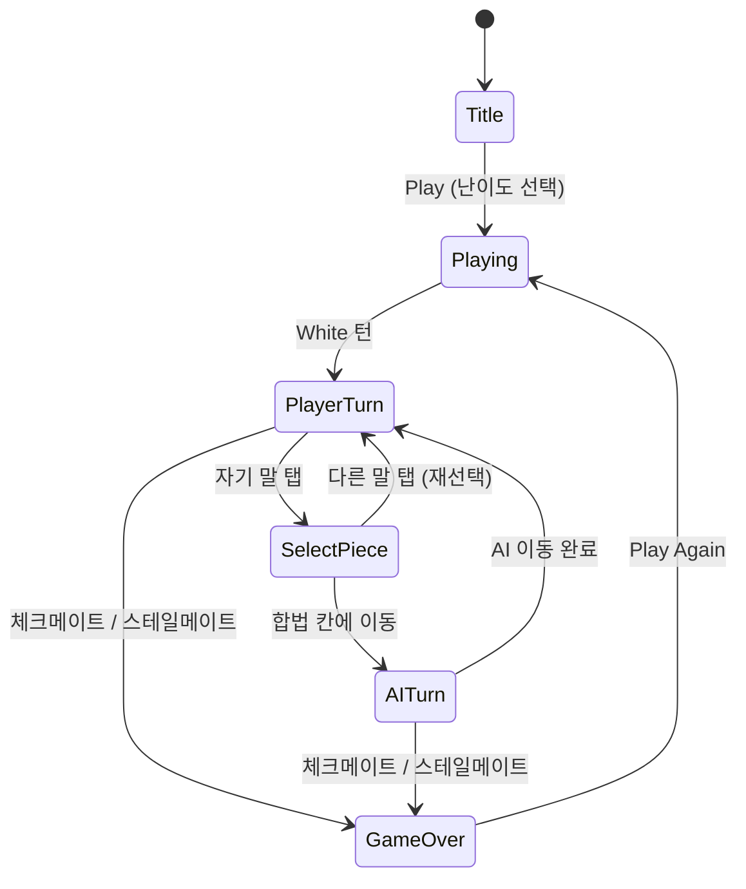

# Chess

> 클래식 체스 — chess.com 스타일 미니멀 2D 보드, 룰 무결, AI 봇 지원

## 개요

표준 8×8 체스. 플레이어(White) vs AI(Black). 모든 공식 룰을 정확히 지키는 것이
최우선이며, 시각적으로는 chess.com 스타일의 깔끔하고 직관적인 2D 보드를 사용한다.
유니코드 체스 기호(♔♕♖♗♘♙)로 말을 표현하여 에셋 로딩 없이 빠르게 렌더링한다.

## 게임 규칙

### 기본 규칙
- 8×8 보드, 표준 초기 배치
- White가 먼저 움직임
- 각 말은 표준 이동 규칙을 따른다 (Pawn/Knight/Bishop/Rook/Queen/King)
- 자기 킹이 체크 상태에 놓이는 수는 둘 수 없음

### 특수 규칙 (필수 구현)
- **앙파상 (En passant)**: 상대 폰이 막 2칸 전진했고, 그 옆에 내 폰이 있을 때, 즉시 다음 수에서만 대각선으로 잡을 수 있음. 잡힌 폰은 통과한 칸이 아닌 시작 칸에서 제거됨.
- **캐슬링 (Castling)**: 킹사이드(O-O)와 퀸사이드(O-O-O) 모두 지원
  - 킹과 해당 룩이 한 번도 움직이지 않았어야 함
  - 킹과 룩 사이의 칸이 모두 비어있어야 함
  - 킹이 현재 체크 상태가 아니어야 함
  - 킹이 지나가는 칸 또는 도착 칸이 공격받지 않아야 함 (퀸사이드의 b파일은 비기만 하면 됨)
- **프로모션 (Promotion)**: 폰이 마지막 랭크 도달 시 **자동으로 퀸으로 승격** (MVP)

### 종료 조건
- **체크메이트**: 체크 상태이고 합법적인 수가 없으면 상대 승리
- **스테일메이트**: 체크가 아닌데 합법적인 수가 없으면 무승부
- (MVP는 50수 룰/3회 반복은 미구현, 추후 추가)

## 게임 플로우



## UI 레이아웃

```
┌─────────────────────────────┐
│  HUD: ♙ You  vs  ♟ AI       │
│  Status: Your turn / Check! │
├─────────────────────────────┤
│                             │
│   ┌─┬─┬─┬─┬─┬─┬─┬─┐         │
│   │ │ │ │ │ │ │ │ │         │
│   ├─┼─┼─┼─┼─┼─┼─┼─┤  8×8    │
│   │ │ │ │ │ │ │ │ │  보드   │
│   └─┴─┴─┴─┴─┴─┴─┴─┘         │
│                             │
│   [Play Again] (게임 종료시) │
└─────────────────────────────┘
```

색상 팔레트 (chess.com classic):
- 라이트 칸: `#F0D9B5`
- 다크 칸: `#B58863`
- 선택된 칸: `#F7EC74` (노란 하이라이트)
- 합법 이동 도트: `#646F40` (어두운 녹색)
- 마지막 수 칸: 약간 노란 틴트

## 스코어링 시스템

- 승/패/무승부 카운트만 (현재 라운드 + 누적)
- 추후: ELO, 체크메이트까지의 수, 잡은 말 가치 등 추가 가능

## 난이도 설계 (AI 레벨)

플러그형 `ChessAI` 인터페이스로 설계하여 새 AI를 쉽게 추가할 수 있다.

```typescript
interface ChessAI {
  selectMove(state: BoardState): Move | null;
}
```

| Difficulty | AI 종류    | 동작 |
|------------|------------|------|
| easy       | RandomAI   | 모든 합법 수 중 랜덤 선택 |
| medium     | GreedyAI   | 잡는 수 우선 (말 가치 기반), 동률은 랜덤 |
| hard       | GreedyAI*  | MVP는 GreedyAI 동일, 추후 MinimaxAI로 교체 (TODO) |

말 가치: P=1, N=3, B=3, R=5, Q=9, K=∞.

미래 확장: MinimaxAI (alpha-beta), 오프닝 북, Stockfish WASM 연동 등.

## 사운드/이펙트 (햅틱)

웹은 이벤트명만 전달, RN의 `HAPTIC_PATTERNS` 맵에서 패턴 결정 (ADR-014).

| 이벤트              | 시점                    | RN 패턴             |
|---------------------|-------------------------|---------------------|
| chess-piece-tapped  | 자기 말 탭              | Heavy × 1           |
| chess-capture       | 잡는 수 실행            | Heavy × 1           |
| chess-check         | 체크 발생               | Heavy × 3           |
| chess-checkmate     | 게임 종료 (체크메이트)  | Heavy × 6           |

햅틱은 탭 시점 즉시 발생 (애니메이션 전).

## MVP 범위

- ✅ PvAI 모드만 (PvP, 온라인 미포함)
- ✅ 플레이어는 White 고정 (색 선택은 추후)
- ✅ 프로모션 선택 UI (PR #230 구현됨)
- ✅ 모든 표준 룰 (캐슬링 / 앙파상 / 프로모션 / 체크메이트 / 스테일메이트)
- ✅ 난이도 3단계 (easy=Random, medium=Greedy, hard=Greedy)
- ✅ 햅틱 4종
- ❌ 엔진 프로모션 로직 연동 (#221)
- ❌ 50수 룰, 3회 반복 무승부 (#222)
- ❌ 무브 히스토리 / SAN / PGN export (#229)
- ❌ 체스 시계 / Time Control (#228)

## Phase 2: Chess Parity (실작업 항목)

다음 기능들은 실제 서비스급 체스 플레이 경험을 위해 순차적으로 구현한다.

- [ ] **프로모션 로직 연동 (#221)**: UI 선택값이 엔진 `applyMove`에 반영되도록 수정 (현재 퀸 고정)
- [ ] **무승부 규칙 상세 구현 (#222)**: Threefold repetition, 50-move rule, Insufficient material 판정 및 UI 알림
- [ ] **AI 및 플레이 옵션 고도화 (#223)**: Hard 난이도용 MinimaxAI 도입, 플레이어 색상(Black/White) 선택 지원
- [ ] **보드 UX 개선 (#225)**: 드래그 앤 드롭 이동, 좌표(a-h, 1-8) 표시, 보드 뒤집기, 화살표/마킹 기능
- [ ] **매치 제어 플로우 (#226)**: 기권(Resign), 무승부 제안/수락, Abort 정책, Rematch/New Game 흐름
- [ ] **Premove 지원 (#227)**: 고속 플레이를 위한 상대 턴 중 수 예약 및 자동 실행 UX
- [ ] **체스 시계 도입 (#228)**: 플레이어별 타이머, Time Control 프리셋(Bullet/Blitz/Rapid), Increment 지원
- [ ] **기보 및 복기 시스템 (#229)**: SAN 생성, PGN export, Move List UI, 게임 히스토리 탐색(되감기)

## Phase 3: Platform Parity (Roadmap)

온라인 플랫폼으로서의 확장을 위한 기술 로드맵 (구현 이슈 #224 해결).

1. **온라인 대전 인프라**: 서버 Authoritative state 관리, 실시간 PvP 매치메이킹, 재접속 처리
2. **레이팅 시스템**: Glicko-2 또는 ELO 기반 유저 레이팅, Rated/Unrated 모드 분리
3. **사용자 데이터**: 계정 기반 전적 관리, 히스토리 저장소, 전역 리더보드
4. **분석 및 학습**: 게임 종료 후 엔진 기반 리뷰 (Accuracy, Blunder 감지), 분석 보드 모드
5. **운영 및 보안**: Anti-cheat 시스템, 유저 신고 및 매너 점수 관리
