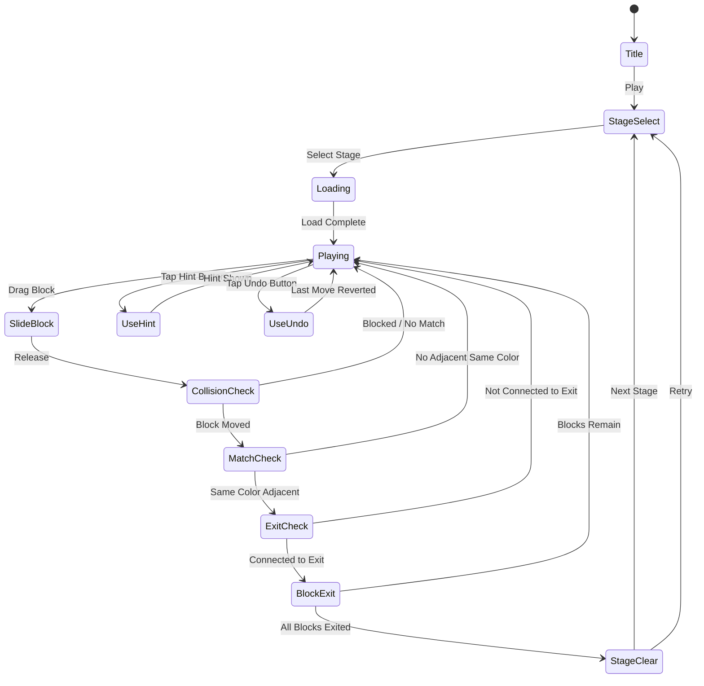

# Color Block Jam

> 색상 블록을 슬라이드하여 같은 색끼리 출구로 보내는 교통 퍼즐 게임.
> Rush Hour + 색상 매칭 하이브리드. 심플한 규칙, 깊은 전략.

## 개요

격자 보드 위에 다양한 색상의 블록이 배치되어 있다. 플레이어는 블록을 수평 또는 수직으로 슬라이드하여 같은 색 블록끼리 인접시키고, 해당 색상의 출구로 탈출시킨다. 모든 블록을 탈출시키면 스테이지 클리어.

### 핵심 차별점

| 비교 | Rush Hour (#12) | Color Road (#33) | **Color Block Jam** |
|------|----------------|-----------------|---------------------|
| 이동 방식 | 슬라이드 | 경로 그리기 | **슬라이드** |
| 목표 | 특정 블록 탈출 | 색상 수집 | **색상 매칭 + 탈출** |
| 퍼즐 깊이 | 높음 | 낮음 | **중간 (접근성 ↑)** |
| 핵심 재미 | 논리 | 캐주얼 | **발견 + 논리** |

---

## 게임 규칙

### 기본 규칙

- 보드는 N×N 격자 (기본 6×6, 최대 8×8)
- 블록은 **1×1** 또는 **1×2** 크기로 배치
- 블록은 자신의 축(수평/수직)으로만 슬라이드 가능
- 다른 블록 또는 벽에 막히면 이동 불가
- **같은 색 블록이 인접하면 출구 방향으로 탈출 가능**
- 출구는 보드 가장자리에 색상별로 배치됨
- 모든 블록 탈출 시 **스테이지 클리어**

### 블록 이동 규칙

```
수평 블록: ←→ 이동만 가능
수직 블록: ↑↓ 이동만 가능
1×1 블록: 수평/수직 둘 다 이동 가능 (특수 타입)
```

### 색상 매칭 & 탈출 조건

1. 같은 색 블록 2개 이상이 **직선으로 인접**
2. 인접한 그룹이 해당 색의 **출구와 연결**되면 탈출 가능
3. 탈출 시 블록 전체가 보드에서 제거됨 (애니메이션)
4. 단색 블록 1개만으로도 출구와 직접 인접하면 탈출 가능

### 특수 블록 (Phase 2)

| 블록 타입 | 설명 |
|-----------|------|
| 잠금 블록 | 특정 조건 달성 전 이동 불가 |
| 방향 블록 | 한 방향으로만 이동 가능 |
| 멀티컬러 블록 | 2가지 색상 보유, 어느 색과도 매칭 가능 |

---

## 게임 플로우



---

## UI 레이아웃

### 메인 게임 화면

```
┌─────────────────────────────┐
│  ← Stage 12    ⭐ 0   🔇    │  ← 상단 HUD (스테이지, 스코어, 음소거)
├─────────────────────────────┤
│   이동 횟수: 7    ⭐⭐⭐      │  ← 별점 가이드 (N이동 이하 = 3별)
├─────────────────────────────┤
│                             │
│  🟥→  ·  🟦  ·  ·  🟥出    │
│   ·  🟩  ·  🟦  ·   ·      │
│   ·   ·  🟥  ·  🟩  ·      │  ← 게임 보드 (6×6)
│  🟦→  ·   ·  🟩  ·   ·      │    (→ = 수평 블록, ↕ = 수직 블록)
│   ·  🟥  ·   ·  🟦出 ·      │
│   ·   ·  🟩出 ·   ·   ·     │
│                             │
├─────────────────────────────┤
│   [💡 힌트]    [↩️ 되돌리기]  │  ← 하단 버튼 (아이템)
└─────────────────────────────┘
```

### 출구 표시

```
보드 가장자리에 색상 게이트 표시
예시: 🟥出 = 빨간색 블록 탈출구
      🟦出 = 파란색 블록 탈출구
```

### 클리어 오버레이

```
┌─────────────────────────────┐
│                             │
│        ✨ CLEAR! ✨          │
│                             │
│       ⭐ ⭐ ⭐               │  ← 별점 (이동 수 기준)
│                             │
│    이동 횟수: 7              │
│    최적 이동: 5              │
│                             │
│  [다음 스테이지]  [재시도]    │
│                             │
│  [광고 보고 힌트 받기]        │  ← 리워드 광고
└─────────────────────────────┘
```

---

## 스코어링 시스템

### 별점 기준 (이동 횟수 기반)

| 별 | 조건 |
|----|------|
| ⭐⭐⭐ | 최적 이동 수 ± 0 (완벽 클리어) |
| ⭐⭐ | 최적 이동 수 + 1~3 이내 |
| ⭐ | 최적 이동 수 초과 (클리어만) |

> 타이머 없음 — 생각할 시간을 충분히 주는 것이 핵심 UX

### 점수 계산

| Action | 점수 |
|--------|------|
| 블록 탈출 1회 | +50 |
| 연속 탈출 (콤보) | +50 × 콤보 수 |
| 3별 클리어 | +300 보너스 |
| 2별 클리어 | +100 보너스 |

---

## 난이도 설계

### 난이도 파라미터

| 파라미터 | 설명 |
|----------|------|
| 보드 크기 | 5×5 → 6×6 → 7×7 → 8×8 |
| 색상 수 | 2 → 3 → 4 → 5 |
| 블록 수 | 색상당 2~4개 |
| 최적 이동 수 | 3 → 5 → 8 → 12+ |
| 특수 블록 | 없음 → 잠금 → 방향 → 멀티컬러 |

### 스테이지 커브 (50 레벨 MVP)

| 레벨 범위 | 보드 | 색상 수 | 블록 수 | 특수 블록 | 난이도 |
|-----------|------|---------|---------|----------|--------|
| 1~10 | 5×5 | 2 | 4~6 | 없음 | 튜토리얼 |
| 11~20 | 6×6 | 3 | 6~9 | 없음 | 쉬움 |
| 21~30 | 6×6 | 3~4 | 8~12 | 잠금(일부) | 보통 |
| 31~40 | 7×7 | 4 | 10~14 | 잠금+방향 | 어려움 |
| 41~50 | 8×8 | 4~5 | 12~16 | 전체 | 도전 |

### 튜토리얼 시퀀스 (레벨 1~3)

```
레벨 1: 빨강/파랑 2색, 블록 4개, 1번 이동으로 클리어 가능 (기본 슬라이드 교육)
레벨 2: 빨강/파랑 2색, 블록 6개, 3번 이동 (색상 매칭 교육)
레벨 3: 3색, 블록 9개, 5번 이동 (복합 조작 교육)
→ 각 레벨에 말풍선 가이드 표시
```

---

## 수익화 설계

### 아이템 시스템

| 아이템 | 효과 | 획득 방법 |
|--------|------|-----------|
| 💡 힌트 | 최적 다음 이동 1수 표시 | 재화 구매 / 광고 시청 |
| ↩️ 되돌리기 | 마지막 이동 취소 (무제한 실행 취소) | 재화 구매 / 광고 시청 |
| 🔀 초기화 | 보드를 초기 상태로 리셋 | 무료 (항상 가능) |

### 광고 리워드

| 상황 | 광고 형태 | 리워드 |
|------|----------|--------|
| 스테이지 클리어 후 | 선택형 (옵트인) | 힌트 2개 |
| 막혔을 때 | 선택형 | 힌트 1개 |
| 스테이지 잠금 | 선택형 | 스테이지 즉시 해금 |
| 앱 실행 | 인터스티셜 (3회 플레이마다) | — |

### 인앱 결제

| 상품 | 가격 | 내용 |
|------|------|------|
| 힌트 팩 소형 | $0.99 | 힌트 5개 |
| 힌트 팩 대형 | $2.99 | 힌트 20개 |
| 광고 제거 | $1.99 | 영구 광고 제거 |
| VIP 패스 | $4.99 | 광고 제거 + 힌트 무제한 30일 |

---

## 사운드 & 이펙트

| 이벤트 | 사운드 | 비주얼 이펙트 |
|--------|--------|---------------|
| 블록 슬라이드 | 슬라이딩 마찰음 | 이동 경로 잔상 |
| 색상 매칭 | 경쾌한 팝 효과음 | 블록 테두리 발광 |
| 블록 탈출 | 상승 톤 효과음 | 파티클 폭발 |
| 콤보 탈출 | 콤보 상승 음계 | 화면 중앙 콤보 텍스트 |
| 스테이지 클리어 | 축하 팡파레 | 별 날아오는 애니메이션 |
| 막힌 이동 | 둔탁한 효과음 | 블록 진동 |

---

## 레벨 데이터 구조

레벨은 JSON으로 관리하여 서버 업데이트 가능:

```json
{
  "id": 1,
  "board": { "width": 5, "height": 5 },
  "blocks": [
    { "id": "r1", "color": "red",  "x": 0, "y": 0, "size": 2, "axis": "horizontal" },
    { "id": "r2", "color": "red",  "x": 3, "y": 2, "size": 1, "axis": "both" },
    { "id": "b1", "color": "blue", "x": 1, "y": 3, "size": 2, "axis": "vertical" }
  ],
  "exits": [
    { "color": "red",  "side": "right", "index": 0 },
    { "color": "blue", "side": "bottom","index": 1 }
  ],
  "optimalMoves": 3,
  "starThresholds": [3, 5, 99]
}
```

---

## MVP 범위

### Phase 1 — MVP (1주 목표)

- [x] 기획서 작성
- [ ] 5×5 ~ 6×6 보드 렌더링
- [ ] 블록 슬라이드 입력 (드래그)
- [ ] 충돌 감지 (블록 ↔ 블록, 블록 ↔ 벽)
- [ ] 색상 매칭 감지 (인접 판정)
- [ ] 출구 탈출 로직 및 애니메이션
- [ ] 클리어 판정 + 별점 계산
- [ ] 튜토리얼 3스테이지 포함 총 10스테이지
- [ ] 되돌리기 (Undo) 기능
- [ ] 기본 사운드 (슬라이드, 클리어)

### Phase 2 — 출시 빌드 (2주차)

- [ ] 50스테이지 완성
- [ ] 힌트 시스템 (최적 수 계산)
- [ ] 리워드 광고 연동
- [ ] 스테이지 셀렉트 화면 + 별점 표시
- [ ] 특수 블록 (잠금, 방향)
- [ ] 파티클 이펙트 완성
- [ ] BGM 추가

### 미포함 (후순위)

- 멀티컬러 블록
- 레벨 에디터
- 소셜 기능 (리더보드, 공유)
- 시즌/이벤트 스테이지
