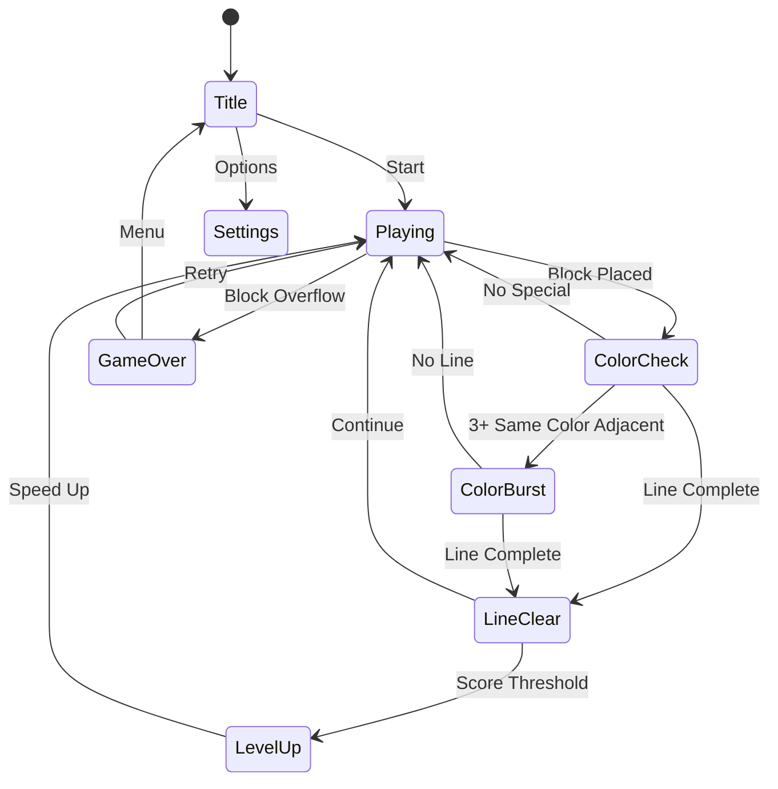

# Color Block

> 테트리스 메카닉에 색상 매칭 요소를 결합한 블록 낙하 퍼즐 게임.
> 같은 색 블록을 인접시켜 보너스를 획득하고, 라인을 클리어하는 전략적 레이어가 추가된다.

---

## 라이선스 리스크 및 게임 정체성

### 테트리스 상표 회피 전략

"테트리스(Tetris)"는 The Tetris Company가 보유한 등록 상표다. 상표 침해 없이 유사 게임을 출시한 사례는 많다.

| 리스크 항목 | 회피 방법 |
|------------|----------|
| 게임 이름 "테트리스" 사용 | 게임명: **"Color Block"** (상표 아님) |
| 테트리노(Tetromino) 형태 | 블록 형태 자체는 저작권 보호 불가 (미국 판례 상 게임 규칙·메카닉 비보호) |
| 테트리스 고유 UI/색상 | 독자적인 색상 테마·UI 디자인 적용 |
| "테트리스" 홍보 문구 | "블록 낙하 퍼즐", "색상 매칭 블록 게임"으로 표기 |

**결론**: 메카닉(낙하 블록 + 라인 클리어)은 게임 규칙으로서 저작권·상표 보호 대상이 아니다. 이름·로고·고유 UI만 차별화하면 법적 문제 없다. 수십 개의 테트리스 클론이 앱스토어에 정상 운영 중.

---

## 개요

보드 위로 색상이 부여된 블록이 낙하한다. 플레이어는 블록을 이동·회전시켜 라인을 완성하면 클리어된다. 핵심 차별점은 **색상 매칭 보너스**: 같은 색 블록이 인접하면 추가 점수와 콤보가 발동한다. 색상을 의식한 배치 전략이 순수 라인 클리어에 깊이를 더한다.

---

## #45 테트리스와 비교

| 항목 | #45 테트리스 (순수) | #74 Color Block (이 게임) |
|------|--------------------|-----------------------------|
| 핵심 목표 | 라인 클리어 | 라인 클리어 + 색상 매칭 |
| 블록 색상 | 시각 구분용 (기능 없음) | 게임 메카닉의 핵심 |
| 전략 레이어 | 형태·위치 계산 | 형태·위치 + 색상 배치 계획 |
| 콤보 시스템 | 멀티라인 (테트리스 4줄) | 색상 인접 체인 + 멀티라인 |
| 난이도 원천 | 속도 증가 | 속도 + 색상 관리 복잡도 |
| 타겟 유저 | 캐주얼~하드코어 | 캐주얼 (색상 = 직관적 가이드) |
| 차별화 포인트 | 없음 (레드오션) | 색상 보너스로 신선함 제공 |

**개발 전략**: #45는 순수 구현 학습용·포트폴리오용. #74는 시장 차별화 포인트를 가진 실제 매출 목표 게임.

---

## 클래식 장르 포트폴리오 종합

| # | 게임 | 장르 | 핵심 메카닉 | 개발 난이도 | 시장성 |
|---|------|------|------------|------------|--------|
| #45 | 테트리스 | 블록 낙하 | 라인 클리어 | 낮음 | 레드오션 |
| **#74** | **Color Block** | **블록 낙하+색상** | **라인+색상 매칭** | **낮음** | **차별화 ✓** |
| #115 | 지뢰찾기 | 논리 퍼즐 | 확률+추론 | 낮음 | 니치 |
| #118 | 틱택토 | 보드 게임 | 2인 전략 | 매우 낮음 | 캐주얼 |

**포트폴리오 전략**:
- **#74 Color Block** → Phase 1 우선 출시 대상. 낮은 개발 난이도 + 명확한 차별점 + 캐주얼 대중성
- #115 지뢰찾기 → 닌텐도 DS 세대 노스탤지어 타겟, 광고형 수익
- #118 틱택토 → 극초단 개발, 멀티플레이어 확장 여지
- #45 테트리스 → Color Block 개발 후 코드 재사용으로 빠르게 추가

---

## 게임 규칙

### 기본 규칙

- 10×20 그리드 보드 (표준 블록 낙하 크기)
- 블록(테트로미노 형태)이 상단에서 낙하
- 플레이어가 이동·회전하여 원하는 위치에 배치
- 가로 한 줄이 꽉 차면 **라인 클리어** → 위 블록 하강
- 블록이 보드 최상단을 초과하면 **게임 오버**

### 색상 시스템

블록 각각의 칸에 색상이 부여된다. 블록 형태(I, O, T, S, Z, L, J) 외에 색상이 핵심 변수다.

**색상 종류**: 빨강, 파랑, 초록, 노랑, 보라 (5색)

### 색상 매칭 규칙

| 조건 | 보너스 |
|------|--------|
| 같은 색 블록 2개 인접 | 해당 칸 점수 ×1.5 |
| 같은 색 블록 3개 연속 인접 | 점수 ×2 + **Color Burst** 이펙트 |
| 같은 색 블록 4개+ 인접 클러스터 | 점수 ×3 + 인접 클러스터 자동 제거 |
| 라인 클리어 시 해당 라인 전체 같은 색 | **Rainbow Clear** → 점수 ×5 |

**Color Burst**: 3개 이상 같은 색 인접 시, 해당 블록들이 라인 클리어와 별도로 터진다. 이 메카닉이 "테트리스와 다른 Color Block만의 핵심 재미"다.

### 넥스트 블록 및 색상 예고

- 다음 블록 1개 미리 보기 (형태 + 색상)
- HOLD 기능: 현재 블록을 홀드하고 다음 블록으로 교체 (1회/라인클리어마다 리셋)

---

## 게임 플로우



---

## UI 레이아웃

```
┌──────────────────────────┐
│  SCORE: 12,400   Lv: 5   │  ← 상단 HUD
│  LINES: 38               │
├────────────┬─────────────┤
│            │ NEXT        │
│  ┌──────┐  │ ┌──┐        │
│  │      │  │ │🟦🟦│       │
│  │  게  │  │ │🟦🟦│       │
│  │  임  │  │ └──┘        │
│  │  보  │  │             │
│  │  드  │  │ HOLD        │
│  │      │  │ ┌───┐       │
│  │ 10×20│  │ │🟥🟥🟥│     │
│  └──────┘  │ └───┘       │
├────────────┴─────────────┤
│  ←   ↻   ↓   ↺   →     │  ← 터치 컨트롤
│      [HARD DROP]         │
└──────────────────────────┘
```

---

## 모바일 조작 (터치 UX)

### 제스처 기반 조작 (우선)

| 제스처 | 동작 |
|--------|------|
| 좌우 스와이프 | 블록 이동 |
| 위로 스와이프 | 하드 드롭 (즉시 낙하) |
| 아래로 스와이프 | 소프트 드롭 (빠른 낙하) |
| 탭 | 시계 방향 회전 |
| 두 손가락 탭 | 반시계 방향 회전 |
| 좌하단 영역 탭 | HOLD |

### 버튼 기반 조작 (보조, 항상 표시)

화면 하단에 고정 버튼 배치:
- `←` `→` 이동 버튼 (꾹 누르면 연속 이동)
- `↻` `↺` 회전 버튼
- `↓` 소프트 드롭
- `⬇` 하드 드롭 (큰 버튼, 실수 방지 위해 약간 분리)

**UX 원칙**:
- 버튼 최소 44×44pt (iOS HIG 기준)
- 게임 보드는 화면 상단 70% 차지
- 가로 모드 지원 불필요 (세로 고정)

---

## 스코어링 시스템

### 기본 라인 클리어

| 동작 | 기본 점수 |
|------|----------|
| 1줄 클리어 | 100 × 레벨 |
| 2줄 동시 클리어 | 300 × 레벨 |
| 3줄 동시 클리어 | 500 × 레벨 |
| 4줄 동시 클리어 (컬러블록) | 800 × 레벨 |

### 색상 보너스

| 조건 | 배율 |
|------|------|
| 2개 인접 | ×1.5 |
| 3개 연속 (Color Burst) | ×2 |
| 4개+ 클러스터 | ×3 |
| Rainbow Clear (라인 전체 동색) | ×5 |

### 콤보

연속 라인 클리어 또는 Color Burst 발생 시:
- 1연속: 기본
- 2연속: ×1.5
- 3연속: ×2
- 4연속+: ×3 (상한)

---

## 난이도 설계

| 레벨 | 낙하 속도 | 블록 색상 수 | 특이사항 |
|------|-----------|------------|----------|
| 1~3 | 느림 (1초/칸) | 3색 | 튜토리얼 구간 |
| 4~7 | 보통 (0.7초/칸) | 4색 | Color Burst 도입 |
| 8~12 | 빠름 (0.4초/칸) | 5색 | Rainbow Clear 가능 |
| 13~20 | 매우 빠름 (0.2초/칸) | 5색 | 난이도 정점 |
| 20+ | 순간 낙하 | 5색 | 생존 모드 |

**레벨업 조건**: 10줄 클리어마다 레벨 +1

---

## 게임 모드

| 모드 | 설명 | MVP |
|------|------|-----|
| **클래식** | 무한 생존, 최고 점수 도전 | ✅ |
| **타임어택** | 2분 내 최고 점수 | Phase 2 |
| **컬러 챌린지** | Color Burst만으로 N점 달성 | Phase 2 |

---

## 사운드/이펙트

| 이벤트 | 사운드 | 이펙트 |
|--------|--------|--------|
| 블록 이동 | 짧은 클릭 | 없음 |
| 블록 배치 | 둔탁한 쿵 | 없음 |
| 라인 클리어 | 상쾌한 팡 | 라인 플래시 |
| Color Burst | 특수 반짝 효과음 | 색상 폭발 파티클 |
| Rainbow Clear | 화려한 팡파르 | 무지개 이펙트 |
| 게임 오버 | 실패 사운드 | 블록 회색 처리 |
| 레벨업 | 상승 톤 | 레벨 배너 |

---

## 수익화

### Phase 1 (MVP 출시 즉시)

| 항목 | 내용 |
|------|------|
| **광고 (배너)** | 게임 하단 배너 광고 (플레이 중 최소화) |
| **광고 (전면)** | 게임 오버 후 인터스티셜 광고 (3회 중 1회) |
| **광고 제거** | 1회 결제 $1.99~$2.99 |

### Phase 2

| 항목 | 내용 |
|------|------|
| **블록 스킨** | 색상 테마 팩 (네온, 파스텔, 레트로) — $0.99/팩 |
| **보드 배경** | 배경 테마 — $0.99/팩 |
| **스타터 팩** | 광고 제거 + 스킨 3종 번들 — $3.99 |
| **무제한 HOLD** | 기본 1회 → 광고 시청으로 추가 1회 제공 |

**수익화 원칙**: 페이-투-윈 없음. 스킨과 편의성만 판매. 공정성 유지가 리텐션의 핵심.

---

## MVP 범위

### Phase 1 — 출시 목표 (1~2주)

- [x] 기획서 작성
- [ ] 10×20 그리드 보드 렌더링
- [ ] 7종 테트로미노 생성 및 낙하
- [ ] 좌우 이동, 회전, 소프트/하드 드롭
- [ ] 라인 클리어 판정 및 블록 하강
- [ ] 색상 배정 시스템 (5색)
- [ ] 색상 인접 감지 → Color Burst 발동
- [ ] 기본 스코어링 + 레벨업
- [ ] 게임 오버 판정
- [ ] 다음 블록 미리보기
- [ ] 배너 광고 연동
- [ ] 전면 광고 (게임 오버 시)
- [ ] 모바일 터치 컨트롤

### Phase 2

- [ ] HOLD 기능
- [ ] 타임어택 모드
- [ ] 블록/배경 스킨 시스템
- [ ] 광고 제거 인앱 결제
- [ ] 최고 점수 리더보드
- [ ] 사운드/이펙트 폴리싱

---

## 기술 구현 참고 (lib 팀 전달용)

- **엔진**: Phaser.io (lib/color-block)
- **그리드**: 2D 배열 `number[][]` — 0: 빈칸, 1~7: 블록 종류, 색상은 별도 레이어
- **색상 레이어**: `string[][]` — 각 칸의 색상값 저장
- **인접 감지**: BFS/DFS로 같은 색 연결 컴포넌트 계산
- **낙하 루프**: Phaser 타이머 이벤트 (레벨별 interval 조정)
- **터치**: Phaser Input + 스와이프 감지 (velocity threshold)
