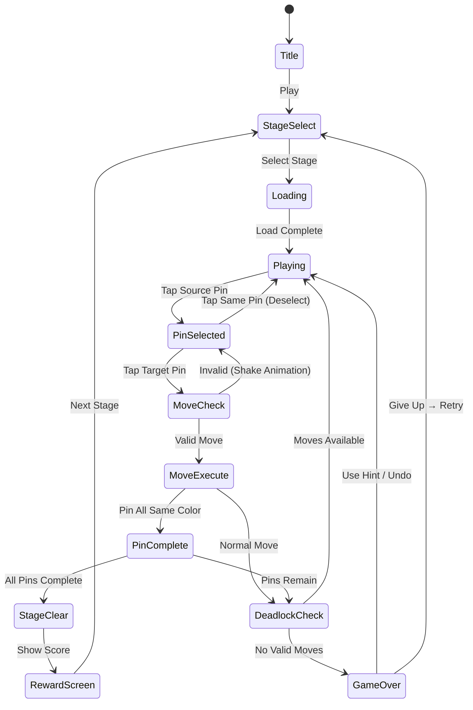

# Color Knitzy

> 뜨개질 테마의 색상 정렬 퍼즐. 핀에 엉켜있는 실타래를 색깔별로 정리하는 힐링 게임.

## 개요

여러 핀(뜨개질 바늘)에 다양한 색상의 실이 섞여 있다. 플레이어는 핀에서 실을 뽑아 다른 핀으로 옮겨가며 같은 색끼리 모은다. 모든 핀에 한 가지 색 실만 남으면 스테이지 클리어.

**핵심 재미**: 뒤엉킨 실타래가 색깔별로 깔끔하게 정렬되는 시각적 만족감 + 하노이 탑 변형 퍼즐의 전략적 쾌감.

### 장르 포지셔닝

| 게임 | 테마 | 메카닉 |
|------|------|--------|
| #17 / #32 (실 풀기류) | 실 | 연결/풀기 |
| **Color Knitzy (#38)** | **뜨개질 실** | **색상 정렬 (하노이 변형)** |

같은 실 테마이지만 메카닉이 완전히 다름. 정렬 퍼즐 특유의 "아 이렇게 하면 되겠다" 전략적 인사이트가 핵심 훅.

---

## 게임 규칙

### 기본 규칙

- 화면에 **N개의 핀**이 있음 (일반 핀 + 빈 핀 1~2개 버퍼)
- 각 핀에는 색상 실이 **위에서 아래로 쌓인** 형태로 배치됨
- 플레이어는 핀 하나를 탭하면 **최상단 실 1가닥**이 선택됨
- 다른 핀을 탭하면 해당 핀으로 실이 이동됨
- 이동 규칙:
  - 대상 핀이 **비어있으면** 항상 이동 가능
  - 대상 핀 최상단 실이 **같은 색**이면 이동 가능
  - 대상 핀 최상단 실이 **다른 색**이면 이동 불가
  - 핀이 **꽉 차있으면** (최대 용량 초과) 이동 불가
- 한 핀에 **같은 색 실만** 남으면 해당 핀 완성 → 잠금 (더 이상 건드릴 수 없음)
- 모든 핀이 완성되면 **스테이지 클리어**

### 연속 이동 (Auto-Stack)

- 실 이동 시, 이동한 실과 같은 색이 대상 핀에 계속 쌓여 있으면 **자동으로 연속 이동** 가능 상태
- 플레이어가 명시적으로 다음 핀을 고르기 전까지 선택 유지

### 게임 오버 조건

- 이동 가능한 수가 **0**이 된 경우 (데드락)
- 선택지가 없어도 즉시 게임오버는 아님 → **힌트 버튼** 또는 **실행 취소**로 탈출 유도

### 핀 구조

```
핀 최대 용량: 4~6 실 (난이도별 조정)

[핀 A]    [핀 B]    [핀 C]    [빈 핀]
  🔴          🔵          🔴
  🔵          🔴          🔵
  🟡          🟡          🟡
  🔴          🔵          🔴
```

---

## 게임 플로우



---

## UI 레이아웃

### 메인 게임 화면

```
┌─────────────────────────────┐
│  ← Stage 12    ⭐ 0   ⏱ 02:34 │  ← 상단 HUD
├─────────────────────────────┤
│                             │
│  🧶 Color Knitzy            │  ← 스테이지 타이틀
│                             │
│  ┌───┐ ┌───┐ ┌───┐ ┌───┐   │
│  │🔴 │ │🔵 │ │🟡 │ │   │   │
│  │🔵 │ │🔴 │ │🔵 │ │   │   │
│  │🟡 │ │🟡 │ │🔴 │ │   │   │
│  │🔴 │ │🔵 │ │🟡 │ │   │   │
│  └───┘ └───┘ └───┘ └───┘   │  ← 핀들 (4개, 마지막은 빈 버퍼)
│   PIN1  PIN2  PIN3  EMPTY   │
│                             │
│  ✨ [완성된 핀은 반짝임 효과] │
│                             │
├─────────────────────────────┤
│  💡 힌트(3)  ↩️ 되돌리기   │  ← 하단 도구
└─────────────────────────────┘
```

### 핀 선택 상태

- 선택된 핀: 상단 실이 **들어올려진 애니메이션** + 핀 테두리 강조
- 이동 가능한 대상 핀: **초록 테두리** 표시
- 이동 불가 핀: **회색 처리** + 탭 시 흔들림(shake) 피드백

### 스테이지 클리어 화면

```
┌─────────────────────────────┐
│                             │
│       🧶 완성!              │
│   뜨개질 패턴이 완성됐어요!   │
│                             │
│  ⭐⭐⭐  (3성 평가)          │
│                             │
│  이동 횟수: 23회            │
│  클리어 시간: 1분 42초       │
│  보너스 점수: +300           │
│                             │
│  [다음 스테이지]  [스테이지 선택] │
└─────────────────────────────┘
```

---

## 스코어링 시스템

| Action | Score |
|--------|-------|
| 핀 1개 완성 | +200 |
| 스테이지 클리어 (기본) | +500 |
| 최소 이동 클리어 보너스 | +300 |
| 시간 보너스 | 남은초 × 5 |
| 힌트 미사용 | +200 |
| 되돌리기 미사용 | +100 |

### 별점 기준 (3성 시스템)

| 별점 | 조건 |
|------|------|
| ⭐ | 클리어 |
| ⭐⭐ | 힌트 1회 이하 OR 최적 이동의 150% 이하 |
| ⭐⭐⭐ | 힌트 없음 AND 최적 이동의 120% 이하 |

---

## 난이도 설계

### 파라미터 정의

| 파라미터 | 설명 |
|----------|------|
| 색상 수 | 정렬해야 할 색상 종류 |
| 핀 수 | 총 핀 개수 (색상 핀 + 빈 핀) |
| 핀 용량 | 핀 하나에 들어갈 수 있는 실 최대 개수 |
| 빈 핀 수 | 버퍼로 사용하는 빈 핀 개수 |

### 레벨별 설계

| 구간 | 레벨 | 색상 수 | 핀 수 | 핀 용량 | 빈 핀 수 |
|------|------|---------|-------|---------|---------|
| 튜토리얼 | 1~3 | 2 | 3 | 4 | 1 |
| 입문 | 4~10 | 3 | 4 | 4 | 1 |
| 초급 | 11~20 | 4 | 5 | 4 | 1 |
| 중급 | 21~30 | 5 | 6 | 5 | 1 |
| 고급 | 31~40 | 6 | 7 | 5 | 1 |
| 전문가 | 41~50 | 7 | 8 | 6 | 2 |
| 마스터 | 51+ | 8+ | 9+ | 6 | 2 |

### 난이도 조절 요소

- **빈 핀 1개 → 2개**: 난이도 급격히 감소 (버퍼 여유)
- **핀 용량 증가**: 더 많은 실 → 더 복잡한 경우의 수
- **색상 혼합도**: 초기 배치 시 같은 색이 최대한 흩어지도록 배치 (알고리즘 제어)

---

## 아이템 / 도구

| 아이템 | 효과 | 획득 방법 |
|--------|------|-----------|
| 💡 힌트 | 최적 다음 이동 1회 표시 | 기본 3개, 광고 리워드 +1 |
| ↩️ 되돌리기 | 이전 이동 상태로 복귀 (무제한) | 기본 제공 |
| 🔮 솔버 | 전체 풀이 경로 자동 재생 | 프리미엄 아이템 |
| 🎨 테마 팩 | 실/핀 비주얼 변경 | IAP / 광고 |

---

## 시각/사운드 효과

### 애니메이션

| 상황 | 효과 |
|------|------|
| 실 선택 | 실이 핀 위로 살짝 들어올려짐 + 흔들림 |
| 실 이동 | 부드러운 포물선 궤적으로 이동 |
| 이동 불가 | 핀 흔들림 (shake) + 빨간 테두리 순간 표시 |
| 핀 완성 | 실 색상이 빛나면서 뜨개질 패턴 완성 이펙트 |
| 스테이지 클리어 | 전체 핀에서 반짝임 + 실이 완성된 패브릭으로 변환 애니메이션 |

### 사운드 (ASMR 콘셉트)

| 상황 | 사운드 |
|------|--------|
| 실 선택 | 부드러운 실 마찰음 |
| 실 이동 | 실이 슬라이드되는 소리 |
| 핀 완성 | 만족스러운 딸깍 + 뜨개질 소리 |
| 스테이지 클리어 | 따뜻한 멜로디 + 실 감기는 소리 |
| 이동 불가 | 짧고 부드러운 거부음 (너무 거슬리지 않게) |

> **힐링 포인트**: BGM은 카페 ASMR 스타일. 사운드 하나하나가 실제 뜨개질 소리처럼 느껴지도록.

---

## 수익화 전략

### 광고 (주 수익원)

| 유형 | 트리거 |
|------|--------|
| 인터스티셜 | 5스테이지마다 (클리어 후) |
| 리워드 광고 | 힌트 +1개, 되돌리기 5회 추가, 스테이지 실패 후 계속하기 |
| 배너 | 스테이지 선택 화면 하단 |

### IAP (부 수익원)

| 상품 | 가격 | 내용 |
|------|------|------|
| 광고 제거 | $2.99 | 영구 광고 제거 |
| 테마 팩 (개별) | $0.99 | 비주얼 테마 1종 |
| 테마 팩 (전체) | $4.99 | 모든 테마 |
| 힌트 팩 | $1.99 | 힌트 30개 |

### 테마 팩 아이디어 (비주얼 다양성 → 리텐션)

| 테마 | 컨셉 |
|------|------|
| Classic Wool | 기본 양털 실 |
| Neon Electric | 네온 색상 형광 실 |
| Pastel Dream | 파스텔 힐링 색상 |
| Dark Forest | 다크 모드, 어두운 색감 |
| Candy Cotton | 솜사탕 질감 |

---

## MVP 범위

### Phase 1 — MVP (1주 목표)

- [x] 기획서 작성
- [ ] 핵심 이동 로직 (핀→핀 실 이동, 유효성 검사)
- [ ] 핀 완성 판정 + 스테이지 클리어 판정
- [ ] 기본 UI (핀 4~5개, 탭 인터랙션)
- [ ] 되돌리기 (Undo) 기능
- [ ] 레벨 1~30 (튜토리얼~중급)
- [ ] 기본 사운드 (선택/이동/클리어)
- [ ] 인터스티셜/리워드 광고 연동

### Phase 2 (2주차, 데이터 보고 결정)

- [ ] 힌트 시스템 (자동 풀이 1스텝 표시)
- [ ] 별점 시스템
- [ ] 테마 팩 1~2종 IAP
- [ ] 스테이지 31~50
- [ ] 클리어 애니메이션 강화 (뜨개질 패턴 완성 효과)
- [ ] 일일 챌린지 스테이지

### Out of Scope (MVP 제외)

- 멀티플레이어
- 레벨 에디터
- 소셜 공유
- 리더보드

---

## 기술 구현 참고

> 아래는 Game Core 팀을 위한 힌트. 실제 구현은 해당 팀 결정.

- **상태 관리**: 각 핀 = 색상 배열 (스택 구조). 이동 = pop + push
- **유효성 검사**: target.top === source.top OR target.isEmpty AND target.length < MAX_CAPACITY
- **되돌리기**: 이동 히스토리 스택 저장 (상태 스냅샷)
- **힌트 알고리즘**: BFS/DFS로 최단 풀이 경로 탐색 → 첫 이동 표시
- **데드락 감지**: 유효한 이동이 0개인 경우 감지
- **레벨 생성**: 완성 상태에서 역방향으로 N회 랜덤 이동 → 초기 배치 생성 (항상 풀 수 있음 보장)
