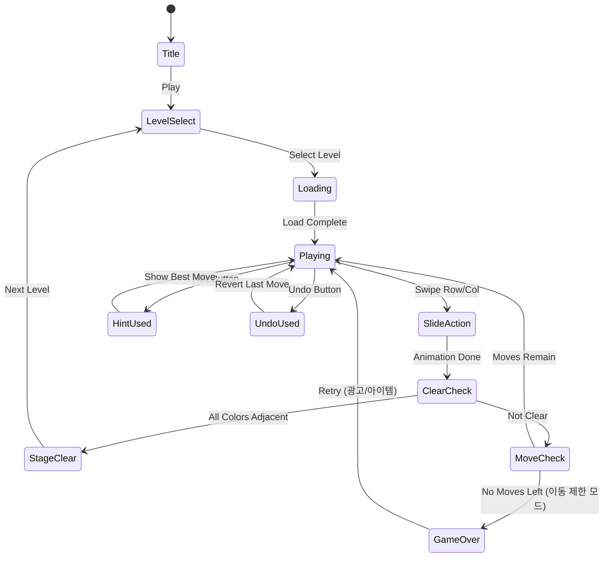

# Color Slide Puzzle

> 색상 타일을 행/열 단위로 슬라이드하여 같은 색끼리 인접시키는 퍼즐 게임.
> 클래식 15-퍼즐의 색상 버전. 단순하고 중독성 높은 코어.

## 개요

NxN 그리드에 여러 색상의 타일이 배치되어 있다. 플레이어는 행 또는 열 전체를 한 칸씩 슬라이드할 수 있다. 목표는 **같은 색상의 타일을 모두 인접하게 모으는 것**. 직관적인 조작, 낮은 진입장벽, 높은 반복 플레이성.

## 게임 규칙

### 기본 규칙

- 그리드는 N×N (기본 4×4) 으로 구성
- 각 셀에는 하나의 색상 타일이 배치됨
- 플레이어는 **행(가로) 또는 열(세로) 전체**를 좌/우/상/하로 1칸 슬라이드
- 슬라이드 시 끝에서 밀려난 타일은 반대쪽 끝으로 순환 (wrap-around)
- **클리어 조건**: 같은 색상의 타일이 모두 연속적으로 인접한 상태

### 클리어 판정

- 같은 색상 타일이 **직사각형 영역**을 형성하면 클리어로 판정
- 예: 4×4 그리드에서 색상 4종 → 각 색이 2×2 블록을 이루면 클리어
- 또는 한 줄(행/열) 전체를 같은 색이 차지해도 클리어 조건에 포함

### 슬라이드 상세 규칙

```
[초기 상태] - 4×4, 4색 (R/G/B/Y)
R G B Y
G R Y B
B Y R G
Y B G R

[행 0 오른쪽으로 1칸 슬라이드 후]
Y R G B    ← R G B Y가 오른쪽으로 이동, Y가 왼쪽 끝으로 순환
G R Y B
B Y R G
Y B G R
```

## 게임 플로우



## UI 레이아웃

```
┌─────────────────────────┐
│  Lv.12    🔀 23/30 💡  │  ← 레벨, 이동 횟수, 힌트 버튼
├─────────────────────────┤
│                         │
│  ← ┌──┬──┬──┬──┐ →     │
│    │🔴│🟢│🔵│🟡│       │
│  ↑ ├──┼──┼──┼──┤ ↑     │
│    │🟢│🔴│🟡│🔵│       │
│  ↓ ├──┼──┼──┼──┤ ↓     │  ← 슬라이드 가능 방향 화살표
│    │🔵│🟡│🔴│🟢│       │
│  ← ├──┼──┼──┼──┤ →     │
│    │🟡│🔵│🟢│🔴│       │
│    └──┴──┴──┴──┘       │
│                         │
├─────────────────────────┤
│  [↩ Undo]   [💡 Hint]  │  ← 하단 액션 버튼
├─────────────────────────┤
│  ████████████░░░░  75%  │  ← 진행률 (클리어에 얼마나 가까운지)
└─────────────────────────┘
```

### 조작 방법

- **스와이프**: 행/열을 손가락으로 드래그하여 슬라이드
- **탭 + 방향**: 행/열 선택 후 화살표 탭으로 슬라이드 (대안)
- **애니메이션**: 슬라이드 시 타일이 부드럽게 이동 (150ms tween)

## 스코어링 시스템

| Action | Score |
|--------|-------|
| 스테이지 클리어 | +1000 |
| 이동 효율 보너스 | (최소이동 / 실제이동) × 500 |
| 힌트 미사용 클리어 | +300 |
| 되돌리기 미사용 클리어 | +200 |
| 별점 3개 (최소이동 이내) | ⭐⭐⭐ |
| 별점 2개 (최소이동 × 1.5 이내) | ⭐⭐ |
| 별점 1개 (클리어) | ⭐ |

### 별점 기준

각 레벨에는 **최소 이동 횟수(par)**가 사전 정의됨:
- ⭐⭐⭐: par 이내 클리어
- ⭐⭐: par × 1.5 이내
- ⭐: 제한 내 클리어

## 난이도 설계

### 그리드 크기별 특성

| 그리드 | 색상 수 | 타일/색상 | 난이도 | 목표 이동 수 |
|--------|---------|----------|--------|------------|
| 3×3 | 3색 | 3개 | 입문 | 3~8 |
| 4×4 | 4색 | 4개 | 쉬움 | 8~15 |
| 4×4 | 4색 | 4개 | 보통 | 15~25 |
| 5×5 | 5색 | 5개 | 어려움 | 20~35 |
| 5×5 | 5색 | 5개 | 전문가 | 35~50 |
| 6×6 | 6색 | 6개 | 마스터 | 45~70 |

### 레벨 구성 (MVP 50레벨)

| 구간 | 레벨 | 그리드 | 색상 | 이동 제한 |
|------|------|--------|------|----------|
| 튜토리얼 | 1~5 | 3×3 | 3 | 없음 |
| 입문 | 6~15 | 4×4 | 4 | 없음 |
| 초급 | 16~25 | 4×4 | 4 | 있음 |
| 중급 | 26~35 | 5×5 | 5 | 있음 |
| 고급 | 36~45 | 5×5 | 5 | 있음 (빡빡) |
| 전문가 | 46~50 | 6×6 | 6 | 있음 |

### 레벨 데이터 포맷

```json
{
  "id": 12,
  "grid": 4,
  "colors": 4,
  "par": 12,
  "moveLimit": 20,
  "initial": [
    [0, 1, 2, 3],
    [1, 0, 3, 2],
    [2, 3, 0, 1],
    [3, 2, 1, 0]
  ]
}
```

> `initial`: 초기 그리드 배치. 숫자는 색상 인덱스 (0=Red, 1=Green, 2=Blue, 3=Yellow...).
> 레벨은 **역방향 풀이**로 생성: 정답 상태에서 무작위 슬라이드 N번 적용.

## 클리어 판정 알고리즘

```
function isSolved(grid):
  for each color c:
    cells = positions of all tiles with color c
    // 셀들이 연속적 직사각형 블록을 형성하는지 확인
    minRow = min(cells.row), maxRow = max(cells.row)
    minCol = min(cells.col), maxCol = max(cells.col)
    blockSize = (maxRow-minRow+1) * (maxCol-minCol+1)
    if blockSize != cells.length:
      return false  // 중간에 다른 색 있음
  return true
```

## 아이템 / 수익화

### 무료 아이템

| 아이템 | 효과 | 초기 제공 |
|--------|------|----------|
| Undo (되돌리기) | 마지막 슬라이드 취소 | 무제한 (패널티 없음) |

### 유료/광고 아이템

| 아이템 | 효과 | 획득 방법 |
|--------|------|----------|
| 힌트 (💡) | 최적 다음 슬라이드를 강조 표시 | 광고 시청 or 젬 구매 |
| 자동 풀이 | 남은 퍼즐 자동 완성 (관람 모드) | 젬 5개 |
| 이동 추가 (+5) | 이동 제한 레벨에서 5회 추가 | 광고 시청 |

### 젬 패키지

| 패키지 | 젬 수 | 가격 |
|--------|------|------|
| 소형 | 50 젬 | $0.99 |
| 중형 | 150 젬 | $2.99 |
| 대형 | 500 젬 | $7.99 |

### 수익화 흐름

```
게임 오버 (이동 초과) → "5회 추가" 팝업 → 광고 시청 → 이동 추가
                                        → 젬 소비 → 이동 추가
                                        → 거절 → 재시작 or 레벨 선택
```

## 진행률 표시 (Progress Bar)

클리어에 얼마나 가까운지 실시간 피드백:
- 각 색상의 "집중도(cohesion score)" 계산
- 같은 색이 모여있을수록 높은 점수
- 전체 진행률 = 모든 색상 cohesion 평균
- 클리어 직전 진행률이 90%+ 되어야 자연스러운 UX

```
cohesion(color) = 1 - (분산된 정도 / 최대 분산)
progress = avg(cohesion for all colors)
```

## 사운드 / 이펙트

| 이벤트 | 효과 |
|--------|------|
| 타일 슬라이드 | 부드러운 슉 소리 |
| 색상 그룹 완성 | 밝은 팡 + 해당 색상 타일 반짝임 |
| 스테이지 클리어 | 축하 음악 + 별 애니메이션 |
| 게임 오버 | 부드러운 실패음 + 이동 제한 표시 강조 |
| 힌트 표시 | 해당 행/열 가이드 라인 펄스 |
| 거의 다 됐을 때 (90%+) | 긴장감 상승 BGM |

## MVP 범위

### Phase 1 (MVP — 1주 목표)

- [x] 기획서 작성
- [ ] 4×4 그리드 + 4색 구현
- [ ] 행/열 슬라이드 로직 (wrap-around)
- [ ] 클리어 판정 알고리즘
- [ ] 50개 레벨 데이터 (역방향 생성)
- [ ] 이동 횟수 카운터 + 제한
- [ ] Undo 기능
- [ ] 별점 시스템 (3성)
- [ ] 레벨 셀렉트 화면

### Phase 2 (출시 후 1주)

- [ ] 5×5, 6×6 그리드 추가
- [ ] 힌트 시스템 (광고 연동)
- [ ] 진행률 바 (cohesion score)
- [ ] 사운드 / 이펙트
- [ ] 이동 추가 광고 아이템
- [ ] 젬 패키지 인앱결제

### Phase 3 (데이터 보고 결정)

- [ ] 일일 챌린지 레벨
- [ ] 리더보드 (최소 이동 경쟁)
- [ ] 테마 팩 (색상 스킨)
- [ ] 레벨 에디터 (UGC)
