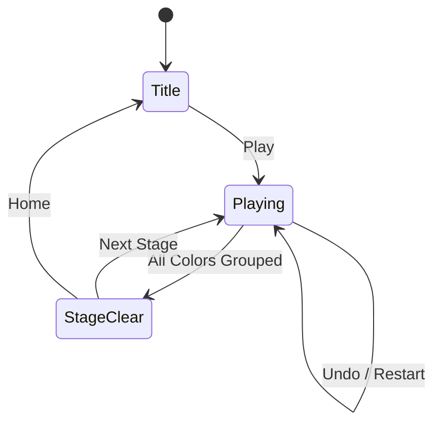

# Color Slide

> NxN 슬라이딩 퍼즐 — 빈 칸을 이용해 타일을 밀어 같은 색끼리 인접하게 모으는 게임

## 개요

NxN 격자에 여러 색상의 타일과 하나의 빈 칸이 있다. 플레이어는 빈 칸에 인접한 타일을 탭하여 밀어 넣고, 같은 색 타일끼리 하나의 연결된 덩어리(상하좌우 인접)로 모으면 스테이지 클리어.

## 게임 규칙

### 기본 규칙
- NxN 격자 (3×3 ~ 5×5)
- 격자에 2~8가지 색상의 타일 + 1개의 빈 칸
- 빈 칸에 인접한(상하좌우) 타일을 탭하면 빈 칸으로 슬라이드
- 모든 색상의 타일이 각각 하나의 연결된 그룹을 이루면 **스테이지 클리어**

### 연결 판정
- 같은 색 타일끼리 상하좌우로 인접하면 연결된 것으로 판정
- 대각선은 연결로 치지 않음
- 빈 칸은 무시 (어디에 있든 상관없음)
- BFS로 각 색상의 연결성을 검증

### 스코어
- 클리어 시 `max(100, 500 - moves * 5)` 점 부여
- 적은 수로 클리어할수록 높은 점수

## 스테이지 구성

| 스테이지 | 격자 | 색상 수 |
|----------|------|---------|
| 1 | 3×3 | 2 |
| 2 | 3×3 | 3 |
| 3 | 4×4 | 3 |
| 4 | 4×4 | 4 |
| 5 | 4×4 | 5 |
| 6 | 5×5 | 4 |
| 7 | 5×5 | 5 |
| 8 | 5×5 | 6 |
| 9 | 5×5 | 7 |
| 10 | 5×5 | 8 |
| 11+ | 5×5 | 8 (최대 난이도 유지) |

## 게임 플로우

## 보드 생성

1. Solved 상태(같은 색끼리 정렬된 보드) 생성
2. 빈 칸에서 랜덤 유효 이동을 `(셀 수 × 20)`회 수행하여 셔플
3. 셔플 후 `isWon()` 체크 — 이미 풀린 상태면 재생성 (최대 50회 시도)
4. 역방향 셔플이므로 항상 풀 수 있는 보드 보장

## UI 구성

### HUD
- Stage / Moves / Score 표시
- Undo 버튼 (이전 수로 되돌리기)
- Restart 버튼 (스테이지 재시작)

### ClearScreen
- Stage Clear! / Game Over 타이틀
- Stage / Score / Moves 통계
- Next Stage / Retry / Home 버튼

## 기술 스택

- **lib/colorslide/**: Phaser.io 기반 게임 코어
- **web/arcade/src/games/colorslide/**: React + Stitches UI
- 패턴: watersort / crunch3과 동일한 stage-based 구조
