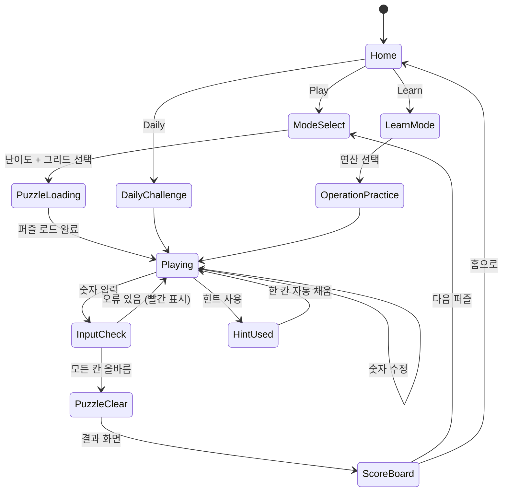

# CrossMath (크로스매스)

> 크로스워드 형태의 수학 퍼즐 — 빈칸에 숫자를 채워 수식을 완성하라

## 개요

격자(Grid) 위에 숫자와 연산자가 배치되어 있다. 일부 숫자 칸은 비어 있으며, 플레이어는 빈칸에 올바른 숫자를 입력해 가로·세로 방향의 모든 등식을 동시에 만족시켜야 한다. 교육적 재미와 논리적 사고가 결합된 퍼즐 게임.

```
[ ?] [+] [ 3] [=] [ 7]
[×]      [-]      [+]
[ 2] [+] [ ?] [=] [ 6]
[=]      [=]      [=]
[ ?]     [ 2]     [13]
```
→ 빈칸(?)을 채워 가로·세로 등식을 모두 성립시키는 것이 목표

## 게임 규칙

### 기본 규칙

- 격자는 **숫자 칸**과 **연산자 칸**이 교차 배치된 구조
- 연산자(+, -, ×, ÷)와 등호(=)는 고정; 숫자 칸 일부가 비어 있음
- 플레이어는 빈 숫자 칸을 선택해 **1~99 사이의 정수**를 입력
- 가로·세로 방향의 모든 등식이 성립하면 **퍼즐 클리어**
- 잘못된 숫자 입력 시 해당 칸이 **빨간색**으로 하이라이트됨 (오류 체크 모드)
- 0으로 나누기 등 유효하지 않은 수식 방지 (퍼즐 생성 단계에서 보장)

### 그리드 구조

그리드 크기는 **완성 등식 수**를 기준으로 표기한다.

| 모드 | 등식 수 (가로 × 세로) | 실제 셀 수 | 빈칸 수 |
|------|----------------------|-----------|---------|
| 3×3  | 가로 2줄 × 세로 2줄  | 5×5       | 3~4개   |
| 5×5  | 가로 3줄 × 세로 3줄  | 7×7       | 5~7개   |
| 7×7  | 가로 4줄 × 세로 4줄  | 9×9       | 8~12개  |

> **표기 규칙**: "3×3"은 디스플레이 셀이 아닌 **숫자 격자(number grid)** 기준

#### 셀 배치 예시 (3×3 모드 = 5×5 실제)

```
[ A] [op] [ B] [=] [ C]   ← 가로 등식 1: A op B = C
[op]      [op]      [op]
[ D] [op] [ E] [=] [ F]   ← 가로 등식 2: D op E = F
[=]       [=]       [=]
[ G]      [ H]      [ I]  ← 세로 결과 행
```
- 세로 등식: A op D = G, B op E = H, C op F = I

### 연산 규칙

- 모든 연산은 **정수 결과**만 허용 (나눗셈은 나누어 떨어지는 경우만 출제)
- 음수 결과는 난이도 "상"부터 허용 (초급·중급은 양수만)
- 연산 우선순위 **없음** — 왼쪽에서 오른쪽, 위에서 아래로 순서대로 계산

### 입력 방식

- 빈 칸을 탭하면 **숫자 키패드** 팝업
- 이미 채운 칸을 다시 탭하면 **수정 가능**
- 전체 지우기 버튼으로 모든 입력 초기화

## 게임 플로우



## UI 레이아웃

### 메인 게임 화면

```
┌─────────────────────────────┐
│  ← Back   크로스매스   ⏱ 03:45  │  ← 상단 바 (타이머, 뒤로가기)
├─────────────────────────────┤
│  Lv.2   3×3 모드   ★★☆☆☆   │  ← 레벨/모드 표시
├─────────────────────────────┤
│                             │
│   [ 4][+][ ?][=][ 7]        │
│   [-]    [+]    [-]         │
│   [ 2][+][ 1][=][ 3]        │  ← 퍼즐 그리드
│   [=]    [=]    [=]         │
│   [ 2]   [ ?]   [ 4]        │
│                             │
├─────────────────────────────┤
│  [1][2][3][4][5][6][7][8][9][0]  │  ← 숫자 키패드
│        [지우기]  [확인]          │
├─────────────────────────────┤
│  💡 힌트(2)  ✓ 체크  🔄 리셋 │  ← 도구 바
└─────────────────────────────┘
```

### 홈 화면

```
┌─────────────────────────────┐
│        🧮 크로스매스          │
│      수학 퍼즐의 세계로!       │
├─────────────────────────────┤
│   🎮  일반 플레이              │
│   📅  오늘의 챌린지  🔥3일 연속  │
│   📚  학습 모드                │
├─────────────────────────────┤
│   📊  내 기록  │  🏆 랭킹     │
└─────────────────────────────┘
```

### 난이도/모드 선택 화면

```
┌─────────────────────────────┐
│  그리드 크기 선택              │
│  [3×3]   [5×5]   [7×7]      │
├─────────────────────────────┤
│  연산 설정                    │
│  [+]  [-]  [×]  [÷]         │
│  (복수 선택 가능)              │
├─────────────────────────────┤
│  난이도                       │
│  [쉬움]  [보통]  [어려움]      │
├─────────────────────────────┤
│         [시작하기]             │
└─────────────────────────────┘
```

## 스코어링 시스템

| Action | Score | 비고 |
|--------|-------|------|
| 퍼즐 클리어 (기본) | +500 | |
| 남은 시간 보너스 | 남은초 × 5 | |
| 힌트 미사용 클리어 | +300 | 퍼펙트 보너스 |
| 힌트 1회 사용 | +100 | |
| 오류 체크 미사용 | +200 | |
| 연속 클리어 (콤보) | +100 × 연속 수 | |
| 7×7 클리어 | +1000 | 그리드 보너스 |

### 별점 시스템 (★)

| 별점 | 조건 |
|------|------|
| ★★★ | 힌트 0, 오류 체크 0, 제한시간 50% 이내 |
| ★★☆ | 힌트 1 이하 또는 시간 내 클리어 |
| ★☆☆ | 클리어만 해도 획득 |

## 난이도 설계

### 난이도별 파라미터

| 난이도 | 그리드 | 연산 종류 | 빈칸 비율 | 제한시간 | 힌트 제공 |
|--------|--------|-----------|-----------|----------|-----------|
| 쉬움   | 3×3    | +, -      | 30%       | 5분      | 3개       |
| 보통   | 3×3/5×5| +,-,×     | 40%       | 4분      | 2개       |
| 어려움 | 5×5/7×7| +,-,×,÷   | 50%       | 3분      | 1개       |
| 전문가 | 7×7    | 전체+음수  | 60%       | 제한없음  | 0개       |

### 숫자 범위

| 난이도 | 사용 숫자 범위 | 결과 범위 |
|--------|--------------|-----------|
| 쉬움   | 1~10         | 1~20      |
| 보통   | 1~20         | 1~50      |
| 어려움 | 1~50         | -10~100   |
| 전문가 | 1~99         | 제한없음   |

### 연산 복잡도 단계

```
Level 1: 덧셈만          예: 3 + 4 = 7
Level 2: 덧셈 + 뺄셈     예: 8 - 3 = 5
Level 3: × 추가          예: 3 × 4 = 12
Level 4: ÷ 추가          예: 12 ÷ 4 = 3
Level 5: 혼합 (2연산)    예: 가로:+, 세로:×
Level 6: 음수 결과 허용  예: 3 - 7 = -4
```

## 퍼즐 생성 알고리즘 (구현 가이드)

```
1. 정답 격자 생성:
   - 그리드 크기에 맞게 숫자 배치
   - 무작위 연산자 할당
   - 가로·세로 등식이 모두 성립하는지 검증
   - 정수 결과 + 0으로 나누기 방지 조건 적용

2. 빈칸 선정:
   - 난이도에 따른 빈칸 비율 적용
   - 퍼즐이 **유일한 해(unique solution)**를 가지는지 검증
   - 유일 해 없으면 빈칸 조합 재선정

3. 문제 저장:
   - 정답(solution)과 출제 격자(puzzle)를 분리 저장
   - 씨드(seed) 기반 생성 → 일일 챌린지에 활용
```

## 힌트 시스템

| 힌트 종류 | 효과 | 비용 |
|-----------|------|------|
| 칸 힌트 | 선택한 빈칸 1개 자동 채움 | 힌트 1개 소모 |
| 오류 체크 | 틀린 칸 빨간색으로 표시 | 별점 -1 |
| 등식 힌트 | 특정 행/열 정답 공개 | 힌트 2개 소모 |

## 학습 모드 (Learn Mode)

교육적 가치를 극대화한 모드. 광고/수익화 없이 무료 제공 (리텐션 목적).

### 연산별 연습

| 코스 | 내용 | 문제 수 |
|------|------|---------|
| 덧셈 기초 | 1~10 범위 덧셈 | 10문제 |
| 뺄셈 기초 | 결과 양수 보장 | 10문제 |
| 곱셈 기초 | 구구단 범위 | 15문제 |
| 나눗셈 기초 | 나누어 떨어지는 수 | 15문제 |
| 혼합 연산 | +, - 조합 | 20문제 |
| 고급 혼합 | 전체 연산 | 20문제 |

### 학습 모드 특징

- 오답 시 **단계별 풀이 힌트** 자동 제공
- 진행 상황 저장 (% 달성률 표시)
- 완료 시 **수료 뱃지** 지급

## 일일 챌린지 (Daily Challenge)

- 매일 0시 KST 기준 **새 퍼즐** 제공
- 전 세계 동일 퍼즐 (씨드 기반 생성)
- 난이도 선택 가능 (쉬움/보통/어려움)
- 클리어 결과를 **SNS 공유** 가능

```
오늘의 크로스매스 📅 2026-03-27
난이도: 보통 ⭐⭐
시간: 2:34  힌트: 0  별점: ★★★
#크로스매스 #수학퍼즐 #오늘의챌린지
```

- 7일 연속 클리어 시 **주간 보너스 힌트** 지급
- 랭킹 보드: 클리어 시간 기준 전체 순위

## 수익화 전략

### 핵심 수익 모델

| 수익원 | 가격 | 예상 전환율 |
|--------|------|-------------|
| 광고 제거 (영구) | ₩3,900 | 5~8% |
| 힌트 팩 (10개) | ₩1,900 | 10~15% |
| 프리미엄 퍼즐 팩 (각 50문제) | ₩2,900 | 3~5% |
| 전체 언락 번들 | ₩7,900 | 2~3% |

### 광고 배치 (비구매 유저)

| 위치 | 타입 | 빈도 |
|------|------|------|
| 퍼즐 클리어 후 | 전면 광고 | 3판마다 1회 |
| 힌트 충전 | 보상형 광고 | 힌트 1개 획득 |
| 홈 화면 하단 | 배너 | 상시 |

### 프리미엄 퍼즐 팩 구성

| 팩 이름 | 그리드 | 문제 수 | 테마 |
|---------|--------|---------|------|
| 초급 팩 | 3×3    | 50문제  | 기본 |
| 중급 팩 | 5×5    | 50문제  | 기본 |
| 고급 팩 | 7×7    | 30문제  | 기본 |
| 스피드 팩 | 3×3/5×5 | 30문제 | 제한시간 60초 |

## 사운드/이펙트

| 상황 | 사운드/이펙트 |
|------|-------------|
| 숫자 입력 | 키패드 클릭음 (경쾌) |
| 정답 칸 완성 | 부드러운 '딩' 소리 |
| 오류 감지 | 짧은 '틱' + 빨간 진동 |
| 퍼즐 클리어 | 축하 팡파르 + 별 애니메이션 |
| 힌트 사용 | 반짝임 이펙트 |
| 일일 챌린지 완료 | 특별 이펙트 + 공유 팝업 |
| BGM | 집중력 향상 잔잔한 배경음 (옵션) |

## MVP 범위

### Phase 1 — MVP (1~2주)

**목표**: 스토어 출시 가능한 최소 완성품

- [ ] 기획서 작성 ✅
- [ ] 퍼즐 생성기 구현 (3×3, 5×5, +/- 연산)
- [ ] 핵심 게임 로직 (입력 → 등식 검증 → 클리어 판정)
- [ ] 기본 UI (그리드 + 키패드 + 오류 표시)
- [ ] 힌트 시스템 (칸 자동 채움)
- [ ] 50문제 사전 생성 저장
- [ ] 클리어 결과 화면 (시간 + 별점)
- [ ] 기본 광고 연동 (AdMob 배너)

### Phase 2 — 완성도 (3~4주)

- [ ] 7×7 그리드 + ×, ÷ 연산 추가
- [ ] 일일 챌린지 + SNS 공유
- [ ] 학습 모드 기초 (덧셈/뺄셈 코스)
- [ ] 인앱 결제 (힌트 팩, 광고 제거)
- [ ] 효과음 + 애니메이션

### Phase 3 — 성장 (5~8주)

- [ ] 프리미엄 퍼즐 팩 콘텐츠 추가
- [ ] 글로벌 랭킹 (일일 챌린지)
- [ ] 전체 학습 모드 코스
- [ ] 푸시 알림 (일일 챌린지 리마인더)
- [ ] A/B 테스트 (힌트 가격, 광고 빈도)

## 기술 구현 참고

### 데이터 구조 (lib 팀 전달용)

```typescript
interface CrossMathPuzzle {
  id: string;
  grid: PuzzleCell[][];       // 전체 셀 (숫자 + 연산자)
  solution: number[][];       // 정답 숫자 격자
  blanks: CellPosition[];     // 빈칸 위치 목록
  difficulty: Difficulty;
  timeLimit: number;          // 초 단위, 0이면 무제한
  hintsAvailable: number;
}

interface PuzzleCell {
  type: 'number' | 'operator' | 'equals' | 'blank';
  value: number | string | null;
  isBlank: boolean;
}

type Difficulty = 'easy' | 'normal' | 'hard' | 'expert';
```

### 등식 검증 로직

```
가로 등식: row[0] op1 row[2] = row[4] (row[1]과 row[3]은 연산자/등호)
세로 등식: col[0] op1 col[2] = col[4]
전체 클리어: 모든 가로/세로 등식 성립 여부 체크
```
