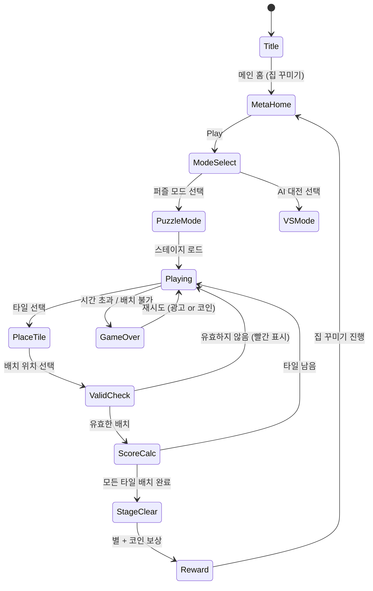

# Domino Dreams

> 도미노 타일을 연결하고 꿈의 집을 완성하는 보드게임 퍼즐

## 개요

전통 도미노 보드게임을 모바일 싱글플레이에 최적화한 캐주얼 퍼즐 게임.
도미노 타일의 숫자를 맞춰 연결하며 점수를 획득하고, 클리어 보상으로 집과 마을을 꾸미는 메타게임으로 재방문율을 높인다.

**레퍼런스**: SuperPlay의 Domino Dreams (AppStore 4.6★, 글로벌 Top 64)

---

## 게임 모드

### 1. 퍼즐 모드 (핵심 모드 / MVP)
정해진 도미노 타일 세트를 모두 보드에 배치하는 퍼즐.
배치 공간은 제한되어 있으며, 규칙에 맞게 모든 타일을 놓으면 클리어.

### 2. VS AI 모드 (Phase 2)
AI 상대와 번갈아 도미노를 놓으며 더 많은 점수를 획득하는 턴제 대전.
Draw 규칙 적용 (놓을 타일 없으면 드로우 패널티).

---

## 도미노 핵심 규칙

### 타일 구성
- 표준 더블-6 세트: `[0|0]` ~ `[6|6]`, 총 28개 타일
- 각 타일은 두 칸으로 나뉘며, 각 칸에 0~6 숫자(핍) 표시
- 더블 타일: 양 끝 숫자가 같은 타일 (예: `[3|3]`)

```
┌───┬───┐
│ 3 │ 5 │  ← [3|5] 타일
└───┴───┘
```

### 연결 규칙
- 타일은 **맞닿는 끝의 숫자가 같아야** 연결 가능
- 가로/세로 방향 모두 배치 가능
- 더블 타일은 수직 방향으로 분기 가능 (T자 연결점)

```
예시: [2|4] - [4|1] - [1|6] (4→4, 1→1 매칭)
      [2|4]
           \
        [4|4]  ← 더블: 위아래로 분기
           /
        [4|6]
```

### 특수 점수 조건
| 조건 | 점수 |
|------|------|
| 연결된 양 끝 합이 5의 배수 | +5점 (Five-Up 룰) |
| 더블 타일 배치 | +10점 |
| 올 클리어 (모든 타일 배치) | +200점 |
| 콤보 (3연속 점수 조건 달성) | × 1.5배 |

---

## 게임 플로우



---

## UI 레이아웃

### 인게임 화면

```
┌────────────────────────────┐
│  ⭐ 3/3   🏆 Score: 45    │  ← 상단 HUD (목표 별, 점수)
│  ⏱ 02:30                  │
├────────────────────────────┤
│                            │
│  ┌──┬──┐ ┌──┬──┐          │
│  │2 │4 │ │4 │4 │          │
│  └──┴──┘ └──┴──┘          │  ← 보드 (배치된 타일)
│       ↕                    │
│  ┌──┬──┐                  │
│  │4 │6 │                  │
│  └──┴──┘                  │
│                            │
├────────────────────────────┤
│  손패: [1|2] [3|5] [0|4]  │  ← 현재 배치 가능한 타일 (3개)
│  남은 타일: 14개           │
├────────────────────────────┤
│  🔄 Pass  💡 힌트  ↩ Undo │  ← 액션 버튼
└────────────────────────────┘
```

### 메타 홈 화면 (집 꾸미기)

```
┌────────────────────────────┐
│  💰 Coins: 1,240  ⚙️     │
├────────────────────────────┤
│                            │
│    🏠 나의 드림 홈          │
│  ┌──────────────────────┐  │
│  │  🌿  🪟  🌸         │  │
│  │     [집 이미지]      │  │
│  │  🌳       🌺        │  │
│  └──────────────────────┘  │
│                            │
│  [다음 꾸미기: 화단 - 80코인] │
├────────────────────────────┤
│         [PLAY]             │
└────────────────────────────┘
```

---

## 스코어링 시스템

### 퍼즐 모드 기본 점수

| 액션 | 점수 |
|------|------|
| 타일 배치 (기본) | +5 |
| Five-Up (끝 합 5의 배수) | +5 ~ +35 (합에 비례) |
| 더블 타일 배치 | +10 |
| 콤보 3연속 | 다음 점수 × 1.5 |
| 올 클리어 보너스 | +200 |
| 남은 시간 보너스 | 남은초 × 2 |

### 별 획득 조건 (스테이지별)

| 별 | 조건 |
|----|------|
| ⭐ | 스테이지 클리어 |
| ⭐⭐ | 목표 점수 달성 |
| ⭐⭐⭐ | 시간 내 + 힌트 미사용 클리어 |

---

## 난이도 설계

### 퍼즐 모드 스테이지 구성

| 단계 | 스테이지 | 타일 수 | 보드 크기 | 시간 | 특징 |
|------|----------|---------|-----------|------|------|
| Tutorial | 1~5 | 7개 | 4×4 | 없음 | 기본 연결 학습 |
| Easy | 6~20 | 14개 | 6×6 | 없음 | 분기 없음 |
| Medium | 21~50 | 21개 | 8×8 | 5분 | 더블 타일 포함 |
| Hard | 51~100 | 28개 (풀세트) | 10×10 | 4분 | Five-Up 조건 추가 |
| Expert | 100+ | 28개 | 8×8 (좁음) | 3분 | 최소 이동수 제한 |

### AI 대전 모드 난이도 (Phase 2)

| 레벨 | AI 전략 | 승률 (플레이어 기준) |
|------|---------|---------------------|
| 초보 | 랜덤 배치 | ~80% |
| 일반 | 점수 최적 1수 탐색 | ~55% |
| 고수 | 2수 앞 탐색 + 블로킹 | ~35% |
| 마스터 | 미니맥스 3수 + 핍 카운팅 | ~20% |

---

## 메타게임: 드림 홈 꾸미기

### 컨셉
도미노 게임 클리어 → 코인 획득 → 집/마을 꾸미기 아이템 구매 → 더 예쁜 집 완성.
집이 발전할수록 새 게임 모드/테마 잠금 해제.

### 꾸미기 단계 (집 → 마당 → 마을)

| 단계 | 내용 | 필요 코인 | 잠금 해제 |
|------|------|-----------|-----------|
| 1단계 | 기본 집 외벽 색상 | 0 (시작) | - |
| 2단계 | 현관문 교체 | 50 | Easy 스테이지 |
| 3단계 | 창문/화단 추가 | 80 | Medium 스테이지 |
| 4단계 | 마당 꾸미기 | 150 | Hard 스테이지 |
| 5단계 | 이웃집 추가 | 300 | Expert 스테이지 |
| 6단계 | 마을 완성 | 500 | AI 모드 해금 |

### 시각적 진행감
- 집이 완성될수록 배경이 화사하게 변함
- 계절 이벤트 아이템 (크리스마스 장식, 벚꽃 등)
- SNS 공유 기능 (집 스크린샷)

---

## 아이템 / 부스터

| 아이템 | 효과 | 획득 방법 |
|--------|------|-----------|
| 힌트 | 배치 가능한 위치 1개 표시 | 광고 시청 / 코인 20개 |
| Undo | 마지막 배치 되돌리기 | 코인 10개 |
| Shuffle | 손패 새로 뽑기 | 코인 30개 |
| 시간 추가 | +60초 | 광고 시청 |
| 와일드 타일 | 어디든 연결 가능한 조커 | 코인 50개 |

---

## 수익화 모델

### 코어 루프
```
게임 플레이 → 코인 획득 → 집 꾸미기 → 다음 스테이지 동기부여
```

### 수익화 포인트

| 유형 | 내용 | 예상 전환율 |
|------|------|------------|
| 광고 (보상형) | 힌트/시간 추가 시 광고 시청 | 40~60% DAU |
| 광고 (전면) | 게임 오버 후 재시도 전 | 통제 필요 (UX 주의) |
| 인앱 결제 | 코인 팩 ($0.99~$9.99) | 2~5% |
| 인앱 결제 | 광고 제거 ($2.99) | 3~8% |
| 인앱 결제 | 프리미엄 테마팩 ($1.99) | 1~3% |
| 시즌 패스 | 월간 꾸미기 아이템 패스 ($4.99/월) | 1~2% |

### 코인 경제 밸런스

| 획득 | 코인 | 소모 | 코인 |
|------|------|------|------|
| 스테이지 클리어 (Easy) | 10~20 | 힌트 1회 | 20 |
| 스테이지 클리어 (Hard) | 30~50 | Undo 1회 | 10 |
| 광고 시청 | 15 | 와일드 카드 | 50 |
| 일일 보너스 | 30 | 집 꾸미기 아이템 | 50~500 |
| 3성 클리어 | +10 보너스 | 코인 없을 때 구매 유도 | - |

---

## 사운드/이펙트

- 타일 배치: 나무 블록 "탁" 소리
- 유효 연결: 경쾌한 "딩" 효과음
- 무효 위치: 낮은 "틱" + 빨간 깜빡임
- Five-Up 달성: 코인 획득 효과음 + 골드 이펙트
- 올 클리어: 폭죽 이펙트 + 축하 음악
- 집 꾸미기: 망치질 + 완성 팡파르

---

## 구현 복잡도 분석

### 핵심 구현 과제

| 컴포넌트 | 난이도 | 예상 시간 |
|----------|--------|-----------|
| 도미노 타일 렌더링 (Phaser) | 낮음 | 0.5일 |
| 보드 그리드 + 배치 로직 | 중간 | 1일 |
| 연결 유효성 검사 엔진 | 중간 | 1일 |
| Five-Up 점수 계산 | 낮음 | 0.5일 |
| 드래그&드롭 UX | 중간 | 1일 |
| 퍼즐 스테이지 데이터 설계 | 중간 | 1일 |
| 메타게임 집 꾸미기 UI | 중간 | 1.5일 |
| AI 상대 로직 (Phase 2) | 높음 | 2~3일 |
| 광고/결제 연동 | 낮음 | 0.5일 |

**MVP 예상 기간**: 약 7일 (AI 제외)
**Phase 2 (AI 대전)**: 추가 3일

### 기술 리스크
- **도미노 배치 유효성 검사**: 방향(가로/세로) × 더블 분기 처리가 복잡. Phaser 씬에서 그리드 기반 좌표계로 관리.
- **퍼즐 레벨 생성**: 수동 설계 필요. 랜덤 생성 시 풀 불가 케이스 방지 알고리즘 필요.
- **AI 미니맥스**: MVP에서 제외 권장. Phase 2에서 간단한 greedy AI로 시작.

---

## MVP 범위

### Phase 1 (MVP — 7일)
- [x] 기획서 작성
- [ ] 더블-6 도미노 타일 세트 렌더링
- [ ] 보드 그리드 + 드래그&드롭 배치
- [ ] 연결 유효성 검사 (숫자 매칭)
- [ ] Five-Up 점수 계산
- [ ] 퍼즐 스테이지 20개 (Tutorial 5 + Easy 15)
- [ ] 클리어 / 게임오버 판정
- [ ] 별 3개 시스템
- [ ] 코인 획득 + 집 꾸미기 3단계
- [ ] 보상형 광고 연동 (힌트)

### Phase 2 (출시 후 1주)
- [ ] 스테이지 50개 추가 (Medium/Hard)
- [ ] AI 대전 모드 (Greedy AI)
- [ ] 집 꾸미기 6단계 전체
- [ ] 인앱 결제 코인 팩
- [ ] 일일 퍼즐 도전

### Phase 3 (데이터 보고 결정)
- [ ] 미니맥스 AI (고수/마스터)
- [ ] 시즌 이벤트 아이템
- [ ] 멀티플레이어 (실시간 대전)
- [ ] 더블-9 세트 확장

---

## 투자 가치 판단

### 긍정 요소
- **검증된 장르**: SuperPlay의 Domino Dreams 글로벌 Top 100 유지, 4.6★ 높은 평점
- **메타게임 리텐션**: 집 꾸미기는 검증된 retention 드라이버 (Homescapes, Township 모델)
- **간단한 코어**: 도미노 규칙은 직관적, 튜토리얼 부담 낮음
- **광고 수익 친화적**: 힌트/부스터 수요가 자연스럽게 발생

### 리스크 요소
- **경쟁 포화**: SuperPlay 원작이 이미 독점적 위치
- **차별화 필요**: 비주얼/메타게임에서 차별점 없으면 사용자 이탈 빠름
- **레벨 설계 공수**: 퍼즐 레벨 100개+ 수동 설계 필요

### 결론
**권장 개발 우선순위: 중간 (Month 1 후반~Month 2 초)**

found3보다 구현 복잡도가 약간 높으나 메타게임으로 인한 리텐션 기대값이 높음.
MVP를 7일 안에 출시하고 CPI/D1 리텐션 데이터를 본 후 Phase 2 투자 여부 결정.
D1 리텐션 35% 이상이면 집 꾸미기 콘텐츠 확장에 집중 투자.
