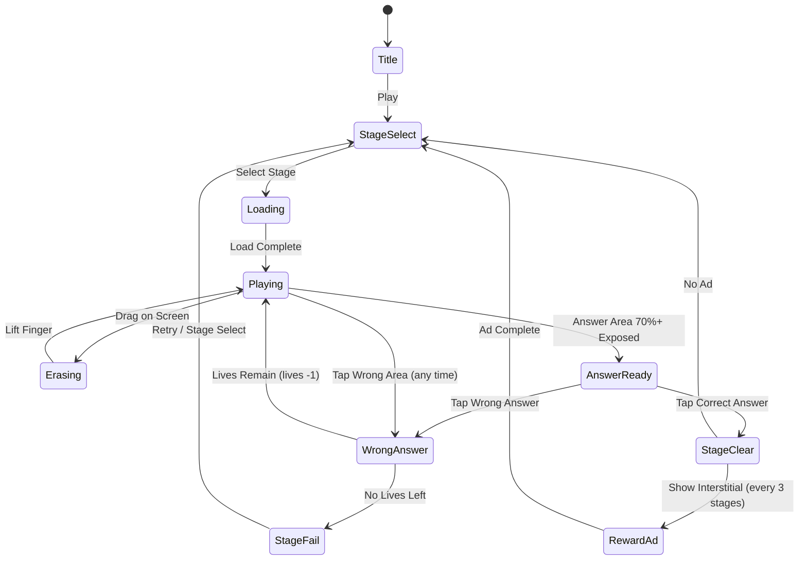

# DOP 5: 한 부분 지우기

> 그림 일부를 손가락으로 문질러 지워서 숨겨진 정답을 찾아내는 지우기 퍼즐 게임.
> 모바일 광고에서 가장 많이 보이는 장르 중 하나 — 설치 전환율 최상위권.

## 개요

화면에 일부가 가려진 장면이 표시된다. 플레이어는 손가락으로 가림막을 문질러 지워가며 숨겨진 내용을 확인하고, 제시된 질문에 맞는 정답 영역을 찾아 선택한다. 정답 영역을 완전히 지우면 스테이지 클리어.

### 핵심 재미 루프

```
가림막 발견 → 문질러 지우기 → 숨겨진 내용 확인 → 정답 선택 → 클리어/실패
```

- **호기심 자극**: "뭐가 숨어있지?" — 지우기 전 긴장감
- **만족감**: 지워지는 스크래치 효과 + 정답 확인 순간의 카타르시스
- **유머/반전**: 예상을 빗나가는 결과물 → 소셜 공유 욕구 자극

---

## 게임 규칙

### 기본 규칙

1. 화면에 **가림막(Overlay)**으로 덮인 장면 이미지가 표시된다
2. 플레이어는 손가락으로 드래그하여 가림막을 지운다
3. 상단에 **문제(Question)**가 표시된다 (예: "범인은 누구?", "무엇이 문제일까?")
4. 가림막 아래에는 정답 영역과 오답 영역이 존재한다
5. 정답 영역을 충분히 노출 후 탭하면 **정답 판정**
6. 오답 영역을 탭하면 **오답 처리** (기회 차감)
7. 기회 3회 소진 시 스테이지 실패

### 지우기 메카닉

- 드래그 궤적을 따라 **원형 브러시** 방식으로 가림막 제거
- 브러시 크기: 기본 60px (디바이스 화면 기준)
- 지워진 영역은 복구 불가 (덮기 기능 없음)
- 정답 영역의 **70% 이상** 노출 시 탭 가능 상태로 전환 (하이라이트 표시)
- **힌트 사용 시**: 정답 영역 자동 부분 노출 (약 30%)

### 정답 판정

| 상태 | 조건 | 결과 |
|------|------|------|
| 정답 탭 | 정답 영역 70% 이상 노출 후 탭 | 클리어 |
| 오답 탭 | 오답 영역 탭 | 기회 -1, 오답 영역 X 표시 |
| 조기 탭 시도 | 정답 영역 70% 미만 노출 상태 탭 | 반응 없음 (더 지우도록 유도) |
| 기회 0 | 3번 오답 | 스테이지 실패 |

### 문제 유형 (카테고리)

| 유형 | 설명 | 예시 |
|------|------|------|
| **탐정/범인 찾기** | 장면 속 증거/범인 식별 | "누가 케이크를 먹었을까?" |
| **상황 해결** | 문제 상황의 원인 지우기 | "차가 왜 안 켜질까?" |
| **유머/반전** | 예상 밖 결과 | "왜 화장실에 줄이 길까?" |
| **틀린 그림 찾기** | 이상한 부분 노출 | "무엇이 잘못됐을까?" |
| **숨은 물건** | 특정 오브젝트 탐색 | "열쇠가 어디 있을까?" |

---

## 게임 플로우



---

## UI 레이아웃

```
┌─────────────────────────────┐
│  ← Back    Stage 3/20  ❤❤❤  │  ← HUD: 뒤로가기 / 스테이지 / 잔여 기회
├─────────────────────────────┤
│                             │
│  Q: "범인은 누구일까요?"      │  ← 문제 텍스트
│                             │
├─────────────────────────────┤
│                             │
│  ┌───────────────────────┐  │
│  │  [가림막으로 덮인       │  │
│  │   장면 이미지]         │  │
│  │                       │  │
│  │   ☁️☁️ 문질러서 지우기☁️│  │  ← 게임 캔버스 (Phaser)
│  │                       │  │
│  │      [정답 영역]       │  │
│  │                       │  │
│  └───────────────────────┘  │
│                             │
├─────────────────────────────┤
│  💡 힌트 (광고 시청)  ← 하단 │  ← 힌트 버튼
└─────────────────────────────┘

[정답 시]
┌─────────────────────────────┐
│        ✅ 정답!              │
│    [전체 장면 공개 애니메이션] │
│    "다음 문제" 버튼           │
└─────────────────────────────┘

[오답 시]
┌─────────────────────────────┐
│        ❌ 틀렸어요!           │
│    오답 영역에 X 표시 1초     │
│    → 계속 게임 진행           │
└─────────────────────────────┘
```

---

## 데이터 구조

### 퍼즐 데이터 스키마

```typescript
interface Puzzle {
  id: number;           // 고유 ID
  question: string;     // 문제 텍스트
  sceneImage: string;   // 장면 이미지 경로 (배경)
  overlayColor: string; // 가림막 색상 (기본 회색 #888)
  answers: AnswerArea[];
  category: 'detective' | 'situation' | 'humor' | 'spot-diff' | 'hidden-object';
  difficulty: 1 | 2 | 3; // 1=쉬움, 2=보통, 3=어려움
}

interface AnswerArea {
  id: string;
  label: string;        // 정답/오답 설명 텍스트
  isCorrect: boolean;
  region: {
    x: number;          // 정규화 좌표 (0~1)
    y: number;
    width: number;
    height: number;
  };
}
```

### 예시 퍼즐 데이터

```json
{
  "id": 1,
  "question": "누가 냉장고를 열어 먹었을까요?",
  "sceneImage": "assets/puzzles/fridge_scene.png",
  "overlayColor": "#777777",
  "category": "detective",
  "difficulty": 1,
  "answers": [
    {
      "id": "cat",
      "label": "고양이",
      "isCorrect": true,
      "region": { "x": 0.6, "y": 0.4, "width": 0.2, "height": 0.3 }
    },
    {
      "id": "dog",
      "label": "강아지",
      "isCorrect": false,
      "region": { "x": 0.1, "y": 0.5, "width": 0.2, "height": 0.3 }
    }
  ]
}
```

---

## 기술 구현 가이드 (lib)

### Phaser 씬 구성

| 씬 | 역할 |
|----|------|
| `BootScene` | 에셋 프리로드 |
| `MenuScene` | 타이틀 / 스테이지 셀렉트 |
| `GameScene` | 핵심 게임플레이 |
| `ResultScene` | 정답/오답 결과 |

### 지우기 구현 방식

- Phaser `RenderTexture` 사용: 가림막 레이어를 렌더 텍스처로 생성
- 포인터 이동 이벤트(`pointermove`)에서 브러시 위치에 **erase 블렌딩** 적용
- `Graphics` 객체로 브러시 마스크 그리기 → `RenderTexture.erase()` 호출
- 픽셀 커버리지 계산: 정답 영역 픽셀 중 투명화된 비율 측정 (`getPixel` 샘플링)

### 성능 고려

- 가림막 해상도: 게임 캔버스의 **50% 스케일**로 생성 후 업스케일 (모바일 최적화)
- 픽셀 체크: 매 프레임 X, 손가락 `pointerup` 이벤트 시점에만 커버리지 계산
- 이미지 압축: JPEG 70% 품질 / WebP 지원 시 WebP 우선

---

## 스코어링 시스템

| 액션 | 점수 |
|------|------|
| 정답 (기회 3 유지) | +300 |
| 정답 (기회 2 유지) | +200 |
| 정답 (기회 1 유지) | +100 |
| 힌트 미사용 클리어 | +50 보너스 |
| 지운 면적이 50% 미만에서 정답 | +100 보너스 (빠른 추리) |

---

## 난이도 설계

| 단계 | 문제 수 | 오답 영역 수 | 가림막 밀도 | 특징 |
|------|---------|------------|------------|------|
| Easy (1~7) | 7문제 | 1개 | 60% 커버 | 단순 장면, 명확한 정답 |
| Normal (8~14) | 7문제 | 2개 | 80% 커버 | 복합 장면, 유사 오브젝트 |
| Hard (15~20) | 6문제 | 3개 | 95% 커버 | 거의 전체 가림, 반전 유머 |

---

## 수익화 전략

### 광고

| 유형 | 노출 시점 | 빈도 |
|------|----------|------|
| 인터스티셜 | 스테이지 클리어 후 | 매 3스테이지 |
| 리워드 광고 | 힌트 버튼 탭 | 사용자 요청 시 |
| 배너 | 스테이지 셀렉트 화면 하단 | 항시 |

### 힌트 시스템

- 힌트 1회: 광고 시청 시 무료 제공
- 힌트 효과: 정답 영역의 30% 자동 노출 + 경계선 글로우 표시
- 힌트 미사용 클리어 시 보너스 점수 제공 (사용 억제 유도)

---

## 에셋 계획

### MVP 20문제 에셋 목록

```
assets/
  puzzles/
    scene_01_fridge.jpg       # 냉장고 도둑
    scene_02_cake.jpg         # 케이크 범인
    scene_03_car.jpg          # 차 고장 원인
    scene_04_toilet.jpg       # 화장실 대기줄
    scene_05_wallet.jpg       # 지갑 도둑
    ...
    scene_20_final.jpg
  ui/
    overlay_brush.png         # 브러시 마스크 텍스처
    heart_full.png
    heart_empty.png
    hint_button.png
    checkmark.png
    wrong_x.png
```

### 에셋 생산 효율화

- **AI 이미지 생성 활용** (Midjourney/DALL-E): 장면 이미지 빠른 제작
- 장면당 생성 시간 목표: **15분 이내**
- 이미지 포맷: 720×1080px JPEG (9:16 비율, 모바일 최적)
- 정답 영역 좌표는 이미지 편집 툴로 수동 측정 후 JSON 저장

---

## 사운드/이펙트

| 이벤트 | 사운드 | 이펙트 |
|--------|--------|--------|
| 지우기 중 | 스크래치 사운드 (루프) | 지워진 영역 반짝임 |
| 정답 영역 70% 노출 | 띵~ 알림음 | 영역 테두리 글로우 |
| 정답 | 팡! 축하음 | 전체 장면 페이드인 |
| 오답 | 틱! 실패음 | X 마크 + 화면 흔들림 |
| 힌트 사용 | 반짝 효과음 | 정답 영역 부분 노출 |
| 스테이지 클리어 | 짧은 승리 징글 | 별 3개 애니메이션 |

---

## MVP 범위 (1~2주)

### Phase 1 — MVP (Week 1~2)

- [x] 기획서 작성
- [ ] lib: GameScene 구현 (지우기 인터랙션 코어)
  - [ ] RenderTexture 기반 가림막 시스템
  - [ ] 포인터 드래그 → 지우기 처리
  - [ ] 정답 영역 커버리지 계산
  - [ ] 정답/오답 판정 로직
  - [ ] 기회(lives) 시스템
- [ ] lib: MenuScene (스테이지 셀렉트)
- [ ] lib: 퍼즐 데이터 로더 (JSON)
- [ ] web: React 래핑 + Phaser 통합
- [ ] 에셋: 장면 이미지 20개 제작
- [ ] 퍼즐 데이터: 20문제 JSON 작성
- [ ] 광고 SDK 연동 (인터스티셜 + 리워드)

### Phase 2 — 출시 후 개선

- [ ] 스테이지 20개 → 60개 확장
- [ ] 소셜 공유 기능 (정답 장면 캡처 공유)
- [ ] 리더보드 / 점수 시스템
- [ ] 스테이지 팩 (테마별 묶음)
- [ ] 다국어 지원 (EN, JA, ZH)

---

## 리스크 및 대응

| 리스크 | 대응 |
|--------|------|
| 에셋 제작 병목 | AI 이미지 생성 툴 활용, 20문제로 MVP 범위 제한 |
| 지우기 성능 이슈 (저사양 기기) | 가림막 해상도 50% 다운스케일, 픽셀 체크 최소화 |
| 정답 영역 좌표 측정 작업 | 간단한 좌표 측정 툴 스크립트 제작 (선택) |
| 콘텐츠 소진 속도 빠름 | Phase 1부터 데이터 구조 확장성 확보 |
