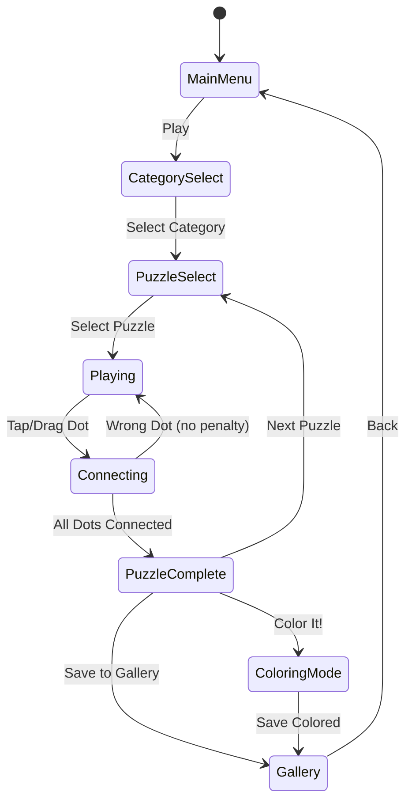

# Dot Puzzle: Connect & Relax

> 번호 순서대로 점을 이어 그림을 완성하는 힐링 퍼즐 게임

## 개요

화면에 번호가 매겨진 점들이 흩어져 있다. 플레이어는 1번부터 순서대로 점을 터치/드래그하여 선을 긋고, 마지막 점까지 연결하면 숨겨진 그림이 완성된다. 시간 제한 없이 느긋하게 즐기는 **힐링 퍼즐** 장르.

### #25 한붓그리기와의 차별점

| 구분 | #25 한붓그리기 | #46 Dot Puzzle |
|------|--------------|----------------|
| 목적 | 경로 탐색 퍼즐 (두뇌 자극) | 번호 순 연결 (힐링·완성 쾌감) |
| 난이도 | 막힘·실패 스트레스 있음 | 실패 없음, 느긋함 |
| 그림 | 추상적 선 패턴 | 구체적 완성 이미지 (동물·풍경 등) |
| 타겟 | 퍼즐러 | 캐주얼·힐링 유저 |
| 수익화 | 스테이지 팩 | 퍼즐 팩 + 색칠 프리미엄 |

---

## 게임 규칙

### 기본 규칙

- 화면에 번호가 붙은 점(dot)들이 배치됨
- 플레이어는 **1번 점부터 순서대로** 드래그/탭하여 선을 연결
- 모든 점을 순서대로 연결하면 **그림 완성**
- 시간 제한 없음 (릴랙스 모드)
- 잘못된 점을 선택해도 패널티 없음 (올바른 다음 번호만 반응)
- 연결 도중 되돌리기(Undo) 가능

### 조작 방식

- **드래그 연결**: 1번에서 손가락을 떼지 않고 순서대로 쭉 드래그
- **탭 연결**: 각 번호를 순서대로 탭 (핀치줌 시 탭 모드 추천)
- **확대/축소**: 핀치 줌으로 세밀한 점 선택 가능 (고밀도 퍼즐)

### 선 연결 피드백

- 올바른 점 연결 시: 부드러운 선 그려짐 + 소프트 효과음
- 완성 시: 그림이 점선 스타일 → 실선 → 채색(옵션) 애니메이션
- 잘못된 점 터치 시: 무반응 또는 가벼운 진동

---

## 게임 플로우



---

## UI 레이아웃

```
┌─────────────────────────────┐
│  ☰  Dot Puzzle    🖼 Gallery │  ← 상단 바
├─────────────────────────────┤
│                             │
│   •3        •7    •12       │
│       •5                    │
│  •1            •10          │
│       •4   •8               │  ← 퍼즐 캔버스
│  •2       •6   •9   •11     │    (핀치줌 가능)
│                             │
│                             │
├─────────────────────────────┤
│  🔍−  [======●======]  🔍+  │  ← 줌 슬라이더
├─────────────────────────────┤
│  ↩ Undo    ⟳ Reset   💡 Hint │  ← 하단 도구바
└─────────────────────────────┘
```

### 완성 화면

```
┌─────────────────────────────┐
│                             │
│       🎉 완성! 🎉            │
│    ┌───────────────┐        │
│    │   [완성 그림]  │        │
│    └───────────────┘        │
│                             │
│  ⭐⭐⭐  점 수: 120개 연결!   │
│                             │
│  [🎨 색칠하기]  [🖼 갤러리]   │
│  [➡ 다음 퍼즐]              │
└─────────────────────────────┘
```

---

## 카테고리 & 퍼즐 목록

### 카테고리 구성

| 카테고리 | 아이콘 | 예시 퍼즐 | 점 수 범위 |
|---------|--------|----------|-----------|
| 동물 | 🐾 | 강아지, 고양이, 토끼, 곰, 새 | 50~300 |
| 풍경 | 🌄 | 산, 집, 나무, 꽃, 달 | 80~400 |
| 건물 | 🏙 | 성, 등대, 교회, 에펠탑 | 100~400 |
| 음식 | 🍎 | 컵케이크, 아이스크림, 피자 | 50~200 |
| 탈것 | 🚂 | 기차, 비행기, 자동차, 배 | 80~300 |
| 시즌 | 🎄 | 크리스마스, 할로윈, 봄꽃 | 100~500 |

### MVP 20 퍼즐 구성 (Phase 1)

| # | 카테고리 | 제목 | 점 수 | 난이도 |
|---|---------|------|------|--------|
| 1 | 동물 | 강아지 | 50 | ★☆☆ |
| 2 | 동물 | 고양이 | 60 | ★☆☆ |
| 3 | 풍경 | 별 | 45 | ★☆☆ |
| 4 | 동물 | 물고기 | 70 | ★☆☆ |
| 5 | 풍경 | 하트 | 40 | ★☆☆ |
| 6 | 동물 | 토끼 | 80 | ★★☆ |
| 7 | 풍경 | 꽃 | 90 | ★★☆ |
| 8 | 건물 | 집 | 85 | ★★☆ |
| 9 | 음식 | 컵케이크 | 95 | ★★☆ |
| 10 | 탈것 | 자동차 | 100 | ★★☆ |
| 11 | 동물 | 코끼리 | 120 | ★★☆ |
| 12 | 풍경 | 나무 | 110 | ★★☆ |
| 13 | 건물 | 등대 | 130 | ★★★ |
| 14 | 동물 | 공룡 | 140 | ★★★ |
| 15 | 탈것 | 기차 | 150 | ★★★ |
| 16 | 건물 | 성 | 160 | ★★★ |
| 17 | 동물 | 나비 | 180 | ★★★ |
| 18 | 풍경 | 산 | 200 | ★★★ |
| 19 | 탈것 | 비행기 | 220 | ★★★ |
| 20 | 건물 | 에펠탑 | 250 | ★★★ |

---

## 난이도 시스템

### 난이도 기준

| 난이도 | 점 수 | 번호 크기 | 간격 | 대상 |
|--------|------|----------|------|------|
| ★☆☆ 입문 | 40~80 | 크게 | 넓음 | 아이·시니어 |
| ★★☆ 일반 | 81~200 | 보통 | 보통 | 일반 유저 |
| ★★★ 고급 | 201~400 | 작게 | 좁음 | 퍼즐 마니아 |
| ★★★★ 전문 | 401~500+ | 극소 | 매우 좁음 | 하드코어 |

### 번호 가독성 처리

- 입문: 번호 폰트 24px, 점 크기 16px
- 일반: 번호 폰트 18px, 점 크기 12px
- 고급: 번호 폰트 12px, 점 크기 8px → 핀치줌 필수
- 전문: 번호 숨김 옵션 (번호 없이 순서 기억)

---

## 퍼즐 데이터 구조

```typescript
interface DotPuzzle {
  id: string;
  title: string;
  category: 'animal' | 'landscape' | 'building' | 'food' | 'vehicle' | 'season';
  difficulty: 1 | 2 | 3 | 4;
  dots: Dot[];
  previewImage?: string; // 완성 이미지 썸네일
}

interface Dot {
  index: number;   // 1, 2, 3, ... (연결 순서)
  x: number;       // 0~1000 좌표 (정규화)
  y: number;       // 0~1000 좌표 (정규화)
}
```

### 좌표 데이터 자동 생성 전략

- **벡터 이미지 추출**: SVG 패스 → 등간격 샘플링으로 점 좌표 추출
- **도구 스크립트**: `scripts/svg-to-dots.ts` — SVG 경로를 N개 점으로 분할
- **수동 튜닝**: 자동 추출 후 가독성 개선 위해 점 배치 미세 조정
- 좌표는 JSON 파일로 `lib/dot-puzzle/data/{id}.json` 저장

---

## 완성 보상 & 갤러리

### 갤러리 시스템

- 완성한 퍼즐은 갤러리에 자동 저장 (로컬 스토리지)
- 갤러리: 그리드 뷰, 완성 날짜·소요 시간 표시
- 미완성 퍼즐은 실루엣(물음표)으로 표시 → 수집욕 자극

### 색칠 모드 (Color Mode)

- 점 잇기 완성 후 **색칠하기 모드**로 전환 가능
- 구역별 색칠 (버킷 채우기 방식)
- 기본 팔레트 12색 무료 / 확장 팔레트 프리미엄
- 색칠한 그림도 갤러리에 별도 저장

### 업적 시스템

| 업적 | 조건 | 보상 |
|------|------|------|
| 첫 완성 | 첫 퍼즐 완성 | 무료 팩 1개 |
| 동물 마스터 | 동물 카테고리 전체 완성 | 전용 색칠 팔레트 |
| 스피드 러너 | 100점 퍼즐 3분 내 완성 | 칭호 |
| 수집가 | 갤러리 50개 달성 | 프리미엄 테마 |

---

## 수익화 전략

### 무료 제공 (F2P)

- 카테고리당 퍼즐 3개 무료
- 광고 시청으로 힌트 획득 (1일 5회)
- 기본 색칠 팔레트

### 퍼즐 팩 (IAP)

| 팩 | 내용 | 가격 |
|----|------|------|
| 동물 팩 | 동물 퍼즐 30개 | $1.99 |
| 풍경 팩 | 풍경 퍼즐 30개 | $1.99 |
| 건물 팩 | 건물 퍼즐 30개 | $1.99 |
| 전체 팩 | 모든 카테고리 100개+ | $4.99 |
| 시즌 팩 | 시즌별 한정 20개 | $0.99 |

### 프리미엄 구독 (선택)

- **색칠 프리미엄** $2.99/월: 확장 팔레트 + 레이어 색칠 + 공유 기능
- 광고 제거 $1.99 (원타임)
- **번들**: 전체팩 + 색칠 프리미엄 + 광고제거 $7.99

### 광고 배치

- 퍼즐 완성 후 전면 광고 (3퍼즐당 1회)
- 힌트 사용 시 리워드 광고 (선택적)
- 갤러리 화면 배너 광고

---

## 사운드/이펙트

### BGM

- 힐링 장르: 로파이, 자연음, 피아노 앰비언트
- 카테고리별 테마 BGM:
  - 동물: 밝고 귀여운 멜로디
  - 풍경/자연: 바람·물 소리 믹스
  - 건물: 클래식 피아노

### SFX

| 이벤트 | 효과음 |
|--------|--------|
| 점 연결 | 부드러운 '틱' 또는 음계 상승 |
| 연속 연결 (드래그) | 부드러운 글리산도 |
| 완성 | 짧은 차임벨 + 스파클 |
| 색칠 채우기 | 부드러운 '퍽' |
| 힌트 사용 | 별 반짝이는 효과음 |

### 접근성

- BGM/SFX 개별 볼륨 조절
- 무음 모드 지원
- 진동 피드백 ON/OFF

---

## MVP 범위

### Phase 1 — MVP (1~2주)

- [x] 기획서 작성
- [ ] 점 좌표 데이터 JSON 포맷 확정
- [ ] SVG → 점 좌표 변환 스크립트
- [ ] 20개 퍼즐 데이터 제작
- [ ] 드래그/탭 연결 코어 로직 (lib)
- [ ] 퍼즐 렌더링 (캔버스 기반)
- [ ] 완성 판정 + 완성 애니메이션
- [ ] 카테고리 선택 + 퍼즐 선택 화면 (web)
- [ ] 갤러리 (완성 목록, 로컬 저장)
- [ ] 기본 BGM + SFX
- [ ] RN WebView 래핑

### Phase 2 — 확장

- [ ] 색칠 모드
- [ ] 퍼즐 팩 IAP
- [ ] 광고 통합 (리워드/전면)
- [ ] 업적 시스템
- [ ] 힌트 시스템 (다음 점 하이라이트)
- [ ] 핀치줌 고도화
- [ ] 추가 퍼즐 (100개+)

### Phase 3 — 성과 기반

- [ ] 시즌 팩 (명절·이벤트)
- [ ] 색칠 공유 기능 (SNS)
- [ ] 난이도 ★★★★ 전문 퍼즐
- [ ] 구독 모델 색칠 프리미엄
