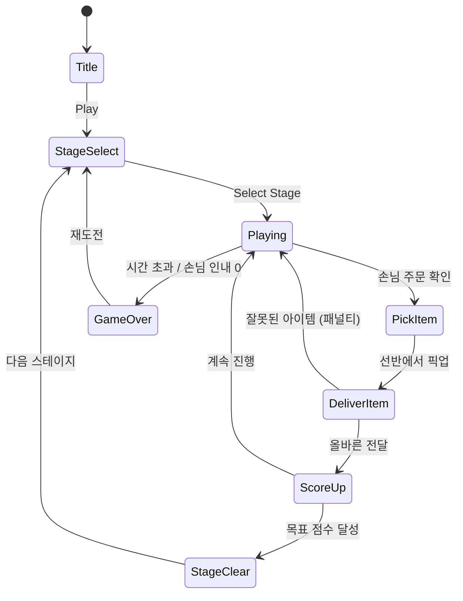

# Dream Store (드림 스토어)

> 헬로키티 마이 드림 스토어(#88, 평점 4.7) 레퍼런스 기반 자체 IP 캐주얼 스토어 운영 퍼즐

## 개요

귀여운 마스코트 캐릭터가 운영하는 드림 스토어에 손님이 찾아온다.
플레이어는 손님의 요청을 파악하고, 선반에서 물건을 꺼내 빠르게 전달하며 스토어를 운영한다.
타임 어택 + 주문 매칭 구조로 직관적이고 중독성 있는 캐주얼 경험을 제공한다.

### 포지셔닝

| 항목 | 내용 |
|------|------|
| 장르 | 캐주얼 타임 매니지먼트 + 아이템 매칭 퍼즐 |
| 타겟 | 여성 10~30대, 캐주얼 게이머 |
| 핵심 감정 | 귀여움 + 성취감 + 바쁜 재미(busy-fun) |
| 개발 기간 | 1~2주 MVP |

---

## IP 활용 전략 분석 (헬로키티 레퍼런스)

### 헬로키티 IP가 하는 일

| 역할 | 효과 |
|------|------|
| 즉각적 신뢰 | 브랜드 인지도로 다운로드 허들 제거 |
| 감정 연결 | 어릴 때부터 쌓인 캐릭터 애착 → 관대한 IAP |
| 비주얼 완성도 | IP 아트셋 = 개발 비용 절감 |
| 마케팅 자생력 | 팬덤 커뮤니티 자발적 바이럴 |

### IP 없이 동일한 효과를 내는 방법

1. **캐릭터 디자인에 집중 투자** — 마스코트 1개를 제대로 만들면 IP 부럽지 않음
2. **테마 일관성** — 비주얼 톤, 색상, 폰트, 사운드를 패키지로 통일
3. **시리즈 확장성** — 같은 마스코트로 다른 게임까지 재활용 (브랜드 자산 축적)
4. **공략 가능한 틈새** — IP 게임은 라이선스 비용에 묶여 할인/이벤트가 느림 → 자체 IP가 빠르게 대응 가능

---

## 코어 메카닉

### 기본 구조: 주문 매칭 + 타임 어택

```
손님 도착 → 말풍선에 원하는 아이템 표시 →
선반에서 아이템 픽업 → 손님에게 전달 →
팁/점수 획득 → 다음 손님
```

### 게임 루프



### 핵심 게임플레이 규칙

1. **손님 인내도**: 손님마다 인내도 게이지 존재. 시간이 지나면 감소. 0이 되면 손님 이탈 + 페널티
2. **아이템 선반**: 스토어 선반에 아이템이 카테고리별로 배치. 레벨이 오를수록 아이템 종류 증가
3. **동시 손님 수**: 레벨 1은 손님 1명, 이후 최대 4명 동시 처리
4. **콤보 보너스**: 연속 정확 전달 시 점수 배율 증가
5. **목표 점수**: 각 스테이지마다 목표 점수 존재. 달성 시 별 1~3개 획득

### 아이템 카테고리 (스토어 테마별)

| 스테이지 테마 | 아이템 예시 |
|-------------|------------|
| 빵집 | 크루아상, 케이크, 마카롱, 식빵 |
| 꽃집 | 장미, 튤립, 화분, 부케 |
| 문구점 | 노트, 펜, 스티커, 테이프 |
| 카페 | 아메리카노, 라떼, 케이크, 주스 |
| 액세서리점 | 반지, 목걸이, 헤어핀, 가방 |

---

## UI 레이아웃

```
┌─────────────────────────────┐
│  ⏱ 60s    ⭐⭐⭐  💰 1200   │  ← HUD (시간/별/점수)
├─────────────────────────────┤
│                             │
│  💁 [🎂?]   💁 [🌹?]      │  ← 손님 + 말풍선 (인내 게이지)
│  ████████   ███░░░          │
│                             │
├─────────────────────────────┤
│         STORE               │
│  ┌────┐ ┌────┐ ┌────┐      │
│  │ 🎂 │ │ 🌹 │ │ 📓 │      │  ← 아이템 선반
│  └────┘ └────┘ └────┘      │
│  ┌────┐ ┌────┐ ┌────┐      │
│  │ 🍩 │ │ 🌷 │ │ ✏️ │      │
│  └────┘ └────┘ └────┘      │
│                             │
├─────────────────────────────┤
│  🔄 다시보기  ⚡ 빠른손  ❄️ 슬로우 │  ← 아이템
└─────────────────────────────┘
```

---

## 스코어링 시스템

| 액션 | 점수 |
|------|------|
| 정확한 아이템 전달 | +100 |
| 빠른 전달 보너스 (3초 이내) | +50 |
| 콤보 (연속 정확 전달) | × 콤보 수 |
| 손님 이탈 없이 스테이지 완료 | +300 |
| 잘못된 아이템 전달 | -30 |
| 손님 인내 0 (이탈) | -100 |

### 별 기준

| 별 | 조건 |
|----|------|
| ⭐ | 목표 점수 달성 |
| ⭐⭐ | 목표 × 1.5 달성 |
| ⭐⭐⭐ | 목표 × 2 + 손님 이탈 0 |

---

## 난이도 설계

| 스테이지 | 손님 수 | 아이템 종류 | 시간(초) | 동시 손님 |
|---------|--------|------------|---------|----------|
| 1~5 | 5 | 4 | 90 | 1 |
| 6~10 | 8 | 6 | 80 | 2 |
| 11~15 | 12 | 8 | 75 | 3 |
| 16~20 | 15 | 10 | 70 | 3 |
| 21+ | 20 | 12 | 60 | 4 |

### 스테이지 진행 구조

- 5스테이지마다 테마(스토어 배경/아이템) 변경
- 20스테이지마다 보스 스테이지 (VIP 손님 — 복합 주문)

---

## 자체 캐릭터 설계

### 마스코트: "키키(Kiki)"

| 항목 | 내용 |
|------|------|
| 종 | 작은 흰 고양이 (고양이는 보편적 인기 + 헬로키티 연상 없이 독립 가능) |
| 색상 | 흰 배경 + 파스텔 핑크/민트 포인트 |
| 표정 | 말 없이 눈 표정으로만 감정 전달 (입 없음 → 차별화) |
| 의상 | 스테이지 테마별 아르바이트 복장 변경 |
| 성격 | 부지런하고 진지하지만 실수하면 귀엽게 당황 |

### 캐릭터 표현 포인트

```
기본    : (・ω・)  → 집중 모드
성공    : (≧▽≦)  → 기쁨
실패    : (；△；)  → 당황
콤보    : (✧ω✧)  → 흥분
게임오버: (｡•́︿•̀｡) → 지침
```

### 왜 고양이인가?

1. 동서양 모두 친숙한 동물 — 글로벌 마케팅 가능
2. 헬로키티와 유사한 감성이지만 법적 문제 없음
3. 귀여운 고양이 = SNS 바이럴에 최적
4. 향후 게임 시리즈 마스코트로 재활용 가능 (브랜드 자산 축적)

---

## 아이템/도구

| 아이템 | 효과 | 획득 방법 |
|--------|------|----------|
| 빠른 손 ⚡ | 다음 10초간 이동 속도 2배 | 광고 시청 or 코인 |
| 슬로우 타임 ❄️ | 5초간 모든 손님 인내 멈춤 | 코인 |
| 다시보기 🔄 | 마지막 잘못된 전달 취소 | 1회/스테이지 무료 |
| 손님 뽀너스 💝 | 현재 손님 인내 게이지 풀 충전 | 광고 시청 |

---

## 수익화 전략

### 구조: Freemium + Soft Launch 광고 수익 우선

#### 1단계: 무료 플레이 + 광고 (MVP 출시)

```
하트(라이프) 시스템:
- 기본 5하트
- 1하트 = 30분 회복
- 광고 1개 시청 → 즉시 1하트 충전
```

#### 2단계: IAP 추가 (출시 후 2주)

| 상품 | 가격 | 내용 |
|------|------|------|
| 하트 팩 | ₩1,200 | 하트 5개 |
| 스타터 팩 | ₩3,900 | 코인 500 + 하트 10 + 프리미엄 의상 |
| 광고 제거 | ₩5,900 | 영구 광고 제거 |
| 코인 팩 | ₩990~₩11,000 | 코인 100~1,500 |
| 시즌 패스 | ₩4,900/월 | 매일 코인 + 익스클루시브 의상 |

#### IP 게임 대비 수익화 장점

| 항목 | IP 게임 | 자체 IP (키키) |
|------|---------|---------------|
| 라이선스 비용 | 매출의 15~30% | 없음 |
| 가격 자유도 | IP 정책에 묶임 | 완전 자유 |
| 이벤트 속도 | IP사 승인 필요 | 즉시 대응 |
| 캐릭터 커스텀 | 제한적 | 무제한 |
| 브랜드 자산 | IP사 소유 | 우리 자산 |

### 수익 목표 (3개월)

| 월 | 목표 DAU | 목표 매출 |
|----|---------|---------|
| 1 | 1,000 | 광고 수익 위주 ₩500만 |
| 2 | 5,000 | IAP 추가 ₩2,000만 |
| 3 | 15,000 | 시즌패스 ₩6,000만 |

---

## 사운드/이펙트

- 아이템 픽업: 경쾌한 팝 효과음
- 정확 전달: 밝은 딩 + 파티클
- 콤보: 상승 음계 (2→3→4콤보마다 반음 상승)
- 손님 이탈: 실망 효과음 + 캐릭터 당황 표정
- 스테이지 클리어: 축하 BGM + 별 애니메이션
- BGM: 밝고 귀여운 카페/팝 장르, 루프

---

## MVP 범위

### Phase 1 (MVP, 1주)

- [ ] 기획서 작성
- [ ] 단일 스토어 테마 (빵집)
- [ ] 손님 1~2명 동시 처리
- [ ] 아이템 4종 매칭
- [ ] 인내 게이지 + 타임 아웃
- [ ] 5스테이지
- [ ] 기본 점수/별 시스템

### Phase 2 (2주차)

- [ ] 스토어 테마 3종 추가
- [ ] 동시 손님 최대 4명
- [ ] 아이템 도구 시스템
- [ ] 광고 연동 (하트 충전)
- [ ] 스테이지 셀렉트 UI
- [ ] 마스코트 키키 애니메이션

### Phase 3 (이후)

- [ ] IAP 추가
- [ ] 시즌 이벤트
- [ ] 리더보드
- [ ] 스토어 꾸미기 (메타 레이어)

---

## 결론: IP vs 자체 캐릭터 투자 가치

### 단기 (3개월 내)

자체 IP 투자가 정답.
IP 라이선스는 협상 기간 + 비용 구조가 MVP 속도에 맞지 않음.
`키키` 마스코트를 found3 + dream-store 양쪽에 적용하면 브랜드 일관성 확보.

### 장기

- `키키` 브랜드가 성공하면 IP 자체가 자산이 됨
- 향후 캐릭터 굿즈, 웹툰, 콜라보 등 2차 수익 가능
- 반면 IP 게임은 IP사 정책 변경 시 게임 자체가 위협받음

### 핵심 메시지

> 3개월 MVP에서 IP는 사치다.
> 귀여운 고양이 하나 제대로 만들고, 게임 재미에 집중하라.
> 우리 IP가 곧 우리 자산이다.
