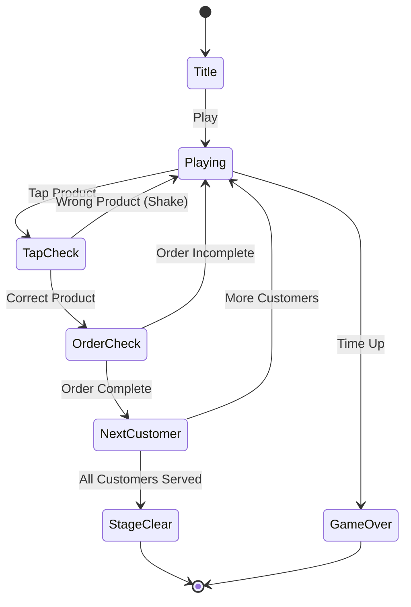

# Dream Store

> 고객 주문을 받아 그리드에서 상품을 찾아 제공하는 가게 운영 퍼즐 게임

## 개요

귀여운 상품이 그리드에 배치되어 있다. 고객이 원하는 상품 주문을 보여주면 플레이어가 그리드에서 해당 상품을 탭하여 제공한다. 모든 고객을 제한 시간 안에 서빙하면 스테이지 클리어.

## 게임 규칙

### 기본 규칙
- 그리드에 다양한 상품(음식/음료) 타일이 배치됨
- 화면 상단에 현재 고객의 주문이 표시됨 (아이콘 목록)
- 플레이어가 주문에 맞는 상품을 그리드에서 탭하면 해당 타일이 제거됨
- 올바른 상품 탭 시 주문의 해당 아이콘에 체크 표시
- 주문의 모든 상품을 제공하면 다음 고객 등장
- 모든 고객을 서빙하면 **스테이지 클리어**
- 제한 시간 내 서빙 못하면 **게임 오버**

### 그리드 보충
- 상품 제거 후 중력 적용 — 위의 타일이 아래로 떨어짐
- 빈 칸은 새로운 랜덤 상품으로 채워짐
- 주문에 필요한 상품은 하이라이트 표시됨

### 콤보 시스템
- 연속으로 올바른 상품을 탭하면 콤보 증가
- 콤보에 따라 점수 배율 증가
- 틀린 상품 탭 시 콤보 리셋 (흔들림 피드백)

## 게임 플로우



## UI 레이아웃

```
┌─────────────────────────┐
│ Stage  Score  Time Served│  ← 상단 HUD (React)
├─────────────────────────┤
│  🛒 Order: 🍰 ☕ 🍮     │  ← 현재 주문 (Phaser)
├─────────────────────────┤
│                         │
│  ┌──┐ ┌──┐ ┌──┐ ┌──┐   │
│  │🍰│ │☕│ │🧁│ │🍮│   │
│  └──┘ └──┘ └──┘ └──┘   │
│  ┌──┐ ┌──┐ ┌──┐ ┌──┐   │  ← 상품 그리드 (Phaser)
│  │🍨│ │🍰│ │☕│ │🧁│   │
│  └──┘ └──┘ └──┘ └──┘   │
│  ┌──┐ ┌──┐ ┌──┐ ┌──┐   │
│  │🍮│ │🍨│ │🍰│ │☕│   │
│  └──┘ └──┘ └──┘ └──┘   │
│                         │
└─────────────────────────┘
```

## 스코어링 시스템

| Action | Score |
|--------|-------|
| 올바른 상품 탭 | +50 × 콤보 |
| 주문 완료 보너스 | +200 |

## 난이도 설계

| Stage | 상품 종류 | 그리드 | 고객 수 | 주문 크기 | 시간(초) |
|-------|-----------|--------|---------|-----------|----------|
| 1 | 4 | 5×5 | 5 | 2 | 90 |
| 2 | 5 | 5×6 | 6 | 2 | 90 |
| 3 | 6 | 6×6 | 8 | 3 | 100 |
| 4 | 7 | 6×6 | 10 | 3 | 110 |
| 5 | 8 | 6×7 | 12 | 3 | 120 |

## 테마

- 파스텔 핑크 배경 (#fff5f7)
- 귀여운 픽셀 음식 아이콘 (cake, boba, coffee, croissant, ice cream 등)
- Hello Kitty 감성의 가게 운영 컨셉
- 주문 완료 시 카메라 플래시 이펙트

## 기술 구조

```
lib/dreamstore/          ← Phaser 게임 코어
├── src/
│   ├── types.ts         ← 타입 정의
│   ├── game.ts          ← Phaser 팩토리
│   ├── index.ts         ← public exports
│   ├── logic/
│   │   ├── board.ts     ← 그리드 생성/중력/보충
│   │   ├── stage.ts     ← 스테이지 설정
│   │   └── customer.ts  ← 고객 주문 생성/검증
│   ├── scenes/
│   │   └── PlayScene.ts ← 메인 게임 씬
│   └── objects/
│       └── ProductTile.ts ← 상품 타일 오브젝트

web/arcade/src/games/dreamstore/  ← React UI
├── useGame.ts           ← 게임 훅
├── HUD.tsx              ← 상태 표시 오버레이
└── ClearScreen.tsx      ← 결과 화면
```

## MVP 범위

### Phase 1 (MVP)
- [x] 기획서 작성
- [x] 상품 그리드 (중력 + 보충)
- [x] 고객 주문 표시 + 탭으로 서빙
- [x] 콤보 시스템
- [x] 타이머 + 게임 오버 판정
- [x] 5 스테이지
- [x] HUD + ClearScreen
- [x] App.tsx 라우트 등록

### Phase 2
- [ ] 사운드 이펙트
- [ ] 특수 고객 (더 높은 보너스)
- [ ] 스테이지 셀렉트 화면
- [ ] 리더보드
