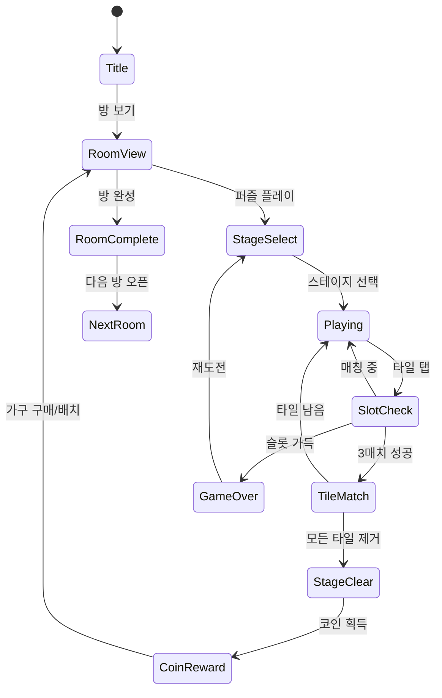

# Dreamy Room - 꿈의 방

> **장르**: Triple Match Puzzle + 방 꾸미기 메타
> **레퍼런스 순위**: #69 | **개발사**: ABI Games Studio | **평점**: 4.5

## 개요

몽환적인 방을 꾸미는 인테리어 판타지 게임. 트리플 매치 퍼즐을 클리어하여 가구와 소품을 획득하고, 자신만의 꿈의 방을 완성해 나가는 캐주얼 퍼즐.

**코어 루프**: 퍼즐 클리어 → 별/코인 획득 → 가구 잠금 해제 → 방 꾸미기 → 다음 방 오픈

---

## 1. 코어 메카닉

### 게임 루프

```
[퍼즐 스테이지] → [클리어] → [코인/별 획득] → [가구 구매/선택] → [방에 배치] → [방 완성] → [다음 방 오픈]
```

### 퍼즐 ↔ 꾸미기 연동

- 스테이지 1개 클리어 → 코인 50~150 (난이도 비례)
- 가구 1개 해금 비용: 코인 100~300
- 방 1개 완성에 필요 가구: 10~15개 → 약 15~20 스테이지 필요
- 스테이지당 소요 시간: 약 2~4분 → 방 1개 완성에 총 30~60분 플레이

---

## 2. 매치 퍼즐 타입: Triple Match (Found3 유사 방식)

### 왜 Triple Match인가?

| 방식 | 특징 | 채택 여부 |
|------|------|-----------|
| Swap Match-3 (Candy Crush) | 인접 타일 교환 → 3개 줄 맞추기 | ❌ 개발 복잡도 높음 |
| Triple Match (Found3 방식) | 같은 그림 3개 선택 → 제거 | ✅ **채택** |
| Blast Puzzle | 타일 탭 → 같은 색 그룹 제거 | ❌ 꾸미기 테마와 연동 어색 |

### Triple Match 적용 방식

- **퍼즐 타일 = 가구/소품 아이콘** (의자, 침대, 식물, 램프 등)
- 같은 아이템 3개 선택 시 제거
- 제거된 아이템 → "수집 슬롯"에 적립 → 방 꾸미기 재료
- 테마 일체감: 퍼즐에서 모은 가구가 실제로 방에 배치됨

### 게임 규칙

- 보드에 다양한 가구/소품 타일 배치 (레이어 겹침 가능)
- 하단 슬롯 최대 7칸
- 슬롯이 가득 차고 3매치 불가 시 게임 오버
- 제한 시간 또는 제한 이동 횟수 방식

---

## 3. 방 꾸미기 메타

### 방 구성

- **방 1개** = 바닥 + 벽 + 가구 10~15개 슬롯
- 가구 종류: 침대, 책상, 의자, 커튼, 조명, 러그, 화분, 선반 등
- 각 가구에 **스타일 A/B 선택지** 제공 (예: 침대 - 화이트 vs 우드)

### 배치 방식 (MVP 간소화)

```
[방 전경 이미지]
  ┌─────────────────────────┐
  │  🪞  🛏️         🪴      │
  │    [침대 선택 중]        │  ← 가구 슬롯에 탭하면 선택 UI
  │  🪑      💡    📚       │
  │                         │
  └─────────────────────────┘
     [A스타일] [B스타일]      ← 2가지 중 선택
```

- 드래그&드롭 불필요 (MVP) → **탭하여 스타일 선택** 방식으로 단순화
- 가구 위치는 고정 (배치 자유도 없음, MVP 기준)

### 방 종류 (MVP 기준 3개 방)

| 방 | 테마 | 분위기 |
|----|------|--------|
| Room 1 | 공주의 침실 | 핑크/골드, 로맨틱 |
| Room 2 | 자연의 서재 | 우드/그린, 포레스트 힐링 |
| Room 3 | 우주 별빛 방 | 퍼플/블루, 몽환적 |

---

## 4. #35 Tile Home과의 비교 및 차별점

| 항목 | Tile Home (#35) | Dreamy Room (#69) |
|------|-----------------|-------------------|
| 퍼즐 타입 | 타일 퍼즐 (집 짓기 방식) | Triple Match (가구 수집) |
| 꾸미기 테마 | 집 전체 건설/리모델링 | 방 단위 인테리어 꾸미기 |
| 감성 | 실용적, 건축/DIY 느낌 | 몽환적, 감성/판타지 |
| 타겟 | 건축/집 관심층 | 인테리어/라이프스타일 관심층 |
| 에셋 규모 | 집 전체 (복수의 방+외관) | 방 단위 (집중, 관리 용이) |
| 스토리 | 집 완성 목표 | 꿈의 방 완성 판타지 |
| 선택 자유도 | 건축 순서/구조 | 가구 스타일 A/B 선택 |

**핵심 차별점**: Tile Home이 "집짓기 건설 시뮬레이션" 느낌이라면, Dreamy Room은 "내 꿈의 공간 꾸미기 판타지"로 감성적 몰입감이 강점.

---

## 5. 감성 소구 - 타겟 유저

### 주 타겟

- **20~35세 여성**
- 인테리어, 홈리빙, 라이프스타일 콘텐츠에 관심
- 오늘의 집, 핀터레스트 사용자층
- "나만의 공간" 판타지를 즐기는 사람

### 감성 키워드

`몽환적` · `힐링` · `나만의 공간` · `인테리어 판타지` · `감성 인테리어`

### 마케팅 소구점

- "현실에서 못 이룬 인테리어를 게임에서"
- 단 5분 퍼즐로 꿈의 방 한 걸음씩 완성
- 방 완성 후 SNS 공유 기능 (스크린샷 → 공유 트리거)

---

## 6. 수익화 모델

### 기본 구조: F2P + 광고 + IAP

| 수익원 | 방식 | 예상 비중 |
|--------|------|-----------|
| 전면 광고 | 스테이지 실패 후 광고 보기 = 재도전 | 40% |
| 보상형 광고 | 광고 시청 → 아이템/코인 보상 | 25% |
| 하트(라이프) IAP | 소진 시 충전 | 20% |
| 프리미엄 가구 | 다이아/프리미엄 재화로 구매 | 10% |
| 광고 제거 패키지 | 일회성 구매 | 5% |

### 라이프 시스템

- 하트 5개 기본 제공
- 스테이지 실패 시 하트 1개 소비
- 하트 자동 회복: 30분당 1개
- 광고 시청 → 즉시 하트 1개 추가
- 하트 팩 IAP: ₩1,200 (10개), ₩3,500 (무제한 24시간)

### 프리미엄 가구

- 일반 가구: 코인(무료 재화)으로 해금
- 프리미엄 가구: 다이아(유료 재화) 필요
- 방 1개당 프리미엄 가구 2~3개 (전체의 20%)
- 프리미엄 가구 없이도 방 완성 가능 (강제 아님)

---

## 7. 메타게임 에셋 부담 분석

### MVP 에셋 규모 (3개 방 기준)

| 에셋 종류 | 수량 | 비고 |
|-----------|------|------|
| 방 배경 이미지 | 3개 | 1024x768 고해상도 |
| 가구 아이콘 (퍼즐용) | 20~25종 | 64x64 px |
| 가구 인테리어 이미지 | 15개/방 × 3방 = 45개 | A/B 스타일 포함 시 90개 |
| UI 기본 소재 | 버튼, 팝업 등 20개 | |
| 캐릭터 (옵션) | 1개 (반신상) | MVP에서 생략 가능 |

### 에셋 부담 평가

```
전체 에셋: ~120개 이미지
일러스트레이터 작업 시 예상: 5~8일 (아웃소싱 기준)
비용 추정: 50~100만원 (프리랜서 수준)
```

**비교**: 순수 퍼즐(found3 방식) 대비 에셋 3~4배 → 핵심 병목

### 위험 완화 전략

1. **Free Asset 우선 활용**: 로열티 프리 인테리어 아이콘 팩 구매 ($20~50)
2. **AI 생성 이미지**: Midjourney/Stable Diffusion으로 배경 생성
3. **방 수 최소화**: MVP는 1개 방으로 시작, 데이터 보고 추가
4. **스타일 단순화**: A/B 선택 없이 단일 스타일로 시작

---

## 8. 결론: 꾸미기 메타 추가 가치 vs 순수 퍼즐 집중

### 시장 데이터

- 꾸미기 메타 포함 캐주얼 퍼즐: 리텐션 D7 약 20~30%
- 순수 트리플 매치 (메타 없음): 리텐션 D7 약 8~15%
- 꾸미기 메타는 **리텐션 2~3배 향상** → 수익화 효율 직결

### MVP 권장 전략

```
[Phase 1 - 2주 목표]
  퍼즐 메카닉 완성 (Triple Match)
  + 방 1개 (최소 꾸미기)
  + 광고 수익화

[Phase 2 - 데이터 후]
  방 추가 (방 2, 3)
  A/B 스타일 선택 기능
  소셜 공유
```

### 최종 판단

| 옵션 | 장점 | 단점 | 권장 시기 |
|------|------|------|-----------|
| 순수 퍼즐 집중 | 빠른 출시 (1주), 에셋 최소 | 낮은 리텐션, 경쟁 포화 | 리소스 없을 때 |
| 꾸미기 메타 풀 구현 | 높은 리텐션, 강한 IP | 에셋 부담, 2~3주 추가 | 여유 있을 때 |
| **MVP 꾸미기 (방 1개)** | 리텐션 확보 + 빠른 출시 균형 | 컨텐츠 부족감 | **현재 상황에 최적** |

> **최종 권장**: 퍼즐 + 방 1개 꾸미기 MVP로 2주 내 출시. 리텐션/CPI 지표 확인 후 방 추가 여부 결정.
> 꾸미기 메타는 Tile Home과의 차별화 포인트이므로 **완전히 제거하지 말 것**.

---

## 게임 플로우



## UI 레이아웃

```
[퍼즐 화면]
┌─────────────────────────┐
│  ❤️❤️❤️   스테이지 5    🪙150 │
├─────────────────────────┤
│                          │
│  🛏️  🪑  🛏️  🪴  🛏️    │
│    🪴  🪑  🪴  🪑       │
│  💡  🛏️  💡  🪑  💡    │  ← 가구 아이콘 타일
│                          │
├─────────────────────────┤
│ [🛏️][🪑][  ][  ][  ][  ][  ] │  ← 슬롯 (7칸)
├─────────────────────────┤
│   🔀 셔플    ↩️ 되돌리기  │
└─────────────────────────┘

[방 꾸미기 화면]
┌─────────────────────────┐
│     ✨ 꿈의 침실 ✨       │
│ ┌───────────────────┐   │
│ │  🪞     🛏️    🪴  │   │
│ │                   │   │  ← 방 전경
│ │  🪑     💡    📚  │   │
│ └───────────────────┘   │
│                          │
│ [침대 선택]              │
│ [화이트] [우드]          │  ← 스타일 A/B 선택
└─────────────────────────┘
```

## 스코어링 시스템

| Action | 보상 |
|--------|------|
| 타일 3매치 제거 | 코인 +10 |
| 연속 매치 (콤보) | 코인 +10 × 콤보 |
| 스테이지 클리어 | 코인 +50 |
| 남은 시간 보너스 | 코인 +(남은초 × 0.5) |

## 난이도 설계

| Level | 그림 종류 | 타일 수 | 레이어 | 시간(초) | 방 연동 |
|-------|-----------|---------|--------|----------|---------|
| 1~5 | 4~6 | 12~18 | 1 | 120 | Room 1 |
| 6~10 | 6~8 | 18~24 | 2 | 150 | Room 1 완성 |
| 11~15 | 8~10 | 24~30 | 2 | 150 | Room 2 |
| 16~20 | 10~12 | 30~36 | 3 | 180 | Room 2 완성 |

## 사운드/이펙트

- 타일 선택: 부드러운 팝 효과음 (몽환적 톤)
- 3매치 제거: 반짝임 이펙트 + 별 파티클
- 방 가구 배치: 기쁜 멜로디 + 반짝 이펙트
- 방 완성: 화려한 축하 연출 (파티클 + 음악)
- 배경음: 잔잔한 드림팝/로파이 계열

## MVP 범위

### Phase 1 (MVP - 2주)

- [ ] 기획서 작성
- [ ] Triple Match 퍼즐 코어 (found3 기반)
- [ ] 가구 테마 타일 이미지 적용
- [ ] 방 1개 꾸미기 화면 (탭 → 배치 방식)
- [ ] 코인 시스템 (퍼즐 클리어 → 코인 → 가구 해금)
- [ ] 스테이지 10개
- [ ] 광고 수익화 (AdMob)

### Phase 2 (데이터 후)

- [ ] 방 2, 3 추가
- [ ] 가구 A/B 스타일 선택
- [ ] 소셜 공유 (방 완성 스크린샷)
- [ ] 이벤트 가구 (시즌 한정)
- [ ] 하트(라이프) IAP
