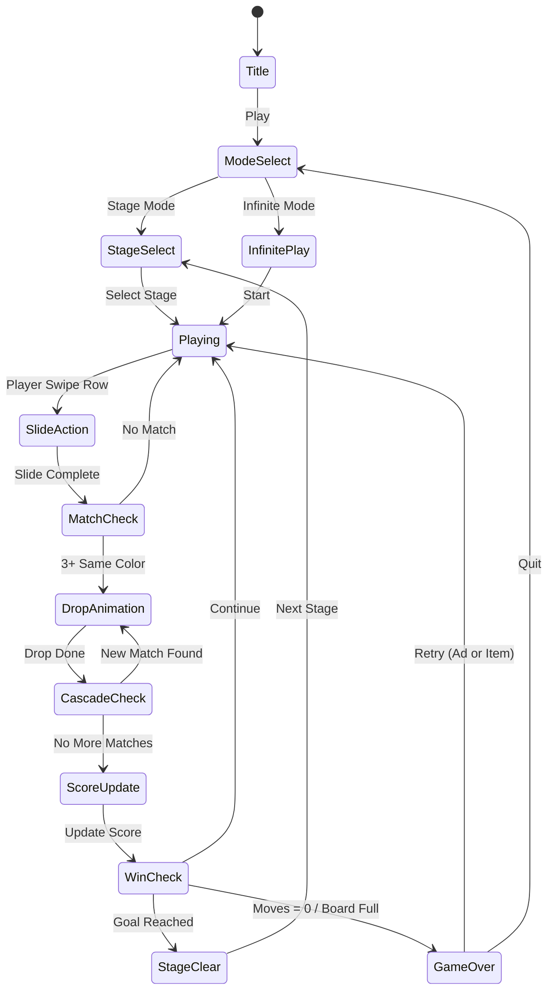

# Drop Away: Color Puzzle

> 색상 블록을 슬라이드로 정렬하여 같은 색 그룹을 만들면 드롭(제거)되는 캐스케이드 퍼즐

## 개요

N×M 그리드 보드 위에 다양한 색상의 블록이 쌓여 있다.
플레이어는 **행(row) 단위로 블록을 슬라이드**하여 같은 색상의 블록을 인접시킨다.
일정 수 이상 같은 색이 연속으로 인접하면 자동으로 드롭(제거)되고,
위의 블록이 낙하하며 **연쇄(캐스케이드) 매칭**이 발생한다.
목표: 보드를 비우거나 최대 점수를 획득.

---

## 게임 규칙

### 기본 규칙

- 보드는 **6열 × 8행** 그리드 (MVP 기준)
- 각 셀에는 색상 블록 또는 빈 칸이 존재
- 플레이어는 **한 행을 좌우로 슬라이드** (무한 루프 슬라이드, 끝에서 반대쪽으로 이어짐)
- 같은 색 블록이 **3개 이상 가로로 연속** 인접하면 즉시 드롭(제거)
- 드롭 후 위 블록이 **중력에 의해 낙하** → 새로운 매치 발생 가능 (캐스케이드)
- 이동 횟수 제한 또는 타이머로 난이도 조절

### 슬라이드 조작

- 해당 행을 **좌 또는 우로 1칸씩 이동** (드래그 또는 버튼)
- 이동 1회 = 1 무브 소모
- 무브를 소모해야만 매치 판정 → 전략적 조작 필요

### 매치 & 드롭 조건

| 조건 | 결과 |
|------|------|
| 같은 색 3개 가로 연속 | 즉시 드롭 |
| 같은 색 4개 가로 연속 | 드롭 + 보너스 점수 |
| 같은 색 5개 이상 가로 연속 | 드롭 + 스페셜 이펙트 + 큰 보너스 |

### 캐스케이드 (연쇄 낙하)

1. 블록 드롭 → 위 블록 낙하
2. 낙하 완료 후 재매칭 판정
3. 새로운 매치 발생 시 다시 드롭 → 반복
4. 캐스케이드 횟수에 따라 **콤보 보너스** 적용

### 게임 오버 / 클리어 조건

| 모드 | 클리어 | 게임 오버 |
|------|--------|-----------|
| 스테이지 모드 | 지정 블록 수 제거 | 무브 소진 |
| 무한 모드 | (없음) | 블록이 상단 경계를 넘음 |

---

## 게임 플로우



---

## UI 레이아웃

```
┌─────────────────────────────┐
│  ⭐ 1,250    🎯 15/30 블록   │  ← HUD: 점수 / 목표
│  🔢 Moves: 18               │  ← 남은 무브 수
├─────────────────────────────┤
│  ┌──┬──┬──┬──┬──┬──┐        │
│  │🔴│🔵│🟢│🔴│🟡│🔵│  ← 행 8 (최상단)
│  ├──┼──┼──┼──┼──┼──┤        │
│  │🟢│🟢│🔴│🟡│🔵│🟡│  ← 행 7
│  ├──┼──┼──┼──┼──┼──┤        │
│  │🔵│🔴│🔴│🔴│🟢│🔵│  ← 행 6 ← 드롭 예정
│  ├──┼──┼──┼──┼──┼──┤        │
│  │🟡│🟢│🔵│🟢│🔴│🟡│  ← 행 5
│  ├──┼──┼──┼──┼──┼──┤        │
│  │🔴│🟡│🟢│🔵│🔵│🔵│  ← 행 4 ← 드롭 예정
│  ├──┼──┼──┼──┼──┼──┤        │
│  │🟢│🔴│🟡│🔴│🟢│🔵│  ← 행 3
│  ├──┼──┼──┼──┼──┼──┤        │
│  │🔵│🔵│🔴│🟡│🟡│🟡│  ← 행 2 ← 드롭 예정
│  ├──┼──┼──┼──┼──┼──┤        │
│  │🟡│🔴│🟢│🔵│🔴│🟢│  ← 행 1 (최하단)
│  └──┴──┴──┴──┴──┴──┘        │
│     ← ●  행 5 선택  ● →     │  ← 슬라이드 컨트롤
├─────────────────────────────┤
│  🔄 Undo(3)  🎨 Paint(2)   │
│  📺 +5 Moves (광고)         │  ← 아이템 / 광고 버튼
└─────────────────────────────┘
```

---

## 스코어링 시스템

| Action | 기본 점수 | 비고 |
|--------|----------|------|
| 3-블록 매치 드롭 | +100 | |
| 4-블록 매치 드롭 | +250 | |
| 5-블록 이상 드롭 | +500 | |
| 캐스케이드 1단계 | ×1.5 배율 | 드롭 점수에 적용 |
| 캐스케이드 2단계 | ×2.0 배율 | |
| 캐스케이드 3단계+ | ×3.0 배율 | |
| 스테이지 클리어 | +1,000 | |
| 남은 무브 보너스 | 남은 무브 × 50 | |

### 콤보 연출

- 1단 콤보: "NICE!"
- 2단 콤보: "GREAT!"
- 3단 콤보: "AMAZING!"
- 4단 이상: "DROP FRENZY!" (화면 전체 이펙트)

---

## 특수 블록 (Phase 2)

| 블록 | 외형 | 효과 |
|------|------|------|
| 폭탄 블록 | 💣 | 제거 시 3×3 범위 블록 폭파 |
| 레인보우 블록 | 🌈 | 어떤 색과도 매치 가능 (와일드카드) |
| 잠금 블록 | 🔒 | 2회 매치되어야 제거 (첫 번째는 잠금 해제) |
| 돌 블록 | 🪨 | 인접 폭발로만 제거 가능 |
| 2X 블록 | ✨ | 포함된 매치의 점수 2배 |

---

## 난이도 설계

### 스테이지 모드

| Stage | 색상 수 | 그리드 | 초기 블록 행 | 목표 블록 수 | 무브 수 | 특수 블록 |
|-------|---------|--------|------------|------------|---------|---------|
| 1~5 | 3색 | 6×8 | 4행 | 15개 | 20 | 없음 |
| 6~10 | 4색 | 6×8 | 5행 | 20개 | 22 | 없음 |
| 11~20 | 4색 | 6×9 | 6행 | 25개 | 25 | 잠금 |
| 21~35 | 5색 | 6×9 | 6행 | 30개 | 25 | 잠금, 폭탄 |
| 36~50 | 5색 | 6×10 | 7행 | 35개 | 28 | 레인보우 제외 전체 |
| 51+ | 6색 | 6×10 | 8행 | 40개 | 30 | 전체 |

### 무한 모드 (MVP 핵심)

- 위에서 블록이 계속 추가 (일정 시간마다 1행씩)
- 블록이 최상단 경계를 넘으면 게임 오버
- 시간이 지날수록 블록 추가 속도 증가
- 점수 기록 → 리더보드

---

## 아이템 시스템

| 아이템 | 효과 | 획득 방법 |
|--------|------|----------|
| Undo (되돌리기) | 마지막 슬라이드 취소 | 구매 / 광고 |
| Color Paint (색 변환) | 선택한 블록의 색을 원하는 색으로 변경 (1개) | 구매 |
| +5 Moves | 무브 5회 추가 | 광고 시청 (1회/판) |
| Row Blast | 선택한 행 전체 제거 | 구매 (희귀) |
| Shuffle | 현재 보드 블록 색상 랜덤 재배치 | 구매 |

---

## 수익화 설계

### 인앱 구매 (IAP)

| 상품 | 가격 | 내용 |
|------|------|------|
| 코인 소량 | $0.99 | 100 코인 |
| 코인 중량 | $2.99 | 350 코인 (17% 보너스) |
| 코인 대량 | $9.99 | 1,400 코인 (40% 보너스) |
| 광고 제거 | $3.99 | 광고 없이 플레이 |
| 스타터 팩 | $1.99 | 200코인 + Undo×5 + Color Paint×3 (신규 한정) |

| 아이템 가격 (코인) | 비용 |
|--------------|------|
| Undo 1회 | 30 코인 |
| Color Paint 1회 | 50 코인 |
| +5 Moves 1회 | 40 코인 |
| Row Blast 1회 | 80 코인 |

### 광고 수익

- 게임 오버 시: "광고 보고 5무브 추가" 제안 (1회/스테이지)
- 무한 모드 일시 정지: "광고 보고 계속하기" (1회/세션)
- 스테이지 클리어 후: 보상형 광고로 코인 2배
- 일일 보너스: 광고 1회 → 코인 50개

---

## 사운드 / 이펙트

| 이벤트 | 사운드 | 비주얼 |
|--------|--------|--------|
| 블록 슬라이드 | 슥~ 슬라이딩 효과음 | 행 이동 애니메이션 (0.1s) |
| 3-매치 드롭 | 퐁! 팝 사운드 | 블록 소멸 파티클 |
| 4-매치 드롭 | 두두두 드럼롤 짧게 | 더 큰 파티클 + 점수 팝업 |
| 5+매치 드롭 | 팡파레 짧게 | 화면 플래시 + 큰 콤보 텍스트 |
| 블록 낙하 | 탁탁 착지음 | 바운스 애니메이션 |
| 캐스케이드 1단 | 연속 팝 | 잔상 이펙트 |
| 캐스케이드 3단+ | DROP FRENZY 음악 | 화면 전체 컬러 폭발 |
| 게임 오버 | 낮은 실패음 | 보드 흔들림 |
| 스테이지 클리어 | 밝은 팡파레 | 별 3개 + 코인 낙하 |

---

## 게임 상태 데이터 구조

```typescript
// 개발팀 참고용 (lib 팀이 구현)

type Color = 'red' | 'blue' | 'green' | 'yellow' | 'purple' | 'orange';

interface Block {
  color: Color | 'rainbow' | 'bomb' | 'locked' | 'stone';
  locked: boolean;   // 잠금 블록 상태
  lockCount: number; // 잠금 해제까지 남은 횟수
}

interface BoardState {
  grid: (Block | null)[][];  // [row][col], null = 빈칸
  rows: number;
  cols: number;
  selectedRow: number | null;
}

interface GameState {
  board: BoardState;
  score: number;
  movesLeft: number;
  targetBlocks: number;
  removedBlocks: number;
  cascadeCount: number;
  mode: 'stage' | 'infinite';
}
```

---

## MVP 범위

### Phase 1 — MVP (1~2주 목표)

- [x] 기획서 작성
- [ ] 6×8 그리드, 3~4색 블록
- [ ] 행 슬라이드 조작 (좌/우 드래그)
- [ ] 3-매치 가로 판정 & 드롭
- [ ] 중력 낙하 (캐스케이드)
- [ ] 콤보 배율 점수
- [ ] 무한 모드 (블록 자동 추가 + 게임 오버)
- [ ] 기본 애니메이션 (슬라이드, 드롭, 낙하)
- [ ] Undo 아이템 (1개 기본 제공)
- [ ] 스코어 저장 (로컬)

### Phase 2 — 수익화 & 콘텐츠

- [ ] 스테이지 모드 (스테이지 1~20)
- [ ] Color Paint 아이템
- [ ] 광고 연동 (+5 무브, 코인 2배)
- [ ] IAP 코인 시스템
- [ ] 특수 블록 (잠금, 폭탄)
- [ ] 리더보드 (무한 모드)
- [ ] 사운드 이펙트 전체 적용

### Phase 3 — 성장

- [ ] 스테이지 21~50
- [ ] 레인보우/돌 블록
- [ ] 일일 챌린지 모드
- [ ] 소셜 공유 (점수)
- [ ] 튜토리얼 개선
