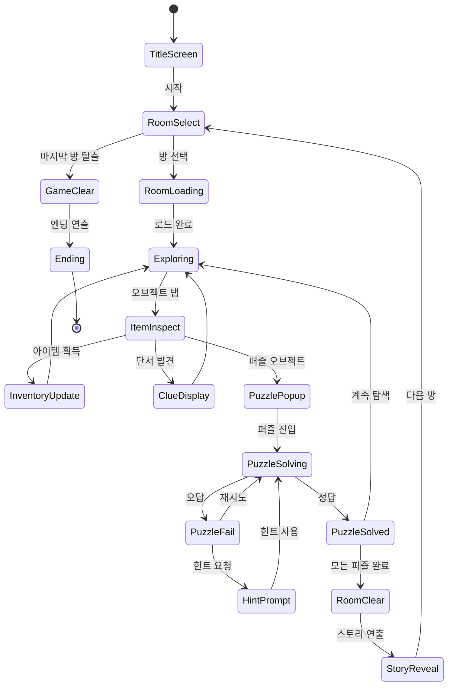

# 방탈출 - 정신병원 탈출하기

> **장르**: Brain-Logic / Escape Room
> **레퍼런스 랭크**: #111 (Rating 4.8)
> **개발사 레퍼런스**: Peaksel Games
> **MVP 목표**: 1~2주
> **우선순위**: Phase 1 출시 후보

---

## 개요

폐쇄된 정신병원에 갇힌 플레이어가 방마다 숨겨진 단서를 수집하고 퍼즐을 풀어 탈출하는 포인트앤클릭 방탈출 게임.

- **핵심 재미 루프**: 오브젝트 탭 → 단서 발견 → 퍼즐 해결 → 다음 방 이동
- **타깃**: 추리/어드벤처 좋아하는 20~35세 (방탈출 카페 경험자층)
- **세션 길이**: 방 1개 = 5~15분, 전체 1~2시간
- **특징**: 몰입형 스토리 + 정신병원 공포/미스터리 분위기

---

## 게임 규칙

### 기본 규칙

- 각 **방(씬)**에는 탭 가능한 오브젝트가 배치됨
- 오브젝트 탭 → 아이템 획득 또는 단서 텍스트 표시
- 인벤토리에 담긴 아이템은 다른 오브젝트에 사용 가능
- 모든 퍼즐을 풀면 출구가 열리며 다음 방으로 이동
- 스토리 완결(최종 탈출)까지 총 **5개 방**

### 인벤토리 시스템

- 최대 **10개** 아이템 보관
- 아이템 + 아이템 결합 가능 (2개 선택 후 합치기 버튼)
- 결합 불가 시 "사용할 수 없습니다" 피드백
- 사용된 아이템은 자동 제거

### 오브젝트 종류

| 타입 | 설명 | 예시 |
|------|------|------|
| 수집형 | 탭하면 인벤토리에 추가 | 열쇠, 메모지, 약병 |
| 조사형 | 탭하면 단서 텍스트 표시 (아이템 없음) | 낙서, 달력, 사진 |
| 잠금형 | 아이템/코드 입력으로 해제 | 자물쇠, 금고, 캐비닛 |
| 퍼즐형 | 미니게임 UI 팝업 | 숫자패드, 슬라이더, 전선 연결 |
| 결합형 | 두 아이템을 조합해야 사용 가능 | 자루 + 날 = 도끼 |

---

## 스토리 & 내러티브

### 배경 설정

> 2003년. 폐업한 **한산정신병원**. 당신은 실종된 동생을 찾아 이곳에 잠입했다.
> 병원 문이 잠기고, 전기가 나간다. 벽에는 누군가 남긴 낙서들...
> "여기서 나갈 수 없어."

### 방 구성 & 스토리 흐름

| 방 번호 | 장소 | 핵심 퍼즐 | 스토리 단서 |
|---------|------|-----------|-------------|
| Room 1 | 입원실 | 자물쇠 + 숫자 조합 | 동생의 입원 기록 발견 |
| Room 2 | 복도 | 전선 연결 + 패턴 매칭 | 의사의 실험 일지 발견 |
| Room 3 | 처치실 | 약품 혼합 + 아이템 결합 | 생존자 메시지 발견 |
| Room 4 | 원장실 | 금고 + 암호 해독 | 실험 진실 노출 |
| Room 5 | 지하실 | 탈출 시퀀스 (복합 퍼즐) | 동생과 함께 탈출 |

### 내러티브 전달 방식

- **메모/일지**: 오브젝트 조사 시 텍스트 팝업 (짧고 임팩트 있게, 3~5줄)
- **환경 스토리텔링**: 벽 낙서, 쓰러진 의자, 혈흔 등 비주얼로 암시
- **보이스오버 없음** (MVP): 텍스트만으로 구현, 사운드 이펙트로 분위기 보강

---

## 퍼즐 시스템

### 퍼즐 종류 상세

#### 1. 숫자 조합 자물쇠
```
[_][_][_][_]  ← 4자리 입력
[확인] [지우기]
```
- 단서: 방 어딘가에 힌트(달력 날짜, 낙서 숫자 등)
- 난이도 조절: 직접 힌트(쉬움) → 암호화된 힌트(어려움)

#### 2. 패턴 매칭 (전선 연결)
```
LEFT    RIGHT
빨강 ○  ○ 빨강
파랑 ○  ○ 초록
초록 ○  ○ 파랑
```
- 드래그로 선 연결
- 색상/심볼 매칭

#### 3. 슬라이딩 퍼즐 (자물쇠 다이얼)
- 3~4개 슬라이더를 올바른 위치로 이동
- 힌트: 주변 오브젝트에서 각 슬라이더 값 유추

#### 4. 아이템 결합
- 인벤토리에서 두 아이템 선택 후 "결합" 버튼
- 예: `녹슨 열쇠 + 오일 = 기름칠된 열쇠`
- 예: `전구 + 소켓 = 작동하는 전구`

#### 5. 시퀀스 입력 (버튼 순서)
- 방 내 단서에서 올바른 버튼 순서 유추
- 예: 포스터의 기호 순서대로 버튼 누르기

#### 6. 탈출 시퀀스 (최종 보스 퍼즐)
- 위 퍼즐 2~3개를 연달아 해결
- 타이머 추가 (긴장감)
- 실패 시 재시도 가능 (패널티 없음, 단 힌트 차감)

### 퍼즐 난이도 배분

| 방 | 퍼즐 수 | 난이도 | 비고 |
|----|---------|--------|------|
| Room 1 | 2개 | ★☆☆ | 튜토리얼 성격 |
| Room 2 | 3개 | ★★☆ | 패턴 도입 |
| Room 3 | 3개 | ★★☆ | 아이템 결합 도입 |
| Room 4 | 4개 | ★★★ | 복합 퍼즐 |
| Room 5 | 5개 | ★★★ | 타이머 + 복합 |

---

## 게임 플로우



---

## UI 레이아웃

### 메인 탐색 화면

```
┌─────────────────────────────┐
│  ☰ 메뉴    Room 2/5  💡×3  │  ← 상단 HUD (방 진행도 + 힌트 수)
├─────────────────────────────┤
│                             │
│    [  방 배경 이미지  ]      │
│    탭 가능 오브젝트들        │
│    ● 자물쇠    ● 서랍        │  ← 오브젝트에 미묘한 글로우 효과
│    ● 메모지   ● 창문         │
│                             │
├─────────────────────────────┤
│  ← 이전   🔍 확대   → 다음  │  ← 씬 이동 (좌/우 스와이프)
├─────────────────────────────┤
│ [아이템1][아이템2][아이템3]  │  ← 인벤토리 바 (하단 고정)
│ [아이템4][아이템5][ + 결합 ]  │
└─────────────────────────────┘
```

### 퍼즐 팝업

```
┌─────────────────────┐
│ × 닫기              │
│                     │
│   [퍼즐 UI 영역]    │
│                     │
│  💡 힌트 사용하기   │
└─────────────────────┘
```

### 화면 전환 구조

- 각 방은 **좌/우 스크롤** 3~4개 패널로 구성
- 줌인 기능: 특정 오브젝트 클로즈업 뷰
- 방 이동: 문 탭 → 페이드 전환 → 다음 방

---

## 힌트 시스템

| 레벨 | 힌트 내용 | 비용 |
|------|-----------|------|
| 힌트 1 | "이 퍼즐은 방 안 어딘가에 답이 있습니다" | 무료 |
| 힌트 2 | "달력의 빨간 날짜를 확인하세요" (일반적 방향) | 힌트 코인 1개 |
| 힌트 3 | "답: 1023" (직접 답 공개) | 힌트 코인 2개 |

- 힌트 코인: 광고 시청으로 획득 (1개) 또는 IAP 구매
- 게임 시작 시 힌트 코인 3개 제공 (튜토리얼)

---

## 스코어링 & 진행도

방탈출 장르 특성상 점수보다 **완료 추적**이 중심:

| 지표 | 표시 방식 |
|------|-----------|
| 방 클리어 수 | 별 3개 (힌트 사용 수에 따라) |
| 총 클리어 시간 | 기록으로 표시 |
| 힌트 사용 횟수 | 엔딩 등급에 반영 |

**엔딩 등급**:
- S: 힌트 0개, 모든 오브젝트 조사
- A: 힌트 1~2개
- B: 힌트 3개 이상

---

## 수익화 전략

### 핵심 수익 모델 (3가지 조합)

#### 1. 방 팩 IAP (주력)
```
무료: Room 1~2 (첫 경험, 훅)
유료: Room 3~5 묶음 = ₩2,900 (전체 팩)
또는: Room별 낱개 구매 = 방당 ₩1,200
```
- **전환율 목표**: 무료 플레이어 중 15~20%
- 완성된 스토리를 보고 싶은 욕구가 전환 드라이버

#### 2. 힌트 코인 IAP
```
힌트 5개 묶음 = ₩900
힌트 20개 묶음 = ₩2,900
무제한 힌트 (영구) = ₩4,900
```
- 라이트 유저 대상 낱개 구매 유도
- 어려운 퍼즐에서 자연스러운 전환

#### 3. 광고 (보조)
- 힌트 코인 1개 = 광고 시청 (15~30초 리워드 광고)
- 방 클리어 후 인터스티셜 (스킵 가능 3초 후)
- **중요**: 광고 빈도 과하면 리텐션 저하 → 방 팩 전환에 집중

### 수익 시뮬레이션 (Month 1)

| 지표 | 추정치 |
|------|--------|
| DAU 목표 | 5,000 |
| 방 팩 전환율 | 15% |
| 방 팩 ARPU | ₩2,900 |
| 월 수익 (IAP) | 약 ₩2,175,000 |
| 광고 수익 (eCPM ₩3,000) | 약 ₩450,000 |
| **월 합산** | **약 ₩2,600,000** |

> 손익분기: 에셋 + 개발비 ₩3,000,000 가정 시 Month 2부터 흑자 가능

---

## 에셋 요구사항 & AI 생성 전략

### 에셋 목록

| 카테고리 | 수량 | AI 생성 가능 | 비고 |
|----------|------|-------------|------|
| 방 배경 이미지 | 15장 (방 5개 × 3패널) | ✅ 가능 | Midjourney/SDXL |
| 오브젝트 스프라이트 | 60~80개 | ✅ 가능 | 배경 분리 처리 필요 |
| UI 요소 | 30개 | ✅ 가능 | 버튼, 패널, 아이콘 |
| 퍼즐 UI | 6종 | ✅ 가능 | 벡터 스타일 권장 |
| 캐릭터/NPC | 없음 (MVP) | - | 텍스트만으로 대체 |
| 배경음악 | 1트랙 (루프) | ✅ Suno/Udio | 공포/불안 분위기 |
| 효과음 | 15~20개 | ✅ ElevenLabs | 문 삐걱, 자물쇠 등 |

### AI 생성 프롬프트 방향

- **배경**: "Abandoned mental hospital room, dark atmosphere, detailed interior, point-and-click game background, 2D, high resolution"
- **오브젝트**: "Isolated object on transparent background, old medical equipment, horror game asset"
- **스타일 통일**: 모든 에셋에 "desaturated colors, vintage horror, 2D game art" 적용

### 에셋 제작 시간 추정

| 작업 | 담당 | 시간 |
|------|------|------|
| 배경 15장 AI 생성 + 터치업 | 1인 | 1~2일 |
| 오브젝트 스프라이트 AI + 배경 제거 | 1인 | 2~3일 |
| 퍼즐 UI 디자인 | 1인 | 1일 |
| 사운드 AI 생성 + 편집 | 0.5일 | |
| **에셋 총합** | | **4.5~6일** |

---

## 콘텐츠 제작 비용 분석

### 방 1개 제작 비용

| 항목 | 시간 | 비용 (시급 ₩50,000 기준) |
|------|------|--------------------------|
| 퍼즐 디자인 & 기획 | 3h | ₩150,000 |
| 에셋 AI 생성 + 편집 | 8h | ₩400,000 |
| 씬 구현 (Phaser) | 8h | ₩400,000 |
| 퍼즐 로직 구현 | 6h | ₩300,000 |
| 스토리 텍스트 작성 | 2h | ₩100,000 |
| QA + 버그픽스 | 3h | ₩150,000 |
| **방 1개 합계** | **30h** | **₩1,500,000** |

**전체 5개 방**: 약 ₩7,500,000 (공통 인프라 재사용으로 2~3번째 방부터 30% 절감)

### 재사용 가능한 공통 인프라

- 인벤토리 시스템 (1회 구현 후 전 방 공유)
- 힌트 시스템
- 퍼즐 팝업 프레임워크 (숫자패드, 패턴 매칭 등)
- 씬 전환 & 페이드 효과
- 사운드 매니저

> **핵심 절감 포인트**: 퍼즐 컴포넌트를 재사용 가능하게 설계하면 Room 1 이후 개발 속도 2배 증가

---

## 기술 구현 노트

### lib/escape-room/ (Phaser.io)

- `SceneManager`: 방 씬 전환, 상태 저장
- `ObjectManager`: 탭 가능 오브젝트, 인터랙션 처리
- `InventorySystem`: 아이템 저장, 결합 로직
- `PuzzleEngine`: 퍼즐 타입별 컴포넌트 (숫자입력, 패턴, 슬라이더)
- `StoryManager`: 단서 텍스트, 대화 팝업
- `HintSystem`: 힌트 레벨 관리, 코인 차감

### web/escape-room/ (React + Stitches)

- Phaser 캔버스 래핑
- 인벤토리 UI (하단 바)
- 퍼즐 팝업 오버레이
- 힌트/설정 모달

### escape-room/rn/ (RN WebView)

- 기존 파이프라인 그대로 적용
- 인앱 결제 브릿지 (방 팩, 힌트 코인)
- 광고 SDK 연동 (AdMob)

---

## MVP 범위

### Phase 1 — MVP (1~2주)

- [ ] 기획서 확정
- [ ] Room 1~2 에셋 AI 생성
- [ ] 인벤토리 + 오브젝트 탭 시스템
- [ ] 숫자 조합 자물쇠 퍼즐
- [ ] 아이템 결합 퍼즐
- [ ] Room 1~2 구현
- [ ] 힌트 시스템 (광고 연동)
- [ ] 앱스토어 출시 (Room 1 무료, Room 2 유료)

### Phase 2 — 콘텐츠 확장

- [ ] Room 3~5 개발
- [ ] 패턴 매칭 / 시퀀스 퍼즐 추가
- [ ] BGM + 효과음 완성
- [ ] 리뷰 유도 시스템
- [ ] 방 팩 번들 IAP

### Phase 3 — 데이터 기반 최적화

- [ ] CPI/ROAS 분석
- [ ] 방별 이탈률 추적 → 난이도 조정
- [ ] 힌트 사용 패턴 분석 → 수익화 최적화

---

## 투자 가치 판단 (결론)

### 장점

| 항목 | 평가 |
|------|------|
| 시장 검증도 | ✅ 높음 — 방탈출 장르는 App Store Top 카테고리 |
| 구현 난이도 | ✅ 낮음 — 포인트앤클릭, 물리엔진 불필요 |
| AI 에셋 활용 | ✅ 높음 — 배경/오브젝트 모두 AI 생성 가능 |
| 수익화 다양성 | ✅ IAP + 광고 + 힌트 3중 모델 |
| 리텐션 | ✅ 스토리 기반, 완결 욕구 강함 |
| 확장성 | ✅ 테마 팩으로 무한 콘텐츠 확장 가능 |

### 리스크

| 항목 | 평가 |
|------|------|
| 에셋 의존도 | ⚠️ 방 1개당 60~80개 오브젝트, AI로 관리 가능 |
| 경쟁 강도 | ⚠️ 시장 포화도 높음 — 차별화 요소 필요 (정신병원 테마) |
| 퍼즐 디자인 | ⚠️ 논리적 일관성 필요 — QA 비중 높음 |
| 현지화 | ✅ 텍스트 양이 적어 한국어만으로 시작 가능 |

### 최종 권고: **출시 권장** ⭐⭐⭐⭐

> 방탈출 장르는 AI 에셋으로 제작 비용을 낮출 수 있고, IAP 전환율이 높은 스토리 기반 장르다.
> 정신병원 테마는 차별화 포인트로 충분하다.
> **Room 1~2 MVP를 1주 내 출시**, 반응 보고 Room 3~5 투자 여부 결정하는 것을 권장한다.
>
> **월 예상 수익**: ₩2,500,000~₩5,000,000 (DAU 5,000~10,000 기준)
> **손익분기**: 개발 시작 후 6~8주
