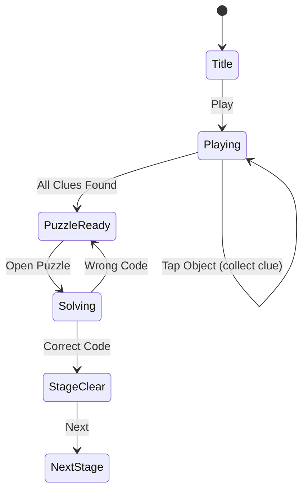

# Escape Room

> 방 안의 단서를 찾고 퍼즐을 풀어 탈출하는 게임

## 개요

각 방에 숨겨진 오브젝트(단서)를 찾고, 올바른 순서로 조합하거나 퍼즐을 풀어 문을 열고 탈출한다. 스테이지마다 다른 테마의 방이 등장한다.

## 게임 규칙

### 기본 규칙
- 방 안에 여러 개의 **오브젝트**(이모지)가 배치됨
- 일부 오브젝트는 **단서(clue)** — 탭하면 인벤토리에 수집됨
- 단서를 모두 수집하면 **퍼즐 패널**이 활성화
- 퍼즐: 수집한 단서를 올바른 순서로 배치 (코드 입력)
- 정답 입력 시 **스테이지 클리어**

### 인벤토리
- 하단에 인벤토리 슬롯 표시
- 수집한 단서가 슬롯에 추가됨
- 모든 단서 수집 시 퍼즐 도전 가능

### 퍼즐 메커니즘
- 수집한 단서를 올바른 순서로 탭하여 코드 입력
- 잘못된 순서 입력 시 리셋 (재시도 가능)
- 정답 시 문이 열리며 클리어

## 게임 플로우



## UI 레이아웃

```
┌─────────────────────────┐
│  🚪 Room 1   ⭐ Score   │  ← 상단 HUD
├─────────────────────────┤
│                         │
│    🔑    📦    🕯️      │
│                         │
│  💎    🗝️    📜    🔍  │  ← 방 안 오브젝트
│                         │
│    🧩    ⚙️    🎭      │
│                         │
├─────────────────────────┤
│ [ 🔑 ][ 📜 ][   ][   ] │  ← 인벤토리 슬롯
├─────────────────────────┤
│  🔓 Solve Puzzle        │  ← 퍼즐 버튼 (단서 다 모으면 활성)
└─────────────────────────┘
```

## 스코어링 시스템

| Action | Score |
|--------|-------|
| 단서 수집 | +50 |
| 퍼즐 정답 (첫 시도) | +500 |
| 퍼즐 정답 (재시도) | +200 |
| 스테이지 클리어 | +300 |

## 난이도 설계

| Stage | 테마 | 오브젝트 수 | 단서 수 | 코드 길이 |
|-------|------|------------|---------|-----------|
| 1 | 서재 | 9 | 3 | 3 |
| 2 | 실험실 | 12 | 4 | 4 |
| 3 | 감옥 | 12 | 4 | 4 |
| 4 | 보물방 | 16 | 5 | 5 |
| 5 | 마법의 방 | 16 | 5 | 5 |

## MVP 범위

### Phase 1 (MVP)
- [ ] 기획서 작성
- [ ] 방 오브젝트 배치 (1 레이어)
- [ ] 오브젝트 탭 → 단서 수집
- [ ] 인벤토리 표시
- [ ] 퍼즐 코드 입력
- [ ] 5 스테이지
