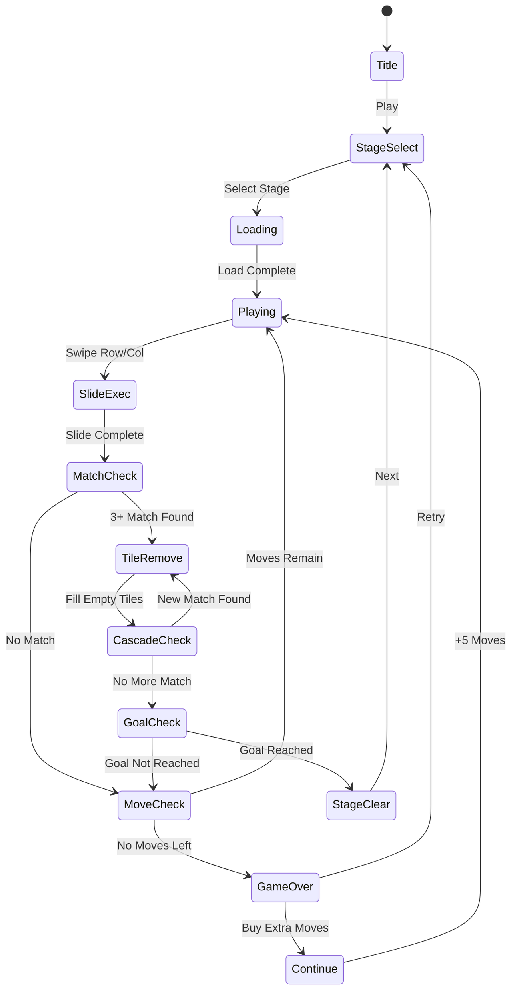

# Fantasy Tile: Sliding Match

> 행/열 전체를 밀어서 3개 이상 같은 타일을 정렬하면 제거되는 슬라이딩 매치 퍼즐

## 개요

NxM 그리드 위에 판타지 테마 타일(보석, 크리스탈, 룬 등)이 배치되어 있다.
플레이어는 행(row) 또는 열(column) 전체를 좌우/상하로 밀어(슬라이드) 같은 타일 3개 이상을 가로/세로로 정렬한다.
정렬된 타일은 자동 제거되고, 빈 공간은 위에서 새 타일이 내려와 채워진다.
제한 이동 횟수 안에 목표 점수를 달성하거나 특수 타일을 모두 제거하면 스테이지 클리어.

### found3와 핵심 차이

| 구분 | found3 | Fantasy Tile: Sliding Match |
|------|--------|----------------------------|
| 입력 방식 | 타일 탭(선택) | 행/열 전체 스와이프(슬라이드) |
| 보드 상태 | 정적 (타일 위치 고정) | 동적 (행/열 단위로 이동) |
| 매칭 장소 | 하단 슬롯에서 3개 모이면 제거 | 보드 위에서 3개 이상 정렬되면 제거 |
| 실패 조건 | 슬롯 7칸 초과 | 제한 이동 횟수 소진 |
| 전략 핵심 | 어떤 타일을 슬롯에 넣을지 선택 | 어느 행/열을 어느 방향으로 밀지 계획 |
| 카스케이드 | 없음 | 있음 (연쇄 매치) |

→ **구조 자체가 다른 별개 게임**. found3에 슬라이드를 얹으면 UX가 충돌하여 혼란을 준다.

---

## 게임 규칙

### 기본 규칙

1. NxM 그리드에 K종류 타일이 무작위 배치됨
2. 플레이어는 한 번에 행 하나 또는 열 하나를 1칸씩 슬라이드
3. 슬라이드 후 3개 이상 같은 타일이 가로 또는 세로로 인접하면 자동 제거
4. 제거된 자리는 위에서 새 타일이 낙하해 채움
5. 낙하 후 또 매치가 발생하면 연쇄(카스케이드) 제거 — 추가 점수
6. 제한 이동 횟수를 소진하기 전에 목표 점수 달성 → 스테이지 클리어
7. 이동 횟수 소진 시 목표 미달 → 게임 오버

### 슬라이드 규칙

- 행 슬라이드: 해당 행 전체가 좌 or 우로 1칸 이동. 밀려난 끝 타일은 **반대쪽 끝으로 순환(wrap)** 또는 제거 후 새 타일 등장 (스테이지별 설정)
- 열 슬라이드: 해당 열 전체가 상 or 하로 1칸 이동. 동일 원칙 적용
- 슬라이드 1회 = 이동 횟수 1 소모

### 매치 판정

| 패턴 | 효과 |
|------|------|
| 3개 직선 (가로/세로) | 제거 + 기본 점수 |
| 4개 직선 | 제거 + 라인 폭탄 타일 생성 |
| 5개 직선 | 제거 + 같은 종류 전체 제거 타일 생성 |
| L/T형 (5개) | 제거 + 3x3 범위 폭발 타일 생성 |

### 특수 타일

| 타일 | 설명 |
|------|------|
| 라인 폭탄 | 활성화 시 해당 행 or 열 전체 제거 |
| 전체 폭탄 | 활성화 시 같은 종류 타일 전체 제거 |
| 범위 폭탄 | 활성화 시 3x3 범위 제거 |
| 잠금 타일 | 슬라이드로 이동 불가. 주변 타일이 매치될 때 제거 가능 |
| 목표 타일 | 스테이지 목표 타일. 제거해야 클리어 |

---

## 게임 플로우



---

## UI 레이아웃

```
┌─────────────────────────────┐
│  ⭐ 1200 / 2000   🔢 12 남음  │  ← 점수 목표 / 남은 이동
├─────────────────────────────┤
│  목표: 💎×20  🔮×15           │  ← 스테이지 목표
├─────────────────────────────┤
│  ← [💎][🔮][🌙][💫][💎][🔮] →  │
│  ← [🌙][💫][💎][🔮][🌙][💫] →  │  ← 그리드 보드
│  ← [💎][🔮][🌙][💎][🔮][🌙] →  │    (행: ← → 스와이프)
│  ← [💫][💎][🔮][🌙][💫][💎] →  │    (열: ↑ ↓ 스와이프)
│  ← [🔮][🌙][💫][💎][🔮][🌙] →  │
│  ← [💎][💫][🔮][🌙][💎][💫] →  │
├─────────────────────────────┤
│   💡 힌트    ↩️ 되돌리기        │  ← 도구
└─────────────────────────────┘
```

---

## 스코어링 시스템

| 액션 | 점수 |
|------|------|
| 3매치 제거 | +100 |
| 4매치 제거 | +250 |
| 5매치 제거 | +500 |
| L/T형 매치 | +400 |
| 카스케이드 1단계 | ×1.5 배율 |
| 카스케이드 2단계 | ×2.0 배율 |
| 카스케이드 3단계+ | ×3.0 배율 |
| 스테이지 클리어 | +1000 |
| 남은 이동 보너스 | 남은 횟수 × 50 |

---

## 난이도 설계

### 그리드 & 기본 설정

| 레벨 구간 | 그리드 | 타일 종류 | 이동 횟수 | 특이사항 |
|-----------|--------|-----------|-----------|----------|
| 1~10 | 5×5 | 4종 | 30 | 잠금 없음, 랩어라운드 |
| 11~30 | 5×6 | 5종 | 28 | 잠금 타일 등장 |
| 31~60 | 6×6 | 6종 | 25 | 목표 타일 등장 |
| 61~100 | 6×7 | 6종 | 22 | 슬라이드 방향 제한 행 등장 |
| 101+ | 7×7 | 7종 | 20 | 랩어라운드 제거, 폭탄 타일 필수 활용 |

### 슬라이드 방향 제한 (고급 메카닉)

- 특정 행/열에 방향 제한 표시 (↔ 또는 ↕ 만 허용)
- 잠긴 행/열: 이동 불가 (잠금 타일 해제 후 활성화)

---

## 수익화

### 인게임 결제

| 상품 | 가격 | 설명 |
|------|------|------|
| 이동 +5 | ₩1,500 / 광고 시청 | 게임 오버 직전 Continue |
| 되돌리기 1회 | ₩500 / 광고 시청 | 직전 슬라이드 취소 |
| 힌트 1회 | ₩500 / 광고 시청 | 최적 슬라이드 위치 표시 |
| 스테이지 스킵 | ₩3,000 | 현재 스테이지 건너뛰기 |
| 광고 제거 | ₩9,900 (영구) | 모든 광고 제거 |
| VIP 패스 | ₩6,900/월 | 힌트 무제한, 매일 이동+10, 광고 제거 |

### 광고

- 스테이지 클리어 후 전면 광고 (3스테이지마다 1회)
- Continue 선택 시 리워드 광고 (+5 이동)
- 힌트/되돌리기 무료 사용 시 리워드 광고

### 핵심 수익 포인트

> **게임 오버 직전 Continue** → 가장 전환율 높은 결제 트리거.
> 플레이어가 목표에 거의 근접했을 때 이동 소진되도록 밸런싱 필요.

---

## 독립 게임 vs found3 변형: 결론

### 결론: **독립 게임으로 출시 권장**

**이유**:

1. **메카닉 충돌**: found3는 "클릭→슬롯 수집" UX, Fantasy Tile은 "스와이프→보드 정렬" UX. 두 메카닉을 하나의 게임에 넣으면 학습 곡선이 급격히 높아짐.

2. **포트폴리오 다양성**: 동일 파이프라인(lib→web→rn)으로 장르가 다른 게임 2개 출시 → CPI 테스트 채널 다변화.

3. **개발 비용 낮음**: found3의 공통 인프라(Phaser 그리드, 타일 렌더링, 스테이지 시스템) 재사용 가능. 슬라이드 로직과 매칭 판정만 신규 개발.

4. **시장 검증**: Candy Crush(스왑 매치), Toon Blast(클릭 제거)와 다른 포지셔닝 — "행/열 슬라이드 매치"는 차별화된 UX.

**found3와 공유 가능한 자산**:
- 타일 이미지 에셋 (판타지 테마 동일 사용)
- Phaser 그리드 렌더러 구조
- 스테이지 데이터 포맷
- 점수/클리어 UI 컴포넌트
- 광고/결제 모듈

---

## Phaser.io 구현 전략

### 핵심 구현 포인트

```
1. 그리드 Matrix 관리
   - 2D 배열로 타일 상태 관리
   - 슬라이드: Array.shift() + push() 또는 pop() + unshift()

2. 슬라이드 입력 처리
   - Phaser InputPlugin의 pointer.on('pointermove') 활용
   - 드래그 방향(수평/수직) 판별 후 해당 행/열 Tween 실행

3. 매치 판정 (슬라이드 완료 후)
   - 전체 그리드 순회, 가로/세로 3+ 연속 타일 검출
   - BFS/DFS로 연결 타일 그룹 탐지

4. 카스케이드 처리
   - 제거 → 낙하 Tween → 새 타일 생성 → 다시 매치 판정
   - Promise 체인 또는 Phaser Timeline 활용

5. 특수 타일 활성화
   - 특수 타일 제거 시 효과 먼저 적용 후 일반 매치 판정
```

### 성능 최적화

- 타일 오브젝트 풀링 (Phaser.GameObjects.Group recycling)
- 슬라이드 중 매치 판정 비활성화 (Tween 완료 콜백에서만 실행)
- 스테이지 데이터 JSON 외부화 (스테이지 추가 시 코드 수정 불필요)

---

## 사운드/이펙트

| 이벤트 | 효과 |
|--------|------|
| 슬라이드 | 스르륵 사운드 + 타일 이동 Tween |
| 3매치 제거 | 반짝이는 파티클 + 팡 사운드 |
| 4매치 / 폭탄 생성 | 전기 이펙트 + 에너지 충전음 |
| 카스케이드 | 연쇄 폭발 이펙트 + 상승 톤 |
| 스테이지 클리어 | 축하 불꽃 + 팡파르 |
| 게임 오버 | 화면 어두워짐 + 실패음 |

---

## MVP 범위

### Phase 1 (MVP — 1주)

- [ ] 기본 그리드 렌더링 (5×5, 4종 타일)
- [ ] 행/열 슬라이드 입력 + Tween 애니메이션
- [ ] 3매치 판정 + 제거 로직
- [ ] 빈 자리 낙하 + 새 타일 생성
- [ ] 이동 횟수 카운트 + 게임 오버
- [ ] 목표 점수 + 스테이지 클리어
- [ ] 5 스테이지

### Phase 2 (출시 전 완성 — 2주차)

- [ ] 카스케이드(연쇄 매치) + 배율 시스템
- [ ] 4/5매치 특수 타일 생성 + 활성화
- [ ] 잠금 타일
- [ ] 힌트 / 되돌리기 아이템
- [ ] 광고 / Continue 결제 연동
- [ ] 20 스테이지
- [ ] 사운드 + 파티클 이펙트

### Phase 3 (선택)

- [ ] 7×7 그리드 + 슬라이드 방향 제한
- [ ] 목표 타일 (특정 타일 n개 제거)
- [ ] 일일 챌린지 스테이지
- [ ] 리더보드
