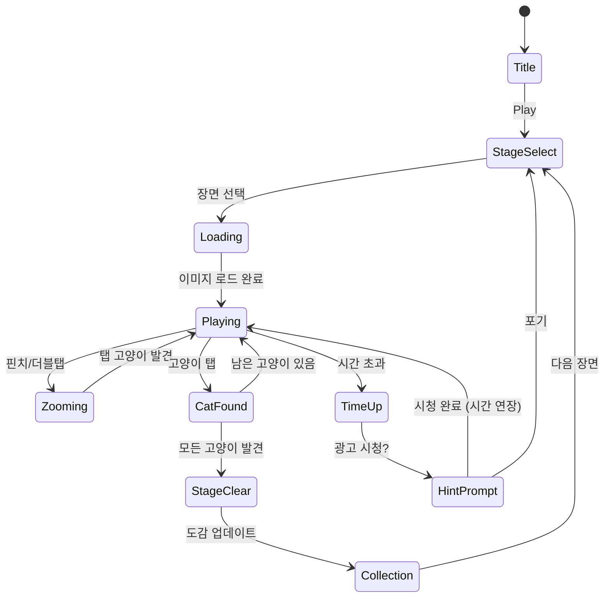

# Find The Cat - Spot It!

> 복잡한 일러스트 속에 숨겨진 고양이를 찾아라! 단일 테마 집중형 숨은그림찾기 퍼즐.

## 개요

플레이어는 정교하게 디자인된 일러스트 장면 속에 숨겨진 고양이를 찾아야 한다.
고양이는 배경과 동화되어 숨겨져 있으며, 장면마다 다른 카무플라주 방식으로 난이도가 결정된다.
찾은 고양이는 도감에 수집되어 수집 욕구를 자극한다.

### 왜 이 게임인가 — 4.9 고평점 분석

| 요소 | 분석 |
|------|------|
| **단순한 조작** | 탭 하나로 끝 — 모바일 최적화 |
| **즉각적 만족감** | 찾는 순간 팡! 이펙트 + 도감 등록 |
| **수집 욕구** | 종별 고양이 도감 — 완성 강박 자극 |
| **광고 삽입 용이** | 힌트 = 광고 시청, 자연스러운 수익화 |
| **세션 길이 유연** | 1분도 가능, 30분도 가능 — 이탈률 낮음 |
| **SNS 공유** | "이 고양이 찾았어!" — 바이럴 구조 |
| **고양이 IP 파워** | 고양이는 인터넷에서 가장 강력한 감성 IP |

---

## 게임 규칙

### 기본 규칙

- 플레이어는 장면 일러스트를 탐색하며 숨겨진 고양이를 찾는다
- 각 장면마다 **숨겨진 고양이 수**가 지정되어 있다 (예: 5마리)
- 고양이를 탭하면 **발견 이펙트** + 도감 등록
- 제한 시간 내에 모든 고양이를 찾으면 **스테이지 클리어**
- 시간 초과 시 **힌트 사용 or 광고 시청**으로 연장 가능

### 고양이 숨김 방식 (카무플라주 유형)

| 유형 | 설명 | 난이도 |
|------|------|--------|
| **색상 동화** | 배경색과 비슷한 고양이 | ★☆☆ |
| **부분 노출** | 꼬리, 귀만 살짝 보임 | ★★☆ |
| **패턴 위장** | 벽지/카펫 패턴 속에 숨음 | ★★☆ |
| **실루엣 위장** | 그림자나 오브젝트 모양과 동일 | ★★★ |
| **반전 은닉** | 뒤집어져 있거나 극소형 | ★★★ |

### 힌트 시스템

- 힌트 사용 시 숨겨진 고양이 위치 **원형 마커 표시** (3초)
- 힌트는 **광고 시청**으로 획득 (1개)
- 또는 인게임 재화로 구매

---

## 게임 플로우



---

## UI 레이아웃

### 메인 플레이 화면

```
┌─────────────────────────────┐
│  ← Back   🐱 3/5   ⏱ 01:23  │  ← HUD (발견 수 / 전체, 타이머)
├─────────────────────────────┤
│                             │
│                             │
│   [      일러스트 장면      ]  │  ← 스크롤/줌 가능 영역
│   [   (핀치 줌, 드래그)    ]  │    전체 화면 사용
│                             │
│                             │
├─────────────────────────────┤
│  💡 힌트    📖 도감    🔊    │  ← 하단 액션바
└─────────────────────────────┘
```

### 고양이 발견 시 오버레이

```
┌─────────────────────────────┐
│                             │
│      ✨ 발견! ✨             │
│   🐱 [고양이 종류 이름]      │
│   "코리안 숏헤어"           │
│                             │
│   [도감에 추가됨]           │
│      [계속하기]             │
└─────────────────────────────┘
```

### 스테이지 클리어 화면

```
┌─────────────────────────────┐
│     ⭐⭐⭐ CLEAR! ⭐⭐⭐       │
│                             │
│  남은 시간: 00:47           │
│  발견율: 5/5 (100%)         │
│  클리어 시간: 1분 13초      │
│                             │
│  [공유하기]  [다음 장면 →]  │
└─────────────────────────────┘
```

### 고양이 도감 화면

```
┌─────────────────────────────┐
│       🐱 고양이 도감         │
├────────────────────────────┤
│  [🐱] [🐱] [❓] [❓] [❓]  │  ← 발견한 종류는 컬러
│  [❓] [❓] [🐱] [❓] [❓]  │    미발견은 실루엣
│  ...                        │
├────────────────────────────┤
│  발견: 12/47종              │
│  진행률: ████░░░░ 25%       │
└─────────────────────────────┘
```

---

## 레벨 디자인

### 장면 구성표 (10장면 MVP)

| # | 장면 이름 | 배경 테마 | 고양이 수 | 난이도 | 카무플라주 유형 |
|---|-----------|-----------|-----------|--------|-----------------|
| 1 | 아늑한 카페 | 카페 인테리어 | 3 | ★☆☆ | 색상 동화 |
| 2 | 꽃 정원 | 봄 정원 | 4 | ★☆☆ | 부분 노출 |
| 3 | 책장 가득 | 도서관 | 4 | ★★☆ | 패턴 위장 |
| 4 | 해변 파라솔 | 여름 해변 | 5 | ★★☆ | 색상 동화 |
| 5 | 크리스마스 트리 | 겨울 실내 | 5 | ★★☆ | 부분 노출 |
| 6 | 야시장 풍경 | 동아시아 야시장 | 6 | ★★★ | 실루엣 위장 |
| 7 | 고양이 카페 | 복잡한 카페 | 6 | ★★★ | 패턴 위장 |
| 8 | 환상의 숲 | 마법 숲 | 7 | ★★★ | 반전 은닉 |
| 9 | 도시 스카이라인 | 밤의 도시 | 7 | ★★★ | 실루엣 위장 |
| 10 | 고양이 왕국 | 판타지 | 8 | ★★★ | 복합 |

### 난이도 매개변수

| 난이도 | 제한시간 | 고양이 크기 | 카무플라주 | 줌 필요도 |
|--------|----------|-------------|------------|-----------|
| ★☆☆ 쉬움 | 3분 | 중간 (60px+) | 단순 | 낮음 |
| ★★☆ 보통 | 2분 | 작음 (40px+) | 복합 | 중간 |
| ★★★ 어려움 | 1분 30초 | 매우 작음 (20px+) | 고급 | 높음 |

---

## 수집 시스템 — 고양이 도감

### 고양이 종류 (MVP 20종 → 확장 47종)

MVP에서 사용할 기본 20종:

| 그룹 | 종류 |
|------|------|
| 단모종 | 코리안 숏헤어, 아메리칸 숏헤어, 브리티시 숏헤어, 아비시니안, 러시안 블루 |
| 장모종 | 페르시안, 메인쿤, 노르웨이 숲 고양이, 버만, 라가머핀 |
| 특이종 | 스코티시 폴드, 렉스, 만체스터, 뱅갈, 오시캣 |
| 희귀종 | 사반나, 셀커크 렉스, 터키시 앙고라, 통키니즈, 봄베이 |

### 도감 수집 보상

| 달성 조건 | 보상 |
|-----------|------|
| 도감 10종 달성 | 힌트 3개 |
| 도감 20종 달성 | 특별 장면 해금 |
| 도감 완성 | 전용 배경 테마 |

---

## 줌 & 스크롤 UX

### 탐색 조작

| 조작 | 동작 |
|------|------|
| 핀치 줌 인/아웃 | 1x ~ 4x 배율 |
| 더블탭 | 2x 줌 토글 |
| 드래그 | 패닝 (줌 상태에서) |
| 탭 | 고양이 탭 시 발견 판정 |

### 줌 판정 규칙

- 고양이 탭 허용 범위: **고양이 영역 + 10px 여백**
- 줌 1x에서는 작은 고양이 탭 어려움 → 자연스럽게 줌 유도
- 잘못된 위치 탭 시 **가벼운 진동 피드백** (오답 패널티 없음)

---

## 스코어링 시스템

| Action | Score |
|--------|-------|
| 고양이 발견 | +200 |
| 연속 발견 (5초 내) | +200 × 연속 수 |
| 힌트 미사용 클리어 | +500 |
| 남은 시간 보너스 | 남은초 × 5 |
| 전체 발견 (퍼펙트) | +1000 |

### 별점 기준

| 별점 | 조건 |
|------|------|
| ⭐⭐⭐ | 힌트 0 + 시간 50% 이상 남음 |
| ⭐⭐ | 힌트 1 이하 or 시간 20% 이상 남음 |
| ⭐ | 클리어 |

---

## 수익화 전략

### 광고 통합 (핵심 수익원)

| 광고 유형 | 트리거 | 빈도 |
|-----------|--------|------|
| 보상형 광고 | 힌트 획득 | 자발적 |
| 전면 광고 | 스테이지 클리어 후 | 3회 클리어마다 1회 |
| 배너 광고 | 메인 메뉴, 도감 화면 | 상시 |

### 인앱 결제 (부가 수익)

| 상품 | 가격 | 내용 |
|------|------|------|
| 힌트 팩 | ₩1,200 | 힌트 10개 |
| 광고 제거 | ₩4,900 | 영구 광고 제거 |
| 장면 팩 | ₩2,400 | 장면 5개 추가 |

---

## 에셋 전략

### 일러스트 제작 방향

**핵심 원칙**: 고품질 일러스트가 곧 게임의 가치. 에셋이 MVP 성패를 결정한다.

### 에셋 확보 방법 (우선순위순)

#### Option A — AI 생성 + 수동 고양이 삽입 (추천, 가장 빠름)

1. **Midjourney / DALL-E 3**로 배경 일러스트 대량 생성
   - 프롬프트: `[장면 설명], detailed illustration, cozy, colorful, no cats, flat design`
   - 1장면당 10~20장 생성 → 최적 선별
2. **Photoshop / Procreate**로 고양이 레이어 수동 삽입
   - 고양이는 별도 sprite sheet로 관리 (20~47종)
   - 카무플라주 효과는 블렌딩 모드 활용
3. **비용 추정**: 툴 구독비 $20~50/월, 작업 시간 장면당 2~4시간

#### Option B — Fiverr/외주 일러스트레이터

- 장면당 $50~150, 10장면 = $500~1500
- 납기 2~3주 (일정 위험)
- 퀄리티 보장 어려움

#### Option C — 무료 에셋 + 수정

- Itch.io, OpenGameArt에서 무료 배경 일러스트 검색
- 라이선스 확인 필수 (CC0 또는 상업 이용 가능)
- 빠르지만 독창성 낮음

### 에셋 관리 구조

```
assets/find-the-cat/
  scenes/
    01-cafe/
      background.png      ← 2048×2048 기본 일러스트
      cats.json           ← 고양이 위치 좌표 및 종류 데이터
      thumbnail.png       ← 장면 선택 썸네일
    02-garden/
    ...
  cats/
    sprites/              ← 고양이 종류별 스프라이트
      korean-shorthair.png
      persian.png
      ...
    catalog/              ← 도감용 고양이 일러스트 (클로즈업)
```

### 고양이 위치 데이터 포맷

```json
{
  "scene": "cafe",
  "cats": [
    {
      "id": "cat_01",
      "breed": "korean-shorthair",
      "x": 340,
      "y": 520,
      "width": 45,
      "height": 38,
      "camouflage": "color-blend",
      "hint_zoom": 2.5
    }
  ]
}
```

---

## 사운드/이펙트

| 상황 | 사운드 | 이펙트 |
|------|--------|--------|
| 고양이 발견 | 야옹 소리 | 파티클 + 원형 확대 |
| 잘못된 탭 | 짧은 틱 | 가벼운 진동 |
| 힌트 사용 | 반짝임 | 원형 마커 3초 |
| 타이머 경고 (30초) | 심장박동 | 타이머 빨간색 |
| 스테이지 클리어 | 축하 멜로디 | 별 3개 애니메이션 |
| 도감 신규 등록 | 특별 효과음 | 도감 아이콘 반짝임 |

---

## MVP 범위

### Phase 1 — MVP (1주 목표)

**목표**: 10장면, 핵심 메카닉, 광고 수익화

- [x] 기획서 작성
- [ ] 에셋 준비: AI 생성으로 10장면 배경 일러스트 확보
- [ ] 고양이 위치 데이터 JSON 작성 (10장면 × 평균 5마리)
- [ ] lib/find-the-cat: Phaser 씬 구현
  - [ ] 이미지 렌더링 + 핀치 줌/드래그
  - [ ] 탭 판정 로직 (좌표 범위 체크)
  - [ ] 타이머 + 발견 카운터
  - [ ] 발견 이펙트 (파티클)
- [ ] web/find-the-cat: React 래핑
  - [ ] 스테이지 선택 화면
  - [ ] 스코어/클리어 화면
- [ ] 광고 SDK 연동 (AdMob)
- [ ] find-the-cat/rn: WebView 래핑

### Phase 2 — 폴리싱 (2주차)

- [ ] 고양이 도감 시스템
- [ ] 힌트 시스템 (광고 시청 → 힌트)
- [ ] 별점 + 스코어 저장
- [ ] SNS 공유 기능 (클리어 화면)
- [ ] 장면 추가 (10 → 20장면)
- [ ] 사운드/이펙트 추가

### 기술 스택

| Layer | 기술 |
|-------|------|
| lib | Phaser.io (SceneManager, Input, Tweens) |
| web | React + Stitches, Phaser canvas 임베드 |
| rn | React Native WebView |
| 에셋 | PNG (2048×2048 scenes), JSON (cat positions) |

---

## 성공 지표 (KPI)

| 지표 | 목표 |
|------|------|
| D1 리텐션 | > 40% |
| 세션 시간 | > 5분 |
| 광고 시청률 (힌트) | > 30% |
| 도감 완성 유저 비율 | > 10% |
| 스토어 평점 | > 4.5 |
